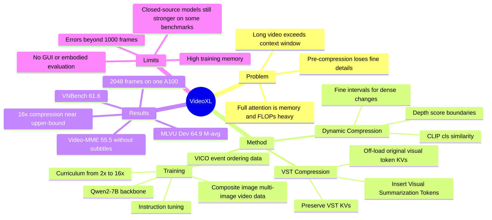

## Summary
Video-XL 试图解决 hour-scale video understanding 中视觉 token 过长、显存/计算成本过高、简单 token reduction 又丢失细粒度信息的问题。它用 Visual Summarization Token (VST) 把每个视频区间的 visual tokens 压缩成 VST 的 KV cache，并结合 dynamic compression、curriculum learning 和 composite data curation，在多个长视频 benchmark 上取得强于同规模开源模型的结果。

## Problem & Motivation
长视频理解对 MLLM 的主要压力来自输入长度：视频由大量 frames 组成，每帧又会产生大量 visual tokens，容易超过 LLM context window；即便强行扩展 context，self-attention 的显存和计算成本也很高。

已有方法常在 visual encoder 之后先减少 token 数，例如 memory bank、token merging、cross-attention 或把每帧压成极少 token。作者认为这些 pre-compression 路线会造成视觉信息损失，尤其影响 long video 中需要 fine-grained detail retrieval 和 temporal reasoning 的任务。Video-XL 的动机是把压缩放到 LLM 内部：利用 LLM 在长上下文中的 KV sparsification / sparse attention 倾向，让特殊 token 学会代理一段视觉上下文。

这个问题与 GUI-agent / embodied research 的连接在于：长时视觉历史如何被压缩、保留、检索，会直接影响 agent 对长 trajectory、screen recording 或 egocentric video 的后续推理。不过本文的实验对象是 video understanding benchmark，不是 GUI / web / embodied closed-loop task。

## Method
**Base architecture.** Video-XL 继承 LLaVA-style minimal architecture：CLIP-ViT-L 作为 visual encoder，两层 MLP + GELU 作为 projector，把视觉特征映射成 visual tokens，再输入 Qwen2-7B LLM。论文的关键新增模块是 VST compression，而不是更换 backbone。

**VST Compression.** 给定一段 visual token sequence，Video-XL 先把它划分成多个 intervals。每个 interval 内均匀插入若干 Visual Summarization Tokens (`<vs>`)，压缩比为 $\alpha_i$，即每 $\alpha_i$ 个 visual tokens 插入一个 VST。LLM 逐段编码视频：一个 interval 编码完成后，只保留该段 VST 的 KVs，off-load 原始 visual tokens 的 KVs；编码后续 interval 时，模型用前面累积的 VST KVs 作为原始视觉上下文的 proxy。

**Dynamic interval partition.** 固定长度切分视频是作者认为的次优方案，因为不同片段的信息密度不同。Video-XL 用 CLIP `[cls]` embedding 计算相邻 frames 的 similarity，再用 VideoLLaMB 中的 depth score 检测语义变化；depth score 超过阈值的峰值被作为 interval boundary。直觉是：变化快、信息密集的片段用更小 interval 做细粒度压缩；变化慢的片段用更大 interval 做粗粒度压缩。

**Training objective and curriculum.** VST 通过 visual instruction tuning 学习：模型先生成压缩后的 VST KVs，再在 compressed KVs 与 instruction 条件下预测 ground-truth response。训练时先随机采样较小压缩比，例如 2x、4x，让 VST 学会较容易的压缩；随后逐步扩大到 8x、12x、16x。作者把这称为 curriculum learning，目的是让模型先建立视觉摘要能力，再学习更强压缩。

**Composite data curation.** 由于 long-video instruction data 稀缺，作者把 single-image、multi-image 和 video 数据统一成 super image / frame sequence 格式做混合训练。使用的数据包括 Bunny、ShareGPT-4o、MMDU，以及 NExT-QA、CinePile、VCG、in-house video captions 等。论文还构建了 Visual Clue Order (VICO)：包含 20k QA pairs，视频平均约 3 minutes；生成流程是把长视频切成 14-second clips，用 VILA-1.5 生成 clip descriptions，再用 GPT-4 提取 key events 并按时间排序，用于训练模型识别和排序长视频中的关键线索。

## Key Results
**Main video benchmarks.** Table 1 中，Video-XL-7B 在 MLVU Dev 上达到 **64.9 M-avg / 4.50 G-avg**，高于 LongVA-7B 的 **56.3 / 4.33** 和 Video-CCAM-9B 的 **58.5 / 3.98**，并在 M-avg 上略高于 GPT-4o 的 **64.6**；在 MLVU Test 上为 **45.5 M-avg / 4.21 G-avg**。在 Video-MME 上，Video-XL 为 **55.5** without subtitles、**61.0** with subtitles；在 VNBench 上为 **61.6**，高于 LongVA-7B **41.5** 和 Video-CCAM-9B **35.6**；在 VideoVista / LongVideoBench 上分别为 **70.6 / 50.7**。

**Important caveat on SOTA.** Video-XL 并不是所有表格列项上的绝对最优：例如 GPT-4o / Gemini-1.5-Pro 在 Video-MME、VideoVista、LongVideoBench 上仍更强；MVBench 上 Video-XL 为 **55.3**，低于 Video-CCAM-9B 的 **64.6** 和 VideoChat2-7B 的 **62.3**。因此更准确的结论是：它在多个 long-video benchmark 上强于同规模开源模型，并在部分指标上接近或超过闭源模型，而不是全面压过所有 baselines。

**Extra-long / cost-effectiveness.** Needle-in-a-Haystack evaluation 在单张 A100-80GB 上进行。论文报告 Video-XL 可以处理 **2048 frames**，在 **128 frames** 内保持 **100% accuracy**，处理更长输入时仍接近 **95% accuracy**；相比之下，LLaVA-NeXT-Video 和 LongLLaVA 因成本限制不能支持超过 1000 frames，LongVA 只能处理其 fine-tuned 长度范围内、少于 400 frames 的输入。

**Compression quality.** 在 16x compression 的统一设置下，Video-XL 在 Table 2 中达到 **MLVU 41.4 / VideoMME 52.0 / MME 1510.2 / MMB 70.9**，接近 upper-bound 的 **41.8 / 52.6 / 1533.7 / 71.6**，并高于 C-Abstractor 的 **37.1 / 46.3 / 1440.2 / 65.1**。这支持作者的核心 claim：VST KV compression 的信息损失小于常见 pre-compression 方法。

**Dynamic compression ablation.** Table 3 显示，完全不启用 dynamic compression 时为 **MLVU 39.8 / VideoMME 50.9 / MME 1460.6 / MMB 70.9**；只在 test 启用没有帮助，为 **39.6 / 50.8 / 1455.0 / 70.8**；train+test 都启用后达到 **41.6 / 52.3 / 1520.0 / 71.3**。这说明 dynamic compression 不是 inference-time trick，而需要训练阶段一起适配。

**Curriculum and data ablation.** Table 4 中，去掉 random compression 为 **40.5 / 51.0 / 1500.4 / 70.3**，去掉 curriculum learning 为 **41.1 / 51.6 / 1512.4 / 71.0**，完整方法为 **41.6 / 52.3 / 1520.0 / 71.3**。Table 5 中，video-only 数据的 MLVU 三类任务平均为 **63.8**；加入 700k single-image 后到 **68.2**；再加入 20k multi-image 后到 **69.5**，说明 single-image 与 multi-image 数据对 long-video training 有互补作用。Supplementary VICO scaling 还显示 Video-XL 随 VICO 从 **5k / 10k / 20k** 扩大时，MLVU 从 **53.9 / 54.3 / 54.9** 上升，Video-MME 从 **60.1 / 60.9 / 61.8** 上升。

## Strengths & Weaknesses
**已知的优点。**

1. **压缩位置选择有 insight。** 论文不是继续在 visual encoder 输出上硬减 token，而是让 LLM 内部的 VST KVs 学会代理长视觉上下文；Table 2 的 16x compression 结果显示它接近 upper-bound，明显好于 pooling、Q-Former、LLaMA-VID、LLaMA-Adapter、C-Abstractor 等压缩 baselines。
2. **ablation 支撑关键模块。** Dynamic compression、curriculum learning、single-image / multi-image / VICO 数据都有对应 ablation；尤其 dynamic compression 只在 test 开启无效，说明训练-推理一致性很关键。
3. **长视频成本问题被正面处理。** 单张 A100-80GB 上支持 2048 frames，且 Needle-in-a-Haystack 长输入 accuracy 接近 95%，比单纯扩 context 的路线更贴近可运行的 hour-scale video understanding。
4. **VICO 的任务形式有启发。** VICO 强迫模型按时间顺序抽取关键事件，对长时视觉 agent 里的 evidence ordering / event ordering 可能有迁移价值。

**已知的局限。**

1. **训练成本仍高。** Supplementary limitations 明确说，训练时 unfreeze CLIP、projector 和 LLM 全部参数，并处理大量 video frames / visual tokens，需要 substantial GPU memory 和 extra computational resources。
2. **超过 1000 frames 后仍有衰减。** 作者在 limitations 中承认，Needle-in-the-Haystack 中当 context 超过 **1,000 frames** 时 Video-XL 偶尔出错，未来需要继续减少 long video compression 的 information decay。
3. **closed-source baselines 仍很强。** Table 1 中 GPT-4o、Gemini-1.5-Pro 在多个 benchmark 上明显高于 Video-XL；Video-XL 的定位更像强开源 7B long-video 模型，而不是所有设置下的最强模型。
4. **baseline evidence 有缺口。** 对 concurrent VoCo-LLaMA，作者说明官方 weights 未发布，无法在 long-video benchmarks 上全面比较，只能报告 image understanding benchmark 作为参考。
5. **failure analysis 不系统。** 正文有 qualitative examples，limitations 也提到 >1000 frames 会偶发错误，但没有把失败细分为视觉识别、temporal ordering、retrieval、compression loss 或语言推理错误。

**推测。**

- 对 GUI-agent / computer-use 的潜在价值在于“长时观察历史的可学习压缩”：VST-like memory 可能比固定帧采样更适合 screen recording 或 UI trajectory，但本文没有在 GUI / web agent benchmark 上实验，不能直接声称适用。
- Dynamic compression 的思想可能可以迁移到 agent trajectory：信息密集的交互片段保留更细粒度 memory，静态或重复片段做更粗压缩。但论文的 boundary detection 基于 CLIP frame similarity，是否适合 GUI state changes 还不知道。

**不知道。**

- 不知道 VST KVs 中具体保留了哪些视觉属性，也不知道压缩错误在不同 task type 上如何分布。
- 不知道 Video-XL 在含 action feedback 的 embodied / GUI closed-loop setting 中是否仍有效，因为所有主实验都是 offline video understanding。
- 不知道更小 LLM 或更长训练视频是否能保持相同压缩质量；supplementary 只报告了 Vicuna-7B、LLaMA2-7B、Qwen2-7B 的泛化结果，以及短视频训练到近一小时 inference 的经验性观察。

## Mind Map

## Notes
- **我的判断**：rating=4。Video-XL 对 video-LLM 很重要，因为它把 hour-scale video 的核心瓶颈从“扩 context”重新表述为“在 LLM KV cache 中学习视觉摘要”；这比单纯减少 visual encoder tokens 更接近可扩展 memory design。它对 GUI-agent / embodied agent 是间接相关：启发在长时视觉 memory，而不是直接给出 agent policy 或交互 benchmark。
- **和 LongVA / LongLLaVA 的区别**：LongVA 主要通过 long context transfer / fine-tuning 扩展视觉上下文，LongLLaVA 依赖 hybrid architecture；Video-XL 的关键是 VST learned compression，因此在同一 A100 setting 下能覆盖更多 frames。
- **后续可追的问题**：如果把 GUI trajectory 切成 observation intervals，是否可以用 UI state-change score 替代 CLIP depth score；如果 VST 只保留 KVs，如何让 downstream agent 显式引用被压缩掉的关键 frame / action evidence。
