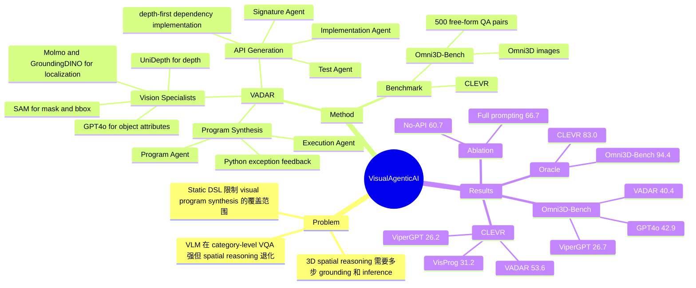

## Summary
VADAR 是一个 training-free 的 visual program synthesis 方法，用 LLM agents 为 3D spatial reasoning 动态生成 Pythonic API，再用该 API 合成可执行程序回答图像问题。论文同时提出 Omni3D-Bench，一个基于 Omni3D、包含 500 个 free-form 3D spatial QA 的 benchmark；实验显示动态 API 明显优于 ViperGPT / VisProg 的静态 API，但真实执行准确率主要受 vision specialists 限制。

## Problem & Motivation
作者关注的问题是：现有 VLM 能做很多 category-level semantic VQA，但在需要 grounding、depth、metric size、relative position 等多步 3D inference 的问题上明显退化。视觉程序方法如 ViperGPT / VisProg 能把视觉问题拆成可执行程序，但它们依赖 human-defined static DSL，因此功能范围受限；遇到新型 spatial query 时，可能退化成直接 VQA、忽略部分 query，或错误实现空间关系。

论文的动机不是单纯提升一个 VQA benchmark，而是测试 embodied agents 所需的 3D visual reasoning：对象定位、属性识别、深度估计、尺度换算和组合推理必须被串起来。为此作者一方面提出 VADAR，让 agent 在解题前动态扩展 reusable API；另一方面提出 Omni3D-Bench，用非模板化、真实图像中的 3D spatial questions 补充 CLEVR 的合成场景。

## Method
VADAR 包含两个阶段：**API Generation** 和 **Program Synthesis**。系统初始 API 来自若干 vision specialists：Molmo pointing model 和 GroundingDINO 用于文本提示的 object localization；SAM 用于从点提示得到 mask / bounding box，并支持 `get_2D_object_size`；UniDepth 估计指定位置的 depth；GPT4o 作为 VQA module 查询 object attributes；`same_object` 用两个 object bounding boxes 的 overlap 判断是否为同一对象。

**API Generation** 阶段由 Signature Agent、Implementation Agent 和 Test Agent 协作。Signature Agent 接收一批问题（论文使用 N=15，无答案），根据当前 API 的 docstrings 提出可复用 method signatures；Implementation Agent 将这些 signatures 实现为 Python 函数，并可调用已有 API；Test Agent 用 Python runtime 和 placeholder inputs 检查 runtime errors。若实现调用了尚未实现的方法，系统会 depth-first 递归实现依赖；若循环依赖在 5 次尝试后仍无法解决，则删除相关方法。

**Program Synthesis** 阶段中，Program Agent 接收单个 question 和已生成 API，先生成 plan，再输出 Python code；Execution Agent 逐行运行程序并调用 vision specialists。若出现 Python exception，Execution Agent 把异常反馈给 Program Agent，最多重试 5 次；超过次数则返回 execution error。这个设计让 VADAR 的答案不仅是 text prediction，而是带有可检查的 intermediate program trace。

作者的关键设计取舍是：API 不是由人提前写死，而是由 LLM agents 从问题分布中动态合成。论文报告的例子包括 `find_closest_object_3D`、`is_behind`、`count_objects_by_attributes_and_position`、`is_left_of` 等 reusable functions；这些函数让最终 Program Agent 输出更短、更模块化的代码，降低直接写长程序时的错误概率。

## Key Results
- **CLEVR**：VADAR total accuracy 为 53.6，高于 ViperGPT 的 26.2 和 VisProg 的 31.2；但低于 Claude3.5-Sonnet 的 58.9、GPT4o 的 58.4 和 Gemini1.5-Pro 的 56.9。按题型看，VADAR 在 numeric 上 53.3、yes/no 上 65.3，分别略高于 GPT4o 的 52.3 和 63.0；multi-choice 为 40.8，低于多个 monolithic VLM。
- **Omni3D-Bench**：VADAR total accuracy 为 40.4，高于 ViperGPT 26.7、VisProg 13.5、Claude3.5-Sonnet 32.2、Gemini1.5-Pro 32.0、SpaceMantis 30.3，仅低于 GPT4o 的 42.9。题型上，VADAR 的 numeric-other MRA 为 35.5，与 GPT4o 持平；multi-choice 为 57.6，略高于 GPT4o 的 57.2。
- **Oracle vision specialists**：用 oracle 替换 vision specialists 后，VADAR 在 CLEVR 达到 83.0，在 Omni3D-Bench 的 50-query subset 达到 94.4；对应 ViperGPT 为 42.6 / 54.9，VisProg 为 39.9 / 66.0。这是论文最关键的证据：program synthesis 本身有较高上限，真实表现的主要瓶颈来自 perception modules。
- **GQA**：在 GQA testdev subset 上，GPT4o 为 54.9，VisProg 为 46.9，VADAR 为 46.1，ViperGPT 为 42.0。作者用这个结果说明 GQA 更偏 object appearance / one-step inference，不足以区分 3D spatial reasoning 能力；VADAR 并不是通用 VQA 上的全面替代。
- **Ablation on CLEVR 100**：No-API Agent 为 60.7；加入 API Agent 到 64.0；再加入 Weak ICL 到 65.7；加入 Pseudo ICL 后到 66.7。这个 ablation 支持动态 API 和 prompting instructions 都有贡献，但实验是在 100 个 CLEVR 子集上做的，规模较小。
- **VSI-Bench-img supplement**：在 VSI-Bench 的 75-query image-based subset 上，VADAR 为 50.1，Gemini1.5-Pro 为 49.5；作者同时指出 VADAR 在该 subset 上高于其 Omni3D-Bench 的 40.4，作为 Omni3D-Bench 更难的补充证据。

## Strengths & Weaknesses
**已知：** VADAR 的主要贡献是把 visual program synthesis 从 static DSL 推向 dynamic API。相较 ViperGPT / VisProg，动态 API 能覆盖更多 spatial reasoning subproblems，并且在 CLEVR 和 Omni3D-Bench 上都给出超过 20 个点的 program-synthesis baseline 提升。

**已知：** 论文的 oracle experiment 很有信息量：VADAR 的 oracle accuracy 远高于真实 execution accuracy，例如 CLEVR 83.0 vs 53.6，说明当前系统不是主要卡在 LLM 写程序，而是卡在 object localization、attribute prediction、depth estimation 等 vision specialists。这个结论对 embodied / GUI agent 也重要：如果高层 reasoning wrapper 依赖低层 perception API，那么 perception API 的误差会成为整体上限。

**已知：** 论文没有回避 failure cases。作者明确说 VADAR 常在需要 5 步或更多 inference 的 query 上失败；另外，VADAR 只基于输入 query 生成程序，图像只在执行阶段被使用，因此 program synthesis 本身无法利用 image context 来消解复杂或歧义 query。

**已知：** Omni3D-Bench 的构造有价值：它来自真实 Omni3D 图像，问题是 human annotators 写的 free-form natural language，并覆盖 relative size / dimension hypotheticals、spatial relationships、depth reasoning、relative proportions、alignment 和 object interaction。相比模板化 spatial QA，这更接近 embodied agent 面对的开放问题。

**推测：** VADAR 的 dynamic API 思路可能适合迁移到 GUI agent：不是让一个 VLM 每次端到端预测，而是动态生成可复用的 visual / spatial tools，例如 element relation、layout grouping、relative distance、state comparison 等。不过 GUI 场景的对象边界、文本 OCR、交互状态和动态页面变化不同于自然图像，需要重新设计 vision specialists。

**不知道：** 论文正文没有给出 DOI 或 GitHub code URL，只给出 project website。论文也没有系统报告不同 object detector / depth estimator / VQA module 的替换实验，因此无法判断 VADAR 的增益对具体 vision specialists 有多敏感；也没有给出真实 embodied closed-loop task 的成功率。

## Mind Map

## Notes
这篇论文最值得记的是 oracle gap：如果 program correctness 已经能到 CLEVR 83.0 / Omni3D-Bench 94.4，而真实 execution 只有 53.6 / 40.4，那么继续堆更强 LLM agent 未必是最有效路线；改进可调用的 perception specialists 可能更有杠杆。

对 GUI-agent 方向的启发是，动态 API 可以被视为一种 test-time skill library construction：先从任务分布里抽象出可复用视觉关系函数，再让 agent 写短程序调用它们。需要警惕的是，论文中的 API generation 仍然依赖一小批 query，并且不看图像生成程序；在 GUI 中，这可能会漏掉 layout-specific 或 app-specific 的视觉状态。
