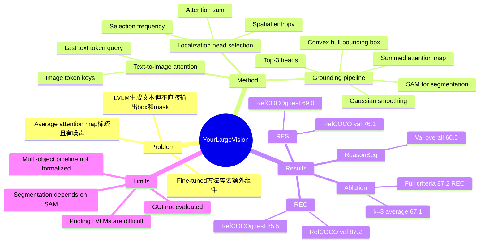

## Summary

本文发现 frozen LVLM 中只有少数 text-to-image attention heads 已经具备 visual grounding 能力，作者称之为 localization heads。方法用 attention sum 和 spatial entropy 在 image-text pairs 上统计 selection frequency，固定选出 top-3 localization heads 后聚合其 attention maps，直接生成 bounding box，并用 SAM 进一步得到 segmentation mask。它在 RefCOCO / RefCOCO+ / RefCOCOg 和 ReasonSeg 上显著强于既有 training-free 方法，并接近部分 fine-tuned LVLM grounding 方法，但并不是在所有 specialized fine-tuned baseline 上都达到最优。

## Problem & Motivation

Visual grounding 要把 free-form text description 对齐到图像中的目标区域，输出 bounding box 或 segmentation mask。LVLM 已经能生成带有区域理解意味的文本回答，但现有 LVLM-based grounding 方法通常还要 fine-tune LVLM，或者加入 specialized token、mask decoder、box head 等额外组件，才能显式输出定位结果。

作者的关键问题是：既然 LVLM 在生成文本时必须利用图像区域信息，能否从 frozen LVLM 的内部 attention 中直接观察和复用这种“看向哪里”的机制？直接平均所有 text-to-image attention maps 并不可行，因为平均图通常稀疏且噪声大；论文的洞察是，不该看 average attention，而要找少数在不同样本上稳定聚焦到文本相关目标的 attention heads。

## Method

论文把 LVLM 输入表示为 image tokens 和 text tokens 的拼接序列，并关注 LLM decoder block 中的 multi-head self-attention。由于 autoregressive decoding 中最后一个输入文本 token 被视为包含整句上下文，作者用最后一个文本 token 的 query `qtxt` 去读取 image token keys，得到每层每个 head 的 text-to-image attention map。

Localization head 的筛选有两个标准。第一是 **attention sum** `S_img`：统计某个 head 对全部 image tokens 的 attention 总量，用来排除主要关注文本或噪声 token 的 heads；论文在 1,000 个 RefCOCO training image-text pairs 上取均值，并用曲线最大曲率点确定阈值，例如 LLaVA-1.5-7B 中 `tau = 0.24`。第二是 **spatial entropy**：把 image attention reshape 成 `P x P` map，按均值二值化，计算 8-neighbor connected components 的 Shannon entropy；低 entropy 表示 attention 更集中在少数空间连通区域。

具体筛选流程是：先保留 `S_img >= tau` 的 heads，再在每个样本中选 spatial entropy 最低的 10 个 heads；对 1,000 个 image-text pairs 重复统计某个 head 被选中的频率，称为 selection frequency。最终对每个 LVLM 固定选择 selection frequency 最高的 top-k heads，主实验中 `k = 3`。例如论文展示 LLaVA-1.5-7B 的高频 heads 包括 `L14 H24`、`L14 H13`、`L14 H26`；LLaVA-1.5-13B 的定性图中使用 `L15 H39`、`L16 H30`、`L7 H2`。

推理时，输入新的 image-text pair，模型不做 fine-tuning，只抽取 top-k localization heads 的 attention maps。每张 map 先做 Gaussian smoothing，主设置为 kernel size `7`、standard deviation `1.0`；然后 element-wise sum 得到 combined map，二值化后用 convex hull 找最大连通区域的 tight bounding box。REC 任务直接使用该 box；RES 任务把该 box 作为 prompt 输入 SAM，得到 segmentation mask。

## Key Results

- **Head discovery / RefCOCO train analysis**：在 LLaVA-1.5-7B、LLaVA-1.5-13B、DeepSeek-VL-1.3B、DeepSeek-VL-7B 等模型上，selection frequency rank 与 head average IoU 的 Spearman correlation 都高于 **0.7**，且 `p < 0.001`。Appendix 扩展到 InternVL-6B、LLaVA-7B、LLaVA-13B、Mini-Gemini-2B、ShareGPT4V-7B、Yi-VL-6B，图中给出的 rho 分别为 **0.787 / 0.783 / 0.736 / 0.784 / 0.727 / 0.721**。
- **REC on RefCOCO / RefCOCO+ / RefCOCOg, Acc@0.5**：LLaVA-1.5-13B(Ours) 在 RefCOCO val/testA/testB 达到 **87.2 / 90.0 / 83.3**，RefCOCO+ 达到 **82.7 / 88.5 / 74.0**，RefCOCOg val/test 达到 **84.3 / 85.5**。作为 training-free 对比，GroundVLP 在对应三组 benchmark 上最高为 RefCOCO **65.0 / 73.5 / 55.0**、RefCOCO+ **68.8 / 78.1 / 57.3**、RefCOCOg **74.7 / 75.0**；但 fine-tuned CogVLM-17B 仍在 RefCOCOg test 达到 **90.8**，所以本文结果应理解为 training-free 强，而非全局 SOTA。
- **RES on RefCOCO / RefCOCO+ / RefCOCOg, cIoU**：LLaVA-1.5-13B(Ours) 在 RefCOCO val/testA/testB 为 **76.1 / 78.9 / 72.8**，RefCOCO+ 为 **64.1 / 67.1 / 57.3**，RefCOCOg val/test 为 **67.7 / 69.0**。相比 training-free Ref-Diff 的 RefCOCO val **35.2**、RefCOCOg test **37.5** 提升很大；与 fine-tuned LVLM segmentation 方法相比，它高于 LISA-13B 的 RefCOCO val **73.4**，但低于 PSALM 的 RefCOCO val **83.6** 和 GLaMM 的 **79.5**。
- **ReasonSeg, cIoU**：在 ReasonSeg 上，LLaVA-1.5-13B(Ours) 的 val overall / short / long / test overall 为 **60.5 / 48.7 / 51.0 / 49.9**；LISA-13B 为 **60.3 / 50.0 / 50.9 / 50.8**。这说明方法在需要 complex reasoning or world knowledge 的 segmentation query 上接近 LISA，但 test overall 略低于 LISA-13B。
- **Direct coordinate baseline vs localization heads, REC RefCOCOg**：Appendix Table 6 显示直接让 LVLM baseline 输出定位结果非常差，DeepSeekVL-1.3B、LLaVA-1.5-7B、LLaVA-1.5-13B 的 baseline 分别只有 **1.5 / 2.92 / 5.28**，而使用 localization heads 后分别为 **65.2 / 82.3 / 84.3**。这支持作者的论点：grounding 信息可能存在于内部 attention 中，但不一定能通过普通文本生成接口直接读出。
- **Number of localization heads, RefCOCO val RES**：Table 4 中 `k=1/2/3/4/5` 的 10 个 LVLM 平均 cIoU 为 **64.5 / 66.0 / 67.1 / 65.4 / 58.9**，top-3 最优；继续加 heads 会引入 noise or redundancy。
- **Criteria and selection ablation, LLaVA-1.5-13B on RefCOCO val**：只用 attention sum 的 fixed selection 仅 **23.9 REC / 19.3 RES**，只用 spatial entropy 为 **31.3 / 25.7**；同时使用两种 criteria 但 greedy per-sample selection 为 **67.4 / 63.8**；完整的 criteria + fixed selection frequency 达到 **87.2 / 76.1**。这说明有效信号不是单个低熵 map，而是在跨样本统计中稳定 text-referred 的 heads。
- **F-LMM comparison and PNG multi-object signal**：F-LMM 仍 fine-tunes mask decoder；在 RES 上，LLaVA-1.5-7B(Ours) 的 RefCOCO val/testA/testB 为 **74.2 / 76.5 / 70.4**，接近 F-LMM 的 **75.2 / 79.1 / 71.9**，RefCOCOg test 二者同为 **68.1**。在 PNG(all) multi-object benchmark 上，DeepSeekVL-7B(Ours) 为 **66.7**，F-LMM 为 **65.7**，但作者也承认 multi-object pipeline 尚未形式化。

## Strengths & Weaknesses

**已知 Strengths**

- 论文的问题 formulation 简洁：不是再训练一个 grounding head，而是问 frozen LVLM 内部是否已经有可复用的 localization mechanism。这个问题对 VLM interpretability 和 training-free grounding 都有价值。
- 方法证据不只来自主表，还包括 head selection frequency 与 IoU 的相关性、`k` 数量 ablation、criteria ablation、smoothing ablation、F-LMM 对比，以及不同 LVLM 上的扩展分析。
- 使用 top-3 heads 的结果很有信息量：对 LLaVA-1.5-13B，REC RefCOCO val **87.2** 和 RES RefCOCO val **76.1** 都是在不 fine-tune LVLM 的条件下得到的。
- Failure analysis 有助于解释模型错误：在 “third from right” banana 例子中，localization head 同时关注第三和第四根 banana，说明失败可能来自 fine-grained spatial disambiguation，而不是完全没有看到目标区域。

**已知 Weaknesses / Caveats**

- RES 结果并非纯 LVLM attention 直接输出 mask，而是用 localization-head box prompt 再调用 SAM；因此“few attention heads are enough”更准确地说是 enough for object localization / box prompting，而不是独立完成任意 mask generation。
- Top heads 是在 RefCOCO training image-text pairs 上通过统计 selection frequency 得到的。这个过程不使用 GT mask 来筛 head，但仍依赖一批 referring-expression 风格的 calibration samples；论文没有证明同一组 heads 在完全不同数据分布上不需要重新筛选。
- 与 fine-tuned specialist 的比较要谨慎：方法明显优于 training-free baselines，但在 RES 上仍低于 PSALM、GLaMM 等强 fine-tuned segmentation models，在 REC 上也低于 CogVLM-17B 等 fine-tuned / larger baselines。
- 作者明确列出两个限制：multi-object grounding 还只是潜力展示，缺少正式 pipeline；对不保留 image spatial information 的 LVLM 或 pooling-based 方法，显式提取 image attention maps 会变得困难。

**推测**

- 对 GUI-agent / screen grounding 的启发在于：如果 GUI-oriented LVLM 也存在类似 localization heads，那么可以把 attention-head probing 作为 training-free UI element localization 或 failure explanation 工具。但论文没有在 screenshot、web、mobile UI 或 computer-use benchmark 上评估，这只能作为跨域假设。
- 这类 head-level mechanism 可能适合作为 agent 的 uncertainty signal：当多个 localization heads 分散或互相冲突时，agent 可能需要 ask clarification 或切换到 detector/OCR 工具。不过论文没有测试 uncertainty calibration。

**不知道**

- 不知道 localization heads 对 prompt paraphrase、last-token choice、image resolution、small object、OCR-dense scene 是否稳定。
- 不知道在 GUI screenshots、document images、video frames 或 robotics egocentric views 上，是否仍能用 RefCOCO 选出的 heads，还是必须重新做 selection frequency 统计。
- 不知道公开代码和模型配置的最终 URL；论文正文只说 source codes will be made available。

## Mind Map

## Notes

这篇的最大价值是把 visual grounding 从“训练一个 grounding module”转成“识别 frozen LVLM 内部哪些 heads 已经在做 grounding”。对 GUI-agent 来说，最值得借鉴的不是具体的 RefCOCO 数字，而是 head-level probing 的工作流：先排除不看 image 的 heads，再找 spatially concentrated heads，最后用跨样本稳定性区分 text-referred localization 和偶然聚类。

需要注意不要过度外推。论文证明的是自然图像 referring expression grounding，且 RES 依赖 SAM；如果用于 GUI，需要重新验证 attention map 是否能对齐到小图标、文字按钮、密集 layout、scrollable regions 和跨窗口目标。
