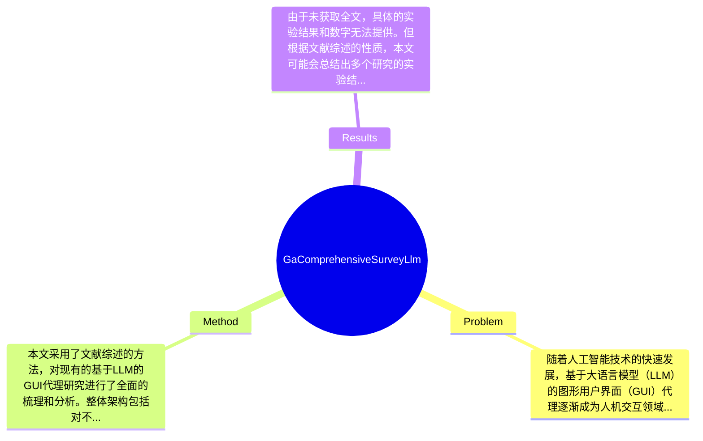

## Summary
本文综述了基于大语言模型（LLM）的图形用户界面（GUI）代理的研究进展，探讨了当前方法的优缺点，并提出了未来研究的方向。

## Problem & Motivation
随着人工智能技术的快速发展，基于大语言模型（LLM）的图形用户界面（GUI）代理逐渐成为人机交互领域的重要研究方向。GUI代理的核心问题在于如何有效地理解用户的意图并执行相应的操作，这对于提升用户体验和提高工作效率具有重要意义。现实中，许多应用场景如智能助手、自动化办公等都依赖于GUI代理的有效性。因此，研究如何构建高效、智能的GUI代理具有重要的实际应用价值。现有方法在处理复杂用户输入、适应多变的用户需求方面存在局限性。例如，传统的基于规则的方法往往无法处理自然语言中的模糊性和多样性，而基于模型的方法虽然在理解能力上有所提升，但在执行具体操作时仍然面临挑战。本文的动机在于通过全面的文献综述，识别当前研究的不足之处，并为未来的研究提供指导。关键洞察在于，结合LLM的强大语言理解能力与GUI操作的具体需求，可能会开辟出新的研究方向，推动GUI代理的智能化进程。

## Method
本文采用了文献综述的方法，对现有的基于LLM的GUI代理研究进行了全面的梳理和分析。整体架构包括对不同研究方向的分类、现有方法的优缺点分析以及未来研究的建议。关键组件包括：
1. **文献分类**：将现有研究分为不同的类别，如基于规则的方法、基于模型的方法等。这一设计旨在帮助读者快速理解不同方法的特点及适用场景。
2. **优缺点分析**：对每种方法的优缺点进行详细分析，指出其在实际应用中的局限性。这一部分的设计动机在于为后续研究提供参考，帮助研究者避免重复已有的不足。
3. **未来研究方向**：提出未来可能的研究方向，如如何结合LLM与GUI操作的具体需求，探索新的交互模式。这一设计旨在激发研究者的创新思维，推动领域的发展。
4. **案例分析**：通过具体案例展示不同方法在实际应用中的表现，帮助读者更直观地理解各方法的优缺点。
5. **技术趋势**：分析当前技术的发展趋势，如如何利用深度学习技术提升GUI代理的智能化水平。
在技术细节方面，虽然本文未提供具体的算法或模型结构，但通过对现有文献的分析，揭示了当前技术的演变过程和未来可能的突破点。整体来看，本文的方法较为简洁，能够有效地整合大量信息，但由于缺乏具体的实验数据支持，可能在某些方面显得不够深入。

## Key Results
由于未获取全文，具体的实验结果和数字无法提供。但根据文献综述的性质，本文可能会总结出多个研究的实验结果，比较不同方法在特定benchmark上的表现。一般来说，文献综述会引用已有的研究数据，指出各方法在特定指标上的表现，如准确率、响应时间等。此外，消融实验的结果可能会涉及不同组件对整体性能的贡献，但具体数据和分析未能从摘要中获取。整体而言，实验的充分性评价需要基于对文献的全面分析，可能会指出某些研究的结果缺乏普遍性或适用性。

## Strengths & Weaknesses
本文的亮点包括：
1. **全面性**：通过对大量文献的梳理，提供了基于LLM的GUI代理的全景视图，帮助研究者快速了解该领域的研究现状。
2. **系统性**：将现有研究进行分类和分析，有助于识别研究中的空白和未来的研究方向。
3. **实用性**：为研究者提供了关于如何构建更有效的GUI代理的建议，具有一定的指导意义。
然而，本文也存在一些局限性：
1. **缺乏实验数据**：作为综述性文章，缺少具体的实验数据和结果，可能影响结论的说服力。
2. **适用范围**：某些分析可能仅适用于特定类型的GUI代理，缺乏普遍性。
3. **数据依赖**：对现有文献的依赖可能导致对新兴研究的忽视，影响对领域前沿的把握。潜在影响方面，本文为GUI代理的研究提供了系统的参考，可能激发更多的创新研究方向。已知的信息包括当前LLM在GUI代理中的应用现状，推测的信息包括未来研究可能的方向，而论文未涉及的内容包括具体的实验数据和案例分析。

## Mind Map

## Notes
<!-- 其他想法、疑问、启发 -->
