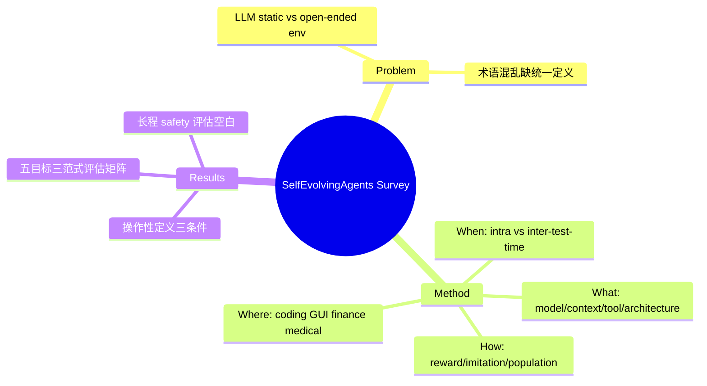

## Summary

第一篇系统性 self-evolving agent survey（TMLR 2026），沿 **What / When / How / Where** 四个维度组织领域：演化什么组件（model / context / tool / architecture）、何时演化（intra- vs inter-test-time）、怎么演化（reward-based / imitation / population-based）、在哪些 domain 落地，并给出了区分 self-evolving agent 与 lifelong learning / model editing / LLM self-improvement 的操作性定义。

## Problem & Motivation

LLM 能力强但本质是 static 的——部署后无法根据新任务、新环境调整内部参数或组件，这在 open-ended 交互环境中成为核心瓶颈。领域内涌现大量"self-evolving"方法但概念混乱（self-improvement / lifelong learning / curriculum learning 边界不清），需要统一定义和分类框架。

## Method

**操作性定义**：self-evolving agent 是"基于自身 trajectory 或 feedback 信号修改内部参数、contextual state、toolset 或 architectural topology，且以提升未来性能为显式目标"的系统。三个必要条件：(1) 更新是 experience-dependent 的；(2) 更新产生 persistent、policy-changing 的效果（非临时指令跟随）；(3) 具备自主探索或 self-initiated learning 机制。

**与相邻概念的区分**（论文给出对照表）：
- vs **lifelong learning**：LL 的 memory 是训练时梯度计算工具且被动接受任务序列；self-evolving agent 用 runtime context 直接影响 test-time 行为，且有主动探索
- vs **LLM self-improvement**（self-rewarding 等）：后者是 model-centric 的参数精化；前者扩展到 tool 获取、架构重构、环境探索的系统级演化

**四维分类**：

1. **What to evolve**：
   - *Model*（policy learning：Self-Challenging Agent、SELF、SCoRe、TextGrad；experience-based：Reflexion、AdaPlanner、SICA、RAGEN）
   - *Context*（memory：SAGE、A-mem、Mem0、Memory-R1、Expel、ReasoningBank、AWM、MemGen；prompt：APE、ProTeGi、PromptAgent、PromptBreeder、SPO、DSPy）
   - *Tool*（创造：Voyager、ALITA、CREATOR；精通：SkillWeaver、DRAFT、CRAFT）
   - *Architecture*（单 agent workflow；多 agent：AFlow、ADAS、MAS-Zero、ReMA、EvoAgent）
2. **When to evolve**：intra-test-time（单 episode 内实时适应）vs inter-test-time（跨 episode 积累），每类再按 ICL / SFT / RL 三种机制细分
3. **How to evolve**：reward-based（textual / internal / external / implicit 四种 reward 形态）、imitation & demonstration（自生成 / 跨 agent / 混合）、population-based & evolutionary（PromptBreeder、EvoAgent、AgentSquare）；正交维度：online-offline、on-policy-off-policy、reward granularity
4. **Where to evolve**：general（memory、model-agent co-evolution、curriculum）+ 垂直 domain（coding、GUI、finance、medical、education）

**评估框架**：提出 adaptivity / retention / generalization / efficiency / safety 五类目标，划分 static assessment、short-horizon adaptive、long-horizon lifelong 三种评估范式。

## Key Results

作为 survey 无实验数字，核心贡献是概念框架。评估章节指出的关键 gap：现有 benchmark 几乎只做单 episode 隔离评估，**没有 benchmark 追踪 evolution 全程的 safety 轨迹**（风险是否随 edge case 反复暴露而积累、不安全行为是否从自主探索中涌现）——这一 gap 后被 [[Papers/2509-Misevolution]] 的实证工作直接命中。

## Strengths & Weaknesses

**Strengths**：
- What/When/How 三轴分解干净且接近正交，操作性定义（三个必要条件）是目前最可用的判据
- 明确划出 self-evolving 与 lifelong learning / self-improvement 的边界，术语混乱的领域里这是实际贡献
- 评估章节的"五目标 × 三范式"矩阵指出了 long-horizon safety 评估的空白，有前瞻性

**Weaknesses**：
- 分类是 method-centric 的，对"哪条路线在什么条件下 work / break"缺少批判性对比——典型 survey 局限
- intra-test-time SFT/RL 的实例较薄弱（单 episode 内做参数更新的工作极少），该象限可能是过度对称化的产物
- ASI 框架（标题的 "Path to Artificial Super Intelligence"）与正文内容脱节，更多是叙事包装

**对本 vault 的意义**：为 Papers/ 中已积累的 UI-Genie、UI-Voyager、UI-Mem、PAE、AWM、SkillOpt 等散点提供了统一坐标系；agenda 中 paused 的 Self-Improving Agent Reliability 方向的"验证偏差"假设对应其 How-to-evolve 中 internal reward 的可靠性问题。

## Mind Map

## Notes

- 与 [[Papers/2508-SelfEvolvingAIAgentsSurvey]] 是同期竞品 survey：本篇强在概念边界与 When 维度，后者强在统一优化框架（optimiser 视角）与 Three Laws
- 检索时确认领域已有第三篇 2026 新 survey（Xiang et al., "Model-Centric to Environment-Driven Co-Evolution", TechRxiv 2026-02）主打 agent-environment co-evolution 视角，与本 vault 的 AFE 方向（环境侧 affordance）有潜在交叉，暂未 digest
