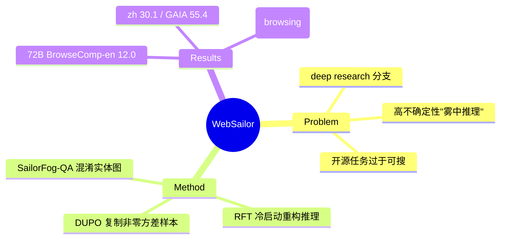

## Summary
Tongyi Lab 的 deep-research / information-seeking web agent：核心洞察是"要教会 agent 在高不确定性（信息迷雾）下做超人推理，就得用高不确定性任务训练"——用 SailorFog-QA（结构化采样 + 信息混淆的 obfuscated entity graph）合成极难任务，配 RFT 冷启动（重构简洁推理）+ DUPO（Duplicating Sampling Policy Optimization，复制非零方差样本使 batch 保持密集、rollout 效率 2–3x）两阶段训练，WebSailor-72B 在 BrowseComp-en 12.0% / BrowseComp-zh 30.1% / GAIA 55.4%，开源 SOTA 并超越加了浏览能力的 Grok-3 / Doubao。

## Problem & Motivation
web agent 已从"操作网页界面"分化出一条 **deep research / 长程信息检索** 支线：agent 需在开放网络中做多跳检索、并行约束满足、跨源综合，最终产出答案/报告。这类任务的难点不是点击精度，而是在 **信息高度不确定、路径高度分叉** 的"迷雾"中持续推理并逐步降低不确定性。作者认为闭源 DeepResearch 类系统之所以强，是因为训练数据/任务本身具备这种极端不确定性；而开源 agent 的训练任务过于"可直接搜索"，学不到 fog-navigation 的推理模式。核心 problem formulation：**用可控生成的高不确定性任务，把"雾中推理"变成可训练目标**。

## Method
两大支柱：

1. **SailorFog-QA 任务合成**：通过 **structured sampling + information obfuscation** 从实体关系图构造任务——刻意模糊化实体/关系（obfuscated entity graphs），制造"难以直接搜索、但答案可验证"的高不确定性 QA。这类任务强迫模型做多跳、交叉验证、在不完整信息下决策，而非一次搜索命中。

2. **两阶段 post-training pipeline**：
   - **RFT cold start（reasoning reconstruction）**：从专家轨迹中 **重构简洁的推理链**做冷启动监督——不直接模仿冗长专家 trace，而是蒸馏出干净的 reasoning 供模型建立基础 agentic 能力。
   - **DUPO（Duplicating Sampling Policy Optimization）**：一种高效 agentic RL 算法。痛点是 DAPO 等方法在并行 rollout 时大量样本坍缩为全对/全错（零 reward 方差）被丢弃，导致 batch 稀疏、训练停滞；DUPO 用**复制非零 reward 方差样本**替换坍缩样本，使 batch 保持密集，rollout 效率相对提升 **2–3x**。

关键设计判断：**"用复杂不确定推理训练具有向下兼容性"**——在难任务上学到的 fog-navigation 推理，迁移到简单任务（GAIA / SimpleQA）也能提升，而非过拟合难题。

## Key Results
WebSailor 模型族（3B / 7B / 32B / 72B）：

| 模型 | BrowseComp-en | BrowseComp-zh | GAIA |
|:--|:--|:--|:--|
| WebSailor-72B | **12.0%** | **30.1%** | **55.4%** |
| WebSailor-7B | 6.7% | — | — |

- WebSailor-72B 显著超越所有开源 agent/框架，并在结合浏览能力后超过闭源 LRM 如 Grok-3、Doubao，逼近闭源 DeepResearch。
- 小模型也很能打：WebSailor-7B 在 BrowseComp-en 达 6.7%，远超更大的 WebDancer-32B（2.5%）。
- 向下兼容：在 GAIA / XBench-DeepSearch / SimpleQA 等更简单任务上同样有竞争力。
- （后续 WebSailor-V2 基于 Qwen3-30B-A3B 进一步刷到 BrowseComp-en 35.3 / zh 44.1 / HLE 30.6。）

## Strengths & Weaknesses
**亮点**：(1) 把"deep research web agent"的能力瓶颈精准 framing 为"高不确定性推理"，并给出可控的合成路径（SailorFog-QA）——问题formulation 比方法更有价值；(2) DUPO 直击 agentic RL 的 batch 坍缩效率问题，是通用的 RL infra 贡献；(3) 是 Tongyi WebAgent 家族（WebWalker→WebDancer→WebSailor→WebWatcher→WebResearcher→...）承上启下的关键节点，开源 deep-research 路线的代表作。

**局限**：(1) BrowseComp 绝对分数仍低（72B 仅 12% en），说明 fog-navigation 远未解决；(2) SailorFog-QA 的合成任务真实性/分布与真实用户 research query 的 gap 未充分评估；(3) 该支线（search + navigate 的紧凑 action space + 长推理）与"操作真实网页 GUI"（WebArena / VisualWebArena 系）是两种 web agent，能力不直接互通。属 [[Topics/WebAgent-Survey]] 的"deep research / information-seeking"技术路线。

## Mind Map

## Notes
- Tongyi 家族其他成员：WebWalker（benchmark）、WebDancer（ReAct 信息检索）、WebWatcher（vision-language deep research）、WebResearcher / WebWeaver / AgentFold / WebLeaper / WebShaper（长程上下文/证据结构化）。
- 与 [[Papers/2606-KBrowseComp]]（韩语 browsing benchmark）、[[Papers/2606-SearchSwarm]]（delegation deep research）同属信息检索支线，可交叉引用。
