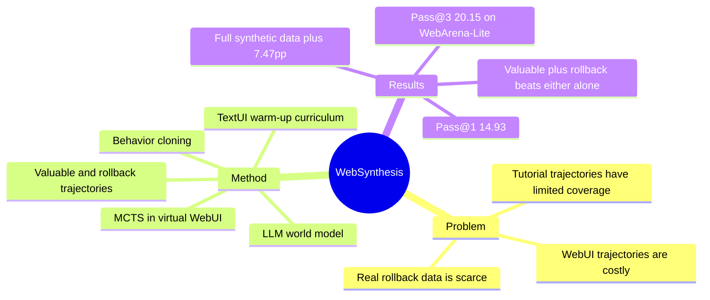

## Summary
WebSynthesis 用 LLM world model 和 MCTS 在虚拟 WebUI 环境中合成训练轨迹，再用 TextUI warm-up 和 behavior cloning 训练 web agent。它的主要价值是把 world-model planning 从 inference-time search 扩展到 offline trajectory synthesis，并显示少量合成轨迹可以接近甚至超过较大规模真实轨迹数据。

## Problem & Motivation
Web agent 的轨迹数据昂贵，真实网站交互存在不可逆动作、状态恢复困难和采样效率低的问题。已有 tutorial-guided 或 real-environment trajectory collection 覆盖有限，而且很难系统地产生错误、rollback、替代路径等训练信号。

WebSynthesis 的动机是：如果 world model 能在虚拟 WebUI 上模拟状态转移，就可以用 MCTS 搜索多条候选路径，再把高价值轨迹和 rollback 轨迹转成训练数据。

## Method
**World-model-guided MCTS.** 系统用 LLM world model 模拟 WebUI state transition，用 MCTS 在虚拟环境中扩展动作树。过程 reward / value 由 LLM 评估，用来筛选更有训练价值的路径。

**Reversible tree planning.** MCTS tree 中保留成功路径、失败路径和 rollback 相关轨迹。作者强调 rollback 轨迹不是单独使用，而是和 valuable trajectories 组合，提供纠错与恢复信号。

**Two-stage curriculum.** 第一阶段是 TextUI fundamentals：dense caption、functionality prediction、state transition prediction。第二阶段用 WebSynthesis 合成的 valuable + rollback trajectories 做 behavior cloning。

## Key Results
- **WebArena-Lite.** WebSynthesis 报告 Pass@3 20.15%，对比 OS-Genesis 18.66%（7.4k real trajectories）和 AgentTrek 11.94%（20k tutorial-guided trajectories）。
- **Pass@1.** WebSynthesis 14.93%，OS-Genesis 11.19%，AgentTrek 9.70%，GPT-4 CoT 13.58%，Qwen2.5 baseline 2.24%。
- **TextUI warm-up.** TextUI curriculum 对 WebSynthesis 带来约 +5.23pp；state transition prediction 是关键子任务之一。
- **Trajectory composition.** Rollback-only 训练很弱（1.49%），valuable-only 约 5.97%，valuable + rollback 约 9.70%，完整方案 14.93%。
- **Scaling.** 从 12.5% synthetic data（约 500 trajectories）扩到 100% 带来 +7.47pp；约 4k synthetic trajectories 时可接近 GPT-4 CoT。

## Strengths & Weaknesses
**已知的强点。** WebSynthesis 把 world model、tree search、rollback signal 和 curriculum learning 组合成一个训练数据合成 pipeline。它说明 rollback 轨迹本身不是 magic，必须和成功/高价值轨迹一起使用，才能提供有效纠错学习信号。

**已知的局限。** 主要评测集中在 WebArena-Lite 165 tasks，绝对成功率仍低。World model 和 process reward model 都依赖强 LLM，虚拟 WebUI 的真实性边界没有被充分量化。MCTS 合成出的轨迹是否覆盖真实开放网页的长尾动态，仍未证实。

**推测。** WebSynthesis 和 UI-Simulator 的差别在于侧重点：UI-Simulator 关注可扩展 simulator rollout，WebSynthesis 关注用 planning 搜索出更高价值的训练轨迹。对训练 infra 来说，两者可以组合：simulator 提供 cheap transition，tree search 提供 data selection。

## Mind Map

## Notes
这篇应该和 [[Papers/2510-UISimulator]]、[[Papers/2411-WebDreamer]]、[[Papers/2511-DreamGym]] 放在同一条 world-model synthesis 线里看。它对 [[Topics/AgentRuntimePrimitives-Survey]] 的补充是：rollback 不只是一种 runtime recovery tool，也可以是离线训练数据形态。

对 AFE 的启发：如果真实 browser runtime 能低成本提供 fork/rollback，那么 WebSynthesis 里的“虚拟 rollback 轨迹”就可以被真实状态分支替换或校准，这可能比继续堆 world-model fidelity 更有差异化。
