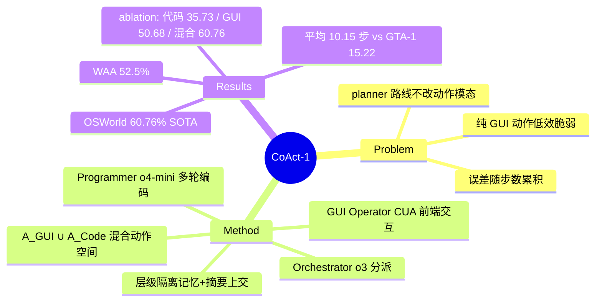

## Summary
CoAct-1 把 coding 作为与 GUI 操作并列的一等 action：Orchestrator（o3）按子任务动态分派给 Programmer（o4-mini，写 Python/Bash 与 OS 后端交互）或 GUI Operator（OpenAI computer-use-preview），在 OSWorld 达到 60.76% SOTA，且平均步数降到 10.15（GTA-1 为 15.22）——用一段脚本替换长串易错的点击序列同时提升成功率与效率。

## Problem & Motivation
纯 GUI 的 computer-use agent 在长程任务上既低效又脆弱：文件管理、表格处理等任务需要长而精确的点击序列，视觉 grounding 歧义（相似图标/菜单）加上误差随步数累积，一次 mis-click 即可毁掉整个任务。已有的 planner 增强路线（GTA-1、Agent S2 等）只改善任务分解，执行仍全部走 GUI，没有从根上解决动作模态本身的低效。作者主张扩展动作空间：A = A_GUI ∪ A_Code，让本质上是后端操作的子任务直接用代码一步完成。

## Method
三 agent 层级系统（基于 AG2 实现）：
- **Orchestrator**（o3）：meta-policy，不直接接触 OS。分解目标、判断每个子任务该走代码还是 GUI，接收执行摘要 + 最新截图后动态重规划；判定完成则终止。系统 prompt 强制"文件操作必须先试 Programmer""结果核验由 Orchestrator 自己看截图做"。
- **Programmer**（o4-mini）：与 code interpreter 多轮交互（上限 20 轮），写 Python/Bash 脚本操作文件系统/数据/环境配置，根据执行反馈自我修正。
- **GUI Operator**（OpenAI computer-use-preview）：标准 perception-action 循环（上限 25 步），处理必须可视化交互的前端操作。
- **记忆隔离**：Orchestrator 持长期记忆（目标 + 各子任务摘要 + 截图）；执行 agent 只有子任务内的短期工作记忆，完成后即清空，摘要由 o4-mini summarizer 压缩后上交。Orchestrator 轮数上限 15，理论步数上限 375，实际 150 步内早停。

## Key Results
全部来自全文：
- **OSWorld (369 tasks, verified)**：**60.76%**（150 步预算），超 Agent S2.5 w/ o3（55.98%）、GTA-1-7B w/ o3（53.07%）、Jedi-7B w/ o3（50.98%）；100 步时已达 59.93%，超所有 baseline 的最终成绩。分类上 Office 64.80%、OS 75.00%、Multiple Apps 47.87%（intro 提及 Calc 70.21%、VS Code 78.26%），程序化控制受益最大的正是纯 GUI agent 历来最脆的类别。
- **WindowsAgentArena (154 tasks)**：**52.5%**（100 步），远超 Agent S2（29.8%）、NAVI（19.5%）；Windows System 83.3%、Windows Utils 77.7%。
- **效率**：平均 **10.15 步**/成功任务，vs GTA-1 15.22、UI-TARS 14.90；OpenAI CUA 4o 虽只 6.14 步但 SR 仅 31.40%。失败率与所需步数正相关——减少步数本身就是减少出错机会。
- **模态 ablation**：Programmer-only 35.73%（平均仅 1.14 步，极高效但覆盖面窄）；GUI-only 50.68%（11.20 步）；混合 60.76%（10.15 步）。两种模态互补而非替代。
- **Backbone ablation**：Orchestrator/Programmer 用 o4-mini/o4-mini → 43.43%；o3/o3 → 58.72%；**o3/o4-mini → 60.76%**（最优）。系统性能对 Orchestrator 推理能力最敏感。
- **失败模式**（附录 D）：高层意图推理失败（如把 "debugging" 关联到 "focusEditorOnBrake" 设置）、歧义 query（改了 workspace 而非 global 设置）、reflection 盲区（GUI Operator 中间步骤出错被后续操作遮蔽，最终截图看不到）、Orchestrator/GUI Operator 幻觉（预测未打开网页的内容、想象任务已完成）。

## Strengths & Weaknesses
**亮点**：
- 问题定位准确：不是"planner 不够强"而是"GUI 动作模态本身低效脆弱"，A_GUI ∪ A_Code 的 hybrid action space 是简洁且第一性的解法。Programmer-only 平均 1.14 步 vs GUI-only 11.20 步的对比非常有说服力。
- 同时提升 SR 与效率的双赢少见（多数方法用更多步数换 SR），"步数越多失败率越高"给出因果解释：代码压缩轨迹长度本身就降低误差累积。
- 失败分析诚实且具体（reflection 盲区是系统设计固有缺陷而非模型问题，作者未回避）。
- 跨 OS（Ubuntu + Windows）验证了范式可迁移。

**局限**：
- 全 closed-source backbone（o3 + o4-mini + computer-use-preview），成绩与 OpenAI 模型能力强耦合，无法区分"架构贡献"与"模型贡献"；无开源模型配置的对照。
- 无 training，纯 prompt 工程 + 编排；三个 agent 的 prompt 含大量任务特定规则（如"新 sheet 必须叫 Sheet1/Sheet2"），有向 OSWorld evaluator 过拟合的嫌疑（推测）。
- coding action 依赖任务本质可程序化（文件/表格/配置），对纯视觉交互任务（Daily 类 66.51% vs Jedi 65.25%）优势不明显。
- reflection 机制只回传最终截图，中间状态错误不可见——作者自己指出这是失败源之一，但未给出修复。

## Mind Map

## Notes
- 与 ComputerRL（2508，API-GUI 混合动作 + RL 训练）同期同思路：都在打破"GUI 动作唯一"假设，区别是 CoAct-1 走多 agent 编排（无训练）、ComputerRL 走端到端 RL。可在 survey 中作为 "hybrid action space" 一节的两条实现路线对比。
- "Orchestrator 能力主导系统性能"（o4-mini→o3 提升 15 个点）与 planner-grounder 文献中 "planner 是瓶颈" 的结论一致。
