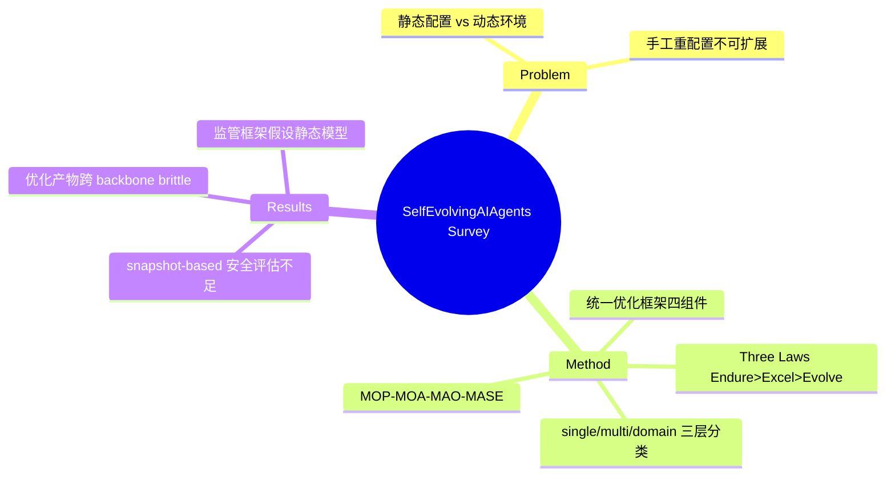

## Summary

以**统一优化框架**（System Inputs → Agent System → Environment → Optimiser 的闭环，形式化为 A* = argmax O(A;I)）组织 self-evolving agent 领域的 survey，提出 **Three Laws of Self-Evolving AI Agents**（Endure 安全 > Excel 保性能 > Evolve 自主演化）和 **MOP→MOA→MAO→MASE** 四阶段范式演进叙事，按 single-agent / multi-agent / domain-specific 三层系统综述优化技术。

## Problem & Motivation

现有 agent 系统（无论单/多 agent）依赖人工设计的 prompt、workflow、tool 配置，部署后静态不变，而真实环境持续变化（用户意图漂移、工具更新、任务需求演化）。手工重配置不可扩展。需要把"agent 优化"从一次性 offline 工程变为持续的、环境反馈驱动的闭环——即 lifelong agentic system。

## Method

**定义**：self-evolving AI agents 是"通过与环境交互持续、系统地优化自身内部组件的自治系统，目标是在适应任务/上下文/资源变化的同时**保持安全并提升性能**"。

**Three Laws**（仿 Asimov，层级式约束）：
1. **Endure**（安全适应）：任何修改必须维持安全与稳定
2. **Excel**（性能保持）：在不违反第一定律前提下，保持或提升既有任务性能
3. **Evolve**（自主演化）：在前两者约束下自主优化内部组件

**范式演进**：Model Offline Pretraining（静态预训练）→ Model Online Adaptation（SFT/LoRA/RLHF）→ Multi-Agent Orchestration（handcrafted 多 agent 协作）→ **Multi-Agent Self-Evolving**（population of agents 基于环境反馈 + meta-reward 持续精化 prompt/memory/tool/topology）。

**统一优化框架四组件**：System Inputs（task-level 或 instance-level）；Agent System（被优化对象：LLM、prompt、memory、tool policy、topology）；Environment（提供 feedback signal，无 ground truth 时用 LLM-based evaluator 产生 proxy metric）；**Optimiser**（核心，由 search space S 与 optimisation algorithm H 定义——rule-based heuristics / gradient descent / Bayesian & MCTS / RL / evolutionary）。

**技术分类**（Figure 5）：
- **Single-agent**：LLM behaviour optimisation（training-based：STaR、NExT、Self-Rewarding、Absolute-Zero、R-Zero；test-time：CoT-SC、ToT、GoT + verifier）；prompt optimisation（edit / generation / text-gradient / evolution 四类：GPS、APE、OPRO、MIPRO、ProTeGi、TextGrad、EvoPrompt、PromptBreeder）；memory optimisation（短期：ReadAgent、MemoryBank；长期：A-MEM、Mem0、GraphReader、AWM）；tool optimisation（training-based：ToolLLM、ReTool、SWiRL；prompt-based：EasyTool、DRAFT；tool creation：CREATOR、LATM、CRAFT、Alita）
- **Multi-agent**：prompt（AutoAgents、DSPy、MIPRO）、topology（code-level workflow：AFlow、ScoreFlow、MAS-GPT；communication graph：GPTSwarm、G-Designer、AgentPrune）、unified（ADAS、MASS、EvoFlow、MAS-ZERO、MaAS）、LLM backbone（COPPER、OPTIMA、MaPoRL）
- **Domain-specific**：biomedicine（MedAgentSim、MDAgents、MDTeamGPT）、programming（Self-Refine、AgentCoder、Self-Debugging、OpenHands）、finance/legal（FinCon、FinRobot、LawLuo、AgentCourt）

**评估**：benchmark-based（tool/API：ToolBench、GTA、AppWorld；web：WebArena、BrowseComp；GUI：AndroidWorld、OSWorld；多 agent：MultiAgentBench、GAIA）+ LLM-as-a-Judge / **Agent-as-a-Judge**（评整条 trajectory 而非 final output）+ safety audit（AgentHarm、RedCode、MobileSafetyBench、MACHIAVELLI、SafeLawBench）。

## Key Results

Survey 无实验数字。挑战章节按 Three Laws 组织：**Endure** —— 优化 pipeline 普遍只优化任务指标忽视安全约束、reward model 噪声导致演化不稳定、动态演化冲击 EU AI Act/GDPR 等假设静态模型的监管框架；**Excel** —— 科学场景 ground truth 缺失、MAS 优化的效率-效果 trade-off、优化后 prompt/topology 跨 backbone 迁移性差（brittle）；**Evolve** —— 优化算法 text-only 无法处理多模态/空间环境、假设固定 toolset 忽视 tool 的自主发现与共同演化。指出当前安全评估全是 **snapshot-based**，MASE 需要 longitudinal evolution-aware 评估。

## Strengths & Weaknesses

**Strengths**：
- Optimiser 视角（search space × algorithm）把 prompt/memory/tool/topology 优化统一成同一个抽象，比按组件罗列更有解释力——本质上把 self-evolution 看成 AutoML 在 agent 系统上的推广
- Three Laws 把 safety 明确置于演化目标之上，且挑战/future work 全部挂回这三条，结构自洽
- MOP→MOA→MAO→MASE 的范式叙事清楚交代了"为什么是现在"

**Weaknesses**：
- "自主性"叙事与所综述内容有落差：大量被归入的技术（APE、DSPy、AFlow）本质是 offline automatic optimisation，并非部署后的 lifelong 演化——survey 自己也承认当前系统离 MASE 愿景很远
- 与 [[Papers/2507-SelfEvolvingAgentsSurvey]] 覆盖高度重叠，差异主要在组织框架而非内容
- Three Laws 是宣言不是机制——如何在优化循环中*实施* Endure 约束（constrained optimisation? verifier gating?）未给出技术路径

## Mind Map

## Notes

- EvoAgentX 是其配套开源框架，声称是首个实现该 self-evolving 闭环的系统
- "Environment 提供 feedback signal / proxy metric"的角色定位与本 vault AFE 方向的 verify affordance 高度同构——可把 AFE 看作该框架中 Environment→Optimiser 通道的 agent-facing 工程化
