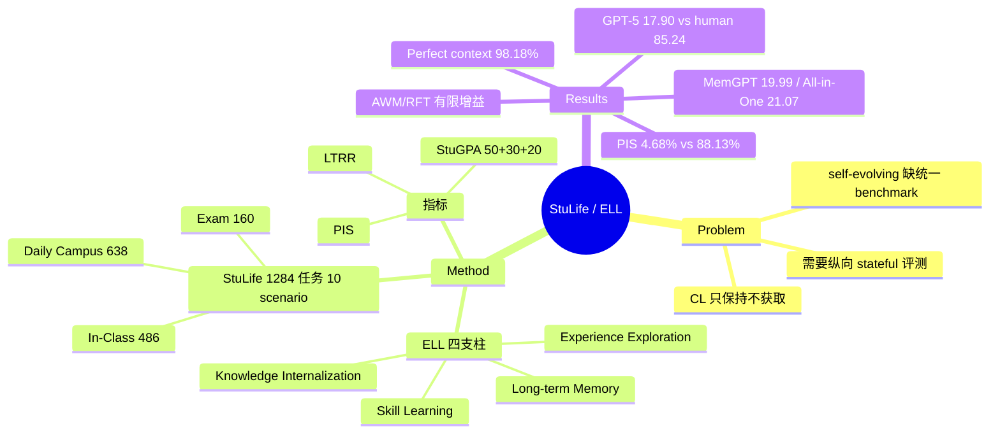

## Summary
提出 Experience-driven Lifelong Learning（ELL）框架（Experience Exploration / Long-term Memory / Skill Learning / Knowledge Internalization 四支柱），并构建 StuLife benchmark：把一名大学生的单学期生涯模拟为 1,284 个状态耦合任务组成的连续 stateful 轨迹，用 StuGPA / LTRR / PIS 量化长程记忆与自发主动性。最强模型 GPT-5 在默认 stateless 设定下 StuGPA 仅 17.90（human 85.24），而 perfect-context 下同类任务成功率 98.18%——作者据此把瓶颈定位在记忆管理与 proactivity，而非任务理解。

## Problem & Motivation
传统 continual learning 依赖静态数据集、预定义任务边界与监督信号，目标是缓解 catastrophic forgetting（性能保持），而非主动的知识获取；既有 self-evolving agent 研究则偏概念框架或窄实现，缺少把长程记忆、技能积累、自我驱动整合起来的可执行评测。作者认为通往开放式智能的关键是 agent 以第一人称从经验中持续学习，因此需要一个任务互联、状态持久、奖励稀疏、且要求自发行为的纵向 benchmark——现有 benchmark（AgentBench、LoCoMo、LifelongAgentBench 等）在 Table 2 的八个维度（Sequentiality/Skill/LTM/Self-Motivation/Real/Interconnected/Interact/LfE）上均不完整。

## Method

**ELL 框架（§3，形式化）**：POMDP 式环境定义之上，agent 的 Knowledge $\mathcal{K}=(\mathcal{M},\mathcal{F})$——Memory 分 trajectory / declarative / structural 三型，Skills 分 procedural / meta / heuristic 三型；lifelong 过程中任务 $\mathcal{T}^{(i)}$ 结束时的知识库作为 $\mathcal{T}^{(i+1)}$ 的初始知识库，并通过 Add / Update / Delete / Combine 四种操作做 Knowledge Refinement。四条原则的操作化：经验探索（长程任务分解与试错）、长期记忆（结构化持久存储）、技能学习（从重复 pattern 抽象可复用技能并验证）、知识内化（显式知识蒸馏为隐式能力，"second nature"）。

**StuLife 构成（§4.1, Table 1）**：三 phase、10 个互联 scenario、共 1,284 任务——
- In-Class（486）：Regulations Learning 70、Core Course Instruction 416（8 门课的每周授课，须按正确时间地点出勤）；
- Daily Campus（638）：Campus Exploration 76、Initial Course Selection 150、Preliminary Planning 50、Academic Activity（advisor 协作）72、Library Study 151、Club Activity 140；
- Examination（160）：Midterm 80（第 10 周，"in-class exam"，须到教室）、Final 80（学期末，"online exam"），每科 10 题。
554 个任务需 long-term memory、628 个需 self-motivation；In-Class 任务平均 ~9.2k tokens。环境提供 email / calendar / map / reservation / course selection / information retrieval / communication 等工具 API（Appendix B），资源可用性、advisor 关系、时间等状态变量随 agent 行为演化。

**评测协议（§5.2.1）**：benchmark 是单条连续 stateful 轨迹（前序动作有持久后果），但默认协议把每个任务作为孤立实例呈现、不带历史 context——跨任务信息保留完全依赖 agent 主动用工具外化（如写 calendar）再在未来任务中想起来检索。不提供任务清单；到点的日程（如 8:00 上课）须 agent 自查 schedule 自发行动。另招募本科/研究生建立 human baseline。

**指标（§5.1）**：StuGPA（100 分 = Exam 50 + 出勤 Class Performance 30 + Campus Daily Life 20，后者含 advisor 8 / club 6 / personal responsibility 6）；LTRR（需一周以上跨度旧知识的任务成功率，测抗遗忘）；PIS（prospective memory——无提示下按既定 schedule 自发行动的成功率）；分模块 Success Rate 与 AvgTurns。§3.3 还定义了 Memory Utilization Score（按 memory distance 加权）、Skill Acquisition Rate、AP/AIP/FGT/BWT/FWT 等 lifelong 指标，但主实验表未报告这些。

**构建流程（§4.2）**：DeepSeek-R1 生成校园背景（地图/手册/课程库/教师档案）与自然语言指令；确定性脚本生成任务状态与时序依赖（保证因果链可验证）；QA 任务 generate-and-verify + 用"只给 key knowledge points 的 optimal LTM agent"校验可解性，不可解题人工修订；最后人工抽检。

## Key Results
- **主榜（Table 3，默认 stateless）**：GPT-5 17.90 > Grok4 17.38 > DeepSeek-V3.1-Thinking 17.04 > Gemini-2.5-Pro 16.43 > Qwen3-235B-A22B 16.03；小模型 Llama-3.1-8B 仅 5.81。Human 85.24。规模正相关，且同尺寸 Thinking 型显著优于 Instruct 型（Qwen3-32B：12.67 vs 7.36）。
- **两大瓶颈**：PIS 全线崩溃——GPT-5 最高也只 4.68%（human 88.13%），多个强模型 <1%；LTRR 最好 Grok4 10.65%（human 84.91%），即最好的模型在长程保持类任务上也失败约 90%。作者明确说明 LTRR 测的是"识别→工具外化→未来检索"的脆弱流程，不是模型内在记忆。
- **自演化机制（Table 4）**：training-based RFT 把 Qwen3-8B 从 13.31 提到 15.43（Total Success 6.71%→8.63%）；inference-time AWM 把 Qwen3-235B-A22B 从 16.03 提到 17.81 并把 AvgTurn 从 16.95 降到 13.96；Reflexion 仅 16.18。增益真实但远未弥合 gap。
- **Context engineering（Table 5，Qwen3-235B-A22B 底座）**：Proactive prompt 主要提 PIS（1.80→3.06）与 In-Class（2.10→5.09）；Skill prompt 提 Daily Campus（10.34→15.28）但 PIS 反降至 0.90；naive RAG 有害（Vanilla RAG 10.98，LTRR 5.42→4.69），结构化记忆 MemGPT 19.99 最高单项；All-in-One（proactive+skill+memory）21.07，超过 GPT-5 默认设定，LTRR 升至 9.39。
- **可解性检验（Appendix F, Table 7）**：给定 perfect context 后 GPT-5 98.18%、Gemini-2.5-Pro 97.37%，超过 human 86.64%——任务本身可解、无明显泄漏；与 GPT-5 全 benchmark 的 In-Class 7.78% / Exam 16.88% 对照，瓶颈被归因于自主记忆管理与主动性。
- **失败模式（Appendix E）**：六类——长期记忆失败、主动性失败、tool-use 与长上下文一致性失败、目标分解失败、前瞻规划失败、信号-噪声优先级失败。

## Evidence Ledger
| Claim ID | Claim | Type | Source locator | Evidence excerpt | Status |
|:--|:--|:--|:--|:--|:--|
| C1 | 1,284 任务 / 10 scenario / 3 phase（In-Class 486、Daily Campus 638、Exam 160） | benchmark-setting | §4.1, Table 1 | "StuLife comprises 1,284 task instances across 10 interconnected scenarios" | self-checked |
| C2 | 单条连续 stateful 轨迹，但默认协议每任务孤立呈现、跨任务保留全靠工具外化 | benchmark-setting | §5.2.1 | "each task is presented to the agent as an independent, isolated instance" | digest |
| C3 | 554 任务需 LTM、628 需 self-motivation；全集平均 5,792 tokens | number | Table 1 | "#LTM 554 ... #Self-Motivat 628 ... 5792" | digest |
| C4 | StuGPA = Exam 50 + 出勤 30 + Campus Daily Life 20（8+6+6） | benchmark-setting | §5.1 | "Exam Performance (50 Points) ... Class Performance (30 Points) ... Campus Daily Life (20 Points)" | digest |
| C5 | GPT-5 StuGPA 17.90 最佳；human 85.24；Llama-3.1-8B 5.81 | number | Table 3, Finding 1 | "GPT-5, achieves a StuGPA of only 17.90 ... human StuGPA of 85.24" | self-checked |
| C6 | PIS：GPT-5 4.68% vs human 88.13%；LTRR：Grok4 10.65% vs human 84.91% | number | Table 3, Finding 2 | "GPT-5, only achieves a PIS of 4.68% ... human PIS of 88.13%" | self-checked |
| C7 | Qwen3-32B-Thinking 12.67/PIS 1.26 vs Instruct 7.36/0.54 | comparison | Table 3, Finding 1 | "Thinking achieves a StuGPA of 12.67, substantially higher than the 7.36" | digest |
| C8 | RFT 13.31→15.43；AWM 16.03→17.81 且 AvgTurn 16.95→13.96；Reflexion 16.18 | number | Table 4, RQ III | "boosting Qwen3-8B's StuGPA from 13.31 to 15.43 ... AWM ... 17.81" | digest |
| C9 | All-in-One 21.07 超 GPT-5；MemGPT 19.99；Vanilla RAG 10.98 且 LTRR 5.42→4.69 | comparison | Table 5, RQ IV | "All-in-One Prompt ... highest StuGPA (21.07, surpassing GPT-5)" | digest |
| C10 | Perfect context：GPT-5 98.18%、Gemini 97.37% > human 86.64%；对照全 benchmark GPT-5 In-Class 7.78%/Exam 16.88% | causal-mechanism | Appendix F, Table 7 | "GPT-5 (98.18%) and Gemini-2.5-pro (97.37%), achieve near-perfect success rates" | self-checked |
| C11 | 单学期；8 门课 416 次 in-class；midterm 第 10 周 in-class exam、final 学期末 online；每科 10 题 | benchmark-setting | §4.1 | "Administered in Week 10 ... designated as an 'in-class exam'" | digest |
| C12 | DeepSeek-R1 生成背景/指令 + 确定性脚本状态依赖 + generate-and-verify + optimal-LTM 可解性校验 + 人工抽检 | benchmark-setting | §4.2 | "generate a rich and detailed campus background using the Deepseek-R1 model" | digest |
| C13 | LTRR 测工具依赖流程而非内在记忆；Grok4 略高只反映前置 tool-use 决策更常正确 | causal-mechanism | §5.2 Finding 2 | "the LTRR metric does not measure an LLM's intrinsic memory" | digest |
| C14 | §3.3 定义的 FGT/BWT/FWT/Memory Utilization/Skill Acquisition 等指标在 Table 3/4/5 中未报告数值 | benchmark-setting | §3.3 vs Tables 3-5 | Table 3 表头仅 "StuGPA / LTRR / PIS / Success / AvgTurn" | digest |

> 核验边界：C1/C5/C6/C10 的 headline 数字经 arXiv HTML 直取自核（main-loop curl，非独立 verifier 子代理——本轮 verifier 因额度中断）；其余 claim 为 digest 级，未经独立 verifier 复核，引用前建议二次核对。

## Strengths & Weaknesses

**Strengths**
- 把 self-evolving 讨论中最缺操作化的两个能力——prospective memory（PIS）与长程保持（LTRR）——做成了可测指标，并放进单条状态耦合的纵向轨迹里，与 LifelongAgentBench 等"技术域任务序列"形成互补（后者无自发性要求）。
- Perfect-context 检验（Table 7）是对 synthetic benchmark 最常见质疑（生成偏差/数据泄漏/任务不可解）的正面回应，且给出了"理解 vs 记忆管理"的清晰瓶颈拆分——GPT-5 从 98.18% 掉到 17.90 的落差本身就是论文最有信息量的数字。
- 有 human baseline（85.24），且 benchmark 同时支持 training-based（RFT）与 inference-time（AWM/Reflexion）两类演化方法及 memory 系统横评，作为评测平台的覆盖面较好。
- 作者对 LTRR 的自我限定（测工具流程而非内在记忆）是难得的诚实标注。

**Weaknesses / 适用边界**
- **headline 数字与协议绑定**：17.90 是"默认 stateless、无任何记忆脚手架"设定下的分数；同底座加 All-in-One prompt 即 21.07。"GPT-5 只有 17.9 分"实际度量的是 model+harness 组合而非模型能力本身，引用时必须带协议限定。
- **"realism" overclaim**：环境全部由 DeepSeek-R1 生成的文本模拟，"From Simulation to Reality""bridging the sim-to-real gap"言过其实；无视觉/GUI/物理观测，与真实校园系统的接口复杂度不可比。
- **框架-benchmark 落差**：ELL 四支柱中 Knowledge Internalization 仅由 RFT 实验间接触及；§3.3 定义的 FGT/BWT/FWT、Memory Utilization Score、Skill Acquisition Rate 未见报告——宣称的 lifelong 指标体系与实际评测存在缺口，catastrophic forgetting 实际上没有被直接测量（C14）。
- **StuGPA 构成 ad hoc**：50/30/20 权重无消融支撑；Class Performance 30 分纯看出勤，与 PIS 测的是高度重叠的 proactivity，成分不正交，低 StuGPA 主要由 PIS 崩溃驱动。
- **misevolution/安全维度缺席**：benchmark 只测能力增长，不追踪经验积累带来的风险漂移（与 [[Papers/2604-ExperienceSafetyRisks]] 的关切正交）。
- 细节松散：正文称评测"ten LLMs"但列表 9 个，Table 3 实际 13 行；human baseline 的人数与协议描述很薄；单学期跨度下"lifelong"名不副实，多学期/规则演化列在 future work。

## Mind Map

## Notes
- **Connections**：
  - [[Papers/2507-SelfEvolvingAgentsSurvey]] / [[Papers/2508-SelfEvolvingAIAgentsSurvey]] / [[Papers/2404-LLMSelfEvolutionSurvey]]——本文是这些 survey 呼吁的"evolution-aware 评测"在 benchmark 侧的第一批落地之一；[[Topics/SelfEvolvingAgents-Survey]] 的 Benchmarks 章此前仅摘要级引用 StuLife，本笔记补足全文证据，其中"StuLife 只测能力侧、不测演化风险轨迹"的判断与 §4/§5 一致。
  - [[Papers/2409-AgentWorkflowMemory]]——AWM 被本文用作 inference-time evolution baseline（16.03→17.81），是 AWM 在原生 web 任务之外的一次外部检验。
  - [[Papers/2601-MemRL]] / [[Papers/2602-MemSkill]]——runtime memory RL 与 memory-skill 演化方法的天然试验场；StuLife 的 PIS 瓶颈（<5%）恰是这两条线都未覆盖的 prospective memory 维度。
  - [[Papers/2604-ExperienceSafetyRisks]]——经验积累的安全风险在 StuLife 中完全不被测量，两者互补；survey 的 "longitudinal evolution-aware 评估" gap 依旧成立。
- v6（2026-01-26）相对初版（2025-08）经过 6 轮修订，引用数字时应注明基于 v6。
- 开放问题：默认协议禁用跨任务 context 使 17.90 更像下限而非能力估计；若允许 agent 自带持久 memory 系统作为"标准配置"，榜单排序是否会重排（MemGPT 19.99 已暗示会）？
