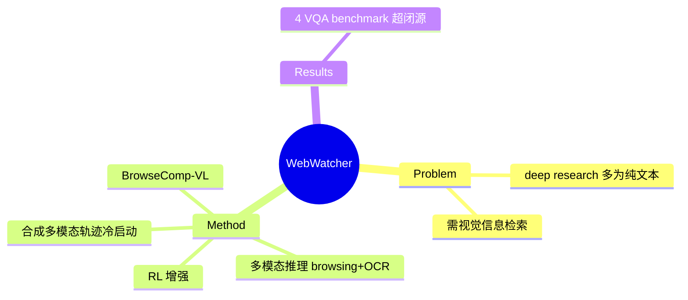

## Summary
WebWatcher 把 deep research agent 从纯文本推进到**视觉-语言多模态**：整合视觉+文本浏览、OCR、多工具调用，用高质量合成多模态轨迹冷启动 + RL，并提出多模态检索 benchmark BrowseComp-VL；在 4 个高难 VQA benchmark 上显著超越闭源 baseline、RAG workflow 与开源 agent。

## Problem & Motivation
真实 deep research 常需处理图像、图表、截图等视觉信息，但既有 deep-research agent（[[Papers/2505-WebDancer]]、[[Papers/2507-WebSailor]]）多为纯文本。多模态 deep research 更难——需要在视觉+文本交织的信息景观里做复杂检索与推理。WebWatcher 想突破这个 vision-language 前沿。

## Method
> [未获取全文，仅基于 abstract + 页面结构]

三大组件：
1. **多模态推理架构**：融合视觉与文本信息，组合 browsing + OCR + 多工具调用，处理视觉/文本交织的复杂信息检索。
2. **合成多模态轨迹冷启动**：用高质量 synthetic multimodal trajectory 做高效 cold start，免大量人工标注即可建立多模态 agentic 能力。
3. **RL 增强**：进一步用 RL 优化行为、提升泛化。

配套提出 **BrowseComp-VL**——需同时处理视觉与文本信息的复杂检索 benchmark。

## Key Results
- 在 4 个高难 VQA benchmark 上**显著超越 proprietary baseline、RAG workflow 与开源 agent**。
- 引入 BrowseComp-VL 填补多模态 deep research 评测空白。
- （具体数值未获取全文；abstract 强调多模态 deep research 仍"highly challenging"。）

## Strengths & Weaknesses
**亮点**：(1) 把 deep-research 支线扩到多模态，补上视觉信息检索这一现实刚需；(2) 合成多模态轨迹冷启动降低标注门槛；(3) BrowseComp-VL 是多模态 deep research 评测的新锚点；Tongyi 家族多模态一环。

**局限**：(1) 未获取全文，缺具体数字与消融；(2) OCR + 多工具拼装的 pipeline 复杂度与鲁棒性未知；(3) 多模态 deep research 绝对难度高、远未饱和。属 [[Topics/WebAgent-Survey]] deep-research 路线（多模态子分支）。

## Mind Map

## Notes
- Tongyi 家族链：[[Papers/2505-WebDancer]] → [[Papers/2507-WebSailor]] → **WebWatcher** → [[Papers/2509-WebSailorV2]]。
- 与 vault 的 [[Papers/2500-WebCogreasonerTowardsKnowledge]]（web 认知推理）互补，但 WebWatcher 更偏多模态 open-web 检索。
