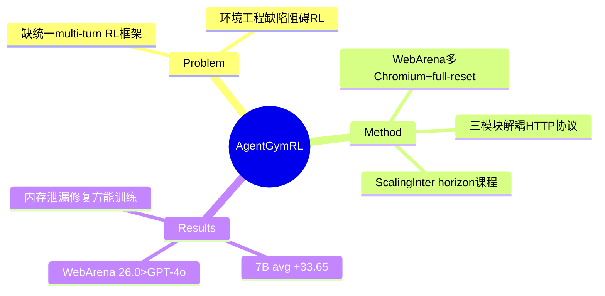

## Summary

AgentGym-RL 是统一多环境 multi-turn RL 训练框架（环境/Agent/训练三模块解耦，HTTP server-client 协议），覆盖 WebArena、Deep Search、TextCraft、BabyAI、SciWorld 五类环境，配套 ScalingInter-RL（交互轮数渐进扩展）训练法；7B 模型五环境平均提升 33.65 分，多项追平或超过 o3/Gemini-2.5-Pro。对环境引擎研究最有价值的是其**基建改造清单**：WebArena 子进程多 Chromium 并行化、full-reset 接口、TextCraft/SciWorld 内存泄漏修复——RL 训练把环境的工程缺陷全部逼了出来。

## Problem & Motivation

社区缺一个统一的、可交互的 RL 框架让 LLM agent 从零（无 SFT）在多样真实环境中训练；既有 RL 多停留在 single-turn，扩展到 multi-turn agent 场景时优化稳定性与效率都成问题。

## Method

- **框架**：环境模块（标准化 server-client 架构 + 统一 HTTP 协议）/ Agent 模块（长程规划与自反思）/ 训练模块（可插拔 RL objective/reward/采样）。
- **WebArena 基建改造（环境引擎第一手证据）**：
  1. 原版"单浏览器单进程"→ **子进程多 Chromium 架构**，单 server 并发管理多浏览器实例；
  2. 新增 **full-reset 接口**——每 episode 后把 web server 恢复到初始状态，否则长时训练中状态不一致累积、污染学习信号；
  3. 并行环境客户端各自独占、互不干扰。
- **其他环境的可靠性工程**：TextCraft 列表结构自复制导致指数级内存增长、SciWorld 内部时钟渐进内存累积——都需重构才能撑住大规模 RL。
- **ScalingInter-RL**：交互 horizon 单调递增课程 {h₁<h₂<…<hₙ}——初期短 horizon 保稳定学基本技能，后期长 horizon 催生规划/反思/策略性回溯。动机：初始就给大交互预算会"早期领先→训练中崩溃"。

## Key Results

- **WebArena（27 任务子集）**：ScalingInter-7B **26.0%** > GPT-4o 16.0%（o3 34.0%）。
- **SciWorld**：ScalingInter-7B **57.0%** > o3 41.5%；base 1.5 → 训后 50.5。
- **TextCraft** 91.0%（o3 93.0%）；**BabyAI** 96.67% > o3 94.44%；Deep Search 38.25%（o3 49.5%）。
- **规模对比**：7B + RL 平均 ~58.6%，超 Llama3.1-70B（~47%）与 Qwen2.5-72B（~43%）——post-training 计算 > 参数规模。
- GRPO 显著优于 REINFORCE++（3B GRPO > 7B REINFORCE++）。

## Strengths & Weaknesses

**Strengths**：五环境统一接口 + 无 SFT 从零 RL 的完整配方；ScalingInter 的"horizon 课程"简单有效且给出崩溃模式的经验刻画；基建改造清单诚实具体，是 WebArena 不适配 RL 的最系统一手记录。

**Weaknesses / 边界**：
- WebArena 只用 27 任务子集评测，与全集 812 任务的数字不可比；绝对分仍低。
- full-reset 是**episode 级全量恢复**——比 [[Papers/2510-WebServ]] 的块级快照粗得多（无 fork/分支/中间态注入），只解决了"能训"，没解决"训得快"。
- 泛化自认局限于 in-domain；环境集合虽多但每个都偏小/偏玩具（BabyAI/TextCraft）。
- ScalingInter 的 δₕ 调度是手工设定，何时该扩 horizon 缺自动判据。

## Mind Map

## Notes

- **对 AFE / 环境引擎的证据价值**：与 [[Papers/2511-DreamGym]] 的"4 并发证词"同源但走了相反路线——DreamGym 放弃真实环境，AgentGym-RL 花工程把 WebArena 改造成勉强 RL-ready。改造清单（并行化、full-reset、内存治理）正是 [[Topics/CUA-Survey]] 轴 1/轴 3 的需求实例；其"状态不一致累积毁训练"的观察给 reset 需求补了训练侧动机（评测侧动机来自任务间污染）。
- "horizon 课程防崩溃"与 [[Papers/2606-AsyncWebRL]] 的"归一化项鼓励长失败轨迹"可互为印证：长 horizon RL 的不稳定既有算法项也有环境项。
- 环境侧仍缺的：fork/分支支持 GRPO group rollout（他们用重复 reset 凑）、中间态注入、可编程 init——都是 MiniSuite 可对照的点。
