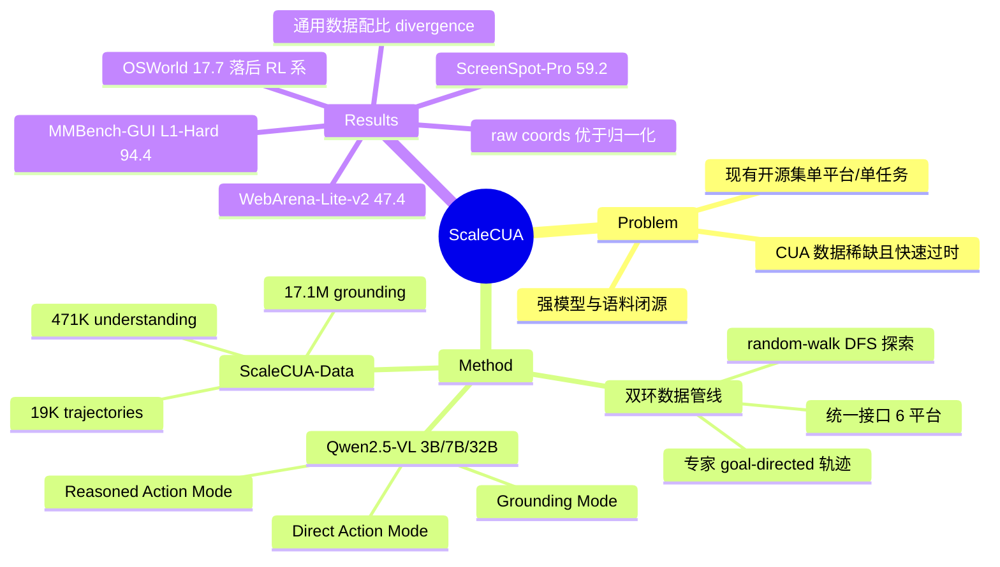

## Summary

ScaleCUA 用"agent 自动探索 + 人类专家"双环数据管线构建了覆盖 6 个平台（Windows/macOS/Linux/Android/iOS/Web）的开源 CUA 语料（471K understanding / 17.1M grounding / 19K trajectories），并基于 Qwen2.5-VL 训练出 3B/7B/32B 三尺寸、支持 Grounding / Direct Action / Reasoned Action 三种推理模式的基座模型。GUI understanding 与 grounding 达开源 SOTA（MMBench-GUI L1-Hard 94.4、ScreenSpot-Pro 59.2、OSWorld-G 60.6），但端到端 OSWorld 仅 17.7%，明显落后 RL 训练的 agent。

## Problem & Motivation

CUA 的瓶颈不在模型架构而在数据：与互联网上海量的 image-text pair 不同，computer-use 数据（尤其是细粒度 action trajectory）稀缺、标注昂贵、且随软件/网页演化快速过时；强 CUA（Operator、Claude computer-use、UI-TARS 等）要么闭源模型、要么闭源语料。现有开源数据集多局限于单平台或单任务类型（如 RICO/AitW 只有 mobile、OS-Atlas 只有 grounding），缺少跨平台、覆盖 understanding + grounding + trajectory 三层监督的统一语料。作者的路线是：把数据管线、数据、模型、评测环境全部开源，验证 data-driven scaling 对通用 CUA 的作用。

## Method

**Cross-Platform Interactive Data Pipeline**（双环闭环）：

- **Agent-Environment Interaction Loop**：先在 Windows/Ubuntu/macOS/Web/Android/iOS 上统一 observation-action 接口。GUI metadata 按平台取用：桌面走 A11y Tree、Web 走 DOM、Android 走 XML layout；A11y 缺失和 iOS/iPadOS 受限的场景用 OmniParser 估计元素 bounding box（容忍噪声换取效率）。
- **Agent-Human Hybrid Data Acquisition Loop**：VLM-driven agent（GPT-4o/Claude/Gemini）探索因模型固有 bias 导致轨迹多样性不足，改用 **rule-driven random-walk agent**（DFS + 启发式剪枝去冗余分支），去重后覆盖面显著更广；再用人类专家在跨平台标注系统上补采 goal-directed 轨迹。共采集 2M+ 原始截图，用 GPT-4o / Claude-3.7 做标注。
- **统一动作空间**：Desktop/Browser/Mobile 三环境共享核心操作（click、write 等）+ 平台专属动作（long_press、open_app 等），使跨平台行为建模一致。

**ScaleCUA-Data 三任务族**：① GUI Understanding 471K（元素级外观/OCR/布局/意图 + 截图级 Interface Captioning + Screen Transition Captioning）；② GUI Grounding 17.1M（point / bbox / action 三种监督格式，LLM 增广）；③ Task Completion 19K 轨迹 = 15K+ **weak-semantic 轨迹**（随机游走按屏幕相似度切段，无明确目标但提供导航监督）+ 4K 人类 goal-directed 轨迹，平均 9 步。增广手段：element cropping、合成分辨率缩放、背景替换、reasoning-based 轨迹标注扩写。

**模型**：基座 Qwen2.5-VL（3B/7B/32B），纯视觉观测（不用 A11y/DOM 做推理输入）。三种推理范式共存于一个模型：

1. **Grounding Mode** — 只做 UI 元素定位（point/bbox/coordinate-referenced action），可作为 grounder 插进 planner–grounder 模块化工作流（planner 用 GPT-4o 等强 VLM）；
2. **Direct Action Mode (DAM)** — 直接输出 `<operation>`（低层自然语言说明，回填对话历史作上下文）+ `<action>`（可执行命令），无中间推理，低延迟；
3. **Reasoned Action Mode (RAM)** — 先 `<think>` CoT 再出 action，牺牲延迟换可靠性与可解释性。

**训练**：SFT，lr 1e-5，max length 40960；3B/7B 用 128×A100，32B 用 128×H200。通用多模态数据比例按模型尺寸递增：3B 25% / 7B 50% / 32B 75%（理由：大模型记忆容量更大，能容纳更多通用知识而不严重稀释 GUI 专有能力）。

## Key Results

**GUI Understanding（MMBench-GUI L1）**：32B 在 Easy/Medium/Hard 达 92.5/92.5/**94.4**，Hard 超过所有开源与闭源模型（GUI-Owl-32B 94.2、GPT-4o 53.5）；3B 即达 83.6，超 Qwen2.5-VL-72B (+16.6)。

**GUI Grounding**：ScreenSpot-v2 32B 平均 **94.7**（3B 89.2 已超 Qwen2.5-VL-72B）；ScreenSpot-Pro 32B **59.2** 超 GUI-Owl-32B（58.0）；OSWorld-G **60.6**。

**端到端 online（Table 5，native agent，15/50 steps）**：

| Benchmark | ScaleCUA-32B | 对比 |
|:--|:--|:--|
| WebArena-Lite-v2 | 44.2 / **47.4** | UI-TARS-72B-DPO 23.4/21.4（+20.8/+26.0） |
| WindowsAgentArena | 21.4 / 24.2 | UI-TARS-72B-DPO 11.1/17.9 |
| OSWorld (Ubuntu) | 16.5 / 17.7 | **落后** OpenCUA-32B 29.7/34.1、COMPUTERRL 47.3 |
| AndroidWorld | 30.6 | **落后** UI-TARS-72B-DPO 46.6、Seed1.5-VL 62.1 |
| MacOSArena | 7.1 / 7.1 | 全线模型都低，OS-specific affordance gap |

**Planner–grounder 工作流**（GPT-4o planner + ScaleCUA-7B grounder）：AndroidWorld 48.3、WebArena-Lite-v2 35.1，超 UI-TARS-1.5-7B（28.6）与 UGround-V1-7B（26.5）等 grounder。

**数据侧 ablation（本文最有信息量的部分，Qwen2.5-VL-3B）**：

- 数据增广：ScreenSpot-Pro 37.8 → 41.3；
- weak-semantic 轨迹（public data 基线上加）：OSWorld 7.9→8.5，WebArena-Lite-v2 8.4→**14.3**——低成本随机游走片段对导航能力有实际贡献；
- **raw 坐标 > 归一化坐标**（SS-Pro 42.3 vs 37.9）：绝对位置更好地捕捉跨平台布局规律；
- 训练分辨率 2K：grounding 升（SS-Pro 45.5 vs 42.3）但 online agent 明显降（AndroidWorld 23.3→13.4）——grounding 与 agentic 任务对分辨率的偏好相反；
- RAM 比 DAM 各 benchmark 稳定高 +1.4~+8.2（长程复杂环境增益最大），代价是延迟；
- 数据 scaling 呈对数增益、75% 后饱和，唯 WebArena-Lite-v2 接近线性——不同 benchmark 的 data hunger 差异大；
- 通用多模态数据比例上升 → GUI benchmark 单调下降、通用 benchmark ~75% 见顶：两类能力存在直接冲突，需要 data-balancing。

## Strengths & Weaknesses

**Strengths**：

- 目前开源 CUA 里覆盖最全的语料（唯一同时有 desktop+mobile+web、understanding+grounding+trajectory 的 hybrid 采集数据集，见其 Table 1），且管线、数据、模型、evaluation harness 全开源——对社区的边际贡献比单点 SOTA 大得多。
- 数据侧 ablation 提供了一批可迁移的 data-centric 经验（raw coords、分辨率 trade-off、通用数据配比 divergence、weak-semantic 轨迹有效性），这些比 leaderboard 数字更有复利价值。
- 一个模型三种推理模式的设计务实：既能当 native agent，又能当模块化工作流里的 grounder，且实验证明它作 grounder 强于专职 grounder（AndroidWorld 48.3）。
- "VLM-driven 探索多样性不足、rule-driven random walk 覆盖更广"是一个反直觉且有证据的工程发现。

**Weaknesses / 适用边界**：

- **SOTA 集中在 understanding/grounding，端到端能力并不领先**：OSWorld 17.7 vs OpenCUA-32B 34.1、COMPUTERRL 47.3；AndroidWorld 也落后 mobile-native 模型。abstract 里 +26.6 的旗舰数字来自 WebArena-Lite-v2——一个**作者自己改造的 benchmark**（从 WebArena-Lite 升级），跨论文可比性存疑。
- 19K 轨迹中真正 goal-directed 的只有 4K（其余是随机游走切段），平均 9 步——**轨迹稀缺这个核心痛点并没有真正被 scaling 解决**，本文实质是 understanding/grounding 的 scaling + 轨迹的少量补充；这也与端到端结果偏弱互相印证。
- 纯 SFT，无 RL/PRM、无 reflection/memory/hierarchical planning（作者在 Limitations 中承认）；history 是平铺的 (operation, observation) 序列，长程任务未验证。
- macOS 全线 ~7%、iOS 只进了数据没有 online 评测：cross-platform **data** ≠ cross-platform **competence**，OS-specific affordance gap 仍在。
- 纯视觉观测是一个双刃剑假设：规避了 A11y/DOM 噪声，也放弃了结构化信息；在 DOM 可靠的 web 场景这未必是最优设定。

**影响**：定位类似 GUI Agent 领域的 "LLaMA moment"——提供开源基座 + 语料让后续工作（RL、memory、reflection）有共同起点；其数据配比结论对任何做 VLM post-training 的工作都有参考价值。

## Mind Map

## Notes

- 与 [[2509-UITARS2]] 对照：UI-TARS-2 走 RL scaling 路线，本文走 data scaling + SFT 路线；ScaleCUA 的 OSWorld 短板恰是 UI-TARS/COMPUTERRL 用 RL 补上的部分——两条路线互补，"开源基座 + 后续 RL"是显然的组合方向。
- 数据管线与 [[2412-OSGenesis]]（reverse task synthesis）、[[2412-AgentTrek]]（tutorial 转轨迹）同属自动化轨迹合成谱系，但 ScaleCUA 的 random-walk + 人类混合是覆盖面 vs 语义质量的另一个 trade-off 点；weak-semantic 轨迹有效这一结论与 OS-Genesis 的"无目标探索也有监督价值"互相印证。
- grounder 角色对照 [[2400-AguvisUnifiedPureVision]]、[[2410-OSAtlas]]、[[2400-NavigatingDigitalWorldAs]]（UGround）：ScaleCUA-7B 作 grounder 超过 UGround-V1-7B，延续"grounding 数据 scaling 直接兑换 grounder 质量"的 pattern。
- 疑问：raw coordinates 优于 normalized 的结论与 Qwen2.5-VL 原生用绝对坐标训练有关，换 InternVL 基座是否还成立？论文 repo 声称支持 InternVL 训练但正文未报数。
- 可挖掘的 gap：分辨率对 grounding/agentic 的反向影响（2K 升 grounding 降 agent）暗示两种能力用同一套视觉 token 化存在张力——动态分辨率或 task-conditioned 视觉编码可能是切入点。
