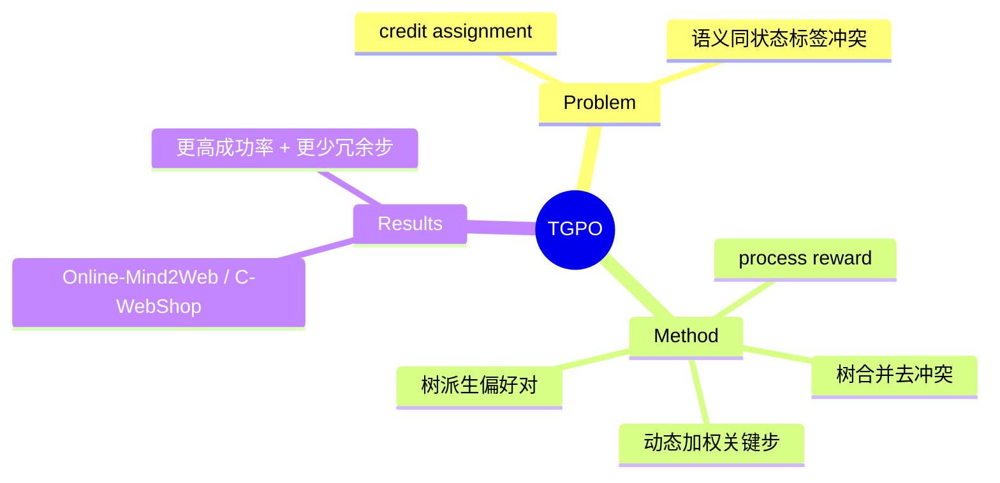

## Summary
TGPO 用**树结构轨迹表示**做 web agent 的离线偏好优化：把多条轨迹中语义相同的状态合并成树、消除偏好标签冲突，再配 process reward model（子目标进度 + 冗余检测 + 动作验证）与动态加权做细粒度 credit assignment，在 Online-Mind2Web 与 C-WebShop 上以更少冗余步超越现有方法。

## Problem & Motivation
web agent RL 的核心难点是 credit assignment——终局稀疏奖励难以定位是哪一步做对/做错，且不同轨迹里"语义相同的状态"被打上冲突的偏好标签，污染训练信号。TGPO 想用树结构 + 过程奖励解决"标签冲突 + 细粒度信用分配"两件事。

## Method
1. **树结构轨迹表示**：把多条轨迹中**语义相同的 state 合并**成树节点，消除同状态被赋予矛盾偏好的 label conflict，为离线 RL 提供干净的对比信号。
2. **Process Reward Model**：给出细粒度过程奖励——subgoal 进度追踪 + 冗余动作检测 + 动作验证（是否真的推进任务）。
3. **Dynamic Weighting**：在训练中优先加权高影响力的决策点（分叉关键步），把梯度集中到真正决定成败的动作上。
4. **Preference Construction**：从树结构派生偏好对，直击 credit assignment。

## Key Results
在 **Online-Mind2Web** 与 **C-WebShop** 上，TGPO 显著超越既有方法，**成功率更高且冗余步更少**（既准又高效）。相对 GRPO/DPO 类 baseline 的优势主要来自树合并消歧 + 过程奖励的细粒度信用分配。

## Strengths & Weaknesses
**亮点**：(1) "合并语义同状态消除标签冲突"是针对 web 轨迹 credit assignment 的巧思，与 vault 里 [[Papers/2606-AsyncWebRL]]（step normalizer 诊断）、ProxMO（state similarity credit）同属"更细粒度信用分配"主题；(2) 在 [[Papers/2504-OnlineMind2Web]]（真实 live 评测）上验证，可信度较高；(3) 过程奖励含冗余检测，直接对治 web agent 空转问题。

**局限**：(1) 树合并依赖可靠的"语义相同状态"判定，web 状态高维、判定误差会传导；(2) process reward model 本身需训练/标注，成本与可靠性未知；(3) 偏离式（离线偏好）与在线 RL 的取舍未充分对比。属 [[Topics/WebAgent-Survey]] 的"训练范式"路线（credit assignment 子问题）。

## Mind Map

## Notes
- 与 vault 的 credit assignment 讨论（agenda "Credit Assignment 方向是否继续"）相关：TGPO 的"语义同状态合并"是 web 版 state-similarity credit，可作为 ProxMO PSA 的对照点。
