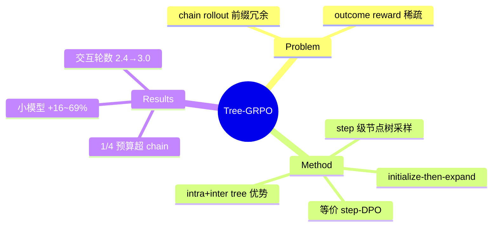

## Summary
把 agent RL 的 rollout 从独立 chain 换成 agent step 级节点的树采样（initialize-then-expand，共享前缀），同预算下获得 ~1.5× 样本；树分叉点的兄弟子树回报差天然构成 step 级过程信号，intra-tree + inter-tree 双层组相对优势估计——1/4 rollout 预算超过 chain-based GRPO，小模型多跳 QA 相对提升 16-69%。

## Problem & Motivation
多轮 agent RL 两大痛点：(1) rollout 预算重——chain 采样每条轨迹独立展开，前缀大量冗余，rollout 阶段主导训练时间且工具调用（如付费搜索 API）昂贵；(2) outcome-only 奖励在长程多轮轨迹上监督稀疏，模型倾向学捷径/短交互，甚至训练崩溃。核心问题：**能否只用 outcome reward、在受限预算下构造更细粒度的监督？**

关键背景论断：MCTS 在离线 DPO 数据构造和 test-time scaling 中已被验证，但**很少用于 online RL 训练——因为其多轮顺序 rollout 与并行化 LLM 推理引擎失配，卡死吞吐**。

## Method
- **Agent step 级树搜索**：节点 = 完整 Thought-Action-Observation 步（区别于 token/sentence 级树方法，后者无法用于 agent 任务）。
- **Initialize-then-expand**：每 prompt 先并行生成 M 条独立 chain 作为 M 棵树的初始化；再迭代 L 次：每树随机采 N 个非叶节点，从 root→节点的完整上下文续写新分支插回树。总计 M×(L×N+1) 条 rollout；期望预算 E[B_tree] = M·B + L·N·B/2（扩展平均从半深处开始）——同预算 ~1.5× 样本。
- **双层优势**：分叉点回传子树叶子的 outcome reward，兄弟子树之差 = 偏好信号（粒度由子树深度调制）；intra-tree 组相对优势 + inter-tree（全树 rollout 组）优势相加，后者兜底前者的小样本高方差。
- **理论**：Prop 3.1 证明 intra-tree GRPO 梯度与 step-level DPO 结构等价（仅权重项不同）——在线 rollout 里隐式做了 step 偏好学习。

## Key Results
- **11 数据集**：多跳 QA 上 <3b 模型相对 chain-GRPO +16%~69%（Qwen2.5-1.5b avg 19.1 vs 11.3）；14b 仍 +8.4%；Qwen2.5-1.5b 上 chain 方法无法激发多轮行为而 Tree-GRPO 可以（无 SFT 冷启动）。
- **Web-Agent QA**（SimpleQA/GAIA/WebWalkerQA/BrowseComp，真实搜索 API）：GAIA +28% avg vs GRPO；BrowseComp 增益边际（受训练数据规模限制）。
- **预算效率**：预算 2/prompt 时 tree 31.6 vs chain 14.9（+112%）；**1/4 预算即超 chain 全预算**。
- **消融**：intra-tree 单独在 N=2 时训练崩溃（小组高方差），inter-tree 单独 +6.4%，组合 +16%；树方法还把平均交互轮数从 2.4 拉到 3.0（对抗捷径偏好）。

## Strengths & Weaknesses
**亮点**：(1) "前缀共享 = 免费样本 + 免费过程信号"一石二鸟，纯 outcome reward 即插即用；(2) DPO 等价性给树结构监督以理论地位；(3) 预算维度的评估协议（per-prompt token/tool-call 预算）应成为 agent RL 标配。

**局限**：(1) **环境全部是无状态检索/搜索 API**（本地 Wikipedia E5 / 真实 web search API）——分支 = 从上下文续写 + 重发查询，无需恢复任何环境状态；**方法能否用于有状态 browser/GUI 环境完全未验证**，而那正是分支需要引擎支持的场景；(2) 随机选节点扩展（无 value 引导），预算大时优势收窄；(3) web-agent QA 的增益受训练集规模制约。

对本方向的意义：training-time branching 的价值证明（样本效率 + 过程监督），但其可行性恰恰依赖环境无状态这一前提——把它搬到 WebArena 级有状态环境，就需要 [[Papers/2510-WebServ]] 式 fork 原语或 [[Papers/2604-Crab]] 式 checkpoint/restore，这是 engine-level branching 的 demand-side 证据。

## Mind Map

## Notes
- 相关家族（本文 Related Work）：TreeRL (2506.11902) on-policy 树搜索、GiGPO (2505.10978) group-in-group、ARPO (2507.19849) 熵触发分支、AEPO (2510.14545) 熵均衡预算分配、AT2PO (2601.04767) 熵引导树扩展——"在哪分支"的信号设计正在成为子赛道。
- 关键推论：**树 rollout 对环境的要求 = 能从任意前缀廉价重建状态**。无状态环境免费获得；有状态环境需要 snapshot/fork。这解释了为什么 agent RL 的树方法都先出现在 QA/tool 域而非 GUI/browser 域。
