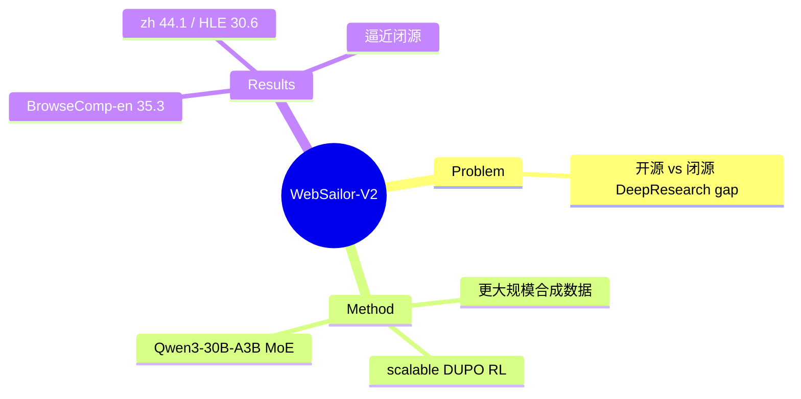

## Summary
WebSailor 的后继：延续"高不确定性合成任务 + DUPO agentic RL + RFT 冷启动"配方，但把合成数据与 RL scale 上去，基于 Qwen3-30B-A3B MoE，把开源 deep-research agent 推到 BrowseComp-en 35.3 / BrowseComp-zh 44.1 / HLE 30.6，逼近闭源 DeepResearch，"弥合与闭源 agent 的鸿沟"。

## Problem & Motivation
[[Papers/2507-WebSailor]] 已证明高不确定性任务训练路线有效，但开源与闭源 DeepResearch 仍有明显 gap。作者判断这个 gap 主要来自**合成数据的规模/质量 + RL 的可扩展性**，而非新范式——因此 V2 的目标是把 V1 的方法 scale 到能与闭源 agent 平起平坐。

## Method
> [未获取全文，仅基于 abstract + 页面结构]

三大延续 + scale：
1. **Synthetic data generation**：继续用 structured sampling + information obfuscation 生成高不确定性任务（SailorFog 思路），但扩大规模与难度覆盖。
2. **Scalable RL — DUPO**：Duplicating Sampling Policy Optimization（复制非零 reward 方差样本使 batch 保持密集，rollout 效率 2–3x），在更大规模上稳定训练。
3. **RFT cold start**：从专家轨迹重构简洁推理做冷启动。
- **Base model**：Qwen3-30B-A3B MoE（激活参数远小于稠密 30B，训练/推理更省）。

## Key Results
- **BrowseComp-en 35.3**、**BrowseComp-zh 44.1**、**Humanity's Last Exam (HLE) 30.6**——相对 V1（72B: en 12.0 / zh 30.1）大幅跃升，且用更小激活参数的 MoE。
- 显著超越所有开源 agent，逼近闭源 DeepResearch，标题即"bridging the chasm to proprietary agents"。

## Strengths & Weaknesses
**亮点**：(1) 证明 V1 范式可 scale——同一配方 + 更多合成数据 + 可扩展 RL 直接把开源 deep-research 提到接近闭源；(2) MoE base 兼顾能力与效率；(3) Tongyi WebAgent 家族最新一环，开源 deep-research SOTA 参考点。

**局限**：(1) BrowseComp 绝对分虽大涨但仍未饱和，fog-navigation 远未解决；(2) 合成任务与真实用户 research query 分布 gap 仍未系统评估；(3) 与"操作真实网页 GUI"的 web agent 能力不互通（deep-research 支线共性局限）。属 [[Topics/WebAgent-Survey]] deep-research 路线。

## Mind Map

## Notes
- 直接后继 [[Papers/2507-WebSailor]]；同族 [[Papers/2505-WebDancer]]、[[Papers/2508-WebWatcher]]。
- 强化 [[Topics/WebAgent-Survey]] takeaway：deep-research 的进步主要靠"合成数据 + RL scaling"，而非新算法。
