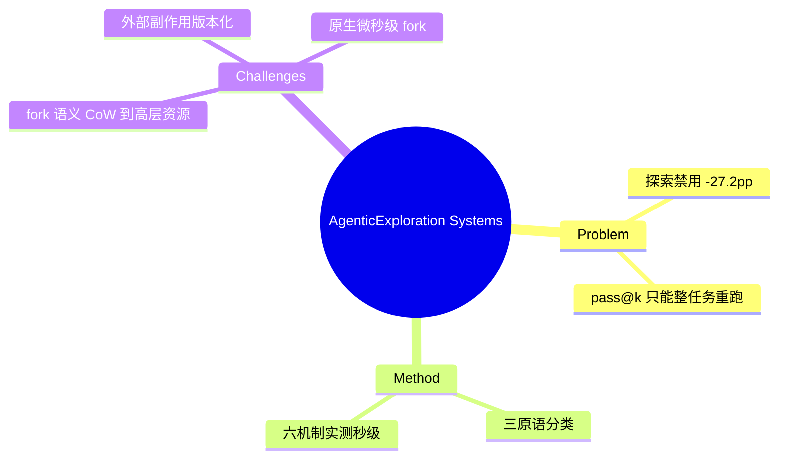

## Summary
系统领域的 position paper：agentic exploration（branch/backtrack/search across execution paths）需要超越 pass@k reset 的系统级支持——实测六种 snapshot/restore 机制全部达不到探索所需速度（最好 ~1.8s，需要的是微秒级），并提出三大开放挑战：fork 语义、外部副作用、原生 fork。

## Problem & Motivation
长程有状态任务中 agent 因累积误差和不可观测状态变化频繁出错，需要从**中间状态**（而非仅初始状态）探索。量化动机：Terminal-Bench 上禁用探索使准确率掉 27.2pp（30.6%→3.4%）。现有基建只支持"整任务重跑"（pass@k），没有任何系统为"从任意中间状态分支"设计。

## Method
**状态恢复三原语的分类**：
1. **Replay-to-node**（前缀重放）：零快照开销，但重放成本随前缀长度线性涨，且要求确定性。
2. **Snapshot/Restore**：O(1) 恢复，但存储成本高。
3. **Backtracking**（预定义逆操作）：被作者判定为不可行——文件删除、网络 I/O、时间敏感操作本质不可逆。

**六机制实测**（56 核 Xeon / 128GB，2GB 状态）：

| 机制 | 延迟 | 缺陷 |
|:--|:--|:--|
| CRIU | 1.445s | 忽略文件系统状态；成本随内存线性 |
| Docker commit | 6.915s | 丢失活跃内存 |
| Podman | 12.914s | 同上，启动 >10s |
| AWS VM snapshot | 353s | 完全不为此设计 |
| checkpoint-lite（自研 CRIU+OverlayFS） | 1.757s | 保留文件系统但仍秒级 |
| Hybrid (Podman+CRIU) | 26.648s | — |

**三大开放挑战**：
1. **Fork 语义**：需要轻量原生 fork——运行中应用的多个活逻辑副本、不复制未变数据；Unix CoW 语义要扩展到高层资源（子分支写 socket 不得污染父流、文件写落入 per-branch overlay）；要求微秒级。
2. **外部副作用**：数据库/浏览器/云 API 的状态在本地 FS/RAM 之外，恢复检查点会使远端状态失效（TCP 序号、auth token、DOM 树）；出路是 **fork-aware API**（副作用内生版本化，类 S3 object-versioning：每分支写不可变 commit）或调用拦截。
3. **原生 fork**：现有子系统 fork 太慢——Neon 的 Postgres branching 秒级 vs 需要的亚毫秒；Python fork 后 GPU tensor/socket 不存活。需要组件内置 fork hook（数据库微秒级版本化 page cache、runtime 暴露 CoW heap）。

## Key Results
（position paper，主结果即上述测量。）核心量化论断：探索价值 27.2pp、现有机制与需求之间隔 3-6 个数量级（秒级 vs 微秒级）。

## Strengths & Weaknesses
**亮点**：(1) 第一篇把"agent 探索需要什么系统原语"作为独立研究议程正式提出的论文，问题 framing 与我们 AFE 方向的 fork/rollback 轴完全同构；(2) 三原语分类 + 三挑战是干净的设计空间地图；(3) 对 backtracking（逆操作）路线的否定有系统层论据。

**局限**：(1) 隔离测试台、无外部依赖——自认真实部署更糟；(2) 只测延迟不测存储/架构改造成本；(3) 无解决方案，checkpoint-lite 原型仍不可用；(4) **视角纯 trainer/infra 侧**：讨论的是运行时给搜索算法供 fork，未讨论把 fork 作为 affordance 暴露给 agent policy 本身的接口与因果收益——与 [[Papers/2510-WebServ]] 同样停在引擎层。

对本方向的意义：系统社区已在 2025-10 正面认领这个问题——AFE 的竞争与合作对象。其"外部副作用"挑战与 [[Papers/2512-WebOperator]] 动作可逆性、[[Topics/WebEnvironment-Engine-Survey]] Open Problem 2（fork 恢复不了外部世界）三方汇合。

## Mind Map

## Notes
- 与 WebServ 互补：WebServ 证明容器栈上 O(1) fork 可达 1.78s/28MiB；本文指出对交互式探索仍慢 3 个数量级——**引擎路线内部也有代际差**。
- "fork-aware API / 副作用版本化"是站长侧接口（agents.txt、permission manifests）之外的第三种环境-agent 契约形态，值得并入 AFE 的接口设计讨论。
