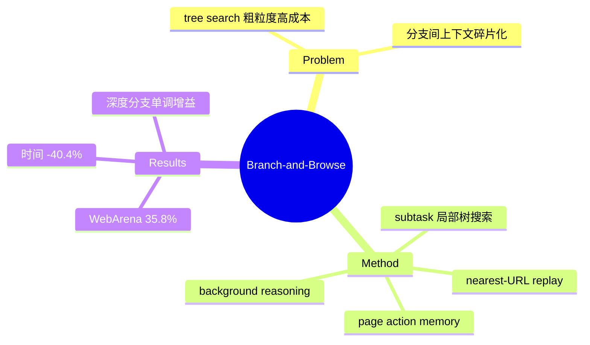

## Summary
细粒度 tree search web agent 框架：subtask 分解约束搜索空间 + nearest-URL 混合重放做状态恢复 + background reasoning 对 frontier 节点离线预扩展 + page 级 action memory 跨分支/跨 session 共享经验，WebArena 35.8%（tree search baseline 19.2%），执行时间 -40.4%。

## Problem & Motivation
线性方法（ReAct）无有效回溯，早期错误只能整任务重来；已有 tree search 粒度粗、算力贵——各分支独立探索、上下文互不共享（contextual fragmentation），且分支不确定性和冗余扩展造成低效。核心问题：如何让 branching 探索在预算内变得可负担。

## Method
- **Tree-structured subtask exploration**：任务先分解为 subtask 序列（带目标函数与成功谓词），tree search 在当前 subtask 的局部范围内展开（frontier 选最高效用节点、生成 b 个候选动作扩展）；subtask manager 可根据观察证据在线改写 subtask（应对分解与站点结构错位）。
- **Web state replay（nearest-URL 策略）**：回到先前状态 o_j 时，不做完整轨迹重放，而是找到最近的缓存 URL 检查点 c≤j，`Load(url_c)` 后只重放 c→j 的剩余动作。是 reset+replay 与 URL 跳转的混合体——仍是 agent 侧近似恢复。
- **Background reasoning**：对 frontier 未探索节点用 DOM snapshot+URL 离线推理可能的下一动作；确定性 click（有显式 URL）在后台预扩展，type/select 等需要 live 上下文的动作延迟执行。
- **Page action memory**：page 级结构化记录（objective / progress summary / reason-action history / page snapshot / action memory），重访 URL 时重建局部上下文，跨分支与跨 session 复用。

实现：GPT-4o + Playwright MCP + AgentScope；默认 depth=5、branch=5。

## Key Results
- **WebArena 35.8%** vs Tree Search（Koh et al.）19.2%（+16.6pp）、WebArena 官方 16.5%、BrowserGym 23.5%、SteP 33.3%、AWM 35.5%；AgentOccam-Judge 45.7% 更高但依赖站点特化启发式（作者称正交可叠加）。
- **效率**：成功任务平均 12.4 分钟 vs tree search 20.8 分钟（-40.4%）。
- **消融**：去掉 background reasoning 时间涨幅 > 去掉 replay——推理时间（而非页面加载）主导运行时开销。
- **深度/分支敏感性**：d=0,b=1 时 23.9% → d=5,b=5 时 35.8%，性能随搜索规模单调升、时间温和涨。

## Strengths & Weaknesses
**亮点**：(1) 把 tree search 的三大成本（状态恢复、节点评估、重复探索）逐一工程化压低，是 agent 侧分支探索的效率集大成；(2) nearest-URL replay 是 reset+replay 谱系的实用改进；(3) action memory 让分支间共享知识，直击 contextual fragmentation。

**局限**：(1) 作者自认**单浏览器 session、不并行分支探索**——并行被明确列为 future work，恰说明 agent 侧做并行分支的工程门槛；(2) URL+局部重放仍无法恢复后端状态（与 [[Papers/2504-WebRollback]] 同一天花板）；(3) 无 live 站点验证，WebArena 确定性沙盒里 replay 假设才成立。

对本方向的意义：agent 侧 branching 的效率优化已经卷到 memory/离线推理层面，但状态恢复和并行两个根子问题仍受"无引擎支持"约束——补强 [[Topics/CUA-Survey]] 轴 4 的"agent 侧模拟天花板"论据。

## Mind Map

## Notes
- 与 [[Papers/2512-WebOperator]] 同为 2510-2512 的 tree search 改良波；WebOperator 攻可逆性安全，Branch-and-Browse 攻效率与记忆，二者正交。
- "background reasoning 只预扩展确定性 click"隐含承认：**只有 URL 可达的状态转移才能安全模拟**——环境若提供真 fork，type/select 也能预扩展。
