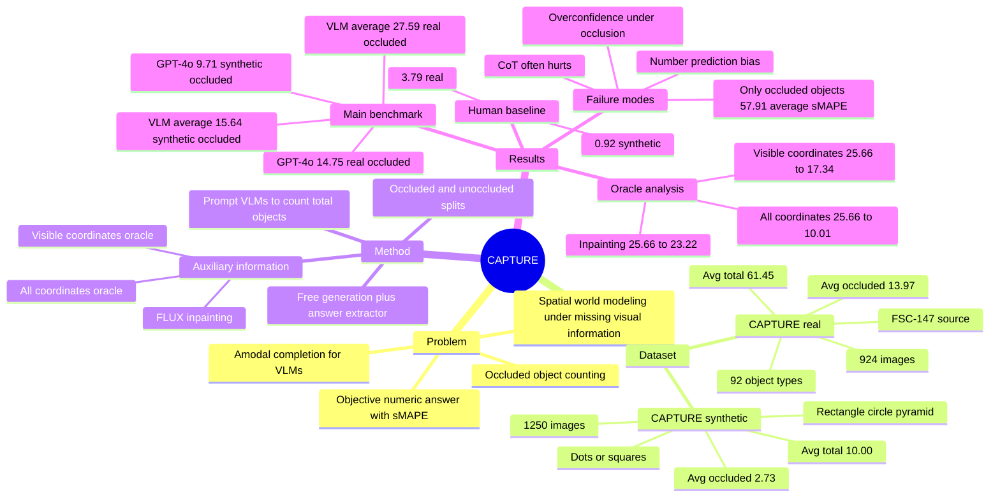

## Summary
CAPTURE 提出一个 amodal counting benchmark，用遮挡物覆盖规则排列的对象，要求 VLM 根据可见 pattern 推断被遮挡对象并输出总数。论文构造了 CAPTURE_real 和 CAPTURE_synthetic 两个 split，显示 GPT-4o、InternVL2、Molmo、Qwen2VL、MiniCPM-o 2.6、Kimi-VL-A3B 等模型在遮挡下均明显退化，而 human baseline 误差很低。核心贡献不是新模型，而是把 VLM 的 spatial reasoning / world modeling 缺陷转成可客观计分的 counting task。

## Problem & Motivation
现实场景里，物体常被其他物体部分或完全遮挡；人类可以利用经验、上下文和 pattern completion 推断不可见部分，但 VLM 是否具备类似的 spatial world model 仍不清楚。传统 amodal completion 通常评估 segmentation 或 inpainting 这类 pixel-level 输出，不适合直接评估以文本 token 输出为主的 VLM。

CAPTURE 的问题设定很直接：图像中对象按规则 pattern 排列，黑色遮挡框覆盖其中一部分对象，模型需要在假设 pattern 延续的前提下数出对象总数。选择 counting 是因为输出是客观数字，便于用 sMAPE 评估；选择 pattern 是因为若对象随机堆叠，推断被遮挡区域内有多少对象并不合理。

论文给出的现实动机包括 stadium seats、production lines、neighborhood buildings 等需要在遮挡下计数或推断规则排列对象的场景。其关键点是把“看不到但需要推断”的空间理解能力拆出来单独测量，而不是用开放式 VQA 问答间接观察。

## Method
**Task / metric.** 输入是一张包含对象 pattern 的图像和计数指令；occluded split 中有黑色 box 遮挡部分对象，unoccluded split 保留对应无遮挡版本。论文用 symmetric mean percent error (sMAPE) 作为主指标，范围 capped at 100%，对没有给出单一答案或生成 incoherent response 的样本赋 100% error。

**CAPTURE_real.** 真实图像来自 FSC-147。作者先用 GPT-4o 过滤“对象是否形成 pattern”，再人工验证 pattern 是否存在、对象是否可数、遮挡后任务是否仍可解，并手工放置 “fair” occluding box。最终 CAPTURE_real 包含 924 张图像、92 个 object types，平均总对象数 61.45，平均被遮挡对象数 13.97；每个样本有 occluded 与 unoccluded 两个版本。

**CAPTURE_synthetic.** 合成 split 用可控的简单对象构造诊断集，包含 1250 张图像，object 为 dots 或 squares，总对象数 5 到 15；pattern 包括 rectangle、circle、pyramid，位置包含 center、top-left、top-right、bottom-left、bottom-right，颜色从 5 种中随机选择。该 split 平均总对象数 10.00，平均被遮挡对象数 2.73，用于分析 object count、occluded count、pattern type 等因素。

**Models / answer extraction.** 主实验评估 GPT-4o、InternVL2-Llama3-8B、Qwen2-VL-7B、Molmo 7B-D、MiniCPM-o 2.6、Kimi-VL-A3B。模型自由生成 rationale 和答案，再由 Llama 3.1 8B answer extractor 抽取单一数字；作者在 1000 个输出上人工验证 extractor，报告 100% accurate。Human baseline 使用 3 名本科生，各自处理 CAPTURE_real 和 CAPTURE_synthetic 中随机选出的 100 个 occluded examples。

**Auxiliary information analysis.** 为区分错误来自 counting、pattern recognition 还是 world modeling，论文设计两类辅助信息：oracle information 直接给 VLM 文本坐标，包括 all object coordinates 或 visible object coordinates；predicted information 则用 FLUX.1-Fill inpainting pipeline 补全遮挡区域，再让 VLM 对补全图像计数。Molmo 因 prompt limit 会截断坐标列表，所以未参与 coordinate oracle 实验。

## Key Results
**CAPTURE_real / CAPTURE_synthetic main results.** 在 CAPTURE_real 上，6 个 VLM 的平均 sMAPE 从 unoccluded 21.95% 上升到 occluded 27.59%，绝对增加 5.64%；在 CAPTURE_synthetic 上从 11.89% 上升到 15.64%，绝对增加 3.75%。GPT-4o 是两个 split 上最强的 VLM，但仍在 CAPTURE_real occluded 上有 14.75% sMAPE，在 CAPTURE_synthetic occluded 上有 9.71% sMAPE；相对 unoccluded，GPT-4o 分别增加 1.41% 和 3.81%。

**Human baseline.** 在 100-example occluded subset 上，human baseline 在 CAPTURE_real 的 sMAPE 为 3.79%，在 CAPTURE_synthetic 为 0.92%。同一表中，4 个 VLM 的平均 occluded sMAPE 分别为 27.37% 和 14.19%，论文据此指出模型在 CAPTURE_real 上约为人类误差的 7 倍，在 CAPTURE_synthetic 上约为 14 倍。

**Object detection baseline / CountGD.** CountGD 在来自 FSC-147 test set 的 149 张 CAPTURE_real 图像上，unoccluded sMAPE 为 3.15%，occluded sMAPE 为 10.34%，退化 7.19%。它在 occluded split 上仍强于 VLM，但其错误直接受被遮挡对象数影响，说明纯检测计数方法无法真正处理 amodal counting；把 CountGD 的 visible count 作为 prompt 信息输入 VLM 可以降低 VLM error，但 hybrid 仍弱于 CountGD alone。

**Data-factor analysis on CAPTURE_synthetic.** 随着被遮挡对象数增加，模型 sMAPE 上升；相比之下，总对象数对 performance 的影响更弱。pattern type 也影响结果，circle arrangement 通常比 rectangle 或 triangle 更低 error；在 pattern classification task 上，4 个 VLM 的平均 accuracy 从 unoccluded 80.39% 降到 occluded 69.41%，说明模型能识别不少 pattern，但遮挡会造成 10.98% absolute drop。

**Auxiliary / oracle results on CAPTURE_real occluded.** 对 GPT-4o、InternVL2、Qwen2VL 三个模型，all object coordinates oracle 将平均 sMAPE 从 25.66% 降到 10.01%，改善 15.65%；visible object coordinates oracle 降到 17.34%，改善 8.32%。这说明相当一部分错误来自视觉定位、遮挡补全和可见对象计数，而不是纯语言算术。

**Inpainting result.** FLUX.1-Fill inpainting pipeline 对三模型平均 sMAPE 从 25.66% 降到 23.22%，仅改善 2.44%。其中 Qwen2VL 从 29.33% 降到 22.64%，InternVL2 从 32.90% 降到 31.12%，但 GPT-4o 从 14.75% 升到 15.89%；论文的定性观察是 inpainting model 有时不能生成正确 pattern，因此 predicted world model 仍不够可靠。

**Additional analyses / ablations.** Chain-of-Thought 不稳定：GPT-4o 在 CAPTURE_real occluded 从 14.75% 变为 14.94%，Qwen2VL 从 29.33% 变为 31.57%；在 CAPTURE_synthetic occluded 上 GPT-4o 从 9.71% 降到 7.73%，但 Qwen2VL 从 11.74% 升到 37.81%。Temperature backoff 略有帮助，4 个 VLM 平均在 CAPTURE_real occluded 从 27.37% 降到 25.85%，在 CAPTURE_synthetic occluded 从 14.19% 降到 13.21%。只数被遮挡对象更难：CAPTURE_real 上 4 个 VLM 平均 sMAPE 从 all objects 27.37% 升到 only occluded objects 57.91%。

## Strengths & Weaknesses
**已知 Strengths.** CAPTURE 的问题设计简洁：pattern recognition、occlusion reasoning 和 counting 都是基础视觉能力，最终答案又是单个数字，可复现、可比较、可做 controlled diagnosis。CAPTURE_real 提供自然图像和多 object type，CAPTURE_synthetic 提供控制变量，两者互补。

**已知 Strengths.** 论文没有只报告主表，还用 CountGD、human baseline、pattern classification、coordinate oracle、inpainting、CoT、temperature backoff、only-occluded counting、confidence calibration、confusion matrix 等分析拆解错误来源。最有信息量的结果是 coordinate oracle 大幅改善而 inpainting 改善有限，说明当前 VLM 不只是“不知道怎么数”，还缺少稳定的可见对象定位和遮挡区域补全能力。

**已知 Weaknesses / Boundaries.** CAPTURE 的可解性依赖规则 pattern；论文明确说若对象随机堆叠，推断遮挡区域内对象数不合理。因此 CAPTURE 不能代表所有 occlusion reasoning，只覆盖“规则排列对象的 amodal counting”这一窄切面。

**已知 Weaknesses / Boundaries.** CAPTURE_real 来自 FSC-147 并经过 GPT-4o 初筛和人工筛选，得到的是“存在可识别 pattern 且遮挡后仍可解”的子集；这让 benchmark 更干净，但也意味着它不是开放世界遮挡分布的无偏采样。CAPTURE_synthetic 更可控，但对象只有 dots / squares，pattern 也限定在少数几类。

**已知 failure cases.** 附录显示模型在 only occluded objects task 上尤其差，Molmo 的 sMAPE 达到 96.79%，InternVL2 达到 75.82%。论文还报告模型会 overconfident，且在 CAPTURE_synthetic 的 confusion matrix 中偏向预测 8、9、10、12 等常见或容易组成 grid 的数字；这说明错误不只是感知噪声，也包含数值先验和生成偏置。

**推测.** 对 embodied / GUI agent，更有价值的不是 CAPTURE 的 counting 本身，而是它揭示的 failure mode：VLM 在“可见结构 + 被遮挡区域 + 规则延续”的低层空间任务上仍不稳，单靠 CoT 或更开放的语言解释不能解决。后续 agent 若依赖 VLM 做 scene completion、UI layout extrapolation 或 occluded affordance reasoning，可能需要显式 object map、coordinate memory、detector 或 verifier，而不是只加 prompt。

**不知道.** 论文没有给出 DOI。它没有评估 GUI screenshot、机器人闭环任务、video temporal occlusion、主动视角选择或 3D scene memory，因此不知道 CAPTURE 分数能多大程度预测真实 agent 的 end-to-end task success。论文也没有系统给出 latency / cost，以及不同 prompt budget、不同 detector 或不同 inpainting model 对结果的敏感性曲线。

## Mind Map

## Notes
这篇论文最值得记住的不是“VLM 不会数数”这个老结论，而是遮挡把 counting failure 和 world-model failure 叠加放大了。坐标 oracle 的结果说明，只要把视觉定位和遮挡补全从图像中抽出来变成 text coordinates，VLM 的错误会显著下降；这支持“显式空间表征可能比纯 prompt reasoning 更可靠”的方向。

一个需要谨慎的点是，CAPTURE 把世界简化成规则 pattern，因此它更像 stress test，而不是通用空间智能 benchmark。它适合用来问“模型能否补全一个可见 pattern 后的不可见对象数”，但不适合直接回答“模型是否理解真实 3D 世界”。

后续可追的问题：能否把 CAPTURE 扩展到 GUI layout、warehouse shelf、tabletop manipulation 或 egocentric video，让 benchmark 从静态 pattern counting 走向 agent 真正会遇到的 partially observable task？另一个方向是用 object detector / segmentation / scene graph 先构建 structured memory，再让 VLM 做 amodal reasoning，测试这种 hybrid system 是否比端到端 VLM 更稳。
