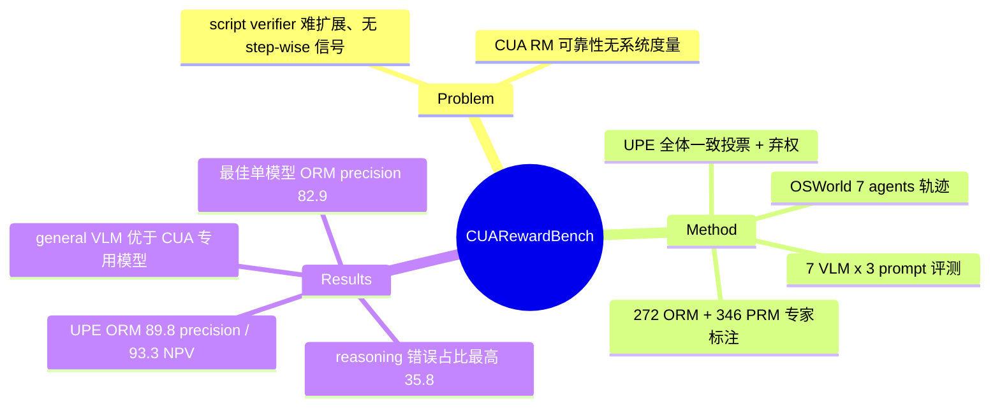

## Summary

首个系统评测 CUA（computer-using agent）reward model 的 benchmark：从 OSWorld 收集 7 个 agent 的轨迹，专家标注 272 条 trajectory-level（ORM）+ 346 条 step-level（PRM）样本，测了 7 个 VLM × 3 种 prompt template。核心结论：现有 RM 精度不足以直接当 verifier 用（最佳单模型 ORM precision 82.9%），general VLM 反而优于 CUA 专用模型；提出 Unanimous Prompt Ensemble（UPE，全体一致才判定、否则弃权）把 ORM precision/NPV 提到 89.8%/93.3%，代价是 recall 掉到 56.8%。

## Problem & Motivation

CUA 的评估与 RL 训练目前依赖 script-based verifier（如 OSWorld 的检查脚本），但脚本难以扩展到新任务、且只能给 outcome 级信号，无法做 step-wise 评估。Reward model 是自然的替代方案（既可做评测 judge，也可为 RL/reject sampling 提供 reward），但"RM 在 CUA 轨迹上到底靠不靠谱"一直没有被系统度量——这正是本文要填的空白：给 ORM（轨迹成败判断）和 PRM（单步好坏判断）建立带专家标注 ground truth 的评测基准。

## Method

**Benchmark 构建**：
- 轨迹来源：OSWorld 上 7 个不同架构/水平的 agent 预采集轨迹，成功率跨 25.9%–50.8%（framework 型：JEDI-7b-o3 50.8%、o3-GTA1 48.8%；单模型型：Claude-4-Sonnet 44.0%、OpenCUA-32B 33.9%，另含 UI-TARS 变体、Doubao-1.5-Thinking）
- 覆盖 OSWorld 全部 10 类软件（Chrome、Thunderbird、LibreOffice Writer/Calc/Impress、VS Code、GIMP、VLC、OS 操作），轨迹限 <25 步以控制标注成本
- 规模：272 条 trajectory-level 标注（139 成功 / 133 失败）+ 346 条 step-level 标注（182 好 / 164 坏）
- 标注协议：trajectory 级看"最终状态是否满足指令 + 有无有害副作用"；step 级只标"key action"（对成败有实质影响的决策点），正确性定义为该动作提升到达目标状态的概率，即 p(target | o_{i+1}, a_i) > p(target | o_i)

**任务定义**：
- ORM：输入完整轨迹（instruction + 截图序列 + reasoning/action），输出二值成败预测；主指标 Precision 和 NPV（分别衡量"判成功时的可信度"和"判失败时的可信度"）
- PRM：输入轨迹 + 待评步骤，输出每步二值正确性

**UPE（Unanimous Prompt Ensemble）**：与 majority voting 不同，要求所有 ensemble 成员对正/负预测**全体一致**才输出判定，否则弃权（abstain）；成员刻意选 precision-NPV trade-off 互补的 模型×prompt 组合（Qwen2.5VL-32B + SE-WSM 严格 prompt；GLM-4.5V-106B + SE-WSM 与 ZeroGUI 宽松 prompt 各一）。本质是用覆盖率换可靠性。

## Key Results

- **单模型上限**：最佳是 GLM-4.5V-106B（12B activated），ORM precision 82.9% / accuracy 80.1%；PRM 明显更难，最佳仅 69.5% precision / 64.2% NPV
- **UPE**：ORM precision 89.8% / NPV 93.3%（recall 降至 56.8%）；PRM 81.7% / 85.1%（recall 48.9%）。Ablation 显示 majority voting 提 precision 但显著伤 NPV；unanimous voting 两者兼保；多样化 prompt ensemble 给 ORM NPV 带来 +9.1pp
- **General VLM > CUA 专用模型**：GUI-OWL-32B 一致差于其 base model，推理过程显著变短——CUA specialization 只对推理弱的小模型有益，对强 base model 反而损伤 reasoning。专用 reward model SE-WSM-7B 也略差于其 Qwen2.5VL-7B base（训练数据仅 860 条轨迹、43 个 Chrome 任务，覆盖太窄）
- **Qwen2.5VL-72B < 32B**：归因于 32B 额外做过 RL 训练，提升了 reward 判断所需的推理与泛化
- **错误分析**（GLM-4.5V 的 53 个失败 case）：reasoning 错误 35.8% > 视觉理解 30.2% > action 理解 17.0% > 知识缺陷 15.1%；视觉推理能力是 CUA RM 的核心瓶颈
- **Prompt 敏感性**：不同 prompt 只是移动 precision-NPV trade-off 而非整体提升（如 Qwen2.5VL-32B 用 SE-WSM prompt 比 ZeroGUI precision +9.1pp 但 NPV -4.4pp）

## Strengths & Weaknesses

**亮点**：
- 问题选得准：CUA 的 RL scaling 卡在 reward 信号上，"RM 到底能不能替代 script verifier"是必须先回答的前置问题。ORM/PRM 双粒度 + precision/NPV 双侧可靠性的度量设计比单看 accuracy 更贴近下游用途（reject sampling / RL filtering 最怕 false positive）
- 反直觉发现有信息量：CUA 专用训练损害 reward 判断能力、prompt 只移动 trade-off 不提上限，这两点对"要不要专门训一个 CUA RM"的决策有直接指导意义
- UPE 简单实用，弃权机制对 data filtering 场景是合理设计

**局限**：
- 规模小（272 + 346 条），长尾失败模式覆盖不足（作者自认）；且全部来自 OSWorld，任务分布窄，结论对真实世界复杂 workflow 的外推性未知
- **UPE 未经 RL 闭环验证**（作者自认）：recall 只有 ~50-57%，被弃权/过滤掉的样本是否有系统性 bias、低 recall 对 RL 样本效率的实际伤害，都还是开放问题。UPE 本身也只是 ensemble + abstention，没有提升 RM 能力上限
- Step-level 只标"key action"，判定带主观性，且 inter-annotator agreement 未报告定量数字（推测：正文只提"rigorous quality control"）
- 72B < 32B 的归因（RL 训练差异）是推测性的，缺 controlled experiment

**影响**：与 [[2504-AgentRewardBench]]（web agent judge 无一 precision >70%）互相印证——**跨 web/desktop 两个 domain，LLM/VLM judge 的可靠性都不足以直接当 ground truth 用**。这为 verifiable-reward 路线（如 [[2606-CUAGym]] 的 programmatic reward 合成）提供了动机，也把"RM-as-verifier vs script-as-verifier"的争论落到了可度量的地面。

## Mind Map

## Notes

- 与 [[2504-AgentRewardBench]] 对读：两者结论一致（judge precision 不够），但本文多了 PRM 维度和 "specialization 有害" 的发现；AgentRewardBench 还额外指出 rule-based verifier recall 低（55.9%），两篇合起来说明 **script 和 RM 两条路各有一侧不可靠**——script 伤 recall，RM 伤 precision
- UPE 的弃权率论文摘要层面未直接给出（recall 56.8% 隐含大量样本被弃权），若用于 RL data filtering，实际可用样本量要打对折以上，值得在复现时关注
- 开放问题：PRM 的 step 正确性定义 p(target|o_{i+1},a_i) > p(target|o_i) 是 potential-based 的，理论上适合做 reward shaping，但标注只覆盖 key action，训练 PRM 时非 key step 的信号从哪来？
