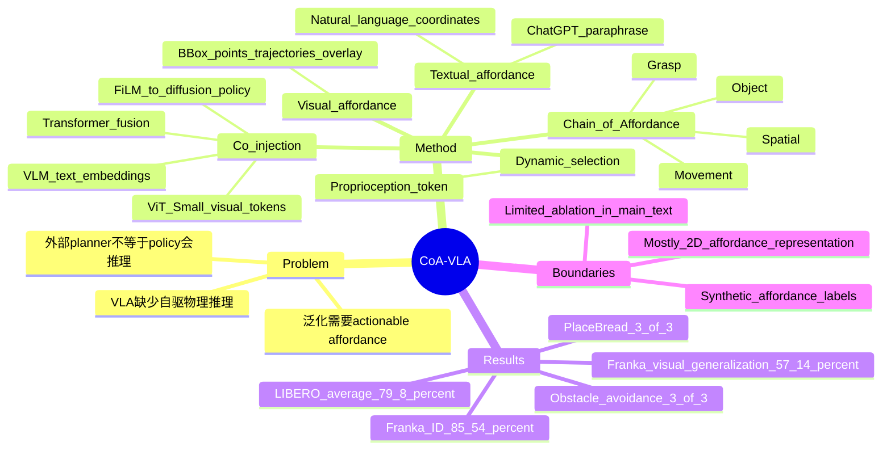

## Summary
CoA-VLA 把 VLA 的中间推理从泛化的 language rationale 改成可执行的 Chain-of-Affordance：object、grasp、spatial、movement 四类 affordance 以 textual + visual 两种形式注入 DiffusionVLA-style policy。论文在 7 个 Franka 真实任务和 LIBERO 上报告 CoA-VLA 相比 Diffusion Policy、Octo、OpenVLA、DiffusionVLA 等 baseline 有更高成功率，尤其在视觉泛化、free-space placement 和 obstacle avoidance 上收益明显。

## Problem & Motivation
现有 VLA 通过大规模视觉-语言预训练和 action fine-tuning 改善机器人策略，但很多方法仍依赖外部 LLM/VLM 做 high-level planning 或 task decomposition，低层 policy 自身缺少明确的、与物理交互相关的推理过程。作者的动机来自 language model 中 chain-of-thought 的成功：如果机器人在动作前先推理“操作什么、怎么抓、放到哪里、如何避障移动”，可能提升多任务复杂环境下的鲁棒性和泛化。

这篇论文的关键 problem formulation 是：robot reasoning 不能只是长文本解释，而应是直接约束 action generation 的 affordance sequence。作者把 affordance 定义成四段互相依赖的链：先做 object affordance 定位目标物体，再做 grasp affordance 确定可抓点，再做 spatial affordance 确定可放置/可到达区域，最后做 movement affordance 生成无碰撞移动轨迹。

## Method
CoA-VLA 建在 DiffusionVLA 上，后者结合 Qwen2-VL 和 diffusion policy head 来预测连续机器人动作。形式化上，给定 demonstration observation 和自然语言任务描述，模型先生成 affordance reasoning `z = {z_obj, z_grasp, z_spat, z_move}`，再让低层动作服从 `p(a | observation, goal, z)`。

**Chain-of-Affordance taxonomy.**
- **Object affordance**：从模糊指令中解析目标物体，并用 pixel-aligned bounding box 定位物体位置。
- **Grasp affordance**：用一组 2D points 表示目标物体的可抓取点或可操作区域。
- **Spatial affordance**：用离散 2D coordinates 表示满足语言关系的可放置区域或可交互空间，例如 plate 上的 free space。
- **Movement affordance**：用轨迹点表示机器人在障碍物存在时可安全通过的移动路径。

**Visual-textual representation.** Textual affordance 用自然语言和坐标表达，例如 bounding box、grasp point、place point；作者用 ChatGPT 对描述做 paraphrase，避免单一模板。Visual affordance 则把 bbox、interaction points、spatial regions 和 movement trajectories 直接 overlay 到历史 observation frame 上：movement trajectory 用较细、低显著度的线，grasp/object/spatial affordance 用更显著的标记。

**Visual-textual co-injection.** Textual affordance 取 VLM 的 last embedding，经 MLP tokenization；visual affordance 经 pretrained ViT-Small 转成 patch tokens。两类 token 经过两个 Transformer blocks 融合后，用 FiLM conditioning 注入 diffusion model，使 action generation 同时受语言语义和像素级 affordance 约束。

**Dynamic affordance selection.** 论文认为每个 timestep 都生成所有 affordance 会增加 test-time cost，也会产生冗余；例如物体已经被抓起后，object/grasp affordance 不再必要。作者把 proprioception 压成一个 token，与 visual token 拼接输入 LLM，让模型根据机器人状态和观察动态选择当前需要的 affordance。

**Data generation pipeline.** 作者用 GPT-4o 生成 scene description 和 task-relevant entities；用 Grounding DINOv2 与 SAM 生成并 refined object bounding boxes；用 RoboPoint 和 GPT-4o 预测 spatial points 后做聚类去异常点；用 CoTracker 跟踪 gripper path 形成 movement trajectories。训练上，作者从 Droid 过滤出 39K 条带语言标注 trajectories 生成 synthetic CoA data 做 pre-training，再用 7 个真实任务的 692 条 trajectories post-train。

## Key Results
**Real robot / 7 Franka tasks.** 在 CleanTrash、PourTea、NailHammer、PlaceBread、PlaceCar、WipeWater、HangCup 七个任务上，CoA-VLA 在 in-distribution setting 达到 **64/77 = 85.54%** 平均成功率，高于 DiffusionVLA **59/77 = 76.60%**、OpenVLA **52/77 = 54.89%**、Octo **34/77 = 44.13%**、Diffusion Policy **33/77 = 42.93%**。在 visual generalization setting，CoA-VLA 为 **36/63 = 57.14%**，高于 DiffusionVLA **28/63 = 44.44%**、OpenVLA **14/63 = 22.22%**、Octo **12/63 = 19.05%**、Diffusion Policy **3/63 = 4.76%**。

**LIBERO simulation benchmark.** 在 LIBERO-Spatial / Object / Goal / Long 四个 suite 上，CoA-VLA 平均成功率 **79.8 ± 0.5%**，高于 OpenVLA **76.5 ± 0.6%**、Octo **75.1 ± 0.6%**、ScaleDP **72.9 ± 0.5%**、Diffusion Policy **72.4 ± 0.7%**。分项上，CoA-VLA 在 LIBERO-Spatial 为 **85.3 ± 0.9%**，LIBERO-Object 为 **93.1 ± 1.0%**，LIBERO-Goal 为 **85.8 ± 0.9%**，LIBERO-Long 为 **55.0 ± 1.2%**。

**Spatial affordance / free-space placement.** 在 PlaceBread 的 3 个空间配置中，CoA-VLA 完成全部 3 个场景；OpenVLA 和 DiffusionVLA 各只成功 1 个场景。论文把这个结果解释为 spatial affordance 帮助模型识别 plate 上未被占用的 open area。

**Movement affordance / obstacle avoidance.** 在 obstacle avoidance 测试中，CoA-VLA 完成全部 3 个场景；OpenVLA 全部失败，DiffusionVLA 只成功 1 个场景。这个结果支持 movement affordance 对碰撞规避和空间适应性的作用，但论文没有给更大规模的障碍物统计实验。

## Strengths & Weaknesses
**已知 Strengths.**
- 方法的核心抽象比较清晰：把 embodied control 中真正影响 action 的信息拆成 object / grasp / spatial / movement affordance，比一般的“让模型解释一下”更接近可执行中间表示。
- Visual + textual co-injection 是合理的工程折中：textual affordance 提供语义和坐标描述，visual affordance 直接给像素级 cue，FiLM conditioning 让 diffusion head 在生成动作时使用这些 cue。
- 真实机器人和 simulation 都有评测；真实机器人表格中还报告了 visual generalization，不只是在训练分布内比较。
- Baseline 覆盖了 Diffusion Policy、Octo、OpenVLA、DiffusionVLA、ScaleDP 等相关模型；论文说明所有 real-robot baseline 使用同一 fine-tuning dataset、相同训练迭代数，并用最后 checkpoint 评估，降低 cherry-picking 风险。

**已知 Weaknesses / boundary.**
- 论文正文没有给出系统 ablation table；虽然提到 appendix 有 ablation 和更多实验，但正文可见证据主要是主结果表和 spatial/movement 的小规模 qualitative-style 对比。因此还不能精确判断 textual-only、visual-only、dynamic selection、co-injection 各自贡献多少。
- real-robot evaluation 的 trial 数有限：in-distribution 是 77 次，visual generalization 是 63 次；PlaceBread 和 obstacle avoidance 的分析各只有 3 个场景，适合说明机制但不足以支撑强统计结论。
- 数据生成依赖 GPT-4o、Grounding DINOv2、SAM、RoboPoint、CoTracker 等外部模型；这降低人工标注成本，但也把上游模型偏差和错误引入 affordance supervision。论文没有系统量化这些 synthetic affordance label 的噪声。
- affordance 主要是 2D bbox/point/trajectory overlay；对 6-DoF manipulation、遮挡、深度几何、安全约束的覆盖仍有限，不能等同于完整 3D physical reasoning。
- 与 GUI-agent / web-agent 的关系是概念启发而非实验结论；论文只评估机器人 manipulation 和 LIBERO。

**推测.** CoA 的 problem formulation 对 GUI / computer-use agent 也有迁移价值：object affordance 可类比为目标 UI element grounding，grasp/action affordance 可类比为可交互控件和操作方式，spatial/movement affordance 可类比为安全路径、拖拽轨迹或界面状态约束。但这是跨 domain extrapolation，论文没有验证。

**不知道.** 不知道 CoA-VLA 的 failure cases 主要来自 affordance 预测错误、dynamic selection 选错 affordance、diffusion action head 执行偏差，还是真实机器人硬件误差。也不知道增加 visual-textual affordance 后的 test-time latency、token cost、GPU cost 相比 DiffusionVLA 增加多少。

## Mind Map

## Notes
- 最值得带走的 insight：对 embodied policy 来说，reasoning chain 的单位不一定是自然语言子任务，而可以是能直接约束动作的 affordance。这个视角比“加更多 CoT tokens”更贴近 control。
- 这篇与 affordance-aware VLA 路线的核心问题是：中间表示应该 externalize 成 visual/text prompts，还是 internalize 成模型隐状态和辅助 loss？CoA-VLA 选择前者，因此可解释性较强，但依赖外部 annotation pipeline。
- 后续如果要引用这篇作为 evidence，最好只引用明确数字：Franka 7 tasks 的 **85.54% / 57.14%**、LIBERO 平均 **79.8 ± 0.5%**、PlaceBread 和 obstacle avoidance 的 **3/3** 小规模结果。不要把它扩写成“解决了泛化”或“具备通用物理推理”。
