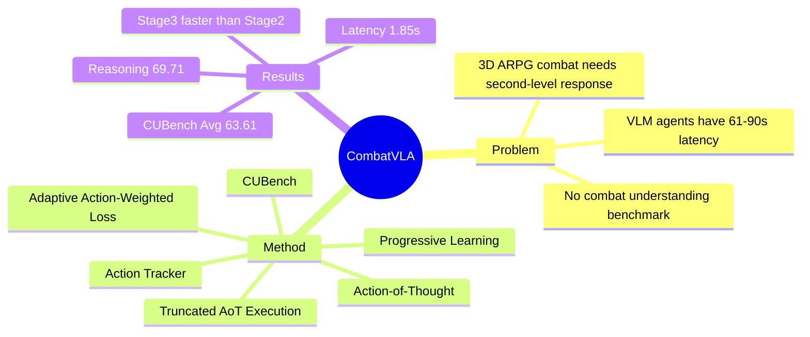

## Summary
CombatVLA 提出一个面向 3D ARPG combat tasks 的 3B Vision-Language-Action model：用 action tracker 收集 video-action pairs，构造 Action-of-Thought (AoT) 数据，再通过 truncated AoT 接入 keyboard/mouse action execution framework。论文的主要证据是 CUBench 上 CombatVLA-3B 达到 Avg 63.61、Reasoning 69.71，以及单次推理延迟 1.85s；但评测集中在 Black Myth: Wukong 与 Sekiro，任务定义和泛化范围仍有限。

## Problem & Motivation
现有 VLA / VLM-based agents 在 UI operation、navigation 或一般 game agent 场景中已有进展，但 3D ARPG combat 同时要求 high-resolution perception、动态敌人行为理解、second-level reaction 和 keyboard/mouse 级动作执行。论文指出 memory/API-based game agents 与人类视觉交互方式不同，RL-based ARPG bot 需要大量 reward design 和 trial-and-error，而 Cradle / VARP 这类 VLM-based game agents 依赖 GPT-4o 等大模型，推理延迟可达 61.68s / 90.23s，难以用于实时 combat。作者还指出当时缺少专门评估 combat understanding 的 benchmark，因此把数据采集、benchmark、VLA 训练和 PC 执行框架做成一套系统。

## Method
**Action Tracker 与数据构造。** 作者实现了一个后台 action tracker，同步记录 keyboard/mouse events 与 game screenshots，并用 timestamp 将 action 对齐到最近的未来 frame。补充材料给出的采集结果是：6 名完成游戏的玩家在两周内产生 200 小时 recordings；清洗后得到 25,000 张 1008 × 560 game screenshots 和 5,000 条 high-quality AoTs。Action set 包括 `w/s/a/d` movement、`shift` sprint、`space` dodge/block、`r` heal、`1` immobilization、left mouse light attack、right mouse heavy attack 等 10 类动作，动作之间可以组合。

**CUBench。** Combat Understanding Benchmark 把 combat IQ 拆为 gathering、comprehension、reasoning 三类 VQA-style tasks。论文报告 CUBench 共 914 条样本，其中 gathering 360 条 (39.4%)、comprehension 204 条 (22.3%)、reasoning 350 条 (38.3%)；QA pairs 由 GPT-4o-0513 生成，再由 10 人 annotation team cross-verified。

**Action-of-Thought。** AoT 把模型输出组织成 JSON-like sequence，包含 `[action]` 和 `[explanation]`：action 是可执行 keyboard/mouse 操作，explanation 描述敌人状态、角色状态和动作语义。核心设计是把可执行动作放在 explanation 前面，并插入 `<TRUNC>` token：训练时模型仍接触 action rationale，部署时遇到 `<TRUNC>` 后停止生成，只解析前面的动作。

**Three-stage progressive learning。** CombatVLA 使用 Qwen2.5-VL-3B 作为 backbone；论文描述训练时冻结 vision encoder、fine-tune language model，并在 implementation details 中称其为 full-parameter SFT on AoT dataset。三阶段分别是：Stage1 Video-AoT coarse-grained tuning，让模型先学习 combat paradigm；Stage2 Frames-AoT fine-grained tuning，用当前 action timestamp 回溯 `k=4` frames 对齐动作；Stage3 Frames-Truncated-AoT tuning，让模型学会先输出 action、再用 `<TRUNC>` 截断 explanation。

**Adaptive Action-Weighted Loss。** 训练目标由 language modeling loss、action alignment loss 和 modality contrastive loss 组成。作者用 priority-aware matching 判断 label action 与 predicted action 是否匹配，对 matched pair 拉近 visual EOS 与 action EOS representation，对 mismatched pair 推远并额外约束高优先级 action prediction；补充材料给出的 priority sequence 是 `r`, `1`, `space`, `left`, `d`, `s`, `a`, `w`, `shift`, `right`。

**Action execution framework。** 部署时框架像 human eyes/hands：采集 game video，采样视觉帧，调用 CombatVLA 输出动作，再用 `pyautogui` 执行 keyboard/mouse control。补充材料说明实际框架会记录 1920 × 1080 video，采样最近 9 frames 中的 3 frames，resize 到 1008 × 560 输入模型；由于模型仍有 1.85s inference delay，实验中会在推理期间 pause game，收到 action 后再 resume 并执行。

## Key Results
| Benchmark / Setting | CombatVLA result | Main comparison | 结论 |
|:--|:--|:--|:--|
| CUBench Avg | 63.61 | Gemini-2.0-flash 57.90; Qwen2.5-VL-3B 55.87 | Combat-specific tuning 比最强 closed-source baseline 高 5.71 points，比 backbone 高 7.74 points |
| CUBench Reasoning | 69.71 | Claude3.5-Sonnet 55.43; Qwen2.5-VL-3B 57.14 | 主要提升来自 action reasoning，作者报告比第二名高 14.28 points |
| CUBench Gathering / Comprehension | 60.83 / 60.29 | best gathering Gemini-1.5-pro 64.44; best comprehension GPT-4o-0513 66.67 | CombatVLA 并非所有低层 perception 子任务第一，优势集中在 reasoning |
| General benchmarks | MME 2141, VideoMME 58.7, OCRBench 741 | Qwen2.5-VL-3B: 2157 / 61.5 / 797 | AoT fine-tuning 没有提升 general VLM benchmarks，且相对 backbone 有小幅下降 |
| Inference latency | 1.85s, 1 model call | Cradle 61.68s / 5 calls; VARP 90.23s / 10 calls | 相比 VARP 约 50× faster，模型调用数降到 1/10 |
| Progressive learning ablation on CUBench | Stage1 Avg 57.27, Stage2 61.43, Stage3 63.61 | Stage1/2 time 3.73s; Stage3 time 1.85s | frame-level alignment 提升准确率，truncated AoT 同时提升 Avg 并约 2× 降低单次推理时间 |
| Adaptive loss ablation on CUBench | full Stage3 Avg 63.61 | w/o `Lcon` 61.58; w/o `Lalign` 61.64 | contrastive loss 和 action alignment loss 都贡献约 2 points Avg |
| Token length | Truncated AoT 43.10 tokens | full AoT 116.57 tokens | `<TRUNC>` 避免平均 73.47 redundant tokens |
| Task-level practical tests | 13 tasks, 10 trials per task | Cradle, VARP, 10 human players | Figure 5 显示 CombatVLA 在多数任务上高于 VLM-based agents，并在作者设置下高于 human players；正文没有给出可复核的逐任务 success-rate 数字 |

一个有信息量的 qualitative failure case 是 CUBench Fig.10：在角色血量很低且敌人未准备攻击的四帧输入中，reference answer 是 restore health；GPT-4o、Gemini-2.0-flash、Claude3.5-Sonnet 和 Qwen2.5-VL-3B 都选择 dodge，CombatVLA 选择 restore health。这个 case 支持作者的 claim：通用 VLM 容易把视觉特效或姿态误读为 imminent attack，而 task-tuned AoT model 更关注 combat state。

## Strengths & Weaknesses
**已知优势。** CombatVLA 的贡献不是单个 module，而是从 action tracker、CUBench、AoT dataset、3B model 到 PC execution framework 的完整闭环；对 agent 研究最有价值的点是把 latency 作为一等问题处理，而不是只报告 benchmark accuracy。Ablation 也比较直接：Stage1 → Stage2 → Stage3 的 Avg 从 57.27 → 61.43 → 63.61，time 从 3.73s 降到 1.85s；loss ablation 说明 `Lcon` 与 `Lalign` 都不是装饰性组件。

**已知局限。** 论文自己的 limitations 写得很明确：task definitions 仍然 simplistic，实验只覆盖 BMW 和 SSDT，没有扩展到更多 game scenarios，现有 VLM/VLA capabilities 仍有改进空间。CUBench 是自建 benchmark，数据来自同一 action tracker pipeline，并且 QA generation 依赖 GPT-4o 后再人工 cross-validation；这不是无效，但意味着 benchmark 独立性弱于社区长期使用的外部 benchmark。Task-level practical tests 的核心结论来自 Figure 5，但正文没有列出逐任务 success-rate 表；此外实验在推理期间 pause game，所以 1.85s latency 不是完全连续、不可暂停环境中的闭环反应时间。

**推测。** AoT explanation 很大程度上由 action type 的语义模板构成，模型可能学到的是“combat state → action prior”的强映射，而不是可迁移的开放式 tactical reasoning；这对 ARPG 很实用，但迁移到物理 robot 或 GUI-agent 仍需额外证据。`action first, rationale later, truncate at deployment` 是一个可迁移的 efficiency pattern：GUI / computer-use agent 也可以先输出 executable action，再把长解释留给训练或 debug。

**不知道。** 论文没有证明 CombatVLA 在与 BMW/SSDT action grammar 差异很大的 games 上仍有效，也没有报告更大/更小模型规模下的 scaling law。资源页面承诺开放 dataset、benchmark、action tracker、model weights、training code 和 framework implementation，但论文文本本身无法证明这些 artifacts 的实际可用性。

## Mind Map

## Notes
Peng Chen 和 Pi Bu 为 equal contribution，Jun Song 为 corresponding author。Frontmatter 的 date_publish 使用论文首页 arXiv header 中的 `arXiv:2503.09527v2 [cs.CV] 9 Jan 2026`；venue 仍按 CVF 页面和论文信息记录为 ICCV 2025。

这篇对 GUI-agent 的直接贡献有限，因为环境不是 GUI grounding，而是 3D game combat；但它对 computer-use / embodied agent 的效率启发很清楚：将 action tokens 放在 explanation 前，并用 `<TRUNC>` 在 inference 时停止生成，是一种把 reasoning supervision 和 execution latency 解耦的简单策略。需要避免过度外推：CombatVLA 的证据只覆盖 keyboard/mouse combat control，不能证明同样策略能解决网页、移动端 UI 或真实机器人中的 perception-action mismatch。
