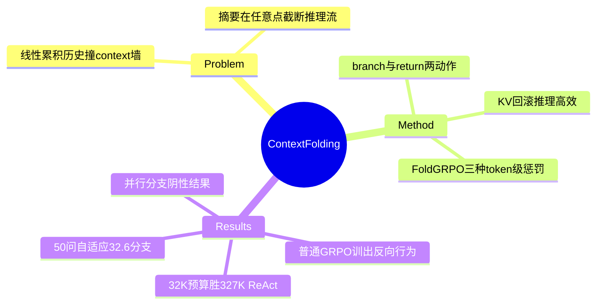

## Summary

Context-Folding 让 agent 用两个特殊动作主动管理上下文：`branch(description, prompt)` 开独立工作上下文做子任务、`return(message)` 折叠分支只留结果摘要回主线程（KV-cache 回滚到 branch 位置，推理高效）；配 FoldGRPO（token 级 process reward 直接塑造 branch/return 行为）端到端训练。Seed-OSS-36B 在 32K×10 branches 预算下 BrowseComp-Plus 0.620 / SWE-Bench Verified 0.580，超过 327K 满上下文的 ReAct+RL 与 Summary+RL，active context 缩小 10×。

## Problem & Motivation

长程 agent 的两类既有 context 方案各有结构性缺陷：post-hoc 摘要在任意点粗暴截断推理流；multi-agent 系统靠手工 workflow、抗拒端到端优化。本文把"何时开分支、何时折叠"变成 agent 自己的可学习行为——折叠对齐**子任务边界**（推理在执行中保持完整，效用兑现后才压缩），这是与 heuristic 摘要的本质区别。

## Method

- **机制**：主线程 plan（高层推理、被抑制做 token 密集操作）↔ 分支 execute（做完 `return`，中间步骤从上下文移除，只留 templated 摘要）；执行态禁止嵌套 branch。推理时 `return` 将 KV-cache 回滚到 `branch` 位置——上下文前缀共享，效率友好。
- **FoldGRPO**：RLVR 二元 outcome reward + **token 级 process reward** Q 并入 advantage（Â=clip(R+Q,0,1) 后按组内 {R} 的 mean/std 归一；observation token mask 不优化）。三种 process 惩罚：
  1. **Unfolded token penalty**：主线程超工作上下文 50% 时，主线程 token 记 Q=−1（创建 branch 的 turn 豁免）——逼 token 密集操作进分支；
  2. **Out-scope penalty**：GPT-5-nano 按 branch prompt 判分支是否越界，越界则分支 token Q=−0.2；
  3. **Failure penalty**：失败 tool call turn 的 token Q=−1。
- **设置**：Seed-OSS-36B-Instruct，32,768 context × ≤10 branches（理论 327,680）；BrowseComp-Plus 自切 680 train / 150 eval（Qwen3-Embed-8B 检索，官方 LLM judge）；SWE-Bench Verified 500 题评测，SWE 训练 740 实例（SWE-Gym+SWE-Rebench 各 8 次 rollout 过滤成功率 0–87.5%）；VeRL，50 步（约 2 epochs），无 KL。

## Key Results

| 配置（36B） | BC-Plus | SWEB-V |
|:--|:--|:--|
| ReAct 32K +RL | 0.446 | 0.480 |
| ReAct 327K +RL | 0.540 | 0.574 |
| Summary 32K×10 +RL | 0.527 | 0.550 |
| Folding 无 RL | 0.420 | 0.492 |
| Folding +GRPO | 0.567 | 0.564 |
| **Folding +FoldGRPO** | **0.620** | **0.580** |

- **"超过全部 baseline"仅对 FoldGRPO 行成立**（+GRPO 在 SWE 上 0.564 < ReAct-327K+RL 0.574）；RL 绝对增益 +20.0%（BC）/+8.8%（SWE）。
- **FoldGRPO vs 普通 GRPO**：+7.7%/+1.6%；行为差异（Table 2, BC）：普通 GRPO 训出坏行为（主轨迹 22,285 tokens、Scope 0.762、Finish 0.738），FoldGRPO 纠正为主轨迹 **7,752**、Scope 0.895、Finish 0.935——总量 100K+ 时主上下文压到 ~8K（>90% 压缩；case study：4 branches 把 107K 压到 6.5K）。
- **长度泛化**：训练 ≤10 branches，50 合并问题任务上自适应用平均 **32.6** branches（ReAct 对照放宽到 1M context 仍被甩开）；单任务性能超 320K 后趋平台。
- **100B+ 对照**（327K ReAct）：GPT-5 0.793/0.718 仍最强；36B folding（0.620/0.580）已过 DeepSeek-V3.1（0.613/0.610）与 GLM-4.5-Air/Qwen3-235B。
- **Parallel branching 阴性结果**：并行分支版 0.6133 与单支相当（平均 2.3 并行支、读 110 vs 80 页）——作者归因任务深度优先特性；广度型任务（WideSearch 类）才是并行的用武之地。
- **训练效率**：相对 327K ReAct rollout 提速 1.52×、每步 1.43×（async rollout，仅计主线程）。

## Evidence Ledger

| Claim ID | Claim | Type | Source locator | Evidence excerpt | Status |
|:--|:--|:--|:--|:--|:--|
| C1 | branch/return 两工具 + KV-cache 回滚 + plan-execution 两态（执行态禁嵌套） | benchmark-setting | §2.2 p.3-4 | "rolls back the KV-cache to the corresponding branch position" | source-verified |
| C2 | FoldGRPO：Â=clip(R+Q,0,1) 组内归一（统计量为 {R}）；三种 token 级惩罚（−1 unfolded/−0.2 out-scope by GPT-5-nano/−1 failure）；observation mask | causal-mechanism | §2.3 p.5 | "Q=−1 … exceeds 50%" | source-verified |
| C3 | Seed-OSS-36B；32K×≤10=327,680；BC-Plus 680/150；SWEB-V 500 评测、740 训练实例；50 步 | benchmark-setting | §3.1-3.2 p.6 | "680 instances for training and 150 for evaluation" | source-verified |
| C4 | FoldGRPO 0.620/0.580 超 327K ReAct+RL 0.540/0.574 与 Summary+RL 0.527/0.550 | comparison | Table 1 p.7 | "0.620 (+14.2) / 0.580 (+2.8)" | source-verified（仅 FoldGRPO 行全超；GRPO 行 SWE 低于 ReAct-327K+RL） |
| C5 | FoldGRPO vs GRPO +7.7/+1.6%；主轨迹 22,285→7,752、Scope 0.762→0.895、Finish 0.738→0.935；>90% 压缩 | number | §4.1/4.3 Table 2 | "over 90% context compression" | source-verified |
| C6 | 训 ≤10 支 → 50 问任务自适应 32.6 支；ReAct 对照 1M context；>320K 平台 | number | §4.4 Fig 5 | "adaptively uses an average of 32.6 branches" | source-verified |
| C7 | 100B+ 对照五模型数字（GPT-5 0.793/0.718 等） | number | Table 1 | "ReAct Agent with 100B+ LLM" | source-verified |
| C8 | 并行分支 0.6133 与单支相当；2.3 支/110 页；深度优先归因 | number | §4.5.3 p.10-11 | "performing similarly to the single-branch version" | source-verified |
| C9 | 训练提速 rollout 1.52×/step 1.43×（仅计主线程） | number | Fig 8 §4.5.2 | "1.52x / 1.43x" | source-verified |

## Strengths & Weaknesses

**Strengths**：
- 与 [[Papers/2510-MemAct]] 构成 Context-as-action 的两种互补 formulation：MemAct 是**编辑动作**（删+写，任意点），本文是**结构化折叠**（对齐子任务边界，KV-cache 友好）——后者的 inference 效率论证（回滚而非重算）更工程完整。
- FoldGRPO 的 process reward 消融是本文最硬的证据：**普通 GRPO 会训出反向行为**（主轨迹变长、失焦、finish 率降），说明 folding 行为不是 outcome reward 的免费副产品，必须显式 process 信号——这是对"稀疏奖励够用"假设的受控否定。
- 平均 32.6 branches 的长度外推 + parallel branching 诚实阴性结果，评测设计质量高。

**Weaknesses / 边界**：
- 任务域同为 deep research（BrowseComp-Plus）+ SWE，无 GUI/视觉 observation；对 CUA context 管理是邻接证据。
- Out-scope penalty 依赖 GPT-5-nano judge——process reward 里嵌入了外部 LLM 判定，judge bias 可进 policy（与 [[Papers/2607-MHLC]] 的 label 构造同类风险）；论文未报 judge 精度。
- BC-Plus 是自切分（680/150），非公共 split；与他文的 BC-Plus 数字不可直接横比。
- 无多 run 方差报告（按 [[Papers/2606-SkillMemoryBudget]] 的标准，0.620 vs 0.567 的 FoldGRPO 增益未附不确定度）；greedy decoding 单次评测。
- FoldAct（2512.22733，queue 中）声称折叠/摘要动作制造**非平稳观察分布**——本文的 KV 回滚 + 段式训练是否规避该问题，待对读。

**对领域**：主动 context 管理路线目前最强的端到端结果；"折叠对齐子任务边界"比"任意点摘要"的优势有直接对照（vs Summary agent +9.3pp @BC）。

## Mind Map

## Notes

- 入队来源：[[Reports/2026-07-27-WebAgent-RL-and-Context-Landscape]] 交叉轴主线 top-10 第 2。
- 与 MemAct 对读：两者都把 context 管理并入 policy，但训练解法不同——MemAct 用 DCPO 段切分对付"删除破坏因果假设"，本文用 branch 结构天然保持前缀一致 + process reward 塑形。FoldAct 的攻击（摘要动作→非平稳观察分布）对两者的命中面可能不同：MemAct 的 in-place 删除改变后续所有步的观察分布，本文主线程只增不删（折叠发生在 return 边界、前缀共享）——待 digest FoldAct 后裁决。
- 对 CUA-Survey §6.9.1 Context-as-action 行：本篇与 MemAct 是该行的两个具体实例，行内"错误折叠难恢复"张力对应本文 out-scope penalty 要解决的失焦问题。
