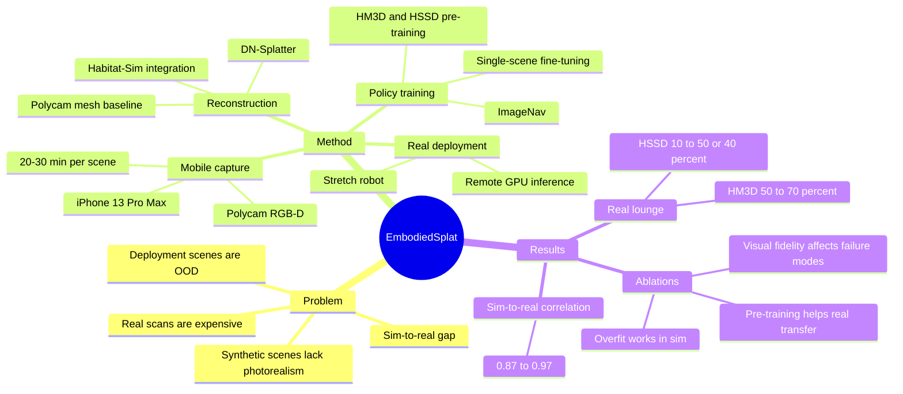

## Summary
EmbodiedSplat 研究如何用低成本手机采集的真实部署环境，通过 3D Gaussian Splatting / Polycam 重建成 Habitat-Sim 场景，再在该场景中微调 ImageNav policy 以改善 real-to-sim-to-real navigation。核心结论是：对目标场景做个性化 fine-tuning 可以显著提升真实机器人 ImageNav 成功率，并且模拟评估与真实评估之间有较高相关性，但效果受场景尺度、重建视觉质量和采集质量影响。

## Problem & Motivation
Embodied AI 的导航策略通常在 simulation 中训练和评估，但 synthetic scenes 往往 photorealism 不足，而 Matterport3D / HM3D 这类真实扫描又依赖昂贵硬件和较重的重建流程。作者关注的具体问题是：能否用普通 mobile device 快速捕获即将部署的室内环境，把它转成可训练的 simulator scene，从而把 policy 训练分布贴近真实部署分布。

这篇论文的场景设定是 indoor ImageNav：agent 输入当前 RGB observation 和 goal image，在 Habitat-Sim 或真实 Stretch robot 上导航到目标位置。相比 GaussNav / SplatNav 等使用 GS 做导航相关模块的工作，本文强调 end-to-end ImageNav policy training、真实机器人评估，以及从手机采集到模拟训练再回到真实部署的完整闭环。

## Method
EmbodiedSplat pipeline 分四步：

1. **真实场景采集**：使用 iPhone 13 Pro Max 和 Polycam 录制 RGB-D 数据，每个场景约 20-30 分钟；随后用 Nerfstudio 处理数据，采样 1000 个低 blur 的对齐 RGB-depth frames 和 poses。作者捕获了 university environment 中的 lounge、classroom、conference rooms 等场景，并使用 MuSHRoom 的 iPhone long sequences 做重建方法评估。
2. **重建 mesh**：主路线使用 DN-Splatter 训练 3D Gaussian Splats，并通过 Poisson reconstruction 生成 mesh；训练 30,000 iterations，使用 iPhone GT depth、depth smoothness、normal loss，以及 Metric3D-V2 normal encoder。对照路线使用 Polycam 导出的 mesh。DN mesh 转成 `.glb` 后加载进 Habitat-Sim。
3. **生成 ImageNav episodes**：对 Captured / MuSHRoom scenes 只选最大 navmesh island，避免把桌床等物体误认为可导航区域；每个 scene 生成 1000 training episodes 和 100 evaluation episodes。成功标准是在步数耗尽前停在 goal 1m 内，simulation 最大 1000 步，real-world 最大 100 步。
4. **训练与部署 policy**：policy 继承 Silwal et al. 的 ImageNav setup：VC-1-Base visual encoder + 2-layer LSTM policy，DD-PPO 训练。zero-shot baselines 分别来自 HM3D 和 HSSD pre-training；personalization 通过在单个重建场景上 fine-tune 20M steps 完成。真实部署用 Hello Robot Stretch，policy 在远程 GPU 上通过 Flask server 接收 robot observation 并返回离散动作。

关键设计选择不是让 GS 直接成为 policy 的输入，而是先把手机捕获转成 Habitat-Sim 可用的 mesh，再复用成熟的 ImageNav training pipeline。因此这篇论文更像是一个 real-to-sim scene personalization pipeline，而不是新的 navigation architecture。

## Key Results
**ImageNav zero-shot simulation。** HM3D pre-trained policy 在 HM3D validation 上为 83.08% SR，HSSD pre-trained policy 在 HSSD validation 上为 63.15% SR。迁移到 Captured scenes 后，HM3D zero-shot 在 conf a 上达到 85% (DN) / 82% (Polycam)，conf b 为 88% (DN) / 79% (Polycam)，但在更大或更 OOD 的 classroom 下降到 53% (DN) / 42% (Polycam)，lounge 为 50% (DN) / 76% (Polycam)。HSSD zero-shot 更弱：classroom 在 DN 和 Polycam 上都只有 1% SR，lounge 的 Polycam mesh 为 14% SR。

**Fine-tuning simulation。** 单场景 fine-tuning 20M steps 后，HM3D pre-trained policy 在不同 Captured / MuSHRoom meshes 上接近或超过 90% SR；HSSD pre-trained policy 大多达到 80%+ SR。补充实验 Table 6 给出了具体数值：HM3D-ZS -> HM3D-FT 在 MuSHRoom / Captured additional scenes 上分别为 koivu 0.87 -> 0.98、classrm2 0.61 -> 0.97、kokko 0.66 -> 0.99、coffeerm 0.90 -> 1.00、vr rm 0.39 -> 0.99、conf c DN 0.16 -> 0.84、conf c Polycam 0.50 -> 0.98。

**Real-world Stretch evaluation on lounge。** 在 10 个 start-goal episodes 上，HM3D zero-shot 真实成功率为 50%，fine-tune 到 Polycam / DN mesh 后均提升到 70%；HSSD zero-shot 为 10%，fine-tune 后 Polycam 为 50%，DN 为 40%。论文摘要报告，相对 HM3D 和 HSSD zero-shot baselines，真实 ImageNav 绝对成功率分别提升 20% 和 40%。

**Sim-to-real predictivity。** 作者报告 reconstructed meshes 的 simulation-vs-real correlation 为 0.87-0.97，说明在这些 lounge 实验中，simulation SR 的提升可以较好预测真实 SR 的提升。但真实评估只覆盖 lounge，且每个 policy 10 episodes，因此这个结论更适合解读为有力证据，而不是已证明的通用规律。

**Ablations / analysis。** 从头在单个 mesh 上 overfit 约 100M steps 可在 simulation 中获得高 SR，但真实 lounge 上 Polycam overfit policy 只有 50% SR，DN overfit policy 只有 10% SR，说明 large-scale pre-training 对 real-world generalization 仍重要。HM3D zero-shot 在 lounge simulation 的 failure analysis 显示，DN mesh 的 "Maximum Steps Reached" failure 为 19 次，高于 Polycam 的 8 次；作者将其与 DN mesh 视觉保真度较低、颜色更暗和存在 holes 联系起来。MuSHRoom 重建评估中，iPhone GT depth 的 F-score 为 0.748，Metric3D-V2 normal encoder 在 GT depth 下 F-score 为 0.752，略高于 DSINE 0.750 和 Omnidata 0.748。

## Strengths & Weaknesses
**已知亮点。** 这篇论文的问题 formulation 很清楚：与其期待一个通用 policy 覆盖所有真实部署分布，不如低成本捕获目标环境并在该分布上 personalized fine-tuning。实验证据覆盖 zero-shot、fine-tuning、overfitting、sim-to-real correlation、real robot deployment 和 reconstruction encoder selection，比单纯展示一个 demo 更扎实。对 GUI-agent / embodied agent 研究的启发是：当 deployment environment 可提前获得时，环境个性化可能比继续扩大通用训练集更直接。

**已知局限。** 真实机器人实验只在 lounge scene 上做，每个 policy 10 episodes；论文自己也说明成功 episodes 的平均距离和步数样本不足以支撑效率结论。Captured scenes 主要是 1-3 rooms 级别，作者在补充材料中提到未来要采集 apartment-scale scenes；因此还不能证明该流程在 building-scale navigation 上成立。DN mesh 视觉质量会影响 goal image matching，失败分析中 DN 比 Polycam 更容易达到 maximum steps。流程也不是零成本：一次采集 20-30 分钟，DN-Splatter 还需要 1-2 小时训练，policy training 使用多张 A40 GPU。

**推测。** EmbodiedSplat 的最强适用场景可能是半固定室内空间，例如办公室、实验室、会议室、家庭房间，而不是快速变化或无法提前扫描的开放环境。Polycam 在真实 overfit 和 lounge zero-shot 上比 DN 更稳，可能说明 ImageNav policy 对 texture / color fidelity 的敏感性高于对几何 fidelity 的敏感性；但论文没有系统隔离这两个因素。

**不知道。** 论文没有给出 object-goal navigation、language navigation、mobile manipulation 或 rearrangement 的实验证据；也没有证明 GS 直接用于 policy observation 会优于 mesh-based simulator integration。对长期部署中的 lighting change、dynamic objects、家具移动、robot localization drift，该工作还没有定量结论。

## Mind Map

## Notes
- 这篇论文的贡献主要不在模型结构，而在把手机场景采集、GS / Polycam mesh、Habitat-Sim、ImageNav fine-tuning 和 Stretch deployment 串成一个可验证闭环。对研究 taste 来说，它的价值在于把 "personalization to deployment distribution" 具体化，而不是提出复杂新 policy。
- 与 Phone2Proc 的差异值得记住：Phone2Proc 更关注 RoomPlan layout 和 ObjectNav，EmbodiedSplat 捕获完整房间 mesh，不做 layout-centric post-processing，也不生成多种 scene variation。
- 结果里最值得谨慎的点是真实评估规模。20% / 40% absolute SR gain 很有吸引力，但 lounge 10 episodes 的统计波动可能较大；后续如果引用，应同时注明 evaluation setting。
- 下一步可追的问题：如果目标是 GUI / web / embodied agent 的统一环境个性化，能否把类似 pipeline 用于 screen-like spatial environments，例如提前扫描 workspace 后让 agent 学会从视觉目标图像或语言指令定位 physical UI / device?
