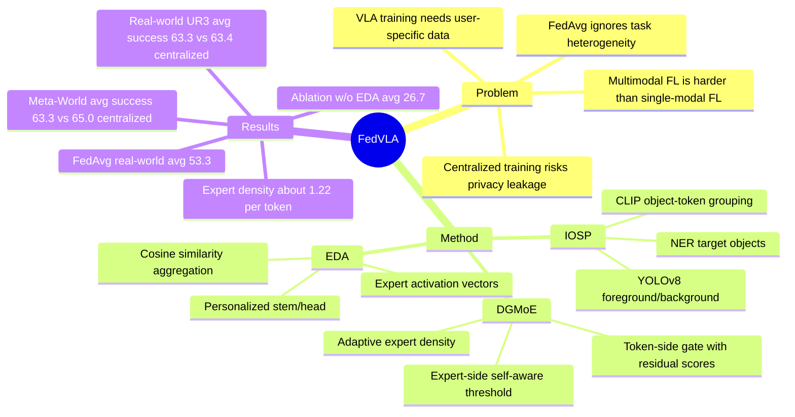

## Summary

FedVLA 试图把 VLA robotic manipulation 的训练从集中式数据汇聚改成 federated learning：用户侧只上传模型更新，raw images / instructions / trajectories 不离开本地。核心方法是 Instruction-Oriented Scene-Parsing、Dual Gating MoE 和 Expert-Driven Aggregation 三件套，在 Meta-World simulation 与 UR3 real-world household tasks 上接近 centralized training，并明显优于 FedAvg。

## Problem & Motivation

现有 VLA models 依赖大规模、用户特定的室内数据来学习 language-conditioned manipulation；这类数据可能暴露个人偏好、家庭环境甚至健康相关信息。Federated learning 能避免直接上传 raw data，但普通 FedAvg 对 VLA 不够合适：robotic manipulation 的不同 client 往往对应不同任务，视觉、语言、proprioception、action sequence 的多模态耦合也比单模态 FL 更复杂。

作者要解决的是 federated VLA learning 中的 task heterogeneity：既要保留每个 client 的任务特异性，又要让跨 client 的共享知识被有效聚合。论文声称这是第一个 privacy-preserving federated VLA training framework；这个 claim 在文中是作者表述，论文的实验证据主要支持“raw data 不共享时仍能保持接近 centralized 的 task success”，而不是形式化隐私保证。

## Method

**Overall formulation.** FedVLA 设定有 `N` 个 clients，每个 client `Ci` 对应一个 local task `Ti` 和 dataset `Di={(oi, li, si, ai)}`，包含 visual observation、language instruction、proprioception 和 action sequence。模型以 Huber loss 训练 action prediction；每个 client 本地更新后，把 trunk 参数和 expert selection statistics 发给 server，stem 与 head 保持 personalized，server 只聚合 trunk。

**Instruction-Oriented Scene-Parsing (IOSP).** IOSP 用 named entity recognition 从 instruction 中抽取 Target Objects，同时用 YOLOv8 检测图像中的 Foreground Objects / Background Objects。之后用 CLIP text/image embeddings 的 cosine similarity 把 scene objects 分成 Target Objects、Surrounding Objects、Background Objects 三组，每组选择 top-8 image tokens，并通过 MoE refinement 后与其他 tokens 和 proprioception 一起输入后续模块。这个设计的目的不是单纯裁剪背景，而是在突出 task-relevant objects 的同时保留 collision / spatial context。

**Dual Gating Mixture-of-Experts (DGMoE).** DGMoE 不再让每个 token 固定选择 `top-k` experts，而是引入两级 gating：token-side gate `Gt` 估计 token 对各 expert 的 selection score，并把上一层 MoE 的 score 作为 residual prior；expert-side gate `Ge` 用 learnable threshold 判断是否接受 token，论文中 scaling factor 设为 `lambda=0.5`。因此 expert 激活数可以随 token 和任务复杂度变化，目标是在保持 task performance 的同时降低 forward computation。

**Expert-Driven Aggregation (EDA).** 每个 client 在每一轮记录各 layer / expert 的 activation count，形成 expert selection vector。server 用不同 clients 的 selection vector cosine similarity 来计算 aggregation weight，使激活模式相近的 clients 更强地互相聚合；直觉上，这是把“哪些 expert 被哪些任务使用”作为 federated aggregation 的语义对齐信号。

## Key Results

**Simulation: Meta-World / MuJoCo household manipulation.** 论文在 Door Lock、Close Drawer、Sweep Into、Open Window 四个任务上评估，每个任务约 30-80 episodes、40-100 steps，使用 Sawyer robot 和三路 128x128 RGB cameras。FedVLA 平均成功率为 **63.3%**，接近 Centralized 的 **65.0%**，明显高于 FedAvg 的 **51.7%**；分任务上，FedVLA 在 Close Drawer 达到 **80.0%**，高于 Centralized 的 **73.3%**，在 Sweep Into 与 Centralized 同为 **53.3%**。

**Real-world: UR3 household tasks.** 真实实验使用 UR3 arm、one-DoF gripper 和 RealSense D435i RGB-D camera，任务为 Clean Up、Trash Collection、Open Drawer、Sorting Pills，每个任务约 50 demonstrations、20-80 steps。FedVLA 平均成功率为 **63.3%**，几乎等于 Centralized 的 **63.4%**，高于 FedAvg 的 **53.3%**；在 Trash Collection 和 Sorting Pills 上，FedVLA 分别达到 **46.7%** 和 **73.3%**，与 Centralized 持平，在 Clean Up 上为 **53.3%**，高于 Centralized / FedAvg 的 **46.7%**。

**Ablation: real-world four-task setting.** 去掉 IOSP 后平均成功率从 **63.3%** 降到 **41.1%**，其中 Trash Collection 从 **46.7%** 降到 **13.3%**；去掉 DGMoE 后平均成功率降到 **31.7%**，Clean Up 从 **53.3%** 降到 **20.0%**；去掉 EDA 后平均成功率降到 **26.7%**，是三个 ablation 中平均性能下降最大的。论文还报告 FedVLA 在 500 training rounds 内 validation loss 更低且更稳定，但图中没有给出可精确摘录的数值。

**DGMoE efficiency analysis.** DGMoE 在 Open Drawer、Sorting Pills、Trash Collection、Clean Up 上的 average activated experts per token 分别为 **1.219 / 1.229 / 1.225 / 1.227**，低于固定 `top-k` MoE 中通常 `k>1` 的 expert density。Figure 6 进一步显示 Target Objects 的 expert density 高于 Surrounding / Background Objects，例如 Open Drawer 中 TO/SO/BO 分别约为 **1.276 / 1.194 / 1.186**，支持“更相关对象激活更多 experts”的设计动机。

## Strengths & Weaknesses

**已知 Strengths.** 论文把 federated learning 的问题放进 VLA manipulation，而不是只在单模态分类或导航上讨论隐私，这个问题 formulation 对家庭机器人部署有现实意义。方法结构比较清楚：IOSP 处理 task-aware perception，DGMoE 处理 adaptive computation，EDA 处理 task-heterogeneous aggregation，三者对应了 federated VLA 的三个主要痛点。实验同时覆盖 Meta-World simulation 和真实 UR3 tasks，并且 ablation 明确显示 EDA、DGMoE、IOSP 都不是装饰性模块。

**已知 Weaknesses / boundary.** Baseline 只有 Centralized 和 FedAvg：这能说明 FedVLA 优于朴素 FL，但不足以定位它相对更强 federated multi-task learning、personalized FL 或 privacy-preserving robotics 方法的优势。任务规模较小，simulation 与 real-world 都只有四个 household-style tasks；每个 client 对应一个 task 的设定清楚但偏简化，还不知道在多任务 client、不同机器人 embodiment 或更长 horizon 场景下是否稳定。隐私层面，论文主要依赖“不上传 raw data”的 FL 机制，没有报告 differential privacy、secure aggregation、gradient inversion attack 防护或通信成本分析。

**推测.** EDA 的 expert-activation similarity 可能适合 VLA / GUI-agent 中的 heterogeneous task routing：如果不同用户或环境激活相似 expert，就让它们共享更多参数更新。但这是从 robotic manipulation 实验外推，论文没有在 GUI agent、web agent 或 non-robotic multimodal agent benchmark 上验证。

**不知道.** 不知道 FedVLA 的失败主要来自 perception parsing、language-object matching、expert routing、aggregation mismatch 还是 low-level control。也不知道 YOLOv8 / CLIP 的 detection 和 matching error 会如何影响真实家居环境中的 privacy-sensitive、遮挡或长尾物体场景；论文没有提供 systematic failure case taxonomy。

## Mind Map

## Notes

- 这篇最有价值的点不是“FL + VLA”这个组合本身，而是 EDA 把 MoE routing statistics 变成 federated aggregation signal：这比纯 parameter averaging 更贴近 task semantics。
- 对 GUI-agent 的可迁移启发：可以把不同 app / workflow / UI pattern 的 expert activation 当成 personalization 与 federation 的中间表示，但需要重新定义 action space 和 privacy threat model。
- 需要后续确认的问题：如果加入 DP noise 或 secure aggregation，EDA 依赖的 expert selection statistics 是否仍然可用？如果不能上传精细 activation counts，是否可以用 coarser routing sketches 替代？
