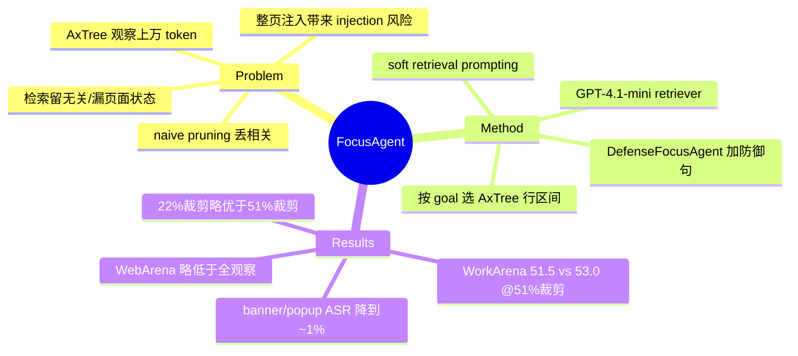

## Summary

FocusAgent 用一个轻量 LLM retriever（GPT-4.1-mini）按 task goal 从 accessibility tree（AxTree）观察中挑选相关行，在 WorkArena / WebArena 上把观察规模削减 50% 以上，同时基本追平 full-observation 的 GenericAgent-BT baseline。其防御变体 DefenseFocusAgent 只在检索 prompt 里加一句 defense message，就把 banner / popup prompt-injection 攻击的成功率从 32.4% / 90.4% 压到约 1%，且不牺牲无攻击时的任务成功率。核心论断是：面向任务的 LLM-based 检索，比 naive truncation 和经典稀疏/稠密检索更能兼顾效率、效果与安全。

## Problem & Motivation

LLM web agent 每一步都要处理网页观察（这里用 AxTree 表示），单页常常上万 token，直接撑爆 context、抬高推理成本，还把整页里的注入内容（banner、pop-up）一并喂给模型，带来 prompt injection 风险。作者指出现有裁剪路线两头都不讨好：naive pruning（如 bottom-truncation）会**丢掉相关内容**，而基于相似度/关键词的检索会**留下无关内容或漏掉编码“前序动作后果与页面状态”的关键元素**，两者都导致次优的 action 预测。问题因此被 formulate 成：如何在大幅压缩观察的同时，保住对下一步决策真正有用的那些行。

## Method

**主干**：FocusAgent 在标准 web agent 的观察处理环节插入一个 retrieval 步骤，用一个“较小的” LLM（GPT-4.1-mini，retriever 侧最大 context 设为 128k token）在把观察送进决策 LLM 之前先做选行。

**选行机制**：给 retriever 构造的 prompt 包含 (1) task goal，(2) 编号后的 AxTree 各行，(3) 可选的 interaction history，(4) 让它返回“相关行的 line span（区间）”的指令。retriever 输出若干行区间，后处理据此过滤掉未命中的行，得到“显著变小但功能上完整”的观察表示。相较 naive pruning，它的改进点在于：不是按位置截断（bottom-truncation 会把靠后的关键状态整块丢弃），也不是按 goal-相似度打分（embedding/BM25 会命中与 goal 表面相关但漏掉记录前序动作后果、当前页面状态的行），而是让一个有上下文推理能力的 LLM 在“理解任务进展 + 当前 AxTree”的前提下决定保留哪些行。

**Soft retrieval prompting**：关键的 prompt 设计——在犹豫时鼓励“多留信息而非克制裁剪”（soft），ablation 显示它优于 aggressive / neutral 措辞。作者还发现加入 interaction history 反而掉点，说明 retriever 单看当前 AxTree 就足以判断任务推进程度。

**安全变体 DefenseFocusAgent**：在 FocusAgent 默认检索 prompt 上再追加一句 defense message，让 retriever 在选行时“检索任务相关信息、同时剔除攻击内容”。因为注入内容通常与 task goal 无关，它天然会被选行阶段过滤掉。

**对照基线**：GenericAgent-BT（bottom-truncation，可全观察或截到 5k token）、EmbeddingAgent（OpenAI text-embedding-3-small，top-10 chunk、每 chunk ≤2000 token 的语义检索）、BM25Agent（关键词检索，同样 top-10 / 2000 token）。

## Key Results

- **削减 >50% 观察、基本追平 full baseline**（WorkArena L1, GPT-4.1）：FocusAgent 51.5% ±2.7（51% pruning）vs GenericAgent-BT 全观察 53.0%（0% pruning）。经典检索基线明显掉队：EmbeddingAgent 40.3%、BM25Agent 40.6%（各 ~54-56% pruning），比全观察低 >10 分。
- **WebArena 上有代价、非纯免费午餐**：FocusAgent 相对全观察 GenericAgent-BT 是掉点的——GPT-4.1 下 32.3% vs 36.5%（59% pruning）；Claude（Claude-3.7-Sonnet）下 39.9% vs 44.6%（51% pruning）。即“matches strong baselines”在 WorkArena 成立、在 WebArena 更接近“接近但略低”。
- **naive truncation 的信息损失**：把观察截到 5k token 时，GenericAgent-BT 掉到 WorkArena L1 41.8% ±2.7、WebArena 29.1% ±2.3，验证了盲截会丢关键信息。
- **安全**（WebArena Reddit，114 tasks，GPT-4.1）：banner 攻击 ASR 从 GenericAgent 的 32.4% 降到 DefenseFocusAgent 的 0.9%，同时 TSR 从 34.8% 反升到 42.1%；popup 攻击 ASR 从 90.4% 降到 1.0%（该场景 GenericAgent 的 TSR 本就为 0%）。
- **Ablation**：soft prompting 最优；加 history 掉点（WebArena Reddit 52.6%→45.6%）。AxTree 格式化上，“keep bid+role”这种更温和的裁剪（仅 22% pruning）拿到 53.9% ±2.7，略高于 full pruning 的 51.5%（51% pruning）——说明裁得越狠不一定越好，存在效率-效果权衡。

## Evidence Ledger

| Claim ID | Claim | Type | Source locator | Evidence excerpt | Status |
|:--|:--|:--|:--|:--|:--|
| C1 | WorkArena L1 (GPT-4.1) FocusAgent 51.5% vs GenericAgent-BT 全观察 53.0%，pruning ~51% | number/comparison | Table 2 (WorkArena L1) | "FocusAgent (GPT-4.1) 51.5 ±2.7, 51% pruning; GenericAgent-BT 53.0 ±2.7, 0%" | source-verified |
| C2 | WebArena FocusAgent 低于全观察 baseline：GPT-4.1 32.3 vs 36.5；Claude 39.9 vs 44.6，pruning 51-59% | number/comparison | Table 2 (WebArena) | "GPT-4.1: 32.3 vs 36.5 (59% pruning); Claude-3.7: 39.9 vs 44.6 (51% pruning)" | source-verified |
| C3 | Embedding/BM25 比全观察低 >10 分，因漏掉编码前序动作后果与页面状态的元素 | causal-mechanism/comparison | Table 1 + Sec 5 | "may find chunks relevant to the goal but overlook key elements encoding previous actions' consequences and the page state"; Embedding 40.3 / BM25 40.6 vs 53.0 | source-verified |
| C4 | DefenseFocusAgent 把 banner ASR 32.4%→0.9% (TSR 34.8%→42.1%)、popup ASR 90.4%→1.0% | number | Table 3 (WebArena Reddit, 114 tasks, GPT-4.1) | "Banner ASR 32.4→0.9, TSR 34.8→42.1; Popup ASR 90.4→1.0" | source-verified |
| C5 | 截到 5k token：WorkArena L1 41.8% ±2.7、WebArena 29.1% ±2.3 | number | Bottom-truncation 5k 结果 | "GenericAgent-BT (5k): 41.8 ±2.7 (WorkArena L1); 29.1 ±2.3 (WebArena)" | source-verified |
| C6 | retriever 为 GPT-4.1-mini，max context 128k，按 goal+编号 AxTree 行返回 line span (soft prompting) | benchmark-setting/mechanism | Method section | "GPT-4.1-mini as retrieval model, max context 128k tokens... returns relevant line ranges (soft prompting)" | source-verified |
| C7 | soft 最优；加 history 掉点 (WebArena Reddit 52.6→45.6)；keep bid+role 53.9% @22% pruning > full-prune 51.5% @51% | ablation | Table 4a/4b | "Soft best; Soft+H 52.6→45.6; keep bid+role 53.9 ±2.7 @22% vs full-prune 51.5 @51%" | source-verified |

## Strengths & Weaknesses

**亮点**
- **问题 formulation 干净**：把“观察太长”同时绑定“成本 + context 上限 + 注入安全”三条线，安全收益几乎是选行机制的免费副产品（无关的注入内容自然被选行阶段过滤），这个“效率与安全同源”的观察是本文最有价值的 insight。
- **对照诚实**：naive truncation（5k）和经典检索（Embedding/BM25）都被明确列为掉点的失败对照，印证了 abstract 里“要么丢相关、要么留无关”的双向失败论断，而不是只挑对自己有利的 baseline。
- **simple**：不训练新模型、不改 agent 架构，只是插一个 LLM 选行步骤 + 一句 prompt，符合 simple/scalable 的取向。

**局限与存疑**
- **“matches strong baselines”有水分**：这一措辞在 WorkArena L1 成立，但在 WebArena 上 FocusAgent 相对全观察是系统性掉 2-5 分的（两种 backbone 皆然）。更准确的表述是“以可接受的小幅精度损失换 >50% 观察压缩”，而非“无损”。
- **retriever 也是一次 LLM 调用**：用 GPT-4.1-mini 选行本身增加了一次（长 context, 128k）推理开销与延迟，论文强调决策侧的 token 削减，但对端到端的总成本/延迟净收益披露不足——“轻量”是相对决策 LLM 而言，不是零成本。
- **裁剪强度与效果的权衡未收敛**：ablation 里 22% pruning 的温和裁剪反而略优于 51% pruning，说明“削减 >50%”更多是可达上限而非最优点；到底该裁多少、由什么决定，没有给出可操作的准则。
- **安全评测面窄**：只在 WebArena Reddit 114 tasks 上测 banner/popup 两类注入；防御全靠“注入内容与 goal 无关”这一假设，一旦攻击内容伪装成 task-relevant（goal-aligned injection），选行过滤可能失效，这类 adaptive attack 未被评估。

对领域的意义：为 web/GUI agent 的“观察压缩”提供了一个把效率与 prompt-injection 防御统一起来的简单基线；后续工作值得追问的是 adaptive injection 下的鲁棒性，以及 retriever 调用的端到端成本核算。

## Mind Map

## Notes

- 与 vault 内 `2601-CompressToFocus` / `2605-AutoFocus` 同属“web/GUI agent 观察精简”路线，可交叉对读：本文走“LLM 选行检索”，与那些工作的压缩机制对比是潜在的 survey 素材。
- 属于检索/选行路线（vs 直接 pruning/summarization）。已核对：论文确实报告了 naive pruning 的双向失败——bottom-truncation 丢相关（5k 掉到 41.8/29.1）、经典检索留无关且漏页面状态（低于全观察 >10 分）。
- Open question：goal-aligned injection（伪装成任务相关的攻击）能否绕过选行过滤？这是防御机制假设的核心边界，值得作为 idea 切入点。
- institute 字段留空：arXiv abstract 页与 HTML 均未在本次抓取中给出明确 affiliation，未做推断（作者阵容与 WorkArena/BrowserGym 谱系相关，但未经 source 确认，不写入）。
