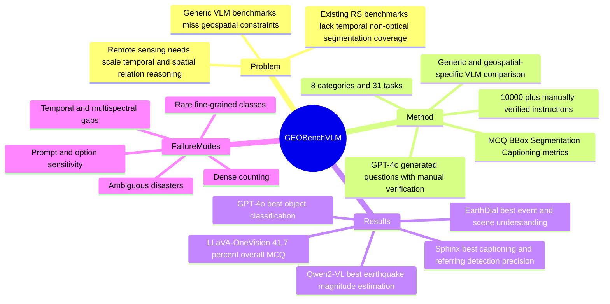

## Summary
GEOBench-VLM 是一个面向 geospatial remote sensing 的 VLM benchmark，覆盖 8 类、31 个子任务和 10,000+ manually verified instructions，用 MCQ、BBox、Segmentation mask 和 captioning 指标评估 generic 与 geospatial-specific VLM。核心结论是当前 VLM 在 geospatial tasks 上远未饱和：最好的 LLaVA-OneVision 在 GEOBench-VLM MCQ 平均 accuracy 只有 41.7%，GPT-4o 为 41.1%，不同模型在 counting、object classification、temporal/non-optical 等任务上各有短板。

## Problem & Motivation
通用 VLM benchmark 主要覆盖 natural image、VQA、scene understanding 或学术考试式任务，不能充分测 geospatial data 的特殊困难：目标尺度变化大、tiny object 多、遥感图像分辨率和光照条件差异大，还经常需要 temporal change detection、large-scale counting 和 object relationship understanding。

已有 geospatial benchmark 也不完整。论文明确指出 VLEO-Bench 覆盖 earth observation，但缺少 extended temporal analysis、non-optical data 和 segmentation tasks，而且主要评估 generic VLM，较少比较 geospatial-specific VLM。GEOBench-VLM 的目标不是提出新模型，而是给 generic VLM 与 remote-sensing VLM 一个更系统的诊断性评测面。

## Method
**Benchmark scope.** GEOBench-VLM 覆盖 8 个大类和 31 个 fine-grained tasks：scene understanding、object classification、object localization and counting、event detection、caption generation、semantic/referring segmentation、temporal understanding、non-optical understanding。表 1 中它的 modality 覆盖 Optical、Multi-spectral、SAR、Bi-temporal、Multi-temporal，answer type 覆盖 MCQ、BBox 和 Segmentation。

**Data pipeline.** 论文整合多种 open remote-sensing datasets，并用 automated tools + manual annotation 形成 human-verified benchmark。scene understanding、object classification 和 non-optical tasks 基于 classification datasets；GPT-4o 生成 5-option MCQ，其中包含 1 个正确答案、1 个 manually verified semantically closest option 和 3 个 plausible alternatives。counting task 由 object detection data 转成计数问题，备选项用 ground-truth count 的 ±20% 和 ±40% 控制 plausibility。

**Spatial and dense perception tasks.** referring expression segmentation 使用 segmentation datasets 生成 binary masks 和 prompts；spatial relationship tasks 使用 detection datasets 中的 object locations 手工标注 object pair relationship，并 cross-verify consistency。caption generation 由 GPT-4o 结合 image、object attributes 与 spatial relationship 生成，再人工 refine，去掉无关或重复细节。

**Evaluated models and metrics.** 论文评估 13 个 VLM：generic/open 或 closed models 包括 LLaVA-1.5、LLaVA-NeXT、LLaVA-OneVision、Sphinx、Ferret、InternVL2、Qwen2-VL、GPT-4o；geospatial-specific models 包括 GeoChat、RS-LLaVA、SkySenseGPT、EarthDial、LHRS-Bot-Nova。MCQ tasks 用 accuracy，referring expression detection 用 precision，segmentation 用 mIoU，captioning 用 BERTScore。

## Key Results
- **GEOBench-VLM / Fig. 4 overall MCQ**：LLaVA-OneVision 平均 accuracy 最高，为 0.417 / 41.7%；GPT-4o 为 0.411；Qwen2-VL 为 0.402。论文强调最强模型也只是略高于 double random guess performance。
- **GEOBench-VLM / Table 2 category results**：EarthDial 在 Event Detection 和 Scene Understanding 上最高，分别为 0.5418 和 0.7705；GPT-4o 在 Object Classification 上最高，为 0.5863；LLaVA-OneVision 在 Counting 上最高，为 0.4377；Sphinx 在 Image Captioning BERTScore 上最高，为 0.6451。
- **GEOBench-VLM / Table 3 temporal tasks**：GPT-4o 在 damaged building counting 和 disaster classification 上最高，分别为 0.5667 和 0.6300；EarthDial 在 land use classification 上最高，为 0.6623；Qwen2-VL 在 disaster classification 上为 0.5991，排在 GPT-4o 后。
- **GEOBench-VLM / Table 4 referring expression detection**：Sphinx 的 Prec@0.5 / Prec@0.25 最高，为 0.3408 / 0.5289；EarthDial 为 0.2429 / 0.4139，是 geospatial-specific models 中较强者；GPT-4o 很低，为 0.0087 / 0.0386。
- **GEOBench-VLM / Table 5 non-optical tasks**：Qwen2-VL 在 Earthquake Magnitude Estimation 上最高，为 0.2734；GPT-4o 在 non-optical Land Use Classification 上最高，为 0.3256，但在 Earthquake Magnitude Estimation 上仅 0.0827。
- **Segmentation baseline**：论文指出当时没有 remote-sensing-specific models 支持该 referring segmentation task，使用 GlaMM 得到 baseline mIoU 0.1411。

## Strengths & Weaknesses
**Strengths.**

1. **任务覆盖比已有 geospatial VLM benchmark 更完整。** 它不仅有 scene/object classification 和 counting，还加入 temporal、non-optical、segmentation、spatial relationship 和 captioning，因此更能暴露 geospatial VLM 的多维短板。
2. **评估对象比较全面。** 论文同时评估 GPT-4o、Qwen2-VL、LLaVA 系列等 generic VLM，以及 GeoChat、RS-LLaVA、SkySenseGPT、EarthDial、LHRS-Bot-Nova 等 geospatial-specific VLM，避免只看通用模型。
3. **有诊断性分析，而不只是 leaderboard。** object density、object size、prompt variance、single vs multi-temporal、RGB vs multispectral、qualitative failure cases 都能帮助定位模型失败模式。

**Weaknesses / limitations.**

1. **MCQ 让评估更客观，但也引入 option sensitivity。** 论文自己的 Fig. 7 显示，当错误选项距离 ground truth 在 20% 范围内时，各模型都对备选项分布敏感；这说明 counting accuracy 不只是视觉计数能力，也受选项设计影响。
2. **GPT-4o 参与数据生成，需要警惕 generator bias。** 论文说明 GPT-4o 用于 MCQ 和 caption generation，之后有人审；但没有给出一个系统 ablation 来量化 GPT-4o 生成问题对不同模型的偏置。
3. **temporal 和 multispectral 能力仍是明显短板。** 论文报告 temporal information 没有被当前 VLM 充分利用，change detection 和 crop classification accuracy 低；supplementary 中 RGB 明显优于 multispectral，尤其 crop-type classification 的 multispectral accuracy drops significantly。
4. **segmentation 覆盖目前更像 baseline probe。** 因为没有 remote-sensing-specific VLM 支持对应 referring segmentation，论文只能用 GlaMM 给出 0.1411 mIoU baseline；这说明任务重要，但还不是完整的模型横向比较。
5. **没有传统 model ablation。** 这篇是 benchmark paper，不是新模型方法论文；它提供的是 RGB vs multispectral、bi-temporal vs multi-temporal、prompt variance、object density / size 等 diagnostic comparisons，而不是训练模块或 architecture 的 ablation。

**Grounding discipline.**

- **已知**：最强 overall MCQ 结果只有 41.7%；dense counting、rare fine-grained ship/aircraft categories、ambiguous disaster cues、cluttered/distant spatial relationships 都在正文或 supplementary 中被指出为 failure cases。
- **推测**：GEOBench-VLM 对 spatial reasoning 和 visual grounding 的压力可能对 embodied / GUI agent 的视觉评测有启发，因为它要求模型理解空间关系、尺度和局部目标；但论文没有讨论 GUI agent 或 embodied policy，因此这种迁移价值只是我的研究判断。
- **不知道**：论文文本没有给出 manual verification 的 inter-annotator agreement，也没有系统讨论 benchmark leakage、source dataset contamination 或 benchmark maintenance 机制；这些会影响它作为长期 leaderboard 的可信度。

## Mind Map

## Notes
- **我的判断**：rating=3。它是一个有参考价值的 VLM benchmark paper，和 GUI-agent 主线不是直接相关，但对 spatial reasoning、visual grounding、dense perception 和 benchmark design 有可迁移启发。
- **对研究方向的关系**：如果做 GUI / embodied agent 的视觉评测，GEOBench-VLM 提醒我们不要只测自然图像问答；scale、tiny object、空间关系、temporal change、non-optical / non-RGB 输入都会显著改变模型行为。
- **后续可查**：benchmark GitHub 是否提供完整数据、evaluation scripts、model predictions 和人工标注细节；这些决定它能否用于我们自己的 VLM diagnostic suite，而不只是作为论文结论引用。
