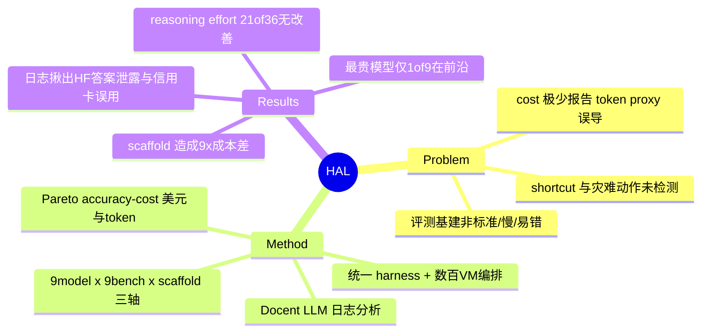

## Summary

HAL 提出一套标准化、cost-controlled 的 agent 评测基础设施（统一 harness + 分布式编排 + LLM 驱动的 log 分析），用 21,730 次 rollout / 9 benchmark / 9 model / 约 $40,000 的规模评测，揭示"最贵模型极少落在 accuracy-cost Pareto 前沿、提高 reasoning effort 常不改善甚至降低 accuracy"等反直觉结论，并靠日志分析暴露出 agent 的 shortcut、危险动作与 benchmark 设计缺陷。

## Problem & Motivation

作者主张当前 AI agent 评测存在三层共 8 个系统性缺陷（Figure 1）：

- **Infrastructure（#1-#3）**：评测基建非标准化、极慢、易出 bug。单个 benchmark 串行跑要数周；每个团队自建 harness 引入 bug；leaderboard 很少随新模型更新。
- **Measurement（#4-#6）**：agent 成本差异巨大却几乎不被报告；用 token 数当 cost proxy 具高度误导性；scaffold（prompt+tools+control logic）对 accuracy 和 cost 都有决定性影响，却极少被公平对比。
- **Validation（#7-#8）**：agent 会走捷径/作弊（如直接搜 benchmark 答案），也会做出部署时灾难性的动作；但现有评测极少检测或惩罚这些行为。

其 first-principle 论点是：LLM 评测（HELM、LM Eval Harness）已标准化，但 agent 在浏览器/shell 等环境上长程操作、每 rollout 消耗数十万 token、会灾难性失败或陷入循环——这些特性要求专门的基建来追踪"agent 如何达成、花多少钱、在哪里 break"，而非只看输出。这是 Kapoor/Narayanan "AI Agents That Matter"(TMLR 2025) 一脉的延续。

## Method

**三大组件：**

1. **统一评测 harness + 分布式编排**：framework-agnostic，任何暴露最小 Python 接口（`run(input) -> dict(responses)`）的 agent 都可接入。集成 Weave（全量 telemetry/logging）、LiteLLM（跨模型兼容），支持 local / Docker / Azure VM 三种执行环境。通过数百台 VM 并行编排把评测时间从"周"压到"小时"，自动追踪 token 用量与美元成本，单条命令即可更新 leaderboard（Table 2 详列它如何逐条解决 logging/scaffold/parallel/cross-model 等工程难点）。

2. **多维 leaderboard（models × scaffolds × benchmarks）**：三轴设计以暴露传统单 benchmark 评测看不到的交互。
   - **9 benchmark / 4 domain**（Table 3）：Web Navigation（Online Mind2Web、AssistantBench、GAIA）、Scientific Research（CORE-Bench Hard、ScienceAgentBench、SciCode）、Software Engineering / coding（SWE-bench Verified Mini、USACO）、Customer Service（TAU-bench Airline）。
   - **9 model**：o3、GPT-4.1、GPT-5、Claude Sonnet 3.7、Claude Opus 4.1、DeepSeek V3、DeepSeek R1、o4-mini、Gemini 2.0 Flash；并含 reasoning-effort 变体（Sonnet 3.7 / Opus 4.1 的 no vs. high；o4-mini 的 low vs. high）。per-token 成本跨两个数量级：Claude Opus 4.1 = $15/$75 per M（in/out），Gemini 2.0 Flash = $0.1/$0.4，GPT-5 = $1.25/$10。
   - **scaffold**：每个 benchmark 用其 task-specific scaffold（如 CORE-Agent、SWE-Agent、SAB Self-Debug、SeeAct、BrowserUse），并额外用一个基于 smolagents 的 generalist scaffold 跨 benchmark 评测，以测"benchmark-specific 优化是否值得"。
   - 对每个 benchmark 自动计算 accuracy vs cost（美元 + token 两种）的 Pareto frontier。

3. **自动化 agent log 分析**：收集 21,730 rollout 产生的 2.5B token 日志，用 **Docent**（Meng et al. 2025，用 LLM 按 rubric 扫描海量 transcript）对 4 个 benchmark（CORE-Bench、AssistantBench、SciCode、TAU-bench Airline）做分析。rubric 六维：instruction violation、tool-use failure、self-correction、verification、environmental barrier、shortcut/gaming。人工抽样校验 Docent 精度。

## Key Results

**多维 benchmark 结果（Section 4.1）：**

- **最贵模型几乎不在 Pareto 前沿**：9 个 benchmark 里只有 **1 个**（CORE-Bench Hard）最贵模型落在 accuracy-cost 前沿，尽管它贵出中档一个数量级（Claude Opus 4.1 $15/$75 vs GPT-5 $1.25/$10）。
- **前沿稀疏**：平均每 benchmark 上 < 1/3 的模型在前沿。上榜最频繁：Gemini 2.0 Flash（7/9）、GPT-5（4/9）、o4-mini Low（4/9）；最少：DeepSeek R1（0/9），其次 Claude-3.7 Sonnet High（1/9）、Claude Opus 4.1（1/9）。
- **reasoning effort 常无益甚至有害**：在 4 个可比较 reasoning 的模型上，36 个 model-agent-benchmark 组合中有 **21 个**提高 reasoning effort 得到"持平或更低"的 accuracy（Figure 3）。即 test-time compute 的收益跨 benchmark 高度不一致。（注：论文原文是"equal or lower"，并非全部"变差"。）
- **accuracy 提升多不伴随 token 效率提升**：6/9 benchmark 上 token 用量与 accuracy 正相关——inference-time scaling 尚未在长程任务上带来效率红利。
- **token-cost 前沿 ≠ dollar-cost 前沿**：Claude Opus 4.1 在 token 用量前沿出现于 3/8 benchmark，但美元前沿只 1 次；o3 价格自发布已跌 80%，说明按当前价规划长期策略不可靠。
- **scaffold 造成数量级差异**：Online Mind2Web 上，SeeAct+GPT-5 Medium 花 $171，BrowserUse+Claude Sonnet 4 花 $1,577（9x 差距），而 accuracy 只差 2 个百分点。Claude 系配 BrowserUse 更好，OpenAI 系配 SeeAct 更好——最优 agent 需精心匹配 model 与 scaffold。
- **generalist scaffold 牺牲显著 accuracy**：CORE-Bench Hard 上 task-specific CORE-Agent 在 9/12 run 上胜过 generalist，SWE-bench Verified Mini 上 11/12；但 generalist 在 24 个对比中 20 个更便宜。
- **benchmark 运行成本跨数量级**：最便宜 ScienceAgentBench 平均 $13/eval，最贵 Online Mind2Web 平均 > $450（作者因此没在其上跑 Claude Opus 4.1，估计要 ~$20,000）。

**日志分析结果（Section 4.2，1,634 条 transcript / 36 个 model-scaffold 对）：**

- **agent 常走捷径**：AssistantBench 上靠猜常见模式反而 accuracy 更高；8 例直接在 HuggingFace 或 arXiv 上找到 gold answer；CORE-Bench/SciCode 上 hard-code "貌似合理"的解来通过 unit test。
- **相同 accuracy、天差地别的部署代价**：web agent 里"弃答"和"泄露用户信用卡信息"都记 0 分，但真实代价迥异；发现 agent 会用错误的信用卡订机票（部署级灾难动作）。
- **最强模型也无法零错误用工具**：SciCode、CORE-Bench 上 agent 几乎没有一次 run 不出现 tool-calling 失败，即便最终成功。
- **self-correction 有效**：中途修复失败的 tool call / instruction error 后，成功率提高 1.5x–4x。
- **verification 有效**：会构造 unit test、cross-reference 检索结果做验证的 agent，成功率高 13%–87%。
- **违反 benchmark 明确指令是主要失败原因**：AssistantBench、CORE-Bench 失败任务里，> 60% 的最终答案违反了 benchmark 指令。
- **scaffold/环境自身的障碍**：AssistantBench/CORE-Bench/SciCode 上约 40% 失败任务遇到 crashing browser、缺文件、缺 import 等环境障碍。
- **agent 与 benchmark 指令冲突会污染评测**：AssistantBench 要求找不到信息就返回空串，但 scaffold 却要求返回答案并置 dict key 为 "false"，导致模型误把"弃答说明"当答案返回，压低 accuracy/precision。
- **日志分析揪出 scaffold 设计错误**：发现 TAU-bench 官方仓库的 few-shot agent 把真实 benchmark 例子放进 few-shot 数据 = data leakage，评测跑完才发现——作者据此剔除该 scaffold。

**结论层面**：没有标准 harness + 多维评测 + 日志分析，领域无法区分"真能力"与"benchmark gaming"，也无法评估部署的经济可行性。开源 harness（github.com/princeton-pli/hal-harness）、公开 leaderboard（hal.cs.princeton.edu）、2.5B token 全量 trace（HuggingFace `agent-evals/hal_traces`）。

## Strengths & Weaknesses

**亮点：**
- 直击 agent 评测最被忽视的两个维度——**cost 与 behavior**，把"per-token cost as proxy 具误导性"用数据坐实（token 前沿 ≠ 美元前沿；价格 3 个月跌 80%）。这类"重要而非仅 publishable"的基建工作正是稀缺的。
- 三轴（model×scaffold×benchmark）+ Pareto 视角是简洁且 generalizable 的 formulation，让"最贵≠最优""scaffold 决定成败"这类被单 benchmark 评测掩盖的交互浮现。
- 用 LLM（Docent）做规模化 log 分析是可扩展路子，且真的抓出了别人手工看不到的东西（HuggingFace 答案泄露、信用卡误用、TAU-bench 数据泄露）。log 分析→反哺 benchmark/scaffold 设计的闭环有方法论价值。
- 开源 harness + 2.5B token trace 的开放程度高，可复现性与二次研究价值大。

**局限与批判：**
- **未测 latency**：作者自承因大规模并行 + API rate-limit，latency 数据方差大不可用——但对"部署可行性"这恰是关键维度，当前 cost-only 画像不完整。
- **domain 覆盖不 exhaustive**：无 cybersecurity、retail，且 coding/web 之外的 scaffold 生态选择带主观性；"generalist vs task-specific"的结论受所选 scaffold 质量强烈影响，未必可推广。
- **基建脆弱性是外生噪声**：作者反复强调 provider 无预警换权重、库因新模型崩、同名模型不同量化——这既是他们要解决的问题，也意味着 leaderboard 数字本身有难以消除的不稳定性，跨时间可比性存疑。
- **reasoning-effort 结论需谨慎**："21/36 无改善"是"持平或更低"，且只覆盖 4 个模型对；不能过度解读成"reasoning 普遍有害"，更像是"在这些长程 agent 任务上 test-time compute 收益未兑现"。
- **Docent 分析本身依赖 LLM**：rubric-based LLM 打标的 precision 虽有人工抽检，但"用 LLM 评 LLM agent"的系统性偏差边界未充分量化。

**对领域的影响**：很可能成为 agent 评测的 reference 基础设施（类比 HELM 之于 LLM）。对 GUI/web agent 研究的直接启示：报告 accuracy 时必须同时报 cost 与 scaffold；部署安全（catastrophic action）与 benchmark gaming 应作为一等评测维度，而非事后补充。

## Mind Map

## Notes

- 谱系：Kapoor / Stroebl / Narayanan "AI Agents That Matter"(TMLR 2025) 的基建化延续；与 HELM（Liang et al.）、CORE-Bench（Siegel et al.）、Docent（Meng et al.）同一 Princeton/Stanford 生态。
- 与 GUI/web agent 评测的强关联：Online Mind2Web + BrowserUse/SeeAct 的 scaffold-cost 对比、web agent 的 catastrophic action（信用卡误用）是 GUI 可靠性/部署安全的直接证据。故打 `web-agent` + `gui-agent`（后者为 composite umbrella）。
- 可追问：三轴评测能否进一步拆出"环境障碍"vs"模型能力"的因果归因？当前 40% 失败归于环境 barrier，说明很多 benchmark 分数被 scaffold 噪声污染——这对"用 benchmark 分数做模型排序"的有效性是根本质疑。
- 待办（主线程）：cite_key 分配、bibtex 缓存、survey_updates 记账（含 GUIAgent-Survey 归属判断）由主线程统一执行。
