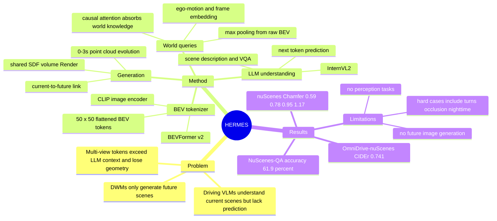

## Summary
HERMES 将 Driving World Model 从单纯 future point cloud generation 扩展到 unified 3D scene understanding + generation：用 BEV tokenizer 压缩六视角输入，并用 world queries 通过 LLM causal attention 把文本侧 world knowledge 传给 future BEV generation。实验在 nuScenes / OmniDrive-nuScenes 上显示它能同时做场景描述、VQA 和 0-3s point cloud evolution，但作者也明确承认尚未覆盖自动驾驶 perception task 与 future image generation。

## Problem & Motivation
现有 Driving World Models 主要预测 future scene evolution，例如 occupancy 或 point cloud forecasting；它们能生成未来几何，但难以解释当前环境、回答 VQA 或给出 scene description。另一条线的 driving VLM / LLM 方法能做 scene understanding、reasoning 和 planning-style QA，但缺少对未来场景演化的预测能力。

作者把核心问题定义为：如何把 world knowledge 和 future scene evolution 放进同一个 autonomous driving world model。直接把多视角图片 token 化会遇到 LLM token length 限制，也难以保留跨视角几何关系；而简单共享 BEV feature、再分别接 LLM 和 generator 的 separated unification 又不能充分利用 understanding 与 generation 的交互。

## Method
HERMES 的输入是当前时刻多视角图片 `It`，输出同时包含当前驾驶场景的文本理解结果，以及从 `Pt` 到 `Pt+Δt` 的 point cloud evolution。整体路径是：multi-view image -> BEV feature -> LLM understanding / world query enrichment -> current-to-future link -> shared Render 输出当前与未来点云。

**BEV-based world tokenizer**：作者使用 CLIP image encoder 和 single-frame BEVFormer v2，把六视角图像编码成 BEV feature `F_bev_t`。为了适配 LLM，上采样前的 BEV feature 会通过 down-sampling block 压缩；默认设置中 encoded scene 为 `w=h=200`，4x downsampling 后 flattened BEV size 为 `50 x 50`，即约 2,500 BEV tokens。作者强调 BEV 的作用不是只做压缩，而是把多视角输入放进统一空间坐标系，保留对象与环境之间的几何关系。

**BEV-to-point Render**：Render 先把压缩 BEV feature 上采样回 `w x h x c`，再显式加入 height dimension 并用 3D convolutions 重建 volumetric feature。随后按照 LiDAR setup 构造 rays，用 SDF-based differentiable volume rendering 预测每条 ray 的 depth，从而生成 point cloud。当前点云预测 `Pt` 既是输出也是 auxiliary task，用于 regularize LLM 输出后的 encoded BEV。

**LLM unification**：HERMES 使用 InternVL2 系列 LLM。理解分支把 flattened BEV 投影到 LLM feature space，并与 text tokens 一起做 next-token prediction，回答 driving scene description / VQA / action-related prompts。

**World queries**：generation 分支不是直接把 LLM feature 丢给 decoder，而是从 raw BEV feature 通过 max pooling 初始化 `Δt` 组 world queries；每组 query 加入 future ego-motion embedding 和 frame embedding，表示计划中的未来位置、朝向和预测帧。由于 causal attention 允许后面的 world queries 访问前面的 BEV/text tokens，这些 queries 会从场景问答和描述中吸收 world knowledge。之后 current-to-future link 使用 3 个 cross-attention blocks：以 LLM output 的 encoded BEV `Bt` 为 query，以对应 future world queries 为 key/value，生成 `Bt+1 ... Bt+Δt`，再用 shared Render 生成未来点云。

**Training objective**：语言侧使用 standard next token prediction loss；点云侧对 0-3s 各帧 ray depth 使用 L1 loss，总损失为 `L = L_N + 10 L_D`。Supplement 中训练分三阶段：Stage 1 训练 tokenizer + Render 做当前点云重建；Stage 2 做 BEV-text alignment / refinement，其中使用 NuInteract dense captions 和 OmniDrive-nuScenes scene descriptions；Stage 3 加入 future generation modules，在 nuScenes keyframes 与 OmniDrive-nuScenes descriptions / conversations 上联合训练。

## Key Results
- **Main benchmark, (OmniDrive-)nuScenes validation**：HERMES 的 Chamfer Distance 为 `0s/1s/2s/3s = 0.59/0.78/0.95/1.17`；ViDAR 为 `-/1.12/1.38/1.73`，4D-Occ 为 `-/1.13/1.53/2.11`。作者报告相对 ViDAR 的 3s generation error 降低 `32.4%`，且 HERMES 只使用当前帧，而 ViDAR / 4D-Occ 使用 3s history horizon。
- **Understanding on OmniDrive-nuScenes**：HERMES 的 `METEOR/ROUGE/CIDEr = 0.384/0.327/0.741`；OmniDrive 为 `0.380/0.326/0.686`，CIDEr 提升约 `8.0%`。但 separated unification 的 CIDEr 为 `0.745`，略高于 HERMES 的 `0.741`；HERMES 的优势主要体现在 generation：`0.59/0.78/0.95/1.17` 优于 separated unification 的 `0.60/0.84/1.08/1.37`。
- **Task interaction ablation, quarter nuScenes training scenes**：understanding-only 得到 `METEOR/ROUGE/CIDEr = 0.379/0.323/0.728`；generation-only Chamfer 为 `0.651/0.988/1.313/1.687`；HERMES 联合训练为 `0.645/0.984/1.333/1.718` 和 `0.377/0.321/0.720`。这说明 unified training 接近单任务性能，但在 2s/3s generation 与 CIDEr 上仍有小幅 optimization gap。
- **World query ablation**：Fig. 3 显示加入 LLM-processed world queries 后，3s Chamfer Distance 从无 world queries 的约 `1.30` 降到 `1.17`；CIDEr 从 `0.750` 降到 `0.741`。作者解释为新增 query 参数提升了 future generation，但增加了 LLM optimization complexity。
- **Flattened BEV size**：`50 x 50` BEV tokens 相比 `25 x 25` 在 ablation 中把 CIDEr 从 `0.671` 提到 `0.720`，0s Chamfer 从 `0.720` 降到 `0.645`；作者将其归因于过度 downsampling 带来的 information loss。
- **NuScenes-QA supplement**：在 NuScenes-QA VQA benchmark 上，HERMES accuracy 为 `61.9%`，高于 LLaVA `47.4%`、OmniDrive `59.2%` 和 CenterPoint+MCAN `59.5%`；作者指出该结果不依赖 3D object detection supervision。
- **Copy&Paste baseline supplement**：Copy&Paste 未来点云的 Chamfer 为 `1s/2s/3s = 1.27/2.12/2.66`，ViDAR 为 `1.12/1.38/1.73`，HERMES 为 `0.78/0.95/1.17`，说明模型不是简单复制当前点云。

## Strengths & Weaknesses
**已知**：HERMES 的主要贡献是把 BEV-based spatial compression、LLM scene understanding 和 point cloud future generation 放进一个统一模型，并用 world queries 建立理解到生成的连接。相比 separated unification，HERMES 的 generation 明显更好；相比 OmniDrive 类 understanding specialist，它在 CIDEr 上更高，同时还输出 future point cloud。

**已知**：论文的 limitation 写得比较清楚。作者没有在 HERMES 框架内探索 autonomous driving perception tasks；future image generation 仍在 future work 中；supplement 还指出复杂场景如 significant left turns、occlusions，以及 low-quality visible light / nighttime driving 会带来挑战。

**已知**：比较结果需要谨慎解释。ViDAR 使用 3s history horizon 和 FCOS3D pre-trained backbone，而 HERMES 使用当前多视角输入与简单 volumetric representation；这让“当前帧即可优于 history-based baseline”很有吸引力，但不同输入历史、backbone 与训练细节会影响公平性。另一方面，separated unification 的 CIDEr `0.745` 高于 HERMES `0.741`，说明统一建模并没有在所有 understanding 指标上单调提升。

**推测**：BEV 作为 LLM token interface 的价值可能不止在 autonomous driving；对 embodied / spatial VLM 来说，它提供了一个把多视角观测压缩成空间一致 token 序列的可复用范式。world queries 的设计也提示了一种通用模式：让未来状态 token 通过 causal attention 读取当前语言理解，再由 cross-attention 生成未来空间状态。

**不知道**：论文没有给出 closed-loop driving / planning evaluation，也没有验证生成的 future point cloud 是否能提升下游 planner 或安全决策。语言理解主要用 METEOR、ROUGE、CIDEr 这类 word-level metric，尚不清楚这些分数与驾驶决策可靠性之间的关系。模型对 out-of-domain 城市、传感器配置变化、恶劣天气和真实部署延迟的鲁棒性也没有被系统评估。

## Mind Map

## Notes
这篇论文与 GUI-agent 的直接关系不强，但对“world model 如何与 language understanding 合并”很有参考价值。尤其值得跟 [[2604-AgentWorld]] 或其他 agent world model 工作对照：HERMES 的 world query 是一种把 language-side context 写入 future latent state 的工程化实现，但目前 evidence 主要来自 open-loop point cloud forecasting 和 caption/VQA 指标。后续如果把这种结构迁移到 computer-use / web-agent，关键问题会变成：什么是 GUI 场景里的 BEV-equivalent representation，以及 future state generation 是否真的能改善 planning，而不只是生成可视化预测。
