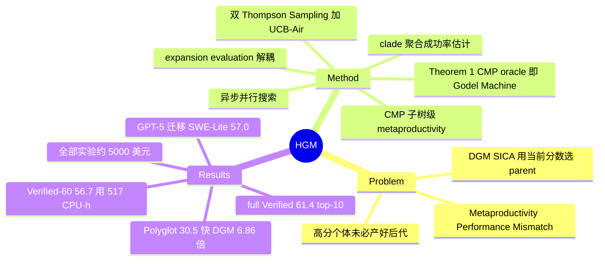

## Summary

HGM 诊断出 DGM/SICA 谱系的共同缺陷——用当前 benchmark 分数选 parent 隐含"高分个体产好后代"的假设，而实证上二者弱相关（Metaproductivity-Performance Mismatch）；改用 clade（子树）级聚合的 CMP（Clade-Metaproductivity）估计指导自改 agent 的树搜索，并证明受限假设下 CMP oracle 足以实现最优 Gödel Machine。SWE-bench Verified-60 上 56.7%/517 CPU-hours（DGM 53.3%/1231h），Polyglot 30.5%/347h（DGM 27.1%/2385h）；full Verified 上发现的 agent 达 61.4%，换 GPT-5 backbone 迁移 SWE-Lite 达 57.0%，与最好的人工 agent 持平——论文据此称 "human-level"。

## Problem & Motivation

DGM、SICA 等自改 coding agent 都以"当前 benchmark 表现"作为选择哪个 agent 继续自我修改的依据（DGM 的 archive 采样偏好高分 + 少后代个体）。本文指出这里有一个未经检验的隐含假设：immediate task performance 能预测该 agent 产出更强后代的能力（metaproductivity）。实证否证（Figure 1 / Table 1）：高分 agent 可能产出全不长进的后代，低分 agent 反而可能孕育长期增益更大的 lineage。作者把这个断裂命名为 **Metaproductivity-Performance Mismatch**——它意味着 DGM 式贪心 parent selection 在系统性浪费搜索预算。

## Method

**从 GMP 到 CMP**。理想指导信号是 Global Metaproductivity（一次自改对整棵 agent 树最终期望性能的影响），但不可操作。HGM 将其局部化为 **Clade-Metaproductivity（CMP）**：以 agent a 为根的子树（clade）中最优后代的期望 utility，CMP_π(T,a) = E[max_{a'∈C(T_B,a)} U(a')]。命名取自生物学家 Julian Huxley 的 clade 概念——评价一个个体看它整个演化支的成就，而非它本人的分数。

**CMP 估计器**。不算真 CMP，而用 clade 内聚合的测试通过率：ĈMP(a) = n^C_success(a) / (n^C_success(a) + n^C_failure(a))，即把整个子树所有后代的 benchmark 成败计数汇总。相比单节点分数，统计上更稳，且天然随子树探索加深而更新。

**理论锚点（Theorem 1）**。在 Assumption 1（有限预算、可重复 trial、utility 只来自评测）下，访问 CMP oracle 足以实现 Gödel Machine（最优自改机器）——这是标题 "approximation of the optimal self-improving machine" 的出处：HGM = 用 ĈMP 近似 CMP oracle。

**搜索算法（§3.3）**。与 DGM/SICA 把"生成新 agent"和"评测"揉在一起不同，HGM 解耦 expansion 与 evaluation，三个决策各有策略：
- **Expansion**（选谁当 parent 去自改）：对 clade 级计数做 Thompson Sampling，a* ~ TS({(τ(1+n^C_success), τ(1+n^C_failure))})，τ 为随时间递增的 exploration-exploitation 调度器；
- **Evaluation**（给谁多跑测试）：对个体级计数做 Thompson Sampling；
- **Expand-vs-evaluate 切换**：UCB-Air 式 infinite-armed bandit 准则，当 N_t^α ≥ |T_t|（α=0.6）时扩展新节点；
- **最终 agent 选择**：取 utility posterior 的 ε-percentile 最大者（正则化不完全 beta 函数）。

**自改机制与初始 agent**。expansion 即 parent agent 对自身代码库提出并实施修改，产出 child（继承修改后的 codebase），与 DGM 同范式、只动 scaffold 不动权重。初始 agent 极简：单层 LLM 循环 + file editing + bash 两工具；full Verified run 进一步移除 file editing 只留 bash，以最小化初始 inductive bias。搜索 backbone 为 GPT-5-mini。**HGM Async** 将 expansion/evaluation 在多 CPU 上异步并发，是 wall-clock 提速的主要工程来源。

## Key Results

- **Mismatch 实证（Table 1）**：各方法 guidance 指标与 empirical CMP 的 weighted Pearson——SICA 0.444 / DGM 0.285 / **HGM 0.778**（Verified-60）；Polyglot 上 0.274 / 0.383 / **0.626**。DGM 的性能指标与真实 metaproductivity 相关性最弱，坐实贪心选择的失准。
- **Verified-60（Table 2）**：初始 agent 40% → SICA 50.0%（infinite loop 崩溃）、DGM 53.3%（1231 CPU-hours）、**HGM 56.7%（517 CPU-hours）**——精度更高且比 DGM 快 2.38×。
- **Polyglot（Table 2）**：SICA 25.4%/572h、DGM 27.1%/2385h、**HGM 30.5%/347h**（快 6.86×）。
- **Full SWE-bench Verified（§4.3.1）**：HGM 发现的 agent 解出 **61.4%**，超过 SWE-Verified leaderboard 上最好的 GPT-5-mini 人工设计 agent（该句原文未附时间戳；带 "at the time of publication" 的时间限定在 §4.3.2 对 SWE-Lite 的比较处），进入全模型 top-10。
- **同 backbone 迁移 SWE-Lite（§4.3.2）**：HGM best-belief agent 49.0%（filtered 40.1%）> SWE-agent + GPT-5-mini 47.6%（39.6%）> 初始 agent 44.0%。
- **跨 LLM 迁移（Table 4）**：GPT-5-mini 上演化的 agent 换 GPT-5 跑 SWE-Lite 达 **57.0%** standard（超过 SWE-agent 的 56.7%）/ 47.8% filtered（落后 SWE-agent 48.3% 一题）；论文总述为"与最好的 officially checked 人工 agent 持平"——这即 "human-level" 一词的实际口径。
- **成本**：三方法全部实验约 **$5000 USD**（App C.2），对照 DGM 原文单 run 约 $22,000。

## Evidence Ledger

| Claim ID | Claim | Type | Source locator | Evidence excerpt | Status |
|:--|:--|:--|:--|:--|:--|
| C1 | Verified-60：HGM 56.7%/517h > DGM 53.3%/1231h > SICA 50.0%/infinite loop；初始 40% | number/comparison | Table 2, §4.2 | "SICA 50.0 infinite loop; DGM 53.3 1231; HGM 56.7 517" | source-verified |
| C2 | Polyglot：HGM 30.5%/347h > DGM 27.1%/2385h > SICA 25.4%/572h | number/comparison | Table 2, §4.2 | "SICA 25.4 572; DGM 27.1 2385; HGM 30.5 347" | source-verified |
| C3 | guidance 指标与 empirical CMP 的 weighted Pearson：HGM 0.778/0.626，DGM 0.285/0.383，SICA 0.444/0.274 | number | Table 1, §4.1 | — | source-verified |
| C4 | full Verified：HGM agent 61.4%，超过当时最好的 GPT-5-mini 人工 agent | sota-novelty | §4.3.1 | "solves 61.4% tasks, surpassing the best human-designed agent" | source-verified |
| C5 | Theorem 1：Assumption 1 下 CMP oracle 足以实现 Gödel Machine | causal-mechanism | §3, Thm 1 | "access to the CMP oracle is sufficient to implement the Gödel Machine" | source-verified |
| C6 | GPT-5 backbone 迁移 SWE-Lite 57.0%（filtered 47.8%），与最好 officially checked 人工 agent 持平 | sota-novelty | §4.3.2, Table 4 | "matching the best officially checked results of human-engineered coding agents" | source-verified |
| C7 | 同 backbone SWE-Lite：HGM 49.0%/40.1% > SWE-agent 47.6%/39.6% | comparison | §4.3.2, Table 3 | — | source-verified |
| C8 | 三方法全部实验总花费约 $5000 | number | App C.2 | "approximately $5000 USD to produce the experimental results, including all three methods" | source-verified |
| C9 | 解耦 expansion/evaluation：clade 计数 TS + 个体计数 TS + UCB-Air 切换（α=0.6）+ ε-percentile 终选 | causal-mechanism | §3.3 | — | source-verified |
| C10 | full run 初始 agent 为 bash-only（去 file-editing）；53.2% = 调整后初始 agent 在 full Verified(500) 的起点分（≠ Verified-60 子集的 40%） | benchmark-setting | §4.3.1, App C.1 | "removing the file-editing tool, leaving only the bash tool" | source-verified |

## Strengths & Weaknesses

**Strengths**：
- **对 DGM 最有信息量的批评**：不是又一个变体，而是把 parent selection 的隐含假设（分数 = 潜力）拎出来实证否证，再给出可测量的替代信号。Table 1 的相关性数据（DGM 指标 0.285 vs HGM 0.778）是这条谱系里少见的"机制诊断先于方法"的工作。
- **机制简洁**：clade 聚合本质上只是把 credit assignment 的单位从个体换成子树——一行估计器 + 标准 bandit 工具（TS、UCB-Air），没有引入新的可调复杂组件，符合 simple & generalizable 的品味。
- **成本意识扭转了路线叙事**：DGM $22k/2 周 → HGM 全部实验 $5k、比 DGM 快 2.4-6.9×，把 offline 自改 scaffold 从存在性证明推向可负担的方法。
- **迁移证据链完整**：同 backbone 跨 benchmark（Verified→Lite 超 SWE-agent）、跨 LLM（GPT-5-mini→GPT-5 达 57.0%）双重验证，延续并强化了 DGM 已示范的 scaffold 改进可迁移结论。

**Weaknesses**：
- **"human-level" 是 leaderboard 口径**：指在 SWE-bench 榜单上追平最好的人工工程 agent，不是与人类工程师的直接对照实验；61.4%/top-10 依赖发表时刻的榜单快照，时效性强。
- **理论与算法之间有明显缝隙**：Theorem 1 只在 Assumption 1（可重复 trial、utility 仅来自评测）下成立，实际算法用 ĈMP 启发式近似 CMP oracle，近似质量只有相关性证据；τ 调度器、α=0.6、ε 等选择缺消融。
- **无组件归因消融**：CMP guidance、async 解耦、Thompson Sampling 三者的贡献未拆开——提速多少来自算法、多少来自工程并行，读者无法判断。
- **天花板与路线风险同 DGM**：仍是 frozen FM 之外的 scaffolding-space 搜索；且 [[Papers/2511-LiveSWEAgent]] 已显示零小时运行时演化在 Verified-60 上 65.0% > HGM 56.7%——即便 HGM 把 offline 演化做便宜了 2-7 倍，offline 路线整体的成本效益仍被 on-the-fly 路线正面挑战。

## Mind Map

## Connections

- [[Papers/2505-DarwinGodelMachine]] — 直接前驱与主要批评对象：DGM 的 archive 采样"偏好高性能 + 少后代"正是被 Mismatch 否证的贪心假设（Table 1 中 DGM 指标与真实 CMP 相关性最弱，0.285）；HGM 把 DGM 保留的"垫脚石"直觉形式化成 clade-level credit assignment，并把成本从 $22k/run 压到三方法合计 $5k。
- [[Papers/2511-LiveSWEAgent]] — 对照面：Live-SWE 在 Verified-60 上转引 HGM 56.7% 作为 offline baseline 并以 65.0%/0h 超过之。注意口径：Live-SWE Table 2 记 HGM 成本为 512h，HGM 原文 Table 2 为 517 CPU-hours（两次独立抓取一致），转引有 5h 出入；60 题子集与 GPT-5-mini backbone 的可比性由 HGM 论文的原始运行保证。
- [[Papers/2607-MetaSkillEvolve]] — 同月消化的另一条递归自改路线：其慢环聚合的 meta-productivity P̂（最近 H 个 children 的 ΔU 均值）与 CMP 是同一"后代表现回溯记 credit"思想在 skill-evolution 域的平行实现，但 HGM 聚合整个 clade 而非固定窗口，且有 Gödel Machine 理论锚点。
- [[Topics/SelfEvolvingAgents-Survey]] — 归入 workflow/架构自改路线（STOP→Gödel Agent→DGM→SICA→HGM→Live-SWE 谱系）。HGM 补上该路线一直缺失的"parent selection 的信号质量"维度，survey 的 Takeaway 5（scaffolding 天花板）与 Takeaway 2（verifier 质量上界）均适用：CMP 估计完全依赖 benchmark 测试执行这一 deterministic verifier。

## Notes

- **512 vs 517**：Live-SWE 笔记（及其论文 Table 2）转引 HGM 成本为 512h，HGM 原文为 517 CPU-hours——差异小不影响结论，但引用 HGM 成本时应以 517（primary source）为准，survey 并入时统一口径。
- SICA 在 Verified-60 的成本列标 "infinite loop"（崩溃未完成），故 HGM vs SICA 的效率对比只在 Polyglot 上有数字（1.65×）。
- CMP 的进化生物学类比（Huxley 的 clade selection）不只是修辞：它把 fitness 评价从个体表型移到演化支系，等价于用后代的实证表现给祖先记 credit——这与 RL 中 return-based credit assignment 同构，可能是"演化式 scaffold 搜索"与 bandit/RL 理论工具进一步融合的入口。
- **核验澄清（verifier）**：53.2% 是经调整（bash-only + 时限延至 5h，App C.1）的初始 agent 在 full SWE-bench Verified(500 题) 上的分数、即 full run 起点；Verified-60 上未调整初始 agent 为 40%，两评测集不可直接比。移除 file-editing 反而（配合其他调整）抬高起点，论文未解释机制。C7 的 SWE-agent+GPT-5-mini 系作者本地换 backbone 复跑、非官方提交。tree 总节点数未报，演化规模不透明。
