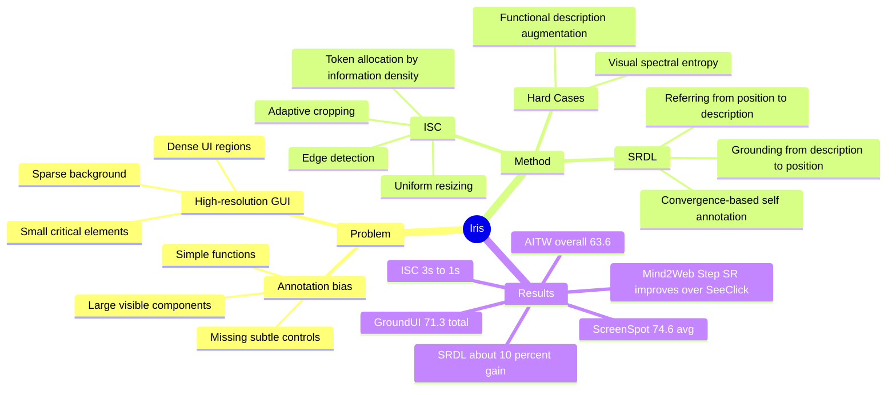

## Summary

Iris 针对 GUI agent 在高分辨率、信息密度不均的界面上容易丢失小而关键 UI element 的问题，提出 Information-Sensitive Cropping (ISC) 和 Self-Refining Dual Learning (SRDL)。ISC 用 edge detection 和 adaptive cropping 把视觉 token 分配到信息更密集的区域，SRDL 通过 referring 与 grounding 的自循环生成约 3M self-annotated GUI samples；在 ScreenSpot、GroundUI、Mind2Web 和 AITW 上都优于 SeeClick，并以 850K GUI annotations 接近或超过使用 10M GUI samples 的 UGround。

## Problem & Motivation

论文关心的是 GUI agent 的 foundational GUI understanding 和 grounding。作者认为 GUI 是跨平台 digital agent 的通用接口，但也带来两个核心困难：一是高分辨率截图中信息分布高度不均，dense toolbar / menu 与大面积空白并存，统一缩放或 uniform grid 会浪费 token 或丢失细节；二是 GUI 标注数据偏向大、显眼、功能简单的组件，训练后模型容易忽略小按钮、sidebar toggle 等交互关键但视觉不显眼的元素。

这个问题对 GUI-agent / computer-use 重要，因为视觉 grounding 错误会直接传递到点击坐标、multi-step web navigation 和 OS automation。论文的立场是：与其继续单纯扩大人工 GUI annotation，不如在 architecture 上让模型自适应分配视觉计算，在 training 上让 referring 与 grounding 互相生成困难样本。

## Method

Iris 的任务定义围绕两个互补能力：**referring** 是给定 UI element position `p` 生成描述 `D`，**grounding** 是给定描述 `D` 定位 position `p`。作者把 UI element 表示为 bounding box `(x1, y1, x2, y2)` 和包含视觉外观、文本、功能角色的 description。

1. **Information-Sensitive Cropping (ISC)**：先用 edge detection 生成二值 information indication matrix `M`，假设 GUI 元素通常有清晰边界；再用 multi-scale sliding window 根据 edge density 提取 information-rich regions，并把已处理区域置零避免重叠；最后把大小不一的 sub-images 统一 resize 到视觉 encoder 的固定输入尺寸。与固定 448x448 缩放或 AnyRes uniform grid 不同，ISC 的目标不是平均看全图，而是让每个 visual token 尽量承载有意义的 UI 信息。

2. **Self-Refining Dual Learning (SRDL)**：Iris 先枚举 GUI image 中的 UI elements，基于 basic description 做 grounding，再从 grounded position 做 referring，检查下一轮 grounding 是否和 position 收敛。若 `Sim(G(R(p)), p) > tau`，该样本被加入 self-annotated training set。论文强调这是不增加人工 annotation 的自我改进循环，初始训练仍沿用 SeeClick 的 850K GUI-specific data 和 150K LLaVA general vision-language instructions。

3. **Hard case mining**：Visual Hard Case Mining 使用 ISC 得到的信息矩阵，计算 Fourier spectrum 的 spectral entropy，挑选高视觉复杂度样本进入 SRDL；Functional Hard Case Mining 则基于模型历史表现找出困难功能描述，并用 GPT 生成相似描述变体，再送入 dual-learning loop。训练上，Iris 从 Qwen-VL 初始化，第一阶段替换为 ISC image processing pipeline，第二阶段混合约 3M SRDL self-annotated GUI samples 与原始训练数据继续训练；优化器为 AdamW，cosine scheduler，初始 learning rate 3e-5，global batch size 64。

## Key Results

- **ScreenSpot grounding (Table 1)**：Iris 用 850K GUI annotations 达到 **74.6% avg accuracy**，高于 SeeClick 的 **53.4%**，也高于 UGround 的 **73.3%**，后者使用 **10M** GUI annotations。分项上，Iris 在 Mobile Text / Icon 为 **85.3 / 64.2**，Desktop Text / Icon 为 **86.7 / 57.5**，Web Text / Icon 为 **82.6 / 71.2**。
- **GroundUI-1K (Table 2)**：Iris 的 Web / Desktop / Mobile / Total 分别为 **72.2 / 61.3 / 80.2 / 71.3**，高于 SeeClick 的 **64.3 / 44.3 / 73.7 / 61.1**；同表中 Gemini-1.5 Total 为 **35.2**，CogAgent 为 **25.5**。
- **Mind2Web downstream agent benchmark (Table 3)**：在 pure GUI-based 设置下，Iris 在 Cross-Task / Cross-Website / Cross-Domain 的 Step SR 分别为 **32.0 / 26.2 / 28.8**，高于 SeeClick 的 **25.5 / 16.4 / 20.8**；Element Accuracy 分别为 **33.5 / 31.2 / 32.8**，也高于 SeeClick 的 **28.3 / 21.4 / 23.2**。
- **AITW mobile OS tasks (Table 4)**：Iris Overall 为 **63.6**、ClickAcc 为 **71.0**，高于 SeeClick 的 **59.3** 和 **66.4**。细分 General / Install / GoogleApps / Single / WebShopping 为 **61.5 / 71.4 / 58.3 / 66.4 / 60.2**。
- **Ablation / efficiency**：论文报告 ISC 将处理时间从 **3s 降到 1s**，约 **300% efficiency improvement**；SRDL 带来约 **10% accuracy gain**。SRDL mining 消融中，without SRDL 为 **64.7%**，只去掉 visual mining 为 **71.4%**，只去掉 functional mining 为 **72.1%**，完整 SRDL 为 **74.6%**。

## Strengths & Weaknesses

**已知**：

- 方法对 GUI 的结构性假设比较贴近问题：GUI screenshot 的信息密度确实高度不均，直接 uniform resize 会让小 icon / widget 变成 token budget 的受害者；ISC 用 edge density 做 lightweight routing，比全图高分辨率输入更务实。
- 实验覆盖 grounding benchmark 和 downstream agent benchmark，至少说明 ScreenSpot / GroundUI 的 grounding improvement 能转化到 Mind2Web 和 AITW 的 step-level 指标。
- 与 SeeClick 的比较相对干净：同样 850K GUI-specific annotated data 和 150K LLaVA instructions，差异主要来自 ISC 和 SRDL；与 UGround 的比较则显示 Iris 用更少人工 GUI annotation 达到相近或更高 ScreenSpot average。
- 消融给出了两个关键信号：ISC 和 SRDL 是互补的；SRDL 中 visual hard case mining 与 functional hard case mining 都有贡献。

**推测**：

- ISC 的收益可能主要来自高分辨率 web/desktop 界面，小屏 mobile 的边际收益会小一些；这与 ScreenSpot 中 web/desktop 相比 SeeClick 的提升更明显一致，但论文没有把分辨率和复杂度作为独立变量系统剥离。
- SRDL 更像 targeted self-training，而不是完全开放式 self-improvement；如果初始 grounding/referring 已经偏错，收敛条件可能会把一致但错误的样本也加入训练。论文用 convergence threshold 控制质量，但没有充分展示 self-label noise 的影响。
- Functional Hard Case Mining 依赖 GPT 生成相似描述，可能提升语言 paraphrase robustness；但这些描述是否真的覆盖真实用户意图的长尾功能表达，还需要额外验证。

**不知道**：

- 论文没有报告 qualitative failure cases，也没有系统分析 Iris 仍会在哪些 UI pattern 上失败，例如极小 icon、低对比度控件、动态弹窗、跨窗口状态或需要语义推理的隐藏功能。
- 论文没有在正文中提供 code / project page / DOI；复现 ISC 和 SRDL 的训练细节仍依赖附录描述，无法判断所有 implementation choices 的敏感性。
- 不知道 3M self-annotated samples 的通过率、错误率、类别分布，以及相比简单扩大 self-training 数据量，dual-learning loop 本身贡献多少。
- Mind2Web 和 AITW 仍是 step-level 或 screen-wise 评估，不能直接证明 Iris 在完整 long-horizon task completion 上可靠；坐标 grounding 的局部提升可能仍会被规划、记忆和 recovery failure 抵消。

## Mind Map

## Notes

- 对 GUI-agent 研究的启发：Iris 把“看整屏”改成“按 GUI 信息密度分配视觉预算”，这比单纯扩大 screenshot resolution 更符合 GUI 的信号结构。后续可以把 ISC 视为 GUI grounding model 的视觉前端 baseline，与 RegionFocus 这类 test-time local refinement 对比：前者是 training/inference architecture，后者是 inference-time correction。
- SRDL 的 referring-grounding loop 值得借鉴，但需要更严格的错误分析。最关键的问题不是能否产生更多 self-label，而是 self-label 是否覆盖 human annotation 漏掉的 hard elements，且不会放大模型已有 bias。
- 与当前 notebook 中的 GUI grounding 方向连接：Iris 支持“small / dense / high-resolution UI 是 grounding bottleneck”的判断；如果要做 evidence-dependence 或 scale-invariant grounding，ScreenSpot 的 web/desktop 分项和 ISC ablation 是直接相关证据。
