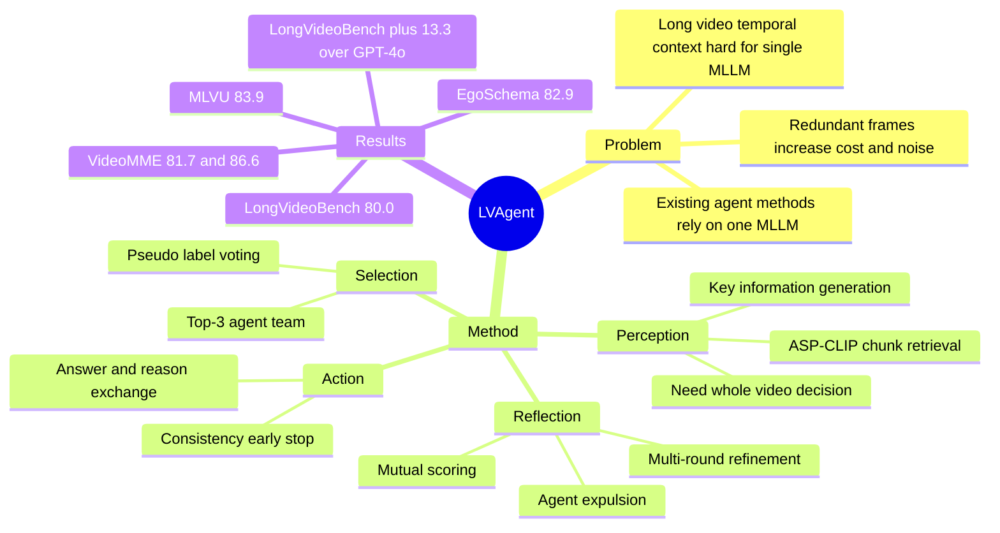

## Summary
LVAgent 解决 long video understanding 中单个 MLLM 难以同时覆盖关键时序片段和完成稳健推理的问题，提出 Selection、Perception、Action、Reflection 四步组成的 multi-round dynamical collaboration 框架。它把多个 MLLM agents 与 ASP-CLIP retrieval 结合，通过多轮讨论、互评和淘汰来逐步修正答案，在 EgoSchema、LongVideoBench、MLVU、VideoMME 四个 benchmark 上都超过 80% accuracy。

## Problem & Motivation
长视频包含大量冗余帧和长程时序依赖，直接把大量 frames 输入单个 MLLM 会带来计算开销，并可能被无关信息干扰。现有 long video MLLMs 主要通过 context extension 或 video token compression 处理长输入，但前者没有消除冗余，后者可能损失 fine-grained details。现有 agent-based long video 方法通常让单个 MLLM 借助 CLIP retrieval、memory bank、RAG 或 CoT 工具答题，论文认为这种单 agent 设置只能形成局部理解，缺少多个 MLLM 之间的动态讨论、互补和纠错。核心问题可以拆成两点：如何按 query 找到关键 video clips，以及如何让 multi-agent collaboration 真正提升长视频理解而不是引入更多噪声。

## Method
LVAgent 的流程由四个阶段组成。

1. **Selection**：先构建 Agent Library，包含 Qwen2-VL-7B/72B、LLaVA-Video-72B、LongVU-7B、InternVL-2.5-7B/78B、Oryx、Aria 等 MLLMs。对目标任务随机采样 150 个无标签视频样本，用 agents 的答案投票生成 pseudo label，再按各 agent 相对 pseudo label 的 accuracy 选择 top-3 agents 组成团队。这个设计的目标是让后续讨论只保留更适合当前任务/domain 的模型，减少弱 agent 干扰和计算开销。

2. **Perception**：先给 agent 4 个随机采样 frames，让 agent 判断是否需要看完整视频；如果需要，就用 16 frames global sampling。否则进入 key info integration：第一轮由 agent 基于粗略视觉信息、question、subtitle、options 生成 key information；后续轮次则把上一轮的 answer、reason、score、是否淘汰等 history information 纳入 key information 生成。随后把视频均分为 6 个 chunks，每个 chunk 随机采 16 frames，用在 LongVR 上 finetune 的 ASP-CLIP 计算 `ASP(frames, key information) + ASP(frames, question)`；选择 similarity score > 0.8 的 chunks，如果没有 chunk 超阈值，则选最高分 chunk。LongVR 由 ActivityNet、OpenVid-1M、ViTT、MovieChat-Caption、Youcook2 中的长视频片段构成，最终约 82K samples，平均视频长度 145.6 秒，caption 平均 71 tokens。

3. **Action**：每个保留 agent 基于 sampled frames、question、subtitle、options 生成 answer 和 reason。若超过半数 agent 给出同一答案，就 early stop，把该答案作为 final answer；否则进入 Reflection。

4. **Reflection**：每个 agent 对自己和其他 agents 的 reasoning 进行打分，最低分 agent 会在该问题的后续讨论中被排除。剩余 agents 汇总上一轮 answers、reasons、scores 与 history information，再生成新的 key information 进入下一轮 Perception。论文默认最多进行 3 轮 discussion，用动态淘汰和历史信息迭代更新来逼近共识。

## Key Results
- **主结果**：LVAgent 在 EgoSchema、LongVideoBench、MLVU、VideoMME 上分别达到 **82.9%**、**80.0%**、**83.9%**、**81.7% / 86.6%**（VideoMME 为 w/o subs / w/ subs）。论文报告它是第一个在这四个 long video understanding benchmark 上均超过 80% accuracy 的 agent-based 方法。
- **相对 SOTA 提升**：在 LongVideoBench 上，LVAgent 的 **80.0%** 相比 GPT-4o 的 **66.7%** 提升 **13.3%**；在 MLVU 上，LVAgent 的 **83.9%** 相比 GPT-4o 的 **64.6%** 高 **19.3%**，相比 InternVL-2.5-78B 的 **75.7%** 高 **8.2%**。
- **VideoMME 分段结果**：LVAgent 在 VideoMME Short / Medium / Long 上分别为 **88.9% / 90.7%**、**82.0% / 87.6%**、**74.3% / 81.7%**，整体 **81.7% / 86.6%**；表中 GPT-4o 整体为 **71.9% / 77.2%**，Gemini 1.5Pro 为 **75.0% / 81.3%**。
- **效率**：在 VideoMME 上，LVAgent 平均处理 **71.2 frames**、推理时间 **33.6s**，同时 LongVideoBench / VideoMME 达到 **80.0%** / **81.7% / 86.6%**；对比 GPT-4o 为 **384 frames**、**153.6s**、**66.7%** / **71.9% / 77.2%**，Gemini 1.5Pro 为 **568 frames**、**227.2s**、**64.0%** / **75.0% / 81.3%**。
- **关键模块 ablation**：不使用 Perception 和 Reflection 时，EgoSchema / LVBench / MLVU / VideoMME 为 **77.9% / 63.9% / 75.7% / 72.1% / 77.8%**；只加 Perception 为 **80.2% / 69.0% / 79.2% / 75.3% / 81.4%**；只加 Reflection 为 **80.4% / 72.2% / 79.3% / 77.6% / 83.5%**；两者都加达到 **82.9% / 80.0% / 83.9% / 81.7% / 86.6%**。
- **agent 组合 ablation**：单独使用 LLaVA-Video-72B、InternVL-2.5-8B、InternVL-2.5-78B 时，LVBench 分别为 **68.3%**、**67.8%**、**69.0%**；三者协作达到 **80.0%** on LVBench 和 **83.9%** on MLVU。
- **讨论机制 ablation**：Dynamic Collaboration 在 EgoSchema / LVBench / MLVU / VideoMME 上为 **82.9% / 80.0% / 83.9% / 81.7% / 86.6%**，优于 Best Score 的 **81.3% / 76.9% / 80.2% / 78.8% / 82.1%** 和 Decide by Agent 的 **81.2% / 77.0% / 79.9% / 79.1% / 82.2%**。
- **retrieval ablation**：ASP-CLIP retrieval 在 EgoSchema / LVBench / MLVU / VideoMME 上为 **82.9% / 80.0% / 83.9% / 81.7% / 86.6%**，高于 CLIP 的 **80.9% / 74.7% / 81.3% / 78.7% / 84.0%** 和 LongCLIP 的 **81.2% / 75.6% / 82.2% / 79.6% / 85.4%**。

## Strengths & Weaknesses
**已知**

- LVAgent 的贡献不是单个新 backbone，而是把 task-level agent selection、query-conditioned video retrieval、multi-agent answer exchange、reflection-based agent expulsion 组合成一个面向 long video QA 的动态协作流程。
- 实验覆盖了 closed-source models、open-source MLLMs 和 agent-based systems，包括 GPT-4o、Gemini 1.5Pro、Qwen2-VL、InternVL-2.5、VideoAgent、VideoTree、VCA、DrVideo、VideoRAG 等 baseline；主表和 ablation 都显示 Perception 与 Reflection 对结果有可观贡献。
- 论文给出了效率证据：LVAgent 在 VideoMME 上使用更少 frames 和更短推理时间，同时超过 GPT-4o、Gemini 1.5Pro、Qwen2-VL 等直接长视频输入方案。
- Reflection 的价值有数值支撑：max rounds 从 1 到 3 时，LongVideoBench 从 **69.0%** 增加到 **80.0%**；不同 discussion methods 的 ablation 也显示动态淘汰比静态选最高分或由单 agent 决策更好。

**推测**

- 这个框架可能更适合 choice-based video QA，因为 Selection、Action 和 consistency check 都围绕 options 和答案投票设计；若换成 open-ended captioning、dense temporal grounding 或需要生成结构化 timeline 的任务，协作收益未必按同样方式成立。
- pseudo label voting 可能在没有真实标签时提供廉价 model selection 信号，但如果 agent library 内部错误高度相关，pseudo label 可能会强化多数模型的共同偏差。
- ASP-CLIP + key information retrieval 的优势可能主要来自把长视频检索压缩成 6-way chunk selection，这对 benchmark QA 很有效，但面对需要跨多个远距离片段组合证据的问题，单 chunk 或少量 chunk retrieval 可能不够。

**不知道**

- 论文正文没有系统报告 LVAgent 自身的 failure cases、错误类型分布，或哪些问题会被 reflection 越讨论越错。
- 论文没有给出不同 agent library 规模、不同 closed/open backbone 混合策略下的成本-收益曲线；只看 top-3 team 和若干组合，仍难判断 selection 的可扩展性。
- LongVR 的完整数据配方和 prompt 细节被放到 supplementary，正文不足以判断 caption optimization、人工筛选和 retrieval finetuning 是否引入 benchmark-domain bias。
- 论文报告实验基于 8 张 A800-80G GPUs，但没有给出 end-to-end dollar cost 或不同部署预算下的性能退化。

## Mind Map

## Notes
这篇论文对我的启发是：long video understanding 里，multi-agent 的价值不一定来自更复杂的 reasoning prompt，而是来自把“谁适合当前任务”“看哪些片段”“哪个 reasoning 不可靠”三个选择问题显式化。值得进一步追问的是，Reflection 打分是否真的在评估 visual evidence-grounded reasoning，还是在做 language-level plausibility ranking；如果后者成立，下一步可以考虑把 retrieved evidence 的可验证性纳入 mutual score，例如要求 agent 引用具体 temporal chunk 或 subtitle span。另一个可探索方向是把 LVAgent 的 dynamic collaboration 用在 GUI / web agent trajectory review：多个 VLM agents 对长屏幕录制或操作轨迹做 query-conditioned retrieval，再通过 reflection 淘汰不可靠解释。
