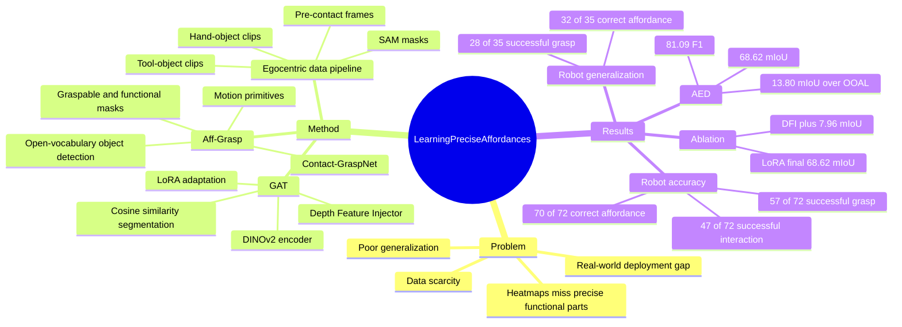

## Summary
这篇论文针对机器人操作中的 affordance learning，提出一个从 egocentric videos 自动收集精确 affordance mask、训练 Geometry-guided Affordance Transformer (GAT)、再部署到真实机器人 Aff-Grasp 的完整系统。核心区别是同时标注 graspable affordance 和 functional affordance，并用 SAM 生成 segmentation mask，而不是只学习粗糙的 grasp heatmap。实验上，GAT 在 AED 上达到 68.62 mIoU，比 OOAL 高 13.80 个点；Aff-Grasp 在真实机器人 179 次试验中报告 77.1% successful grasping。

## Problem & Motivation
Affordance 的关键不只是知道物体能做什么，还要定位“哪个部件支撑哪个动作”：例如 knife 可以握 handle 来 cutting，也可以握 blade 来 handover。已有 affordance 研究面临三个相互耦合的问题：大规模精细标注数据稀缺、跨 domain / 新物体 / 新 affordance 泛化差、真实机器人部署少。

作者指出，从 egocentric human-object interaction videos 中学习 affordance 是低成本路线，但现有方法通常只抽取 graspable region，并以 Gaussian heatmap 表示，缺少 functional part 的精确 mask。这会限制工具使用、tool-object interaction 和 robot-to-human handover，因为这些任务需要区分“应该抓哪里”和“哪个部分产生功能”。

## Method
论文的系统分为三段：自动数据收集、GAT affordance segmentation、Aff-Grasp robot deployment。

**Data collection from egocentric videos**：对 hand-object interaction clips，作者利用 Epic-Kitchens / Ego4D 这类 egocentric video 的 timestamped narrations 找到 “take” / “hold” 等动作片段，再用 hand-object detector 得到 contact states 和 hand-object boxes。接着用 EfficientSAM 从 hand box 得到 hand mask，在 contact frame 中从 hand mask 与 object box 的交集采样 contact points。由于 contact frame 中手会遮挡物体，作者寻找 contact 前最后一个没有 hand-object contact 的 pre-contact frame，并通过 homography 把 graspable point 投影过去。

**Functional point localization**：functional affordance 来自 tool-object interaction clips。作者先从已有 affordance datasets 中取 object-affordance relationship，例如 knife 对应 cut，再在 video narration 中找到后续的 tool-object interaction。工具由 hand-object detector + EfficientSAM 分割，目标物体由 GroundedSAM 分割；系统通过 tool/object bbox 的 IoU 找 pre-contact frame，并在 tool mask 中选择到 target object mask 距离最近的点作为 functional point。若某些 object category 没有相关 action clips，论文使用离 grasp points 最远的采样点作为 functional point，依据是许多工具的 graspable part 与 functional part 位于相对两端。

**Mask generation**：functional point 会通过 foundation-model point correspondence 映射回 hand-object interaction 的 pre-contact frame。生成 graspable mask 时，graspable points 作为 positive prompts，functional points 作为 negative prompts；生成 functional mask 时正负标签反转。最后用 SAM 产生 precise affordance segmentation masks，并裁剪 object images 存储为训练样本。

**Geometry-guided Affordance Transformer (GAT)**：GAT 用 DINOv2 作为 image encoder，以提高跨 domain 泛化；用 Depth-Anything 生成 pseudo depth maps，再通过 Depth Feature Injector (DFI) 以 cross-attention 把 geometric priors 注入 RGB features。DFI 中 image features 作 query，depth features 作 key/value，并用初始化为 0 的 learnable vector 控制注入强度。模型还用 LoRA fine-tune DINOv2 表示，避免全量更新 foundation model 造成过拟合。

**Segmentation head and loss**：GAT 不使用复杂 decoder，而是用 MLP embedder 将 features upsample 4 倍，再与 learnable affordance embeddings 或 CLIP text embeddings 计算 cosine similarity。background 不作为显式可学习类别，而是当所有 affordance prediction 低于阈值时隐式判为 background；训练目标是 focal loss 与 dice loss 的组合，用来应对 collected data 的类别不均衡。

**Aff-Grasp deployment**：给定任务如 “cut cake”，系统先用 open-vocabulary detector 找到 target 和其他 visible objects；再把非 target objects 裁剪送入 GAT，选择对任务 affordance 最确定的物体。之后 Contact-GraspNet 在 graspable affordance mask 内生成 6-DoF grasp proposals，选择最高分 grasp 执行；抓起物体后，系统运行 affordance-specific sequential motion primitives，用 functional part 去作用于 target。handover 任务中则反过来在 functional affordance area 中生成抓取，让 graspable part 面向人类。

## Key Results
**AED vision benchmark**：作者手工标注了 Affordance Evaluation Dataset (AED)，包含 721 张来自已有 affordance datasets 和 internet resources 的图像、13 个 object categories、8 个 affordance classes。GAT 在 AED 上达到 **68.62 mIoU / 81.09 F1 / 83.51 Acc**，高于 OOAL 的 **54.82 / 70.58 / 68.00**、ViT-Adapter 的 **50.86 / 66.88 / 65.21**、DINOv2 baseline 的 **46.16 / 62.49 / 63.61**；相对最强 baseline OOAL，mIoU 提升 **13.80** 个点。

**ImageNet vs foundation model baselines on AED**：ImageNet-pretrained segmentation models 明显较弱：DeepLabV3+ 为 **13.46 mIoU / 22.27 F1 / 23.05 Acc**，PSPNet 为 **16.90 / 27.32 / 26.46**，SegFormer 为 **23.72 / 36.86 / 37.19**。这支持作者关于 cross-domain gap 的判断：训练数据来自 egocentric videos，而 evaluation images 来自不同来源，foundation model features 更抗 domain shift。

**Real-world robot accuracy evaluation**：在 Table 2 的 accuracy evaluation 中，Aff-Grasp 达到 **70/72 correct affordance (97.2%)**、**57/72 successful grasp (80.6%)**、**47/72 successful interaction (65.3%)**。对比 Robo-ABC 为 **62/72 correct affordance (86.1%)**、**44/72 successful grasp (61.1%)**；LOCATE 为 **42/72 (58.3%)** 和 **33/72 (45.8%)**。论文标注 LOCATE 与 Robo-ABC 对 successful interaction 不适用，因为前者 prediction 常 overlap，后者不能 infer functional areas。

**Real-world generalization evaluation**：在 unseen objects 的 generalization evaluation 中，Aff-Grasp 达到 **32/35 correct affordance (91.4%)** 和 **28/35 successful grasp (80.0%)**，高于 Robo-ABC 的 **24/35 (68.6%)**、**21/35 (60.0%)**，也高于 LOCATE 的 **20/35 (57.1%)**、**15/35 (42.9%)**。affordance prediction component 的 inference time 为 **0.0063s**，接近 LOCATE 的 **0.0047s**，远快于 Robo-ABC 的 **12.92s**。

**Robustness / cluttered scenes**：正文报告 Aff-Grasp 在包含 seen 和 unseen distractors 的 cluttered scenes 中能正确选择带有目标 affordance 的物体，affordance prediction success rate 为 **95%**。Abstract 进一步汇总称 framework 在 seen、unseen classes 和 cluttered scenes 的 **179** 次真实机器人 trials 中达到 **77.1% successful grasping**。

**Ablation on AED**：从 frozen DeiT III + linear layer + BCE baseline 的 **31.02 mIoU / 44.55 F1 / 35.85 Acc** 出发，换成 DINOv2 后提升到 **45.45 / 61.78 / 70.86**。在 cosine similarity w/o background classifier 的 **56.70 / 72.00 / 71.22** 基础上，加入 DFI 提升到 **64.66 / 78.35 / 79.74**，即 **+7.96 mIoU / +6.35 F1**；再加入 LoRA 后达到最终 **68.62 / 81.09 / 83.51**。DFI 也可以只在 training 使用并在 inference 移除，此时结果为 **60.15 / 74.92 / 79.87**；Table 5 显示移除 inference-time DFI 后参数从 **96.9M** 降到 **91.7M**，GFLOPs 从 **204.9** 降到 **185.5**，time 从 **10.1ms** 降到 **6.3ms**。

## Strengths & Weaknesses
**已知的 strengths**：论文把 data collection、segmentation model 和 robot deployment 连成闭环，而不是只报告 affordance segmentation 数字。最有价值的点是把 egocentric videos 中的 hand-object interaction 和 tool-object interaction 组合起来，生成 graspable / functional 两类 precise masks，使工具使用和 handover 可以共用同一 affordance 表示。

**已知的 strengths**：实验设置有较强 cross-domain / zero-shot 意味。训练数据来自自动收集的 egocentric videos，AED 来自已有 datasets 和 internet resources；真实机器人评估又包含 seen objects、unseen objects 和 cluttered scenes。Table 4 的 ablation 也比较有信息量：DINOv2、implicit background、DFI、LoRA 都有量化贡献，不只是主结果堆模型。

**已知的 limitations**：自动标注 pipeline 并非无假设。它依赖 timestamped narrations、hand-object detector、EfficientSAM、GroundedSAM、homography / point correspondence、object-affordance relationship，以及 functional parts 常与 graspable parts 分布在相对两端的启发式；这些假设在严重遮挡、非典型工具形状、动作 narrations 缺失或错误时可能 break。

**已知的 limitations**：Aff-Grasp 的机器人能力仍是模块化组合，而不是端到端 VLA / policy learning。它依赖 open-vocabulary detector、GAT、Contact-GraspNet 和预定义 affordance-specific sequential motion primitives；因此论文证明的是 affordance representation 对 task-oriented grasping/tool use 有用，不等于已经解决开放世界 long-horizon manipulation。

**已知的 limitations**：robot comparison 的边界需要看清。作者明确说本文重点是 visual affordance learning，而不是直接比较完整 manipulation policy；LOCATE 和 Robo-ABC 不能评估 successful interaction，因此 Table 2 的 functional interaction 部分没有真正同类 baseline。真实交互成功率 **47/72 (65.3%)** 也说明即使 affordance prediction 达到 **97.2%**，后续 grasp 和 interaction execution 仍会显著掉点。

**推测**：对 GUI-agent / computer-use 的启发主要在“从人类交互轨迹中自动生成 actionability / affordance supervision”这一数据策略，而不是机器人 motion primitive 本身。若迁移到 GUI，需要把 contact point、functional part 和 graspable part 重新定义为 UI element、clickable region、input target 或 state-changing control，不能把机器人 mIoU 或 grasp success 外推到 GUI benchmark。

**不知道**：论文正文没有给出 DOI，也没有给出 GitHub code link；只提供 project page。正文提到 robustness evaluation 的更多结果和 visual examples 在 supplementary，但主文没有列出完整 cluttered-scene trial breakdown 或 variance，因此这里不补写未报告的表格细节。

## Mind Map

## Notes
这篇的核心 insight 是：affordance learning 的瓶颈不只是模型，而是 supervision 的粒度。把 egocentric interaction 中的 contact evidence 转换成 precise segmentation masks 后，affordance 可以从“哪里可能抓”升级为“哪个 part 支撑哪个 function”，这对 embodied manipulation 比 object-level recognition 更接近 action。

后续值得追问两个问题。第一，functional affordance 的自动标注是否会在非工具类物体、多功能物体或需要力/材质判断的任务上失效；第二，GAT 的 depth prior 到底学到了可迁移 geometry，还是主要在 AED 这类 2D part segmentation 上改善边界与细长结构。对 GUI-agent 来说，可借鉴的是 interaction-derived dense supervision，但需要非常小心地区分“视觉上可点击”和“在当前任务状态下可行动”。
