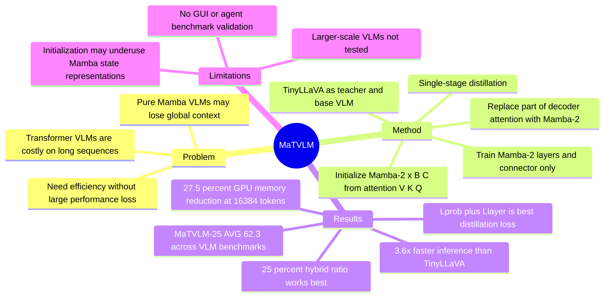

## Summary
MaTVLM 用 Mamba-2 替换预训练 TinyLLaVA 中一部分 transformer decoder 的 attention，并通过 attention-to-Mamba 初始化与单阶段 distillation 训练高效 VLM。论文的核心结果是：在多项 VLM benchmark 上接近 teacher TinyLLaVA，同时最高达到 3.6× inference speedup 和 27.5% GPU memory reduction。

## Problem & Motivation
VLM 的输入序列通常比纯 LLM 更长，transformer attention 的 quadratic complexity 会直接放大训练和推理成本。Mamba / Mamba-2 这类 RNN-style structured state space model 有 linear scaling，但作者指出纯 Mamba-based VLM 会受 sequential processing、vanishing gradients 和 global context 建模不足影响，在复杂理解和推理任务上容易掉性能。

这篇论文的问题 formulation 是：能否在不从头训练一个 Mamba VLM、也不完全放弃 transformer 的情况下，把已有 transformer-based VLM 转成更高效的 hybrid Mamba-Transformer VLM。动机比较实际：如果只追求速度而牺牲 VLM benchmark performance，部署价值有限；如果仍用完整 transformer，则长序列推理和显存压力不解决。

## Method
MaTVLM 以 TinyLLaVA-Phi-2-SigLIP-3.1B 作为 teacher / base VLM。base model 包含 SigLIP vision encoder、connector 和 Phi-2 language model；MaTVLM 只在 language model 中按比例替换 transformer decoder layers 的 attention 部分为 Mamba-2，MLP、Norm 等其他组件保持不变。论文实验了 12.5%、25%、50% 三种 Mamba-2 hybridization ratio，并把替换层按 equal intervals 分布。

关键设计一是 **attention-to-Mamba initialization**。作者从去掉 softmax 的 attention 推导出 linear RNN 形式，并建立 `WV -> x`、`WK -> B`、`WQ -> C` 的对应关系；因此 Mamba-2 中 `x`、`B`、`C` 的 linear weights 用原 transformer attention 的 `V`、`K`、`Q` weights 初始化，其余如 `Delta` 和 `A` 随机初始化。这个设计的目标是利用预训练 transformer 权重加快 Mamba-2 layers 的收敛。

关键设计二是 **single-stage knowledge distillation**。训练时 teacher 是原 TinyLLaVA，student 是 MaTVLM；只有 Mamba-2 layers 和 connector trainable，transformer layers frozen。loss 包括 probability distribution distillation `Lprob`、layer-wise distillation `Llayer` 和 sequence prediction loss `Lce`，但主实验设置为 `alpha=1.0, beta=1.0, gamma=0`，也就是实际使用 `Lprob + Llayer`，不使用 `Lce`。训练使用 ShareGPT4V SFT dataset、batch size 64、AdamW、learning rate `2e-4`，论文结论中说明训练只用 4 张 NVIDIA GeForce RTX 3090。

## Key Results
- **Main VLM benchmarks**：MaTVLM Hybrid-Mamba-25% 在 MME-P / MMB / TextVQA / GQA / MM-Vet / SQA-I / POPE / MMMU / VQAv2 上分别为 1484.1 / 61.2 / 57.7 / 61.5 / 35.4 / 68.0 / 86.0 / 37.3 / 79.0，AVG 62.3。Teacher TinyLLaVA 对应为 1466.4 / 66.1 / 60.3 / 62.1 / 37.5 / 73.0 / 87.2 / 38.4 / 80.1；MaTVLM 在 MME-P 上高 17.7，但 MMB、TextVQA、SQA-I 等仍低于 teacher。
- **Compared with similar-scale VLMs**：论文称相近参数规模模型中，MaTVLM 相比这些 baseline 在几乎所有 benchmark 上更强，显著差距包括 MME-P 最高提升 87.7、TextVQA 最高提升 7.0。表 1 中 MaTVLM-25% 的 MME-P 1484.1 高于 LLaVA-Phi 1335.1、MoE-LLaVA-2.7Bx4 1396.4、MobileVLM 3B 1288.9、LLaVADI 1376.1。
- **Compared with Mamba-based VLMs**：MaTVLM-25% 在 VL-Mamba 的 MME-P 1369.6、MMB 57.0、TextVQA 48.9、GQA 56.2、MM-Vet 32.6、SQA-I 65.4、VQAv2 76.6 上整体更强；但 POPE 86.0 低于 Cobra 88.2 和 ML-Mamba 88.3，TextVQA 57.7 也比 Cobra 57.9 低 0.2。
- **Efficiency**：在 NVIDIA GeForce RTX 3090 上，MaTVLM 相比使用 FlashAttention2 的 TinyLLaVA 最高实现 3.6× faster inference；token length 为 16,384 时 GPU memory peak reduction 为 27.5%。在 token length 为 32,768 时，TinyLLaVA 出现 out-of-memory，而 MaTVLM 仍可运行。
- **Hybrid ratio ablation**：25% Mamba-2 ratio 的 AVG 为 62.3，优于 12.5% 的 61.8 和 50% 的 60.1；作者解释 50% ratio 可能削弱 global dependency modeling。
- **Layer position ablation**：evenly distributed 的 AVG 为 62.3，高于 all at the beginning 的 60.4 和 all in the middle 的 58.9；all at the end configuration 无法有效 distill，并产生 incoherent responses。
- **Distillation loss ablation**：单用 `Lce` 的 AVG 为 55.6，单用 `Llayer` 为 60.7，单用 `Lprob` 为 61.4；`Lprob + Llayer` 达到最高 62.3，而加入 `Lce` 后变为 61.3，说明 direct sequence supervision 在该设置下可能干扰 distillation。

## Strengths & Weaknesses
**已知。** 这篇论文的强项是问题切得很工程化：不重新训练一个纯 Mamba VLM，而是从已有 transformer VLM 出发，只替换部分 attention，并通过权重映射和 distillation 降低训练成本。ablation 也比较有信息量：25% ratio、even distribution、`Lprob + Llayer` 都有明确对照，且 failure case 包括 all-at-the-end replacement 导致 incoherent responses。

**已知。** 方法对 resource-constrained VLM deployment 有直接价值。它不是只报 accuracy，而是同时报告 throughput 和 GPU memory；32,768 token length 下 teacher OOM 而 MaTVLM 可运行，这比单纯 average score 更说明 hybrid architecture 的实用收益。

**局限。** 作者自己承认 attention-weight initialization 可能没有充分利用 Mamba-2 的 implicit state representations，未来可能需要 gradient matching 或额外 pretraining。另一个限制是实验受 GPU 资源限制，没有探索更大规模 VLM 上的 performance 和 optimal Mamba-2 integration ratio，因此 scaling behavior 仍不知道。

**推测。** 对 GUI agent / computer-use agent 的意义主要在底层 VLM efficiency，而不是直接提升 GUI grounding 或 agent planning。它可能适合作为长上下文 screenshot/history 处理的 backbone idea，但论文没有在 GUI benchmark、web/mobile agent benchmark 或 embodied task 上验证，所以不能把结果外推到 agent success rate。

**不知道。** 论文没有给出 detailed wall-clock training time、不同 image resolution 下的稳定性、真实部署 latency 分解、或更大 commercial VLM 的迁移实验。code 和 model 已声明 release，但这条笔记只根据论文内容记录，不把未在文中实验的 claim 当结论。

## Mind Map

## Notes
- **我的判断**：rating=4。它和 GUI agent 不是一阶相关，但对 VLM efficiency、long-context multimodal inference、resource-limited deployment 很相关；如果后续做 GUI agent 的 history compression / long screenshot-context backbone，可以作为 architecture reference。
- **最值得复用的 insight**：不是“Mamba 替换 transformer”这个口号，而是部分替换 + pre-trained attention weight mapping + distillation 的组合。25% ratio 优于 50% ratio 也提醒：efficient sequence model 不能简单堆得越多越好，global context capability 仍是关键约束。
- **后续疑问**：MaTVLM 在 OCR-heavy、screen understanding、multi-image history、long video 或 GUI trajectory context 上是否仍保持优势？如果输入是 GUI screenshot token 和 action history，而非普通 VQA benchmark，Mamba-2 ratio 和 layer placement 可能需要重新 ablate。
