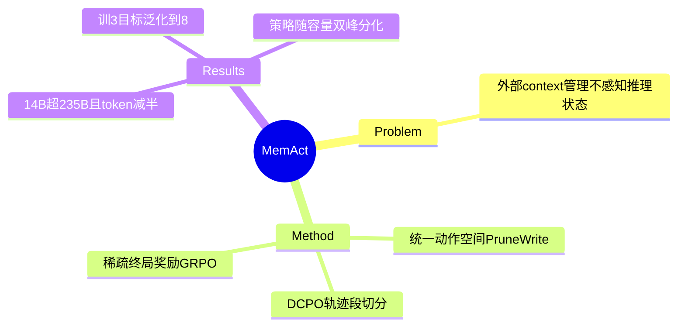

## Summary

把 working memory 管理做成**可学习的策略动作**（Context-as-action 路线的代表作）：统一动作空间 A_task ∪ A_mem，memory 动作为 Prune&Write 算子（按 turn 级 ID 删历史记录 + 写入摘要，摘要自身可被后续再删）；配套 DCPO 解决"上下文删除破坏因果 LM 单调增长假设"的训练难题（按 memory 动作点把轨迹切段、段内前缀固定、段继承轨迹级 advantage）。MemAct-RL-14B 多目标平均 59.1% 超过 16× 大的 Qwen3-235B（53.1%），token 成本 −51%。

> 本笔记以 **v3（2026-05-07）** 为准；v1（2025-10）的单目标数字与"≤3 目标训练"设定不同，引用时注意版本。

## Problem & Motivation

长程 agent 的 context 管理现有方案（滑窗、摘要、外挂 memory）都是**外部机制**，不感知 agent 的推理状态，删或留的决策与任务优化脱节。本文的 formulation 转变：把"保留什么信息"本身并入 policy，让 RL 端到端联合优化信息保留与任务性能。

## Method

- **统一动作空间**：state = 当前 working memory（交互记录序列，各带唯一 ID）；memory 动作 a=(ℐ_target, c) 删指定 turn + 写入摘要/要点/反思，in-place 且可寻址（未来可再删）。
- **DCPO**：删除使被删内容仍"物理残留"于后续 token 的内部表示（每个 token 的潜表示编码其全部前序），造成 train-inference mismatch，简单 attention masking 不够——必须物理重构轨迹。做法：按 K 个 memory 动作点切成 K+1 独立段，段内 context 前缀固定恢复标准因果训练；稀疏终局奖励（+1.0 成功 / −0.1 违反 20K token 或 40 步约束），全局归一 advantage 由各段继承，GRPO clip 目标。
- **训练**：SFT 冷启动 930 例（DeepSeek-V3.1 合成：8-16K 提示、>16K 强制 memory 动作，注入提示从数据中移除）→ 3,000 段；RL 10,240 轨迹（HotpotQA + Asearcher），**刻意只训 ≤3 目标**测泛化。Backbone Qwen2.5-7B/14B。

## Key Results

- **多目标**（Table 1）：MemAct-RL-14B 平均 0.591（2/4/6/8-obj: 0.660/0.591/0.570/0.543）> Qwen3-235B 0.531；token 8.2 vs 16.7×10⁴（−51%）；每步平均输入 context 仅 ~3,500 tokens。
- **单目标五 benchmark**（2Wiki/HotpotQA/Bamboogle/Frames/BrowseComp）：与 Search-R1 基本持平（avg 0.537 vs 0.535），但 7B 版总时长 −40%（SGLang 2,000 轨迹实测）。
- **泛化**：只训 ≤3 目标 → 8 目标仍 54.3%（Search-R1 39.3%）；235B/Tongyi-DeepResearch 在 >4 目标后饱和。
- **策略随容量分化**（Fig 5）：7B 高频粗粒度（~6 条/次）；14B 双峰（~2 条细粒度=推理中除噪 + ~6 条粗粒度=子目标完成后清场）。
- **消融**：RL 不可或缺（SFT 0.553 → RL 0.591）；固定间隔（每 5 turn）0.582，静态调度在高复杂度下删关键信息。

## Evidence Ledger

| Claim ID | Claim | Type | Source locator | Evidence excerpt | Status |
|:--|:--|:--|:--|:--|:--|
| C1 | 统一动作空间 + Prune&Write（turn 级 ID 删 + 写，可寻址可再删） | benchmark-setting | v3 §Method | "amem=(ℐtarget,c)" | source-verified |
| C2 | DCPO：删除致 train-inference mismatch → 轨迹切 K+1 段、段内前缀固定、段继承轨迹 advantage | causal-mechanism | v3 §DCPO | "re-organized into K+1 independent segments" | source-verified |
| C3 | 14B 多目标 0.591 > Qwen3-235B 0.531；token 8.2 vs 16.7×10⁴；每步 ~3,500 tokens | comparison | v3 Table 1 | "0.591 / 8.2 vs 0.531 / 16.7" | source-verified |
| C4 | 单目标与 Search-R1 持平（0.537 vs 0.535）；7B 时长 −40%（SGLang 2,000 轨迹） | number | v3 Table 1 + §efficiency | "reduces total duration by 40%" | source-verified（v3 已用 BrowseComp 替换 v1 的 Musique） |
| C5 | 训 ≤3 目标 → 8 目标 54.3% vs Search-R1 39.3%；大模型 >4 目标饱和 | number | v3 §4.6 | "54.3% … surpassing the 39.3%" | source-verified |
| C6 | 7B 粗粒度高频 vs 14B 双峰（~2/~6 条） | number | v3 §4.6 Fig 5 | "bimodal pattern with peaks at fine-grained (∼2) and coarse-grained (∼6)" | source-verified |
| C7 | SFT 0.553→RL 0.591；固定间隔 0.582 | number | v3 Table 1 | "static schedules often delete critical information" | source-verified |
| C8 | SFT 930 例→3,000 段（提示注入后移除）；RL 10,240 轨迹；奖励 +1.0/−0.1（20K token/40 步约束） | benchmark-setting | v3 §Setup | "930 accurate examples … 3,000 training segments" | source-verified |
| C9 | 自认局限：稀疏奖励难归因具体 memory 动作；摘要不可恢复；failure 含 memory 幻觉 | benchmark-setting | v3 §Limitations | "difficult to accurately assign credit to specific memory actions" | source-verified |

## Strengths & Weaknesses

**Strengths**：
- Context-as-action 路线最完整的实例：formulation（统一动作空间）、训练可行性（DCPO 段切分是真贡献——直面"删上下文违反因果 LM 假设"而非回避）、行为分析（策略随容量分化的双峰证据）三层齐全。
- "刻意只训 ≤3 目标"的泛化设计干净；对照覆盖静态调度与 SFT-only，学习价值的归因链完整。

**Weaknesses / 边界**：
- 任务全是文本检索 QA（HotpotQA/BrowseComp 类），无 GUI/视觉 observation；对 CUA 的 context 管理（[[Topics/CUA-Survey]] §6.9.1 Context-as-action 行）是邻接可迁移证据。
- 与 [[Papers/2606-SkillMemoryBudget]] 的关系需谨慎：那篇打击的是 **online 外挂模块**（检索/注入式），MemAct 是**内化进 policy** 的路线且 RL 训练属 offline 摊销——不在其打击范围，但 MemAct 未报 budget-matched vanilla（多步基线）对照的多 run 方差，其 vs Search-R1 的持平结论若按该标准审视余量不大。
- 作者自认稀疏奖励难归因到具体 memory 动作——正是 FoldAct（2512.22733，queue 中）声称的攻击面（摘要动作制造非平稳观察分布）；两篇对读后再定此路线的成色。
- v1→v3 数字变动较大，跨版本引用有污染风险。

**对领域**：把 context 管理从 heuristic 变成 learnable 的最强正面证据；与 [[Papers/2605-MaskingRegimeMap]]（heuristic masking 的 regime 依赖）呼应——learned 策略正是后者留空的"能否自适应定位 regime"的候选答案。

## Mind Map

## Notes

- 入队来源：[[Reports/2026-07-27-WebAgent-RL-and-Context-Landscape]] 交叉轴主线 top-10 之一（"若只读十篇"排第 1）。
- context-folding 家族链：本篇（memory 编辑动作）→ Context-Folding 2510.11967（分支-折叠）→ FoldAct 2512.22733（理论反驳：摘要动作制造非平稳观察分布）——后两篇在 queue，读完后应对三篇做一致性对读（FoldAct 的攻击是否命中 DCPO 的段切分方案）。
