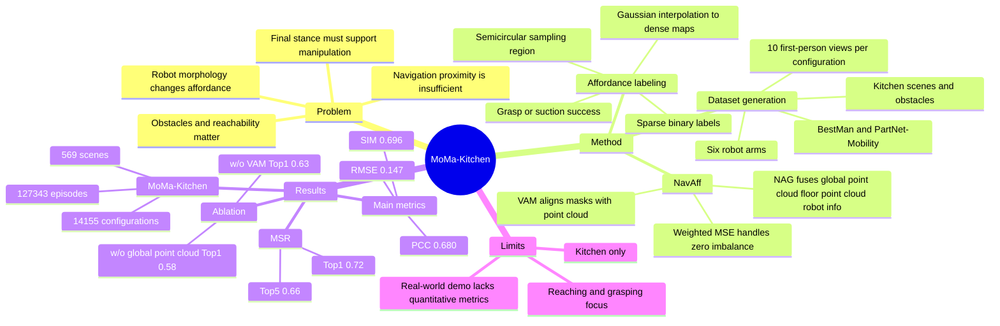

## Summary

MoMa-Kitchen 把 mobile manipulation 的“到达目标附近”问题重新定义为 affordance-grounded last-mile navigation：给定 first-person RGB-D、floor point cloud 和 robot-specific parameters，预测机器人应该停在哪些 floor positions 才能完成后续 manipulation。数据集包含 569 个 kitchen scenes、14,155 个 configurations、127,343 个 episodes；作者同时给出轻量 baseline NavAff，在 MoMa-Kitchen 上优于改造后的 PointNet++、VoteNet 和 H3DNet。

## Problem & Motivation

现有 navigation 方法常用“接近目标位置”定义成功，但 mobile manipulator 的最后站位还必须满足 arm reach、base height、end-effector type、周围障碍物和目标表面朝向等 manipulation constraints。论文用 Figure 1 展示了两个典型失败：位置 A 虽近但被椅子阻挡，位置 B 空间稳定但超出抓取范围；真正可行的是既能接近又能操作的位置 C。

作者认为 navigation 和 manipulation 的 disconnect 是 household mobile manipulation 的关键短板：navigation dataset 往往有空间信息但没有后续操作站位监督，manipulation dataset 有交互数据但不覆盖“通过导航到达最佳 grasping position”的复杂性。已有 training-free LLM/VLM 辅助选点方法也被指出难以准确预测 robotic arm interaction requirements，且不能根据不同 arm model 或 base morphology 动态调整策略。

任务定义是：输入 first-person RGB-D 和 robot-specific parameters，输出 floor-level affordance map；每个 floor point 的 affordance 表示机器人站在该位置后能否可靠操作目标物体。这个 formulation 的重要性在于它把“导航终点”从几何 proximity 变成了由真实 manipulation success 监督的可操作性。

## Method

**Dataset generation.** MoMa-Kitchen 基于 BestMan / PyBullet，并整合 PartNet-Mobility assets 构造 kitchen scenes。每个 scene 从 rectangular kitchen layout 出发，沿墙程序化放置 sink、cabinet、dishwasher、fridge 等 furniture/appliance；随后随机选择 rigid objects 和 articulated objects 作为 manipulation targets，并在目标周围加入 obstacles 形成不同 configurations。补充材料给出的层级是 569 scenes、14,155 configurations、127,343 episodes；每个 configuration 采样 10 个 camera views，形成 first-person RGB image、depth map 和 floor point cloud。

**Affordance labeling.** 对每个 target object，作者在以 target 为中心、半径等于 robot arm 最大 reach 的 floor semicircular region 内采样 robot base positions。每个采样位置执行一次 manipulation：parallel gripper robots 以 successful grasp 判定成功，UR5e suction end-effector 以 valid suction-and-move action 判定成功。离散二值结果会被转换到 robot base frame，再匹配到 floor point cloud；最后用 Gaussian interpolation with k-nearest neighbors 得到 dense floor affordance map。

**Robots and assets.** 数据覆盖 6 种 robot arms：Panda、Flexiv、UR5e、xArm6、Elephant、Realman；其中 UR5e 使用 suction cup，其他主要是 gripper。对象资产共 137 类厨房相关 assets，包括 65 rigid、48 articulated、24 obstacle types；target categories 包括 bottle、pot、fruit、medicine bottle、vegetable、faucet、microwave、cabinet、dishwasher、oven counter，obstacle categories 包括 chair、trolley、bin、table、cart。

**NavAff baseline.** NavAff 有两个模块。Visual Alignment Module (VAM) 用 target / obstacle masks 将 2D visual cues 投影到 global point cloud：target channel 置 1，obstacle channel 置 -1，再由 PointNet++ 提取 feature-enhanced global point cloud。Navigation Affordance Grounding Module (NAG) 分别处理 enhanced global point cloud、reference floor point cloud 和 robot information；robot information 只编码 base platform height 与 robotic arm operational radius，经 MLP tokenization 后与 global point cloud feature 一起作为 cross-attention 的 key/value，floor point cloud feature 作为 query，最后解码为 navigation affordance prediction。

**Training objective.** 主 loss 是 MSE，但因为 ground-truth floor affordance 中 zero-valued elements 占比很高，作者使用 Weighted MSE：ground truth 为 0 的元素以 0.5 概率赋予权重 $\lambda \in (0,1)$，其他元素权重为 1，以缓解非零 affordance 区域被大量零值淹没的问题。训练设置为 PyTorch，单张 NVIDIA A100，batch size 64，6 epochs，约 8 小时；optimizer 是 Adam，learning rate 8e-4 并使用 cosine decay。

## Key Results

**MoMa-Kitchen dataset scale.**

| Split / Dataset | Scenes | Configurations | Episodes |
|---|---:|---:|---:|
| MoMa-Kitchen Train | 456 | 11,408 | 102,687 |
| MoMa-Kitchen Test (Unseen Scenes) | 113 | 2,747 | 24,656 |
| MoMa-Kitchen Total | 569 | 14,155 | 127,343 |

**MoMa-Kitchen navigation affordance grounding.** 在 MoMa-Kitchen benchmark 上，NavAff 在全部指标上优于改造后的 PointNet++、VoteNet 和 H3DNet。NavAff 的 RMSE 为 0.147、logMSE 为 0.0115、PCC 为 0.680、SIM 为 0.696；第二好的 PointNet++ 为 0.164 / 0.0142 / 0.565 / 0.589。

| Method | RMSE ↓ | logMSE ↓ | PCC ↑ | SIM ↑ |
|---|---:|---:|---:|---:|
| PointNet++ | 0.164 | 0.0142 | 0.565 | 0.589 |
| VoteNet | 0.167 | 0.0143 | 0.543 | 0.570 |
| H3DNet | 0.174 | 0.0156 | 0.503 | 0.522 |
| NavAff | 0.147 | 0.0115 | 0.680 | 0.696 |

**MoMa-Kitchen manipulation success rate (MSR).** 论文用 Top1 / Top5 MSR 直接评估 affordance prediction 对 manipulation 的帮助：Random baseline 只有 Top1 0.080、Top5 0.046；NavAff 达到 Top1 0.72、Top5 0.66，优于 H3DNet、VoteNet 和 PointNet++。作者还指出 MSR 与 navigation affordance prediction accuracy 正相关，支持“更准确的 affordance map 能提高后续 manipulation success”的结论。

| Method | Top1 MSR ↑ | Top5 MSR ↑ |
|---|---:|---:|
| Random | 0.080 | 0.046 |
| H3DNet | 0.54 | 0.47 |
| VoteNet | 0.56 | 0.53 |
| PointNet++ | 0.60 | 0.58 |
| NavAff | 0.72 | 0.66 |

**Ablation on MoMa-Kitchen.** 消融显示 VAM 和 global point cloud 对结果最关键。去掉 robot information 后 Top1 MSR 从 0.72 降到 0.70，影响相对小；去掉 VAM 后 RMSE 从 0.147 升到 0.165、PCC 从 0.680 降到 0.562、Top1 MSR 降到 0.63；去掉 global point cloud 后 Top1 MSR 降到 0.58。

| Variant | RMSE ↓ | logMSE ↓ | PCC ↑ | SIM ↑ | Top1 MSR ↑ |
|---|---:|---:|---:|---:|---:|
| NavAff | 0.147 | 0.0115 | 0.680 | 0.696 | 0.72 |
| w/o robot information | 0.148 | 0.0115 | 0.670 | 0.688 | 0.70 |
| w/o VAM | 0.165 | 0.0140 | 0.562 | 0.589 | 0.63 |
| w/o global point cloud | 0.168 | 0.0144 | 0.534 | 0.568 | 0.58 |

**Real-world application.** 论文展示了 simulator-trained NavAff 在真实厨房中的 qualitative pipeline：D435i camera 获取图像，Grounded-SAM 产生 open-vocabulary object masks，Depth Anything v2 估计 depth，back projection 得到 global point cloud，再由 NavAff 预测 floor affordance。正文说模型在 real-world kitchen scenarios 中表现良好，但没有给出 real-world quantitative success rate。

## Strengths & Weaknesses

**已知 Strengths.** 这篇论文最有价值的贡献是把 last-mile navigation 的监督信号定义为 manipulation outcome，而不是 hand-crafted distance-to-target。对 mobile manipulation 来说，这比“到目标附近”更接近真实任务完成条件，也能自然纳入 obstacles、reachability、end-effector type 和 base morphology。

**已知 Strengths.** 数据生成 pipeline 比单纯采样目标点更扎实：它实际在 simulator 中从多个 floor positions 尝试 grasp / suction，再把 success / failure 转成 affordance labels。MoMa-Kitchen 还显式覆盖 6 种 robot arms、不同 base height / arm reach 和 137 类厨房相关 assets，使 benchmark 能考察 hardware-dependent final positioning。

**已知 Baseline / Ablation 价值.** PointNet++、VoteNet、H3DNet 都不是原生为该任务设计，作者对它们做任务适配后作为基线；这说明当前领域确实缺直接可比方法。消融给出的信号比较清楚：VAM 和 global spatial context 是主要贡献，robot information 目前贡献较小；作者自己解释这可能是因为 robot information 只包含 base height 和 arm reach，且只有 xArm6 的 base height 明显不同。

**已知 Weaknesses / boundary.** MoMa-Kitchen 当前仅限 kitchen environments，补充材料明确把 scene diversity 列为 limitation，并建议未来扩展到 living rooms、bedrooms、bathrooms 等 household scenarios。任务也主要聚焦 reaching and grasping，未覆盖需要多次 repositioning 的 pushing、pulling、sliding 或更长 manipulation sequence。

**已知 Weaknesses / boundary.** Real-world application 只报告 qualitative demo，没有给 real-world MSR、trajectory success rate 或 sim-to-real failure statistics；因此不能从论文数字直接推出真实厨房部署成功率。论文也没有给出系统 failure case taxonomy；补充 Table 6 只显示不同 scenes 上指标差异较大，例如 Scene 419493 的 PCC / SIM 为 0.300 / 0.369，Scene 116280 为 0.305 / 0.364，但没有解释这些低分 scene 的具体失败原因。

**推测.** MoMa-Kitchen 可能适合作为 LLM-based task planning 与 low-level manipulation 之间的中间监督：先预测“可操作站位”，再把 navigation endpoint 交给 manipulation policy。论文补充材料也把 integration with LLMs 列为 future direction，但没有评估 LLM/VLM planner 与 NavAff 的 closed-loop integration，所以这只是基于任务形式和作者 future work 的延伸假设。

**不知道.** 论文正文只给 project page，没有在 paper text 中给 GitHub/code link，因此当前不知道 benchmark 数据、simulator scripts 或 NavAff 权重是否已完全开放。也不知道 NavAff 对更复杂 robot descriptors、动态障碍物、非厨房空间、multi-step manipulation 和在线 replanning 是否仍稳定。

## Mind Map

## Notes

- 这篇的核心不是 NavAff architecture 本身，而是把“navigation endpoint”从 geometric goal 转成 manipulation-grounded affordance label。这个监督定义可能比具体 baseline 更值得复用。
- NavAff 的 robot information 只包含 base height 和 arm operational radius；从 ablation 看这个分支带来的提升很小。后续如果强调 cross-robot generalization，需要更细的 robot descriptor 或更强的 hardware variation 证据。
- 后续如果用这类 benchmark 训练 agent，需要特别注意 evaluation：Top1/Top5 MSR 比 RMSE/PCC 更接近真实任务目标，因为一个 affordance map 数值接近并不必然等价于选出的站位可操作。
