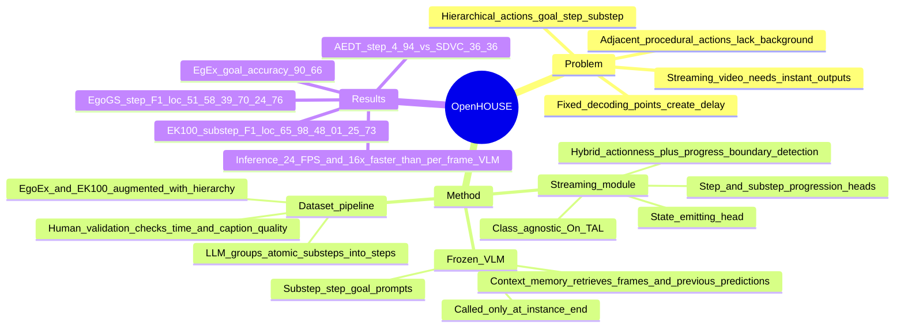

## Summary
OpenHOUSE 把 streaming video understanding 从在线 action classification / localization 推到开放式、层级化描述生成：轻量 Streaming module 在线检测 substep / step / goal 的边界与层级，只有在 action instance 结束时才调用 frozen VLM 生成描述。核心贡献是用 LLM 生成并人工校验层级 temporal annotations，并用 actionness + progress 的 hybrid boundary detection 解决 procedural videos 中相邻动作缺少 background frame 的问题。实验显示它在 EgoGS、Ego-Exo4D Keystep、Epic-Kitchens 100 上显著优于 OAD / SDVC 扩展基线，同时把 VLM 调用控制在在线可用的频率。

## Problem & Motivation
作者要解决的是 **Open-ended Hierarchical Streaming Video Understanding**：在视频流仍在进行时，系统要即时判断当前 action instance 何时结束、属于哪个层级，并输出 free-form description，而不是只给 frame-level action class。这个问题对实时 assistance 很关键，例如 egocentric repair 场景中，“tightening a bolt” 需要被理解为 “changing the wheel” 的 substep，并进一步服务于 “repairing the bike” 的 goal。

现有路线有三类不足。第一，OAD / On-TAL 通常输出预定义 action class 或 class-agnostic proposal，表达不了开放式层级语义。第二，SDVC 这类 streaming dense video captioning 依赖 fixed decoding points，会天然引入 delay，且 decoding point 不保证对齐 action termination。第三，直接让 VLM 每帧推理计算成本过高，也会产生碎片化、冗余且不稳定的描述。

论文的关键判断是：不要把 streaming temporal understanding 和 text generation 塞进一个大模型，而是把它们解耦。轻量在线模块负责“什么时候调用 VLM、取哪段上下文、属于哪个层级”，frozen VLM 只在被调用时做它擅长的 zero-shot caption generation。

## Method
OpenHOUSE 包含三个组件：Streaming module、Context memory、frozen VLM。Streaming module 每帧运行，执行 class-agnostic OAD-based On-TAL，并追踪 substep / step 两个 instance-level hierarchy；当它检测到某个 action instance 结束时，把该 instance 的时间边界和层级作为 query，从 Context memory 中取相关 frames 与已有文本预测，再调用 VLM 生成对应层级的 description。VLM 输出随后写回 Context memory，供后续 step / goal 预测使用。

数据侧，作者先利用 LLM 把已有 atomic action annotations 聚类成 higher-level steps，并生成 step / goal descriptions；随后由 human validation 检查 missing instances、异常长短的 temporal annotations、caption quality 和 goal caption 是否准确。这个 pipeline 被用于把 Ego-Exo4D Keystep 和 Epic-Kitchens 100 扩展成层级格式；在 Ego4D-GoalStep 上，作者用已有 ground-truth hierarchy 验证 pseudo labels 是否足够可靠。

Streaming module 的核心技术是 **Hybrid Action Boundary Detection**。传统 class-agnostic actionness 方法依赖 background-to-action / action-to-background transition，但 procedural videos 中多个动作常常紧密相邻，几乎没有 background frame，导致多个 instance 被合并。OpenHOUSE 同时预测 actionness 和 action progress：action start 仍由 actionness 检测，action end 则通过 progress 的 sudden drop 检测；多层级时为 step / substep 分别设置 progression heads，并结合 state-emitting head。

实现上，Streaming module 使用三层 RNN backbone，hidden size 为 768，共享到 state-emitting head、step progression head、substep progression head。state-emitting head 用 cross-entropy 训练；progression heads 虽然本质是 regression，但被 histogram loss 转成 classification 问题，使用 10 bins 和 $\sigma=0.15$。训练使用 AdamW，learning rate 3e-4，batch size 16，weight decay 0.01，30 epochs。

VLM 端保持 frozen。Substep inference 输入该 substep 每 1 秒采样的 frames 和同一 step 内 prior substep predictions；step inference 输入该 step 内 substep instances 每 3.3 秒采样的 images 和最多 10 个 previous step predictions；goal inference 输入每个 step 一个 image 以及所有 step text predictions。论文主要使用 InternVL2-40B-AWQ，也在 supplement 中比较 GPT-4o、InternVL2-40B-AWQ 和 InternVL2-8B。

## Key Results
- **Dataset pipeline validation on Ego4D-GoalStep (EgoGS)**：生成的 pseudo step labels 与 GT step labels 的 F1 (loc.) 在 tIoU 0.3 / 0.5 / 0.7 下为 **64.7 / 56.1 / 42.8**，F1 (loc. + desc.) 为 **34.04 / 30.87 / 26.10**，GPT Score 为 **2.98**。用 pseudo labels 训练时，OpenHOUSE 在 EgoGS 上的 step F1 (loc.) 为 **50.65 / 38.24 / 23.48**，接近 GT labels 训练的 **51.58 / 39.70 / 24.76**；对应 F1 (loc. + desc.) 为 **14.30 / 11.63 / 7.66** vs **15.23 / 12.67 / 8.68**。
- **Hybrid Action Boundary Detection ablation**：在 EgoGS-GT 上，step F1 (loc.) 从 **16.78** 提升到 **39.35**，substep 从 **22.48** 提升到 **44.79**；在 EgEx-GT substep 上从 **8.42** 提升到 **52.2**；在 EK100-GT substep 上从 **31.46** 提升到 **48.95**。这直接支撑了 progress-based end detection 对相邻 procedural actions 的必要性。
- **EgoGS baselines**：在 EgoGS 上，OpenHOUSE step F1 (loc.) 为 **51.58 / 39.70 / 24.76**，高于 TeSTra **18.27 / 12.51 / 7.08**、MiniROAD **19.23 / 12.46 / 6.56**、MAT **18.36 / 12.34 / 7.00**、SDVC* **22.23 / 10.43 / 3.06**；substep F1 (loc.) 为 **55.17 / 43.71 / 28.83**，高于 MiniROAD **32.12 / 21.90 / 12.88** 和 SDVC* **17.81 / 7.79 / 2.30**。OpenHOUSE 的 substep F1 (loc. + desc.) 为 **19.79 / 16.11 / 10.89**，step 为 **15.23 / 12.67 / 8.68**。
- **Other datasets**：在 EgEx pseudo-step 设置中，OpenHOUSE step F1 (loc.) 为 **62.85 / 45.75 / 26.15**，substep 为 **63.42 / 51.12 / 34.36**，Goal Acc. 为 **90.66**。在 EK100 上，step F1 (loc.) 为 **55.32 / 34.48 / 15.91**，substep 为 **65.98 / 48.01 / 25.73**，Goal Acc. 为 **29.71**；在 Ego-Exo4D exo view 上，step / substep F1 (loc.) 分别为 **62.03 / 39.73 / 19.73** 和 **57.33 / 40.29 / 21.35**。
- **Cross-dataset evaluation on EK100**：以 EK100-trained model 为 upper bound 时，step / substep F1 (loc.) 为 **55.32 / 34.48 / 15.91** 和 **65.98 / 48.01 / 25.73**。用 EgoGS + EgEx 训练并在 EK100 验证时，step / substep F1 (loc.) 达到 **51.64 / 32.47 / 13.84** 和 **53.67 / 33.98 / 15.98**，高于只用 EgoGS 或只用 EgEx 的多数组合，显示 class-agnostic streaming module + zero-shot VLM 有一定跨数据集扩展性。
- **Prediction delay vs SDVC**：在 EgoGS 上，OpenHOUSE 的 AEDT 为 step **4.94s**、substep **1.82s**；SDVC decoding interval 70 时为 step **36.36s**、substep **43.95s**，interval 105 时为 step **64.84s**、substep **52.64s**。同时 OpenHOUSE F1@0.3 (loc.) 为 step **51.58**、substep **55.17**，高于 SDVC 的 step **9.85 / 14.12** 和 substep **5.48 / 8.55**。
- **Context memory ablation on EgoGS step captions**：不用 hierarchical frame sampling / previous output 时，使用 **59,385** frames，F1 (loc. + desc.) **13.08**，GPT Score **2.59**；加入 hierarchical frame sampling 但不用 previous output 时，frames 降到 **22,770**，F1 **10.96**，GPT Score **2.42**；同时使用 hierarchical frame sampling 和 previous output 时，仍只用 **22,770** frames，F1 **13.05**，GPT Score **2.76**。这说明 memory 设计的收益来自 hierarchy-aware frame selection 与 prior predictions 的组合，而不是单独少采样。
- **VLM choice and speed**：在 EgoGS 上，GPT-4o step F1 (loc. + cap.) 为 **15.53 / 12.65 / 8.59**，InternVL2-40B-AWQ 为 **15.23 / 12.67 / 8.68**，InternVL2-8B 降到 **10.01 / 8.21 / 5.49**，说明强 VLM 有收益但不是唯一瓶颈。效率上，使用 InternVL2-40B-AWQ、4 张 RTX 3090，在 46 分钟、16 FPS 视频上 OpenHOUSE 平均 **24 FPS**，比每帧调用 VLM 快 **16x**。

## Strengths & Weaknesses
**已知 / Strengths**
- 任务定义清楚且对 streaming assistance 有实际意义：它要求 action termination 对齐、层级结构和 open-ended description 三者同时在线输出，比单纯 OAD、On-TAL 或 dense captioning 更贴近实时帮助系统。
- 模块解耦是一个务实选择：Streaming module 处理高频时序边界，VLM 低频生成文本，既保持 strict online，又避免每帧调用 VLM 的计算成本。
- Hybrid boundary detection 的证据很强：Table 2 在 EgoGS / EgEx / EK100 的所有配置上都有显著提升，且与 procedural videos 中相邻动作难分的问题机制一致。
- 数据生成 pipeline 有合理验证：EgoGS 上 pseudo labels 不完全复原 GT，但作为训练信号接近 GT labels，说明它更像一种合理 alternate hierarchy，而不是完全错误的噪声。
- baseline 覆盖了 OAD extension、SDVC、SDVC*、GT proposal，能看出 OAD-based localization、frozen VLM captioning、准确低层 action proposal 分别贡献了什么。

**已知 / Caveats**
- 论文没有把 VLM 真正训练成 streaming model；OpenHOUSE 的在线性主要来自外部 Streaming module。因此若 Streaming module 边界错了，VLM 不会主动修正 action interval。
- F1 (loc. + desc.) 仍明显低于 GT proposal：EgoGS GT proposal step F1 (loc. + desc.) 为 **28.68**，OpenHOUSE step 只有 **15.23 / 12.67 / 8.68**，说明 localization / proposal quality 仍是主要瓶颈。
- Context memory ablation 显示 hierarchy-aware frame sampling 单独使用会从 **13.08** 降到 **10.96**，必须结合 previous output 才恢复到 **13.05** 并提升 GPT Score；这提醒我们不能把“少帧 + 层级采样”单独视为稳定收益。
- Goal accuracy 在不同数据集差异很大：EgEx 为 **90.66**，EK100 只有 **29.71**；论文没有充分解释这种差异来自数据集目标定义、VLM caption quality、还是 streaming proposal error。
- 评价依赖 GPT-Score 和 GPT-4 text encoder 的 semantic matching；作者说明 CIDEr / METEOR 等 N-gram metrics 不适合，但这也意味着 evaluation pipeline 本身依赖大型语言模型判断。

**推测 / Implications**
- 对 GUI-agent / computer-use 的启发在于：长程 screen recording 也可能需要“轻量在线 event segmentor + 低频 VLM summarizer”的解耦架构，而不是每帧截图都丢给 VLM；但本文没有 GUI、web 或 embodied manipulation 实验。
- Progress-based boundary detection 可能适合 procedural UI workflows 或 robot demos，因为这些场景也常见相邻子动作、缺少明确 background；不过如何定义 progress supervision 是迁移时的核心问题。

**不知道 / Open Questions**
- 不知道 LLM-generated hierarchy 在更开放、更少规整的自然视频或 GUI 操作日志中是否仍然可靠；本文主要验证 procedural activity datasets。
- 不知道 human validation 的成本如何随数据规模增长。Supplement 只报告 5 位 annotators、每人约 20 小时、补偿 200 美元，没有给出每小时处理量或错误类型分布。
- 不知道真实部署中 VLM 延迟、显存、并发调用和 long-running context memory 会如何影响端到端稳定性；24 FPS 结果是在 4 张 RTX 3090 和 InternVL2-40B-AWQ 下测得。

## Mind Map

## Notes
- 这篇论文最有价值的点不是“又接了一个 VLM”，而是把 streaming VLM system 拆成 online boundary/event proposal 与 occasional generation 两个时间尺度；这对任何长程视觉 agent 都是有用的系统设计模式。
- 已知：OpenHOUSE 的强项是 class-agnostic temporal proposal + hierarchy-aware prompting，不是端到端 learned video-language policy。
- 推测：如果迁移到 GUI-agent，substep/step/goal 可以对应 UI primitive action、workflow segment、user intent；但需要新的 supervision 或 automatic labeling pipeline，不能直接复用本文结论。
- 不知道：论文正文没有 DOI 或 GitHub/code 仓库链接；只给出项目页，并说明 annotations 将随 code 公开。
- 我的判断：rating=4。它与 VLM / streaming video understanding 高度相关，并且对 GUI / embodied agent 的长程观察分段和层级 memory 有明确启发；但它还不是 agent benchmark 或 action policy 论文，且最终性能仍强依赖 streaming proposal 的边界质量。
