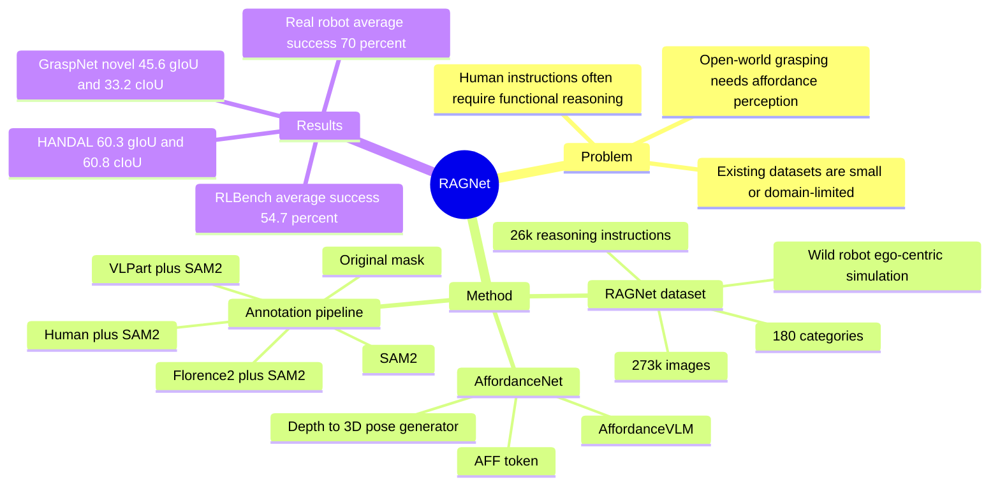

## Summary
RAGNet 把 affordance segmentation 扩展成面向 general grasping 的 reasoning-based benchmark：273k images、180 categories、26k reasoning instructions 覆盖 wild、robot、ego-centric、simulation 四类 embodied data domain。基于该数据训练的 AffordanceNet 用 VLM 预测 affordance map，再结合 depth 生成 3D grasp pose，在 segmentation、reasoning instruction 和 real-robot grasping 上显著优于所测 baseline，但在 RLBench 平均成功率仍低于 LLARVA。

## Problem & Motivation
现有 affordance datasets 往往局限在单一 domain 或少量类别：UMD 主要是 robot table scene，AGD20k 是 exocentric wild images，HANDAL 聚焦 17 类工具/厨具，很多数据也不直接适合 robotic manipulation。作者认为 open-world general grasping 需要同时解决两件事：在 unseen object category / unseen image domain 上泛化，以及理解更接近人类交互的 high-level functional instruction。已有 VLM/MLLM affordance 方法开始尝试 reasoning segmentation，但多使用固定 prompt、数据规模有限，且部分工作没有展示 real-robot deployment。因此本文的动机不是单纯提高一个 segmentation 指标，而是构造足够大且带 reasoning instruction 的 affordance benchmark，并验证它能否支撑可部署的 grasping pipeline。

## Method
RAGNet 的数据来自 HANDAL、Open-X、GraspNet、EgoObjects 和 RLBench，共 273k images、180 categories。图像域覆盖 wild、robot、ego-centric 和 simulation；annotation 目标是 grasping-oriented affordance mask，即有 handle 的物体通常标 handle，无 handle 的物体可标整个可抓取主体。

标注流程使用五类工具按数据条件组合：original mask、SAM2、Florence2 + SAM2、VLPart + SAM2、human (+ SAM2)。例如 Open-X 中 handle-free objects 可用 Florence2 + SAM2，EgoObjects 中 knife/mug/screwdriver/wrench 等可用 VLPart + SAM2，无法可靠自动完成的 microwave oven、drawer、wok、fork、scissors 等类别进入人工标注。

语言侧包含三类 instruction：template-based instruction 直接要求 segment 某个 category 的 affordance map；easy reasoning instruction 仍包含 object category name；hard reasoning instruction 删除 category name，只保留 functional description，例如把 “mug” 改成 “I need something to drink coffee”。这些 reasoning instructions 由 GPT-4 生成，论文报告 HANDAL 上 8.5k hard instructions，EgoObjects 上 12.7k easy + 4.7k hard，总计 26k。

AffordanceNet 包含两个组件。AffordanceVLM 基于 LISA：ViT-CLIP 编码图像，linear projector 对齐到 Vicuna-7B embedding space，prompt 增强为 “You are an embodied robot.”，并引入 affordance-specific 的 `<AFF>` token，再用 SAM decoder 输出 pixel-wise mask。Pose Generator 将 depth map 投影成 3D point cloud，用 affordance mask 过滤目标区域，再生成 grasper pose；real-robot 实验中作者说明 follow GraspNet conditioned 3D affordance point cloud 来生成 3D grasp proposal。

## Key Results
- **Dataset scale / coverage**：RAGNet 有 273k images、180 categories、26k reasoning instructions；相比 AGD20k 的 20k images / 50 categories、HANDAL 的 200k images / 17 categories，RAGNet 同时覆盖 wild、robot、ego-centric、simulation，并提供 reasoning instruction。
- **Affordance segmentation, Table 4**：在 HANDAL 上，AffordanceNet 达到 60.3 gIoU / 60.8 cIoU，优于 VLPart+SAM2 的 40.9 / 28.9、Grounding DINO+SAM2 的 34.7 / 26.8、Florence2+SAM2 的 39.7 / 22.4、LISA 的 16.2 / 12.0、GLaMM 的 24.9 / 17.2。在 zero-shot category benchmark GraspNet novel 上为 45.6 / 33.2，优于 LISA 25.2 / 24.1 和 GLaMM 19.2 / 8.6；在 out-of-domain benchmark 3DOI 上为 37.4 / 37.4，优于 LISA 21.5 / 13.7 和 GLaMM 19.7 / 14.1。
- **Reasoning-based segmentation, Table 6**：在 HANDAL easy 上 AffordanceNet 为 58.3 gIoU / 58.1 cIoU，在 HANDAL hard 上为 58.2 / 57.8，在 3DOI reasoning set 上为 38.1 / 39.4。相比之下，Grounding-DINO 在三组上分别只有 3.6 / 3.0、3.4 / 3.1、4.1 / 3.9；LISA 为 15.5 / 11.9、12.3 / 8.1、12.3 / 8.1；GLaMM 为 4.7 / 3.5、5.0 / 3.5、4.4 / 2.9。
- **Ablation, Table 5**：逐步加入数据时，+GraspNet 在 GraspNet novel 上达到 51.5 / 38.5，但加入 reasoning data 后降到 43.0 / 33.8，+RLBench 后为 42.8 / 33.2；最终 Ours 通过 specialized system prompt 和 `<AFF>` token 回到 45.6 / 33.2。这个 ablation 表明 reasoning data 并非无条件提升 segmentation metric，task-specific modification 是关键补偿因素。
- **Real-robot grasping, Table 7 / 8**：UR5 + RealSense 的 10 个 real-robot tasks 中，AffordanceNet 平均成功率 70%，GraspNet 为 32%；单项上 AffordanceNet 在 can/hammer/mouse 为 80%，toy 为 90%，circle 为 40%。五任务 ablation 中，VLPart 为 34%，LISA 为 26%，easy reasoning 为 62%，hard reasoning 为 48%，完整 AffordanceNet 为 70%，说明 hard reasoning 对 robot grasping 仍更难。
- **RLBench simulation, Table 9**：AffordanceNet 在 open drawer / slide block to target / close jar 上分别为 56% / 64% / 44%，平均 54.7%；LLARVA 分别为 60% / 100% / 28%，平均 62%。已知结果是 AffordanceNet 在 close jar 上更高，但整体平均低于针对特定环境 fine-tuned 的 LLARVA。

## Strengths & Weaknesses
**已知**：本文最强的贡献是把 affordance segmentation 的数据规模、domain diversity 和 instruction complexity 同时拉高，并且给出了从 pixel affordance 到 real-robot grasping 的闭环验证。实验不是只看 in-domain segmentation，还包含 GraspNet novel、3DOI out-of-domain、reasoning instruction、UR5 real-robot 和 RLBench simulation，这比只报单一视觉 benchmark 更能支持 “general grasping” 的 claim。

**已知**：baseline 选择揭示了一个有用事实：通用 MLLM segmentation model 直接拿来做 affordance reasoning 很弱，尤其 reasoning instruction 下 Grounding-DINO、LISA、GLaMM 都远低于 AffordanceNet。不过 real-robot 对比 GraspNet 时，作者让 GraspNet 只面对桌面上剩下的 target object，因为 GraspNet 不支持 language-conditioned grasping；这使比较更像验证 language-conditioned affordance pipeline 的实用性，而不是严格同能力模型的公平对抗。

**已知**：论文没有系统展示 failure case taxonomy。能看到的负面信号主要来自 ablation：reasoning data 加入后部分 segmentation metric 下降，hard reasoning 在 real-robot 五任务 ablation 中从完整模型的 70% 降到 48%，RLBench 平均 54.7% 也低于 LLARVA 的 62%。

**推测**：RAGNet 对后续 embodied VLM / VLA 的价值可能更像 perception-and-grounding pretraining resource，而不是直接替代 end-to-end policy learning。它把 “functional language -> graspable region” 这个中间表示做得很清楚，但从 affordance point cloud 到稳定操作仍依赖额外 pose generator / grasping model。

**不知道**：正文没有给出 DOI；也没有显式暴露具体 data/code URL，只说 data and code available at a link。论文也没有量化自动标注和人工标注的误差、annotator agreement，或不同 annotation tool 对最终性能的独立影响。

## Mind Map

## Notes
这篇对 GUI-agent 的直接相关性不高，但对 embodied agent 很相关：它把自然语言意图、functional reasoning、visual grounding 和 manipulation affordance 连成一个可评估链条。我的 takeaway 是，很多 “VLM understands affordance” 的说法如果没有像 RAGNet 这样区分 template/easy/hard instruction、seen/novel category、in-domain/out-of-domain，会很容易把 category recognition 误当成 embodied reasoning。后续如果做 GUI / robotics shared grounding，可以借鉴它的 hard instruction 设计：去掉显式目标名，只保留任务意图，看模型是否真的能把 intention 映射到可操作区域。
