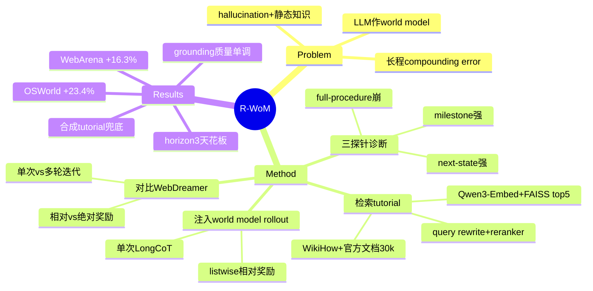

## Summary
针对"LLM 能否胜任 computer-use agent 的 world model"这一问题，先用三个探针任务证明 LLM 只擅长单步/局部预测、在 full-procedure 长程规划上崩塌；随即提出 R-WoM——把外部 tutorial 检索进来 ground LLM 的状态想象与奖励估计，在 OSWorld / WebArena 子集上相对基线最多提升 23.4% / 16.3%，且优势集中在长程 simulation。

## Problem & Motivation
LLM 被寄望于充当数字环境的 world model：给定当前状态和候选动作，模拟未来状态、预测动作结果，从而避免真实环境里昂贵的 trial-and-error。但 LLM 有两个结构性缺陷——**hallucination** 和**依赖静态训练知识**——会在多步 rollout 中累积误差（compounding errors），使 long-horizon simulation 失真。本文先系统地"体检"LLM 的两项 world-model 核心能力（future state prediction 与 reward estimation），再对症下药。这个 problem formulation 值得肯定：它没有直接堆方法，而是先问"LLM 到底在 world modeling 的哪一环 break"。

## Method
### 诊断阶段：三个探针任务（Table 1）
- **Next-state identification**：给当前状态+动作，从同一 trajectory 里的真值与词面相似干扰项中选出真实下一状态（WebArena 100 样本）。LLM 表现较强，普遍 >75%（Qwen 77.0 / Claude-3.5 81.0 / Claude-3.7 86.0）。
- **Full-procedure planning alignment**：生成多步执行计划，由 LLM judge 对照 tutorial 参考流程打分（OSWorld+WebArena 40 样本）。**这是短板**：无检索时 rarely exceeds 65%（Qwen 50 / Claude-3.5 55 / Claude-3.7 65）；接入检索后跃升至 85–95。
- **Milestone transition recognition**（reward estimation 代理）：从成功/失败路径中判断哪段 transition 更接近目标（98 样本）。三个模型都强（83.7–86.7）。

结论：LLM 能抓住 immediate next state、能判断有意义的 transition（奖励信号尚可），但**长程规划不可靠**，需要外部 guidance。

### R-WoM：检索到底 ground 了什么
- **检索什么**：environment-specific **tutorials**（多步操作的程序性文档）。来源为 WikiHow 及官方文档（Chrome Help / GIMP 3.0 / VS Code / Ubuntu Help / Thunderbird / VLC / LibreOffice / GitLab / Adobe Commerce），共 >30k chunked tutorial documents；tutorial 稀缺场景则从 self-played trajectories 合成 tutorial。
- **怎么检索**：task goal g 编码为 query（Qwen-3-Embedding-8B + FAISS，cosine 相似度取 top-5），叠加 **query rewriting**（把 query 里的个人化细节泛化）与 **LLM-based reranker**。检索质量：OSWorld >85% recall@5，WebArena >90%。
- **怎么注入**：注入点是 **world model 的 rollout，而非 acting policy 的 context**。对每个候选动作，world model 以检索证据 E 为条件做一条 **k 步 LongCoT rollout**（`π_w^LongCoT(o_i, t, a; E)`），用 tutorial ground 未来状态想象；奖励用 **listwise 相对偏好排序**（比较各候选 rollout 给相对分），而非绝对稀疏奖励。

### 与 WebDreamer 的区别（planning，非 context 构造）
R-WoM 属于"world model 用于 planning"——policy 先提 m 个候选 thought-action，world model 对每个候选 rollout 打分，执行得分最高的动作（Algorithm 1）。与 WebDreamer 的差异：(1) **单次前向** LongCoT 一口气展开整条多步想象，取代 WebDreamer 的 policy↔world-model 多轮迭代调用；(2) **listwise 相对排序** vs 绝对分；(3) adaptive action branching + action dedup 降本。注意区分：RAG baseline 是把检索结果塞进 policy 的 context；R-WoM 把 tutorial 用在 world model 的 simulation/reward 环节——这正是它超过 RAG 与 WebDreamer 的地方。

## Key Results
- **端到端成功率（Table 2）**。OSWorld，Claude-3.7-Sonnet：R-WoM 38.54% > WebDreamer 31.24% > Vanilla 28.47% > RAG 27.76%（相对 WebDreamer +23.4%）。WebArena，Qwen-2.5-VL-72B：R-WoM 28.49% > WebDreamer 24.50% > RAG 22.42% > Vanilla 21.84%（+16.3%）。R-WoM 在所有模型/两个 benchmark 上一致优于三类基线。
- **grounding 质量单调决定性能（Figure 4）**：ungrounded WebDreamer < retrieved-tutorial R-WoM < oracle-tutorial R-WoM。
- **长程优势（Figure 5）**：WebDreamer 超过 ~2 步即 plateau/下滑（compounding error），R-WoM 的增益能撑到 horizon ~3 再回落——这是它相对基线的核心区分点，也是 horizon 3 的天花板所在。
- **tutorial 稀缺可用合成 tutorial 兜底（Table 3, OSWorld）**：Claude-4.5-Sonnet R-WoM 49.29% > Vanilla 45.83%。
- **成本（Appendix A.4）**：Adaptive 版仅掉 ~1.3pp，token 从 76.19M 输入降到 35.39M（约减半）。

## Evidence Ledger
| Claim ID | Claim | Type | Source locator | Evidence excerpt | Status |
|:--|:--|:--|:--|:--|:--|
| C1 | R-WoM 相对基线最多提升 23.4%(OSWorld)/16.3%(WebArena)，长程 simulation 优势更明显 | number | Abstract | "relative improvements of up to 23.4% and 16.3% on the subsets of OSWorld and Webarena ... particular advantage in longer-horizon simulations" | source-verified |
| C2 | OSWorld/Claude-3.7：R-WoM 38.54 vs WebDreamer 31.24 vs Vanilla 28.47 vs RAG 27.76 | number | Table 2 | "Vanilla=28.47, RAG=27.76, WebDreamer=31.24, R-WoM=38.54" | source-verified |
| C3 | WebArena/Qwen-2.5：R-WoM 28.49 vs WebDreamer 24.50 vs RAG 22.42 vs Vanilla 21.84 (+16.3%) | number | Table 2 | "Vanilla=21.84, RAG=22.42, WebDreamer=24.50, R-WoM=28.49" | source-verified |
| C4 | 检索 OSWorld >85% / WebArena >90% recall@5 | number | Figure 3 | "retrieval can reach over 85% and 90% recall@5, respectively" | source-verified |
| C5 | 探针：next-state >75%、milestone 83.7–86.7%，但 full-procedure planning 无检索 rarely >65%（50/55/65），加检索升至 85–95 | number | Table 1 | "Qwen 50.0→90.0; Claude-3.5 55.0→85.0; Claude-3.7 65.0→95.0; next-state 77/81/86; milestone 83.7/85.7/86.7" | source-verified |
| C6 | WebDreamer 超 ~2 步 plateau/下滑，R-WoM 增益撑到 horizon ~3 | comparison | Figure 5 | "improvements lasting up to horizon three before decreasing"; WebDreamer "plateaus and even declines beyond 2 steps" | source-verified |
| C7 | tutorial 来源 WikiHow+官方文档 >30k chunks；Qwen-3-Embedding-8B+FAISS top-5，含 query rewriting 与 LLM reranker | benchmark-setting | Retrieval setup / App. A.2 | "Over 30k chunked tutorial documents"; "Qwen-3-Embedding-8B with FAISS"; "Top-5"; "query rewriting"+"LLM-based reranking" | source-verified |
| C8 | R-WoM 单次 LongCoT rollout+listwise 相对奖励，区别于 WebDreamer 多轮迭代+绝对奖励 | causal-mechanism | Method section | "entire multi-step imagination trajectory within a single forward reasoning sequence"; "list-wise ranking ... relative" vs "multiple rounds of LLM calls" | source-verified |
| C9 | tutorial 稀缺用合成 tutorial，Claude-4.5 R-WoM 49.29 vs Vanilla 45.83 | number | Table 3 | "Vanilla: 45.83%, R-WoM: 49.29%" | source-verified |
| C10 | Kai Mei(Rutgers)，AWS 实习期间完成；co-authors 来自 AWS Agentic AI | license-code | Author footnote | "work done when Kai is an intern at AWS Agentic AI" | source-verified |

## Strengths & Weaknesses
**亮点**
- **Problem formulation 干净**：先诊断 LLM world model 在哪一环 break（长程规划），再针对性 ground，而非盲目上方法。三探针把"future state prediction 尚可、long-horizon planning 崩"这一结论量化，是本文最有信息量的部分。
- **grounding 质量与性能单调相关（Figure 4）**是有说服力的因果证据：ungrounded < retrieved < oracle，说明增益确实来自外部事实注入而非架构 trick。
- **注入点选得对**：把 tutorial 放进 world model 的 rollout/reward 而非只塞 policy context，解释了为何稳超 RAG baseline——这是"world model for planning"与"policy context construction"的关键区分。
- 诚实标注 horizon 3 天花板，没有 overclaim 无限长程。

**局限 / 待质疑**
- **优势有天花板且窄**：增益只撑到 horizon ~3，超过即回落——本质仍是"用检索延缓 compounding error"，未解决 LLM world model 的长程不可靠根因。
- **强依赖 tutorial 覆盖**：主结果限定在"有 tutorial 覆盖"的子集（OSWorld 87 任务 / WebArena 113 模板），是被挑选过的乐观切片；合成 tutorial 缓解但绝对成功率仍偏低（OSWorld <40%，WebArena <35%）。
- **绝对提升有限**：不少设置下相对提升被小基数放大（如 Claude-3.7/WebArena 仅 +5.6%），SOTA 意义有限，价值在诊断洞察而非刷点。
- **成本**：full R-WoM 输入 token 约为 Vanilla 的 2.3×；Adaptive 版减半但仍显著高于无 world model。
- reranker 与 reward 的"listwise"表述需分辨：listwise 排序主要用于 reward 估计，检索侧是 LLM-based reranker（原文措辞）。

**领域影响**：为"LLM 作为 computer-use world model"提供了可复用的诊断范式（三探针）与一个务实的 grounding 配方；对做 GUI/computer-use planning 的人，提示了"检索 tutorial ground 想象"这一低成本增益点，但也划出了其适用边界（tutorial 覆盖 + 短程）。

## Mind Map

## Notes
- 与 `2500-RetrievalAugmentedGuiAgents`、`2411-WorldModelSurvey`、`2604-AgenticWorldModel`、`2605-MobileWorldModelGUI` 可交叉：R-WoM 是"检索 ground world model 用于 planning"的具体实例，可作对照 WebDreamer 家族的一个数据点。
- 与 thesis（"每个 action 都应回溯到某个 belief source——pixels/structure/memory/prior——并留下可验证的 state change；hybrid observation 会放大 stale evidence"）的关系：R-WoM 的 belief source 是 **prior**（外部 tutorial 知识），显式地把 action 的选择追溯到检索证据 E；但它的 state change 是 world model **想象**出来的、并非真实执行验证——若检索到 stale/mismatched tutorial，正是 hybrid/prior 证据被放大的风险面（horizon 3 后回落、oracle>retrieved 的 gap 都是该风险的间接体现）。
- 待查：Appendix A.5 的 failure case 分析（检索失败 vs 任务失败）在抓取正文中被截断，未纳入 ledger；如后续要用其 failure 结论需回原文核实。
