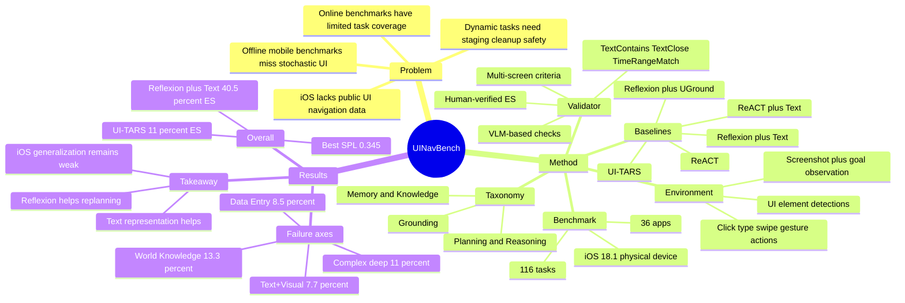

## Summary

UINavBench 提出一个面向 mobile UI 的 online benchmark，用 116 个任务、36 个 apps 评估 interactive digital agents 的 multi-step planning、visual grounding、memory / knowledge 使用和动态环境恢复能力。它的贡献不只是任务集合，而是把任务 taxonomy、iOS staging / cleanup、rule-based + VLM-based validators、ES / SPL 指标和多类 baseline 分析组织成一个可重复评测框架。

## Problem & Motivation

现有 mobile / web / desktop agent benchmark 要么是 offline evaluation，用静态截图或专家轨迹做 step-level / episode-level 匹配；要么是 online benchmark，但任务覆盖有限、任务来源可能偏向 LLM 已知分布，或 evaluation 过于 open-ended。论文的核心问题是：如果 agent 真要在真实 mobile interface 中完成自然语言目标，benchmark 必须同时测 planning、grounding、memory、world knowledge、non-deterministic UI、stateful setup 和 cleanup。

作者选择 iOS 作为 testbed 有两个动机。第一，iOS 上公开 UI navigation 数据比 Android / Web / Desktop 少，因此能检验 agent 是否真的跨平台泛化，而不是只复用训练分布。第二，mobile UI 任务天然包含动态内容、账号状态、跨 app 信息搬运、fine-grained gestures 和 persistent side effects，更接近 deployed GUI agent 会遇到的失败模式。

## Method

**Benchmark design.** UINavBench 用 expert-designed taxonomy 构造任务，而不是只从 LLM 或互联网采样任务。taxonomy 覆盖三组核心能力：

- **Planning & Reasoning**：Task Length、Navigation Depth、Multiple Applications、Goal Specification、Determinism、Task Intent。
- **Grounding**：Perceptual Difficulty 和 Action Complexity，覆盖 click / type / swipe / drag-and-drop / double tap 等 mobile interaction。
- **Memory & Knowledge**：Task Memory、Environment Knowledge、World Knowledge。

任务规模是 116 tasks / 36 apps。表 1 中的关键分布包括：Navigation Depth 为 Surface 26、Shallow 52、Deep 38；Multiple Applications 29；Goal Specification 为 Direct 93、Under-constrained 23；Deterministic 50、Non-Deterministic 66；Perceptual Difficulty 为 Text Only 30、Text+UI 47、Text+Visual 39；Task Memory 30、Environment Knowledge 40、World Knowledge 15。Action complexity 不是互斥分类：Tapping 108、Typing Text 74、Swiping 38、Drag-and-drop 6、Double Tap 5。

**Environment.** 论文把 mobile UI interaction formalize 为 POMDP：每步 observation 包含当前 screenshot、natural language goal，以及由 detection model 生成的 UI elements 列表；action space 支持 CLICK / LONG_PRESS / DOUBLE_CLICK / SWIPE / TYPE / WAIT / NAVIGATE_HOME / SEND_KEYS。每个 episode 在运行 iOS 18.1 的 remote physical device 上执行，通过 VNC 观察和控制设备；系统会 pre-stage accounts、install apps、注入所需数据，并用 OS automation API 屏蔽部分 notification / dialog，以提升 repeatability。

**Staging / safety / cleanup.** 论文把 setup criteria 和 post-execution cleanup 当作 benchmark 的一部分：有些任务需要预置账号或数据，有些任务只改变 local app state，有些会产生 external private / public state changes。对可能造成真实世界副作用、payment、sensor、physical hardware 或不可逆影响的任务，作者选择排除；对可逆 persistent changes，用 post-execution UI automation 清理。

**Task validator.** UINavBench 的 validator 由 task-specific criteria 组成，目标是跨不同成功轨迹验证 task completion，而不是查询 app 内部数据库。rule-based criteria 包括 TextContains、TextClose、TimeRangeMatch；系统支持 multi-screen evaluation、AND / OR logical composition，并用 GPT-4o 等 VLM 做无法用文本严格匹配的视觉或 under-constrained 判断。每个 task 的 criteria 会迭代到在 5 条成功和失败 human-collected trajectories 上与 human judgment 100% alignment；最终 reported Episode Success 仍由 multiple humans 手动验证。

**Baselines.** 论文评测 5 个 baseline。ReACT、ReACT + Text、Reflexion + Text 和 Reflexion + UGround 都以 GPT-4o 作为 planner，输入 goal、screenshot 和 action history；planner 通过 set-of-marks prompting 输出 action 和 UI element id，再转换成 pixel-level action。ReACT + Text 额外加入 UI element 的 compact text representation；Reflexion 用 GPT-4o critic 比较 action 前后 screen 并把 critique 加入 history；UGround baseline 用 UI grounding model 把 language description 转为 pixel location。UI-TARS 是 72B open-weights end-to-end baseline，使用 QwenVL2 backbone。

## Key Results

**UINavBench overall.** 在 116-task UINavBench 上，最强 baseline 是 **Reflexion + Text**，达到 **40.5% Episode Success / 0.345 SPL**。ReACT 为 **25.8% ES / 0.230 SPL**，ReACT + Text 为 **31.8% / 0.260**，Reflexion + UGround 为 **33.5% / 0.235**，UI-TARS 为 **11.0% / 0.085**。这说明 text-based UI representation 和 self-critique/replanning 都有帮助，但当前 agent 离稳定完成 iOS mobile tasks 仍很远。

**Representation / planning ablation.** 在同一 UINavBench benchmark 上，给 set-of-marks 增加 text representation 将 ES 从 ReACT 的 **25.8%** 提到 **31.8%**（+6.0 pp），SPL 从 **0.230** 到 **0.260**；再加入 Reflexion 后，ES 到 **40.5%**（相对 ReACT + Text 再 +9.7 pp），SPL 到 **0.345**（+0.085）。论文据此认为 action self-critique 能帮助 agent 从错误中 replan。

**Long-horizon / deep navigation.** Reflexion + Text 在 short-horizon tasks 上表现明显更好：Simple + Surface 为 **11/14 = 79%**，Simple + Shallow 为 **3/4 = 75%**；但 Complex + Shallow 只有 **3/22 = 14%**，Complex + Deep 只有 **4/36 = 11%**。这直接暴露了 long-horizon planning、exploration 和跨 view memory 的瓶颈。

**Task intent split.** 在 Pure Navigation / Search / Assistance / Data Entry 四类 intent 上，Reflexion + Text 分别为 **64.3% / 63.4% / 33.3% / 8.5%**。Data Entry 很低，说明即使用 GPT-4o planner，涉及编辑文本、创建内容或改变 app state 的任务仍然困难。

**Perceptual difficulty split.** Reflexion + Text 在 Text Only tasks 上达到 **80.0%**，但在 Text+UI 上降到 **42.6%**，在 Text+Visual 上只有 **7.7%**；Reflexion + UGround 在 Text+Visual 上也只有 **12.8%**。论文给出的 failure example 包括 agent 不能区分 "New Folder" 与 "New Note" icon，说明 GUI grounding benchmark 上强的 grounding model 并不自动转化为动态 UI task success。

**Action complexity split.** Reflexion + Text 在 Tap-only tasks 上为 **54.2%**，Tap+Type 为 **56.5%**，Tap+Swipe 为 **40.0%**，Tap+Type+Swipe 只有 **14.3%**。论文观察到 swipe 尤其脆弱：agent 容易 overshoot target element，或在目标不在视野内时陷入反复上下滑动。

**Knowledge split.** Reflexion + Text 在不需要额外 knowledge 的任务上为 **47.7%**，需要 Environment Knowledge 时为 **35.0%**，需要 World Knowledge 时只有 **13.3%**；Reflexion + UGround 在 World Knowledge 上同样是 **13.3%**。这说明即便 planner 是 GPT-4o，agent 也常无法把已有 world knowledge 条件化为正确 UI action。

**iOS generalization.** UI-TARS 在 UINavBench 上只有 **11.0% ES**，而论文引用它在 AndroidWorld 和 OSWorld 上分别达到 **46.6%** 和 **24.6%**。作者把这个 gap 归因于 iOS public UI navigation data 缺乏，结论是 end-to-end UI agent 对 platform distribution shift 仍然脆弱。

## Strengths & Weaknesses

**已知 Strengths.** UINavBench 的最大价值是 benchmark formulation：它把 GUI agent evaluation 从静态轨迹匹配推进到真实 iOS 设备上的 online task completion，并且显式处理 state staging、cleanup、safety side effects 和 dynamic content。taxonomy 也比较有用，因为它把成功率拆到 task length、navigation depth、perceptual difficulty、action complexity、memory / knowledge 等可诊断维度，而不是只给一个 aggregate score。

**已知 Strengths.** Validator 设计务实：rule-based criteria、multi-screen checks 和 VLM-based checks 组合起来，避免为 36 个 apps 分别写 database / API evaluator；最终 ES 又由 multiple humans 手动验证，减少了纯 VLM-as-judge 的不确定性。Baseline 覆盖 SoM + ReACT、text representation、Reflexion、UGround 和 UI-TARS，使结果能支持一些明确结论：text representation 和 Reflexion 有效，end-to-end iOS generalization 弱，visual / gesture / world knowledge 仍是主要短板。

**已知 failure cases / limitations.** 最强 baseline 也只有 40.5% ES，且 Text+Visual 只有 7.7%、World Knowledge 只有 13.3%、Data Entry 只有 8.5%，说明该 benchmark 对当前 agent 是真难题而不是饱和榜单。论文明确提到 agents 会在 grounding、swipe control、exploration、world knowledge integration 上失败；尤其是 swipe overshoot 和 icon confusion，指向低层控制与视觉语义之间的接口问题。

**已知 limitations / boundary.** Validator 是 hand-crafted 且 task-specific 的；作者也说明 validator 不需要 generalize 到 unseen tasks，只需对固定任务的不同 trajectories 泛化。因此 UINavBench 更适合作为 benchmark infrastructure，而不是一个通用 reward model 方案。任务总量 116 个，覆盖 36 apps，已经比很多在线 mobile benchmark 更广，但对训练或长期 scaling 研究仍偏小。

**已知 limitations / boundary.** 论文没有给出 arXiv id、DOI 或代码仓库链接，只说计划让 UINavBench accessible to the research community；因此复现性在论文文本层面仍依赖未来 release。作者也把 open-weight multimodal language models fine-tuned on this task 和 Reinforcement Learning methods 放在 future work，没有在主文中报告这些训练结果。

**推测.** 这篇更像 GUI-agent evaluation 的 infrastructure paper，而不是 agent architecture paper；它对后续工作的价值可能在于定义 failure taxonomy 和 validation harness，让 RL / self-improvement 方法能在真实 mobile UI 上得到比 offline screenshot benchmark 更可信的 reward signal。

**不知道.** 论文主文没有说明 release 后研究者能否访问同等 iOS physical device infrastructure、账号状态和 app versions；也不知道 validator 在 app UI 更新、A/B testing 或区域化内容变化时需要多少维护成本。论文也没有报告 human users 对 under-constrained task success 的一致性上限，因此这类任务中 validator / human judgment 的边界仍需后续观察。

## Mind Map

## Notes

- 对 GUI agent 研究很重要的一点是：UINavBench 把 **benchmark engineering** 也当作研究对象。staging、cleanup、state impact、validator 可靠性这些通常被当作实现细节，但在 online GUI benchmark 中它们直接决定结果是否可信。
- 和 AndroidWorld / OSWorld / VisualWebArena 的关系：UINavBench 的主要差异不是任务更“花”，而是 iOS distribution + taxonomy-balanced curation + task-specific validators。它提供了一个很好的 platform-shift 测试点。
- 最值得跟进的问题：如果用 UINavBench 做 RL，reward 应该直接来自 validator，还是需要 step-level feedback 来解决 long-horizon exploration 和 swipe control？主结果显示仅靠强 VLM planner + Reflexion 还不够，真正的增益可能来自针对 grounding / low-level control / memory 的分层训练。
