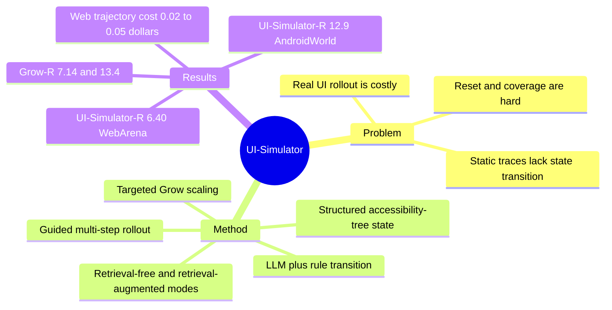

## Summary
UI-Simulator 把 LLM 当作通用 digital world simulator：用结构化 UI state、LLM/rule transition function 和 guided rollout 合成 WebArena / AndroidWorld 训练轨迹。它的关键信号是：在相同真实测试环境暴露下，合成 simulator 经验比直接在真实环境采样更便宜、更可控，并能训练出接近或超过 real-UI 训练的开源 GUI agent。

## Problem & Motivation
真实 web/mobile 环境训练成本高、状态不可控、重置困难、任务覆盖有限。OS-Genesis、WebGym 这类 real-environment pipeline 能提供高真实性，但 rollout 慢且依赖真实环境稳定；纯静态数据又缺少动作后果和状态演化。

UI-Simulator 的问题设定是：能否把 LLM 世界知识转成可扩展、可控的 UI transition simulator，让 agent 在模拟 UI 中练习多步操作，再迁移到真实 WebArena / AndroidWorld？

## Method
**Structured UI state.** Simulator 用 accessibility-tree-like state 表示页面，包括节点文本、bbox、动态属性和可操作元素。这个表示牺牲视觉细节，但便于 LLM 生成状态转移和 agent 学习操作语义。

**Transition function.** 对 click、type、scroll、back 等动作，系统结合 LLM transition 与 rule-based transition。规则处理低风险、可确定的操作；LLM 负责需要语义推断的页面变化。

**Guided rollout and wrapper.** 系统通过 task-conditioned rollout 生成 trajectories，再用 trajectory wrapper 转成可训练数据。UI-Simulator-Grow 进一步做 targeted scaling：找出 base agent 的失败分布，用更强 teacher 引导模拟和训练。

**Retrieval-free vs retrieval-augmented.** Retrieval-free 直接让 LLM 生成新 UI states；retrieval-augmented 从真实或已有 reference states 检索相似状态辅助生成，以提高局部真实性，但也可能过度拷贝无关状态。

## Key Results
- **Main comparison.** UI-Simulator-F 报告 WebArena 6.28 / AndroidWorld 8.6；UI-Simulator-R 为 6.40 / 12.9；UI-Simulator-Grow-R 为 7.14 / 13.4。对照 OS-Genesis 为 6.16 / 9.1。
- **Equal test-env exposure.** 在相同真实测试环境暴露下，OS-Genesis 只有 1.48 WebArena / 5.2 AndroidWorld，而 UI-Simulator-R 约为其 WebArena 4x、AndroidWorld 2.5x。
- **Real-env synthesis ablation.** 直接在真实测试环境中合成经验反而较差：UI-Simulator-F/R 的 "Synthesize in Real Env" 约 4.31 WebArena，AndroidWorld 约 4.7/9.1。
- **Control ablations.** 去掉 step-wise task control 后降到 1.72 WebArena / 5.2 AndroidWorld；去掉 multi-step simulation 后降到 4.06 WebArena / 9.1 AndroidWorld。
- **Cost.** 论文报告 web trajectory 成本约 $0.02（retrieval-free）和 $0.05（retrieval-augmented）；Android 约为其两倍。

## Strengths & Weaknesses
**已知的强点。** 这篇把 synthetic UI simulator 的训练价值讲得很清楚：模拟器不需要完全真实，但必须能提供目标相关、可控、多步的 state transition。它也展示了一个反直觉点：直接在真实环境合成经验不一定优于模拟器，因为真实环境采样不可控、难以覆盖失败分布。

**已知的局限。** 绝对成功率仍低，说明 simulator 经验离可靠 web/mobile agent 还有距离。LLM transition 会产生状态幻觉；retrieval-augmented 可能 over-copy reference state。Accessibility-tree state 对视觉布局、动态脚本、登录状态、异步网络行为的表达有限。

**推测。** UI-Simulator 对训练 infra 的启发不是“用 LLM simulator 替代真实 browser”，而是建立 cost/fidelity ladder：低成本 simulator 用于覆盖失败模式和 pretraining，真实环境用于 calibration、reward grounding 和 final RL。

## Mind Map

## Notes
这篇是“模拟器替代真实 rollout”的关键锚点，和 [[Papers/2511-DreamGym]] / [[Papers/2411-WebDreamer]] 同属 world-model training infra。它对 [[Topics/AgentEnvironment-Survey]] 的补充是：environment engine 不一定只是真实 browser 的工程化封装，也可以是可控的 learned/synthetic transition system。

对 AFE 的直接问题：如果把 UI-Simulator 暴露给 agent 使用，agent 应该知道这是 simulated state 还是 real state 吗？训练 infra 可以容忍 simulator bias，但 agent-facing runtime 如果把模拟状态当真，可能放大 hallucinated affordance。
