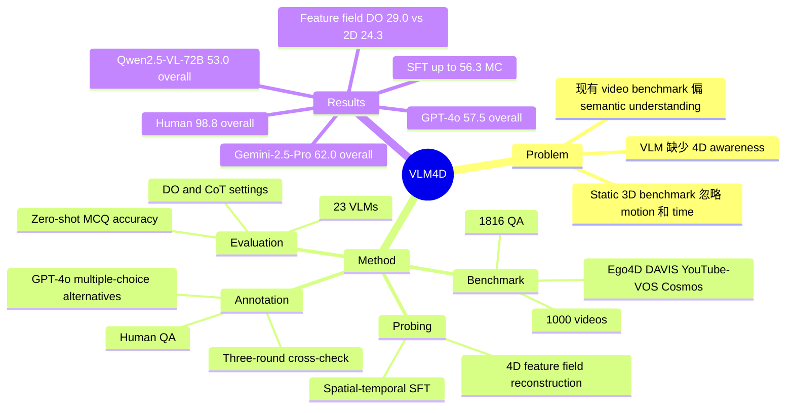

## Summary
VLM4D 提出一个专门评估 VLM spatiotemporal awareness 的 benchmark：1,000 个视频、1,816 个 QA，覆盖 real exo/ego-centric 与 synthetic 视频，以及 translational、rotational、counting、false positive 等问题。对 23 个开闭源 VLM 的 zero-shot 评测显示，最强 Gemini-2.5-Pro 在 VLM4D overall accuracy 只有 62.0%，远低于 human baseline 98.8%，说明现有模型很难稳定把 2D frame sequence 整合成 3D space + time 的动态表示。论文还用 spatial-temporal SFT 与 4D feature field reconstruction 做 probing，显示 targeted data / reconstruction 有帮助，但提升受 synthetic data quality 与 per-scene optimization 约束。

## Problem & Motivation
作者要解决的问题是：当前 VLM 虽然在 image QA、video captioning、general video understanding 上快速进展，但这些能力不自然等价于 4D spatiotemporal reasoning。论文把 4D 定义为 3D space + time，核心难点包括从 camera perspective / object perspective 中 disentangle motion、跟踪 translational / rotational movement、维持 temporal continuity，并识别问题中描述的事件是否真的发生。

这个问题重要，是因为 embodied AI、robotics、interactive AI systems 都需要理解动态环境，而不是只识别单帧语义。作者指出现有 video benchmark 多评估 perception / semantic understanding，较少显式考察 spatial-temporal awareness；已有 3D visual-spatial benchmark 又偏 static 3D scene，忽略 object motion 与 temporal dynamics。因此，论文的动机不是再做一个通用 video QA 榜单，而是用更窄、更锋利的任务暴露 VLM 在 motion + perspective + time 上的缺口。

## Method
VLM4D 的核心是 benchmark construction + model evaluation + solution probing，而不是一个新的 VLM 架构。

**Benchmark 构建。** VLM4D 包含 1,000 个视频和 1,816 个 QA，其中 real samples 为 600 个视频 / 1,371 个 QA，synthetic samples 为 400 个视频 / 445 个 QA。数据来源上，real third-person videos 来自 DAVIS 和 YouTube-VOS，real first-person videos 来自 Ego4D；synthetic videos 用 Cosmos 生成，并加入 bounding boxes 作为 spatial guidance，使生成结果更贴合指定 object trajectory。论文给出的组成比例是 37.5% exo-centric、37.5% ego-centric、25% synthetic；annotation type 比例是 55% translational、19% rotational、17% counting、9% false positives。

**数据质量控制。** Real videos 会被 temporally segmented 并围绕关键 action 居中，平均时长 3-8 秒；synthetic videos 平均 5 秒，并经过人工过滤。QA 主要由 human annotations 构建，再用 GPT-4o 补充 multiple-choice alternatives；作者使用 three-round、multi-person cross-checked verification 来过滤 ambiguous videos、修正 vague / misleading / incorrect QA，并对 temporal alignment 做质量控制。Human baseline 来自参与者独立回答随机抽取的 100 个问题。

**评测设置。** 论文评估 23 个 VLM，包括 GPT-4o、Gemini-2.5-Pro、Claude-Sonnet-4、Grok-2-Vision，以及 Llama 4、Qwen2/2.5-VL、InternVL2.5、InternVideo2/2.5、VideoLLaMA3、LLaVA 系列等 open-source models。评测是 zero-shot，输入为 video 或 sampled frames；每个模型测 direct output (DO) 与 chain-of-thought (CoT) 两种 setting。指标是 MCQ accuracy；CoT 输出用 GPT-o3 和 o4-mini 作为 LLM-as-Judge，并人工处理 disagreement。

**Solution probing。** 作者探索两条方向。第一是 spatial-temporal SFT：在 real dataset 上按 80% / 20% 随机拆分 train/test，用 Qwen 2VL (7B) 和 Qwen 2.5VL (7B) 通过 LLaMA-Factory 分别尝试 real、synthetic、real+synthetic fine-tuning。第二是 4D feature field reconstruction：在 DAVIS 2016 的 50 个视频子集上，用 Feature4X 把 InternVideo2 的 2D feature space 沿 time 维度 lift 成 temporally coherent 4D feature field，并比较 original 2D video、rendered global-view video、reconstructed global feature field 三种输入。

## Key Results
- **VLM4D benchmark 主表。** Human Performance 在 VLM4D overall accuracy 为 98.8%，random selection 为 24.1%；最强 proprietary model 是 Gemini-2.5-Pro，overall 62.0%，其次是 GPT-4o 57.5%、Claude-Sonnet-4 51.3%、Grok-2-Vision 49.8%。这说明即使是最强闭源模型，也距离人类有 36.8 个百分点的 gap。
- **Open-source baselines。** VLM4D overall 上，open-source image VLM 中 Llama-4-Scout-17B 为 54.1%、Llama-4-Maverick-17B 为 53.6%；open-source video VLM 中 Qwen2.5-VL-72B 为 53.0%、InternVideo2.5-8B 为 50.7%。论文据此指出，部分开源模型已接近或超过一些闭源模型，但整体仍远低于 human baseline。
- **Real vs synthetic / ego vs exo 差异。** Gemini-2.5-Pro 在 real average 上为 63.5%，synthetic average 为 57.3%；GPT-4o 在 real average 上为 60.0%，synthetic average 为 49.9%。同一模型在 real / synthetic、ego-centric / exo-centric 上差异明显，支持作者关于 current models lack generalized spatiotemporal understanding 的结论。
- **Spatial-temporal SFT probing。** 在 VLM4D real subset 的 80% / 20% split 上，Qwen 2VL (7B) 从 38.3 MC 提升到 real fine-tuned 54.5、synthetic fine-tuned 42.5、real+synthetic 55.5；Qwen 2.5VL (7B) 从 43.4 提升到 real 55.6、synthetic 48.6、real+synthetic 56.3。已知结论是 targeted SFT 有效；但 synthetic-only 明显弱于 real fine-tuning，作者也指出 synthetic data quality 很关键。
- **4D feature field probing。** 在 DAVIS 2016 的 50-video subset 上，InternVideo2 使用 CoT 时 original 2D video 为 36.0、global view video 为 32.7、global feature field 为 37.4；direct output 时分别为 24.3、23.8、29.0。reconstructed global feature field 在两种 response setting 下都最高，但论文也明确指出当前方法需要 per-scene optimization，generalizability 和计算成本受限。
- **Failure / ablation signals。** CoT 对所有模型没有显示出稳定的大幅优势；作者观察到部分 CoT reasoning 包含 irrelevant information，甚至 final answer 与 reasoning 矛盾。对 2,092,803 个 video instruction tuning samples 的分析显示，包含 target strings 的 caption 有 1,164,006 条，占 55.6%；但在 ShareGPT4Video 中抽取 100 个被检测为 spatiotemporal 的 labels 后，人工评估准确者少于 10%，说明常见 dense captioning 数据中的 spatiotemporal labels 可能大量不精确。

## Strengths & Weaknesses
**已知。** VLM4D 的最大价值是 problem formulation 很清楚：它不是泛泛地问 video understanding，而是把 motion direction、rotation、perspective awareness、counting、false positive event 这些具体能力拆出来测。数据构建也相对认真：real / synthetic 两类来源、ego / exo 两种视角、人工 QA 与 three-round cross-check，使 benchmark 比纯 LLM 生成的评测更可信。实验覆盖 23 个模型，并给出 human / random baselines；主结论不是某个模型 SOTA，而是当前 VLM 与人类 4D awareness 的系统性 gap。

**已知。** 局限也很明确。第一，任务是 MCQ，accuracy 与 LLM-as-Judge 可以高效评测，但可能掩盖 open-ended spatial description、trajectory reconstruction、continuous control 所需的细粒度误差。第二，CoT 失败分析主要是 behavioral observation，没有深入到视觉 token、temporal attention 或 representation 层面解释为什么模型把 visual evidence 与 language reasoning 接不起来。第三，SFT 与 4D reconstruction 只是 probing：SFT 使用 real subset 的 random split，不能直接证明跨数据源泛化；4D feature field 虽然有效，但 per-scene optimization 让它更像昂贵后处理，而不是可直接 scale 到在线 agent 的方法。

**推测。** 对 GUI agent / computer-use agent 的启发是：动态 GUI 的状态转移虽然不是物理 4D 场景，但同样需要 temporal continuity、camera/screen-frame awareness、false positive event checking 和 object/state tracking。VLM4D 的 framing 可以迁移成 GUI-video benchmark 的设计原则：不要只问单帧 OCR / icon recognition，而要问某个控件是否移动、窗口是否切换、操作前后状态是否连续、目标事件是否真的发生。

**不知道。** 论文正文页眉给出 project page，但没有在正文中明确给出 GitHub/code link，因此 frontmatter 的 code 留空；是否已经公开数据下载、评测脚本或 leaderboard，需要另查 project page，不能仅从论文正文断言。论文也没有给出更细的 human study 人数、inter-annotator agreement、每类问题的完整数值表，只在 supplementary 中给出 Figure A 的类别可视化，因此不能过度解释某一类 motion task 的精确失败幅度。

## Mind Map

## Notes
这篇论文更像一个诊断 benchmark，而不是方法论文；它的重要性在于把 VLM 的 spatiotemporal grounding 问题从“视频模型分数不够高”重新表述为“模型没有可靠构建 3D + time 的动态场景假设”。对 embodied / interactive agents 来说，最值得跟进的不是表格上的模型排名，而是两个 negative signal：CoT 不能稳定修复 motion reasoning，现有 video SFT caption 里大量 spatiotemporal descriptors 可能并不准确。后续如果要把这条线接到 GUI agent，可以考虑设计 GUI4D-style tasks：状态变化方向、视角/窗口坐标系转换、事件不存在检测、跨时间 object identity tracking，并避免只用 MCQ 来衡量动态理解。
