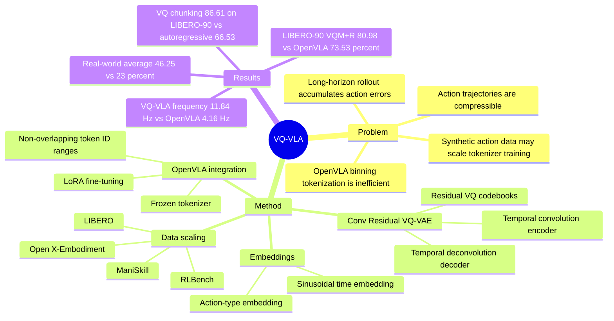

## Summary

VQ-VLA 研究 VLA 中 action tokenization 的 scaling：用 convolutional residual VQ-VAE 把连续多步 robot action sequence 压缩成离散 action tokens，再替换 OpenVLA 的 per-dimension binning tokenizer。核心证据是，使用更大规模的 synthetic trajectory data 训练 action tokenizer 后，OpenVLA 在 LIBERO 和真实 Franka manipulation tasks 上成功率、推理频率和 long-horizon 表现都有提升。

## Problem & Motivation

OpenVLA 等 VLA models 通常把连续 action 的每个维度离散到固定 bins，再由 language-model-style next-token prediction 输出动作；这种表示简单，但会把连续、时序相关的动作拆成大量 token，既影响 inference speed，也容易在 long-horizon rollout 中累积误差。作者的动机是：action trajectory 具有 spatio-temporal continuity，理论上比图像 patch 或语言 token 更容易压缩，因此一个高质量 action tokenizer 可能同时改善 VLA 的表示精度和执行效率。

论文进一步关注 action tokenizer 的 scaling 问题，而不是只提出一个新 tokenizer。作者的关键假设是 synthetic action trajectories 与 real-world action trajectories 的 domain gap 较小，因此可以用 LIBERO、ManiSkill、RLBench 等 simulated data 扩大 tokenizer 训练集，而不必等比例收集昂贵的真实机器人数据。这个假设在文中主要由 LIBERO simulation、Franka real-world tasks 和 Sim&Real domain gap analysis 支撑。

## Method

**Overall pipeline.** VQ-VLA 分两阶段训练：第一阶段训练一个 general convolutional residual VQ-VAE action tokenizer；第二阶段冻结该 tokenizer，把它接入 OpenVLA 7B，用 LoRA fine-tuning 让 VLM 直接预测 VQ-VAE 的 discrete action tokens。VQ-VAE decoder 再把预测出的 tokens 解码成连续动作序列，包括 XYZ positions、Euler angles / orientation 和 gripper states。

**Convolutional residual VQ-VAE.** 输入是 action sequence `a_{t:t+n} in R^{n x d}`。Encoder 使用 2D temporal convolutional layers，而不是简单 MLP，把动作序列编码成 latent embedding；Residual Vector Quantization 把 latent 分解为多层 codebook residuals；Decoder 用 2D temporal deconvolutional layers 重建动作序列。训练目标由 reconstruction loss、VQ codebook loss 和 commitment loss 组成，论文实验中 loss weight `lambda=4`。

**Embedding design.** 在 action sequence 进入 encoder 前，作者加入两类 embedding：sinusoidal time embedding 用于表达不同频率的 temporal pattern；learnable action-type embedding 用于区分 action vector 中 XYZ、Euler angles、gripper states 等不同维度的语义。后续 ablation 显示 embedding 对 LIBERO-90 和真实任务有小幅正收益。

**VLA integration.** 与 OpenVLA 把动作 token 都映射到 `[0,255]` 不同，VQ-VLA 给不同 residual VQ layer 分配 non-overlapping token ID ranges：第 `i` 层 offset 为 `(i-1)*256`，避免不同层中相同 ID 被误认为同一语义。训练 OpenVLA 时，loss 仍是 next-token cross entropy，只是 ground-truth token 来自 frozen Residual VQ-VAE encoder。

**Data scaling strategy.** 论文报告了多种 tokenizer training data 组合：方法部分描述 Open X-Embodiment、Open X-Embodiment+LIBERO、Open X-Embodiment+LIBERO+ManiSkill；simulation 部分为避免 LIBERO-90 evaluation 的 in-domain inflation，又用 out-of-domain ManiSkill 与 ManiSkill+RLBench 训练 tokenizer；real-world 部分则比较 VQO、VQO+L、VQO+L+M。已知结论是更多 synthetic trajectories 通常带来更好 tokenizer；但各实验段落的数据命名不完全统一，复现时需要核对具体配置。

## Key Results

- **LIBERO-10 / LIBERO-GOAL architecture ablation（2026-09-03 更正）.** Original OpenVLA 在 LIBERO-10 / LIBERO-GOAL 上为 **51.0% / 75.8%**。Table 1 完整对照为：MLP Residual VQ-VAE 在 ALL-LIBERO / LIBERO-10 / LIBERO-GOAL 三种 tokenizer 训练集下分别是 **53.4 / 72.6**、**53.2 / –**、**– / 65.2**；Conv Residual VQ-VAE 对应 **60.0 / 75.2**、**54.0 / –**、**– / 72.4**。作者据此认为 temporal convolution 比 MLP 更适合作 action tokenizer encoder/decoder，扩大到 ALL-LIBERO 时收益最大。**但 Conv 的最佳 LIBERO-GOAL（75.2）仍低于 Original OpenVLA 的 75.8**——架构收益只在 LIBERO-10 上成立。
- **LIBERO-90 simulation scaling.** 在 LIBERO-90 上，OpenVLA baseline 为 **73.53%**；只用 ManiSkill 训练的 VQM 为 **14.38%**；用 ManiSkill+RLBench 训练的 VQM+R 达到 **80.98%**，比 baseline 高 **7.45 percentage points**。这个结果同时说明 data scale 有帮助，也暴露出只用 ManiSkill 的 tokenizer 会严重退化。
- **Real-world Franka tasks.** 真实平台为 Franka Research 3 + fixed RealSense D435，6 个 manipulation tasks，每个任务 50 demonstrations、20 trials。全任务平均 success rate 从 baseline **23%** 提升到 VQO+L+M 的 **46.25%**；"Flip the pot upright" 任务提升 **30 percentage points**；long-horizon "Put all cups in the basket" / "Put the toy into the drawer" 中，baseline 为 **15% / 5%**（原笔记误记为 ~0%），VQO+L+M 达到 **50% / 30%**，即 +35 / +25 pp。注意 abstract 的头条措辞 "up to 30% higher success rate on two long-horizon tasks" 与此对不上——30 pp 是短程任务 *Flip the pot upright* 的增幅。
- **Sim&Real domain gap analysis.** 在三个真实任务上，baseline / VQO / VQL / VQO+L / VQO+L+M 的结果分别为：Put the toy into the drawer **5.0 / 15.0 / 10.0 / 10.0 / 25.0%**，Flip the pot upright **30.0 / 45.0 / 55.0 / 45.0 / 60.0%**，Put the toy into the basket **20.0 / 35.0 / 35.0 / 35.0 / 45.0%**。VQL 只用 LIBERO 训练却与 VQO、VQO+L 接近，是作者提出 synthetic-real action domain gap 较小的主要证据之一。
- **Inference speed.** 在真实实验中，VQ-VLA 的 action execution frequency 为 **11.84 Hz**，OpenVLA 为 **4.16 Hz**；论文把这个近三倍提升归因于 VQ-VAE 以 compression ratio 5 解码多步 action sequence，而不是逐步预测单个 action。
- **Action chunking ablation.** 在 LIBERO-90 / Flip the pot upright / Put the toy into the basket 三个任务上，baseline 为 **74.76% / 30.0% / 20.0%**；OpenVLA autoregressive output chunking 降到 **66.53% / 10.0% / 0.0%**；VQ-based chunking (VQO+L+M) 达到 **86.61% / 60.0% / 45.0%**。这说明收益不是简单来自输出 K=5 action chunk，而是 VQ-based action representation 本身更有效。
- **Embedding ablation.** VQO+L 不加 embeddings 时，在 LIBERO-90 / Flip the pot upright / Put the toy into the basket 上为 **85.17% / 40.0% / 35.0%**；加入 time embedding 和 action-type embedding 后为 **86.16% / 45.0% / 35.0%**。
- **补充材料中的内容（2026-09-03 补，原笔记完全遗漏）.** (a) RVQ 具体配置：4 组 codebook × 256 entries、embedding dim 128、k-means 初始化，合计 1024 个 action token——正文"覆写 256 个最少使用 token"的说法与此从未对齐。(b) Supp Table 8 在两个真实任务上**确实**比较了外部 tokenizer（tokenizer 全部 zero-shot、只微调 OpenVLA backbone）：FAST **20 / 5**、QueST **10 / 0**、VQ_{O+L+M} **65 / 20**。(c) Supp Table 9 的 "scratch end-to-end head" 在 LIBERO-90 上只有 **2.91%**（UniAct 61.69、VQ head 86.16），这个数字更像基线实现坏了而非有效对照。(d) LIBERO-Long **55%** vs OpenVLA 51%。(e) 一条被埋起来的负结果：**VQ_O 在 LIBERO-90 上 71.93%，低于 binning baseline 的 73.53%**——即只用真实 OXE 数据训的 tokenizer 反而不如原始 binning。

## Strengths & Weaknesses

**已知 Strengths.** 这篇的主要价值在于把 VLA efficiency 和 long-horizon reliability 归结到 action representation/tokenization，而不是只继续扩大 VLM backbone。方法上，frozen action tokenizer + LoRA fine-tuning OpenVLA 是相对简洁的接口，能直接替换 OpenVLA 的 binning tokenization；实验也覆盖 LIBERO simulation、真实 Franka tasks、inference frequency、action chunking 和 embedding ablation。对 embodied/VLA 研究来说，"scaling action tokenizer with cheap synthetic trajectories" 是一个值得关注的问题 formulation。

**已知 Weaknesses / boundary（2026-09-03 重划边界）.** 外部 tokenizer 对照**存在但极薄**：supp Table 8 在两个真实任务上比过 FAST（20/5）与 QueST（10/0），缺的是 π0-FAST、OpenVLA-OFT、以及任何 diffusion / flow-matching action head，且 n=2 tasks 不足以支撑一般性结论（原笔记"没有系统比较 FAST"的说法过强，已更正）。

更实质的问题是 **chunking confound 只被弱控制**：baseline OpenVLA 每次推理出 1 个 action，VQ-VLA 出 5 个。唯一的 chunking 对照（Table 5 的 "Autoregressive Output"）让 binning tokenizer 自回归吐 5 个 action，结果直接崩掉（66.53 / 10.0 / 0.0 对 baseline 74.76 / 30.0 / 20.0）——这只说明他们的 autoregressive chunking 实现很差，不能证明收益来自 VQ 表示本身；并行解码的 binning chunk（OpenVLA-OFT 式）从未跑过，baseline 也没做 bin 数 sweep。

**"Scaling" 的自变量其实是数据组成而非规模，且全文没有 scaling curve**：仿真侧只有两点（VQ_M 14.38%、VQ_{M+R} 80.98%），真实侧三点（短程均值 34.5 → 35.0 → 46.25），没有以数据量为横轴的图，也没有拟合。引言的 "linear scaling properties" 无任何证据支撑，还被自家数据反驳——VQ_M 崩到 14.38%，而语料最大的真实数据 VQ_O 在 LIBERO-90 上 71.93% 低于 binning baseline。"100× more data" 的说法既未给出先前 tokenizer 的数据量，也从未报告自己训练集的绝对轨迹数。

**Reconstruction 从未被测量。** 正文、补充材料与 arXiv v1 均无 reconstruction MSE/L1、无 codebook utilization 或 perplexity、无 jerk / 频谱平滑度指标。tokenizer 只被"通过下游 policy"间接评估，因此 abstract 的 "smoother and more coherent action outputs" 是未量化的措辞，VQ_M 那次 14.38% 的崩塌也无法区分是重建失败、codebook collapse 还是 token 预测失败。2.85× 提速只有一个端到端控制频率数（11.84 vs 4.16 Hz），无延迟分解、无 tokens-per-chunk。

真实实验规模仍小：6 tasks、50 demos、20 trials、单 Franka Research 3、固定 D435、20 Hz；未报告 seed、逐 trial 物体位置随机化、是否交错评测、是否重复运行、误差棒。一次 trial 即 5 pp，因此 "sim-real domain gap is minimal" 整个论点建立在三个任务上 0–10 pp（即 0–2 次 trial）的差异上——这个证据既不能确认也不能否定一个小 gap。

**局限与 failure cases.** 原文明确列出未来工作：action tokenizer 可以扩展到更大规模 simulated datasets，如 RLBench/CoppeliaSim；multi-step decoding 带来的 speedup 还可与 VLM distillation、quantization 结合；tokenizer architecture 也可继续改进，例如把 action data frequency 作为额外条件。文中还报告了一个负结果：只用 ManiSkill 训练的 VQM 在 LIBERO-90 只有 **14.38%**，远低于 OpenVLA baseline **73.53%**，说明 synthetic data 并非越多越好，数据覆盖与分布组合很关键。

**推测.** 对 GUI-agent / computer-use agent 的间接启发是：如果 action space 具有强时序连续性或可组合 skill chunks，学习 action tokenizer 可能比逐 token 输出低层 action 更稳定。但这是从机器人连续控制外推，论文没有在 GUI grounding、web/mobile agent 或离散 UI action benchmark 上验证。

**不知道.** 不知道 VQ-VLA 的失败样本具体来自 perception、language grounding、tokenizer reconstruction error、VLM token prediction error 还是 low-level control mismatch；论文没有给出 systematic failure case taxonomy。DOI 在正文中未见。

（原笔记此处写"不知道 code / project website URL"，已更正：project page `https://xiaoxiao0406.github.io/vqvla.github.io` 印在 PDF 第 1 页，代码在 `https://github.com/xiaoxiao0406/VQ-VLA`，MIT License，权重在 HF `VQ-VLA/vq-vla-weight`。）

## Mind Map

## Notes

- 对 VLA 方向最有用的 takeaway：action tokenizer 本身可以作为可 scaling 的模块，而不必每次都扩大 policy/VLM backbone；尤其当动作轨迹可压缩、synthetic trajectories 便宜时，这条路线有工程吸引力。
- 需要谨慎的地方：论文把 "synthetic-real domain gap is minimal" 写得较强，但目前证据更多是 success rate 层面的间接证据；如果要作为后续研究假设，应补充 tokenizer reconstruction error、token usage distribution 和 failure cases。
- 复现关注点：先核对不同实验中 VQO/VQO+L/VQO+L+M、VQM/VQM+R 对应的数据组合；其次确认 action frequency、chunk length K=5、codebook layers/token ID offset 与 OpenVLA vocabulary replacement 的实现细节。

### 2026-09-03 更正记录

本笔记源自 2026-07 的 venue backfill（commit `90bfc9c`），当时只读了 CVF listing / abstract，未取正文与补充材料，因此存在多处错误。本次由 daily-papers run `daily-20260903-1405` 的 digest preparer 对照 CVF camera-ready + supplementary 逐条核查后更正：

| # | 原笔记 | 更正 |
|:--|:--|:--|
| 1 | Table 1 的 ALL-LIBERO `60.0 / 75.2` 归给 **MLP** | rowspan 显示这是 **Conv** 的数字；MLP+ALL-LIBERO 为 `53.4 / 72.6`。原写法与紧随其后的"Conv 比 MLP 更适合"自相矛盾 |
| 2 | "没有系统比较 FAST" | supp Table 8 比过（FAST 20/5、QueST 10/0、VQ 65/20），应改为"对照极薄"而非"没有" |
| 3 | "不知道 code / project website URL" | 两者都印在 PDF 第 1 页 |
| 4 | drawer 任务 baseline ~0% | 实为 5% |
| 5 | `arxiv_id: 2507.01016v1` | 去掉非标准的 `v1` 后缀 |
| 6 | 补充材料完全缺失 | 已补 RVQ 配置、supp Table 8/9、LIBERO-Long、VQ_O 71.93% 负结果 |

**论文自身的内部不一致（6 处，均经独立核查确认）**：(a) LIBERO-90 baseline 在 Table 2 / supp Table 7 是 73.53，在 Table 5 是 74.76；(b) Table 5 把 LIBERO-90 的 86.61 归给 VQ_{O+L+M}，而 supp Table 7 该格标 "–"（从未跑过）并给出 VQ_{O+L} = 86.16；(c) Table 3 与 supp Table 7 在 drawer 任务两格上不一致（10/25 对 15/30）；(d) ManiSkill 在 §4.1.3 是"30,000 action sequences"、§4.2.2 是"120k synthetic trajectories"，而"比 LIBERO 大 50×"与两者都对不上；(e) Fig. 3 caption 称两个 horizon 的差距"都是"23.25 pp，实际长程是 30 pp；(f) abstract 的"两个长程任务上最高 +30%"与任何长程增幅都不符。camera-ready 的 supp C.4 还留着 rebuttal 原文（承诺做某实验并在相邻句里报告结果），Table 2 行标签仍写作 "LIEBRO-90"。

本笔记 `verification_status: partial`——上述更正逐条对照过原文，但笔记整体尚未按 Evidence Ledger 格式重写；若要把它当证据引用，应先补 ledger。
