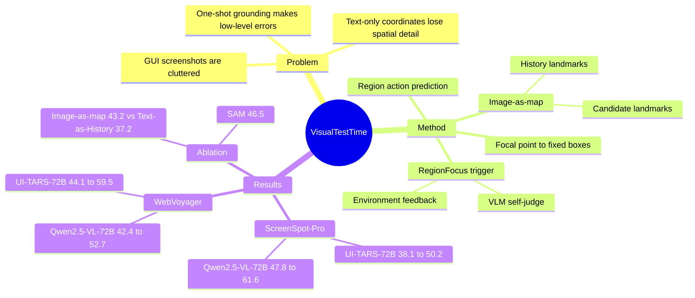

## Summary
RegionFocus 是一个用于 GUI agent grounding 的 visual test-time scaling 方法：当初始 action 可能出错时，它让 VLM 先提出 focal point，再围绕该点生成局部 region、分别预测区域 action，并用 image-as-map 的视觉 landmark 聚合候选动作与记录历史。论文在 ScreenSpot-Pro 和 WebVoyager 上把这个 plug-in 接到 UI-TARS 与 Qwen2.5-VL，最强结果是 Qwen2.5-VL-72B + RegionFocus 在 ScreenSpot-Pro 达到 61.6% avg，UI-TARS-72B + RegionFocus 在 WebVoyager 达到 59.5% overall。

## Problem & Motivation
论文关注的是 VLM-based GUI agents 的低层 grounding 错误：真实 GUI 截图包含大量 irrelevant elements、相近按钮、广告、菜单栏和小 icon，one-shot 使用整张截图时容易点击空白区域或错误组件。作者认为这类低层错误会在长程 web/OS interaction 中累积，因为初始错误之后通常没有有效 feedback loop 来纠正。

现有 GUI agent 大致分为 text-based reasoning 和 vision-based inference。text-based 方法依赖 HTML、accessibility tree、文本标签或 bounding box，可能漏掉视觉上关键但文字描述不充分的信息；vision-based 方法直接用 VLM 看整屏，但容易被背景噪声和过宽视觉注意力干扰。RegionFocus 的动机是把额外 test-time compute 分配到“可能出错且视觉上拥挤”的局部区域，而不是只增加语言推理步骤。

## Method
RegionFocus 是 inference-time plug-in，不需要 retraining，也不改变原 GUI agent 的主体 workflow。标准路径先让 agent 基于整张截图预测 action；当触发条件出现时，进入 RegionFocus 分支，最后输出一个 refined single-step action 回到原 pipeline。

触发条件有两类。对可交互网页环境，触发可以来自环境反馈，例如点击 non-interactive/empty element、重复失败动作或 action parsing error；对 ScreenSpot-Pro 这类只有静态截图的场景，论文使用 VLM self-judge：先把初始预测点用 pink-star landmark 标出来，再让模型判断该点是否正确，若错误则启动 RegionFocus。作者明确承认 VLM judgment 并非总是准确，但实验中能帮助识别并缓解错误。

Region proposal 不是直接让 VLM 预测完整 bounding box。作者观察到 VLM agents 能较稳定地产生靠近目标元素的 focal point，但直接预测 bounding box 较困难；因此主实验采用 fixed-ratio boxes，围绕 focal point 生成若干预定义 region。附录给出的比例为 `[0.5, 0.5]`、`[0.3, 0.3]`、`[0.4, 0.8]`、`[0.8, 0.4]`。在 WebVoyager 这类可交互环境中，agent 可以 zoom in 到高分辨率局部视图；若不能交互，则 crop 原图 region 并 upsample。

每个 region 会独立进行 action prediction，然后通过 action aggregation 选择一个最终 action。对 click/scroll 等 coordinate-based actions，论文把候选坐标以 landmark 标在截图上，让模型直接在图上比较候选位置，而不是只读文本坐标。这个机制也被作者称为 image-as-map：一方面用 numbered pink stars 记录同一 UI image 上已经探索过的 focal points，避免重复访问；另一方面在 action aggregation 中把多个候选点可视化，帮助区分非常接近的 GUI elements。landmark 只用于 RegionFocus 组件，原始 agent inference 仍接收未修改的截图；一旦页面发生有效状态变化，history 会被刷新。

## Key Results
**ScreenSpot-Pro。** 在高分辨率专业桌面 GUI grounding benchmark 上，Qwen2.5-VL-72B 从 47.8% avg 提升到 61.6% avg；细分为 text avg 64.9% → 78.6%，icon avg 20.2% → 34.1%。UI-TARS-72B 从 38.1% avg 提升到 50.2% avg；text avg 50.9% → 64.0%，icon avg 17.5% → 28.0%。UI-TARS-7B + RegionFocus 达到 41.2% avg，高于 UI-TARS-72B baseline 的 38.1%，说明额外视觉 test-time compute 在该 benchmark 上可以部分弥补 model scale。

**WebVoyager。** 在 15 个真实网站、643 个 web tasks 的 benchmark 上，UI-TARS-72B overall 从 44.1%±0.5% 提升到 59.5%±0.1%；UI-TARS-7B 从 33.2%±0.5% 提升到 44.7%±0.5%；Qwen2.5-VL-72B 从 42.4%±0.5% 提升到 52.7%±1.1%；Qwen2.5-VL-7B 从 32.5%±1.3% 提升到 41.1%±1.2%。但提升不是每个 site/model pair 都单调成立：例如 UI-TARS-72B 在 ArXiv 从 64.9%±4.1% 降到 50.3%±3.6%，Qwen2.5-VL-7B 在 Google Map 从 30.2%±1.5% 降到 17.1%±1.2%。

**Ablation。** 在 WebVoyager subset 上，image-as-map 得分 43.2，高于 Text-as-History 的 37.2；Fixed-BBox 为 43.2，高于直接 Predict-Region 的 28.1；引入 SAM 后达到 46.5，说明更好的 point-based segmentation 可以进一步减少背景噪声。增加 test-time thinking budget 也有收益：UI-TARS-7B 的最大 browser-interactive step limit 从 100 增至 300 时，性能从 43.2 提升到 45.3，但边际收益递减。

**Overhead / behavior analysis。** WebVoyager 上，BaseModel + RegionFocus 比 BaseModel alone 平均多 19.74% actual browser-interactive steps，并对应 overall success rate 高 34.3%；RegionFocus 在 61.7% trajectories 中被触发，触发 trajectory 平均触发 5.84 次，平均 overhead 为 66.8%。在 32.3% 的 triggered cases 中 RegionFocus 只触发一次，但这一次触发带来 83.7% success improvement。ScreenSpot-Pro 上，RegionFocus 对 72B 和 7B 模型的触发比例分别为 60.2% 和 33%；72B 若并行执行 region predictions，overhead 为 180%，若顺序执行为 360%。

## Strengths & Weaknesses
**已知。** 论文最强的地方是把 GUI grounding 的一个核心痛点 formulation 成 visual test-time scaling：不是训练一个新模型，而是在出错时局部放大、候选生成、视觉化聚合。这个想法简单、模块化，并且在 UI-TARS 与 Qwen2.5-VL 两类开源 VLM agent 上都有效；ScreenSpot-Pro、WebVoyager 和 ablation 的数字共同支持“image-as-map 比纯文本坐标历史更适合 VLM agent”的结论。

**已知。** 主要代价是推理成本和系统复杂度。每次触发需要 1 次 focal-point proposal、4 次 region action prediction 和 1 次 action aggregation；即使 region prediction 可以并行，ScreenSpot-Pro 72B 的 180% overhead 也不是小代价。WebVoyager 结果还受 bot blocking 与 intermittent VPN issues 影响，论文认为解决这些因素可进一步提升 performance，但这也意味着在线评测的稳定复现难度较高。

**已知。** failure cases 包括：目标元素当前不可见、页面有相关但不可点击的文本、RegionFocus 提出错误 focal point、正确 focal point 下所有 region action prediction 仍失败、action aggregation 选择了非最优候选，以及 general reasoning failure、bot detection 或达到最大 step limit。作者也指出，对于当前页面上根本不可见、需要 scrolling 才能看到的元素，zoom 当前页面并不会有帮助。

**推测。** RegionFocus 的收益可能主要来自两个互补机制：局部放大降低视觉 clutter，image-as-map 把空间选择问题从“解析坐标文本”转换为“比较图上 landmark”。因此它更适合高分辨率、元素密集、候选点很接近的 GUI grounding；在目标需要先滚动、跨页导航或强语义推理的任务上，单纯视觉聚焦的边际收益可能下降。

**不知道。** 论文没有给出 self-judge 的系统性准确率、不同 failure category 的定量占比、完整 latency/cost 分布，或在 mobile GUI / real desktop OS execution 中的端到端复现结果。代码在论文中写的是 will be released publicly，但仅根据论文文本无法确认当前仓库状态。

## Mind Map

## Notes
这篇论文的 insight 不在“更聪明地规划”，而在把视觉 grounding 的 test-time compute 用到更合适的空间尺度上。对 GUI-agent research 来说，它给了一个很实用的判断：当 action failure 来自视觉局部歧义时，zoom/crop + candidate visualization 可能比继续让模型解释整屏更有效；但当 failure 来自不可见元素、不可交互文本或长程语义规划时，RegionFocus 本身不是完整解法。
