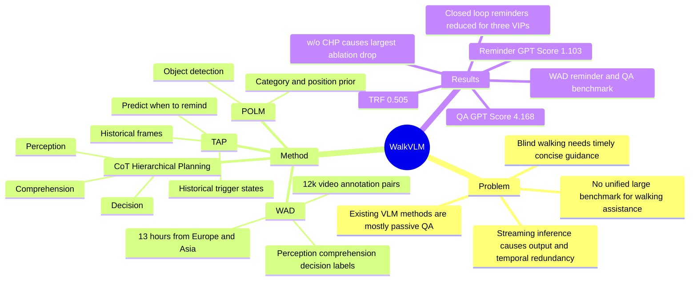

## Summary
WalkVLM 面向 blind walking assistance，把 VLM 从被动 QA 改造成能在 streaming video 中主动、简洁、适时提醒的 walking guidance model。论文贡献包括 Walking Awareness Dataset (WAD) 以及基于 CoT-based hierarchical planning、Priori-Object Location Module (POLM) 和 Temporal-aware Adaptive Prediction (TAP) 的 WalkVLM。

## Problem & Motivation
作者指出全球约 2 亿人存在不同程度的视觉障碍，其中约 3600 万人为完全失明，walking assistance 是高价值场景。已有 vision-based assistance 大致分为 detection-based 与 semantic-based：前者偏障碍物检测，后者多是 VLM 对用户问题做 image/visual QA，难以主动给出 walking reminders。现有相关研究还依赖小规模 self-curated QA 数据集，缺少公开、统一的 training/evaluation benchmark。盲人行走场景要求 streaming video analysis、低冗余、低延迟、信息足够具体；通用 VLM 容易输出过长、重复且推理效率不足。

## Method
论文先构建 Walking Awareness Dataset (WAD)：约 13 小时 walking videos，来自欧洲和亚洲 10 个地点；20% 为 annotator recording，其余来自 YouTube；摄像头位于胸口高度，焦距 13mm/20mm/26mm，分辨率 1080p 到 4K，60 FPS。WAD 包含 12k video-annotation pairs，并为每个 video clip 抽取 10 个 keyframes，形成 120k image-level samples；作者还报告了 3.47M instances。主文称测试集选取 1.5k samples，附录进一步说明测试集包含 1007 reminders 与 134 QA pairs。

Annotation 分为 perception / comprehension / decision 三层。Scene annotation 标注 weather condition、location type、traffic flow rating、danger level、scene description，并用 Detic 做 preliminary object detection 后人工复核。Response annotation 来自 blind test experiment：一人戴眼罩行走，另一人在后方口头引导，作者据此归纳 6 类 reminder：obstacle、intersection、road clear/narrow、oncoming vehicle/person、road departure warning、identifier；QA 分为 scene perception、road inquiry、detailed consultation。提醒中的距离以 5-step scale 表示，方向用 clock position 表示；文本经 GPT/Llama normalization 与人工验证来降低冗余和偏差。

WalkVLM 以 MiniCPM-V2.6 (8B) 为基座，使用 LoRA fine-tuning，rank=64，video stream sampling rate=2 FPS，historical frames=3，TAP 的 visual extraction backbone 为 ConvNext3D。CoT-based hierarchical planning 把 generation 分成三层：perception 提取静态视觉属性和 POLM 目标先验；comprehension 融合局部检测、静态属性与场景信息形成 scene summary；decision 输出 visual QA 或 concise reminder。POLM 先用 generic object detector 找目标，再按 size/confidence 过滤，用目标类别与位置帮助模型关注潜在危险。TAP 用历史帧和历史 trigger state 预测当前是否触发 VLM，trigger level 对应 WAD 的 danger level，用于减少每帧推理与时间冗余。

## Key Results
在 WAD benchmark 的 reminder generation / QA task 上，WalkVLM 相比 LLaVa、DeepSeek-VL、Yi-VL、MiniCPM-V2.6、Qwen2-VL、GPT-4o 以及若干 fine-tuned baselines 取得主要最好结果。Reminder task 上，WalkVLM 的 TF-IDF / ROUGE-1 / ROUGE-2 / ROUGE-L / GPT Score 为 0.166 / 0.191 / 0.062 / 0.173 / 1.103；最强 fine-tuned MiniCPM-V2.6 为 0.152 / 0.171 / 0.056 / 0.170 / 1.024，fine-tuned Qwen2-VL 为 0.147 / 0.163 / 0.054 / 0.165 / 1.018。QA task 上，WalkVLM 的 ROUGE-1 / ROUGE-2 / ROUGE-L / GPT Score 为 0.202 / 0.051 / 0.174 / 4.168，均高于 fine-tuned Qwen2-VL 的 0.196 / 0.047 / 0.167 / 3.246；但 QA TF-IDF 为 0.189，低于 fine-tuned Qwen2-VL 的 0.246。

Temporal redundancy assessment 中，WalkVLM 的 TRF 为 0.505，高于 Qwen2-VL 0.449、GPT-4o 0.430、MiniCPM-V2.6 0.396、Yi-VL 0.341。User study 由 8 名 annotators 评估 conciseness 与 semantic similarity：WalkVLM 在 reminder conciseness / semantic similarity 上为 0.683 / 0.216，在 QA conciseness / semantic similarity 上为 0.576 / 0.170；它在 conciseness 上显著领先，但 QA semantic similarity 低于 GPT-4o 的 0.205。Closed-loop VIP walking test 中，3 名参与者使用 WalkVLM 时需要的 manual reminders 为 24 / 22 / 28 次，不使用时为 35 / 33 / 37 次。

Ablation 在 reminder task 上显示，Full model 的 TF-IDF / ROUGE-1 / ROUGE-2 / ROUGE-L 为 0.166 / 0.191 / 0.062 / 0.173；w/o CHP 降为 0.094 / 0.073 / 0.007 / 0.066，说明 hierarchical planning 是主贡献之一。w/o Pos Prior 为 0.151 / 0.189 / 0.062 / 0.171，w/o POLM Prior 为 0.152 / 0.178 / 0.056 / 0.164，说明精确目标类别和位置先验比粗略区域先验更影响 ROUGE。

## Strengths & Weaknesses
**已知：** 论文的最强点是把 walking guidance 重新表述为 "what to say" 与 "when to speak" 的 streaming decision problem，而不只是 VLM QA。WAD 提供 video、static attributes、scene summary、QA、reminder、bounding boxes 等多层监督，比已有 blind walking semantic datasets 更适合训练主动 guidance model。实验覆盖 automatic metrics、temporal redundancy、subjective user study、closed-loop walking test 与 ablation，能支撑核心 claim：WalkVLM 的提醒更简洁，触发更少冗余。

**已知：** 作者明确披露了多类限制。WAD 地域仍局限于 Europe/Asia，camera position 与 focal length 会带来分布偏差，annotator linguistic preference 会影响 reminder 风格；数据粒度仍偏粗，未来需要更细类别和更大规模数据。模型层面，作者在 limitations 中承认 WalkVLM 对 event priority 的建模较弱，仍会误判 obstacle recognition 与 direction，fine-grained obstacle recognition 还有明显提升空间；discussion 还提到 real-time capability 仍需改进。

**推测：** 对 GUI-agent / embodied agent 的启发不在具体 walking task，而在任务分解：高风险交互场景中，agent 不应持续输出长描述，而应学习基于历史状态的 trigger policy，再用 task-specific hierarchy 约束输出格式。TAP 类似一个轻量 "intervention gate"，这个思想可能迁移到 GUI automation 中的确认提醒、安全中断、错误恢复提示，但论文没有实验证明这种迁移。

**不知道：** 论文没有充分报告真实端侧延迟、功耗、设备形态、网络依赖、不同噪声/夜间/恶劣天气下的 failure rate，也没有给出与 cane、guide dog 或专用 assistive device 的系统级比较。Closed-loop study 只有 3 名 VIP，user study 只有 8 名 annotators，因此它能说明方向有效，但不足以证明真实部署安全性。

## Mind Map

## Notes
这篇论文的 research taste 比 "把 GPT-4o 接到摄像头上" 更好，因为它意识到 visually impaired walking 的关键不是描述越多越好，而是提醒必须少、准、及时。最值得复用的是 benchmark schema：perception/comprehension/decision 三层标注 + trigger timing，比单纯 image caption 或 VQA 更接近 agent 在真实环境中的交互负担。

我会谨慎看待它的安全 claim：实验说明 WalkVLM 减少 manual reminders 和 temporal redundancy，但 real-world assistive deployment 还需要 latency、误报/漏报代价、用户信任校准、fallback interaction、硬件鲁棒性等指标。后续如果做 embodied/VLM agent，可以把它作为 "agent should decide when not to speak" 的证据点，而不是作为完整 walking assistant 解决方案。
