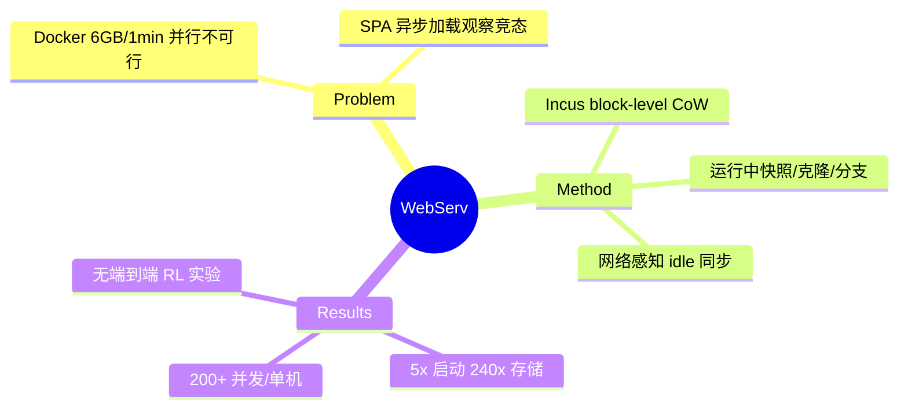

## Summary

WebServ 是第一个把"RL-ready web 环境"的引擎需求列成清单并逐项工程化的工作：用 Incus 容器（ZFS/Btrfs **block-level copy-on-write**）替换 Docker，实现**运行中容器的快照/克隆/分支**——启动 1.78s（Docker 8.96s，~5×）、每容器存储 28MiB（Docker 6.78GB，**~240×**）、单机 200+ 并发；配合 DOM 语义化压缩观察、网络感知的确定性动作执行，并集成 VeRL/Slime 训练框架。

## Problem & Motivation

现有 web 环境在 RL 训练场景下四处失效：(1) server 侧 Docker 太重——WebArena 每容器 ~6GB 存储 + ~1 分钟启动，**大规模并行 rollout 不可行**（DreamGym 论文实测只能开 4 个并行 session）；(2) browser 侧观察噪声大——raw HTML 膨胀 context，AXTree 跨站缺失/不一致；(3) 动作执行**非确定**——SPA 异步加载下"等固定时长"会拿到 partially observed 状态；(4) 缺视觉可交互性线索（cursor style、hover），agent 反复点不可交互元素。

## Method

- **Incus server manager（核心）**：Incus (LXC) + ZFS block-level CoW 替代 Docker 分层文件系统（后者每次启动复制整个修改文件）。**运行中的容器可以被 snapshot 并以块级效率 clone**——从同一状态分支而无需重新初始化整个栈；命名快照的快速 restore 提供**确定性重试**；OCI 兼容可直接跑 Docker 镜像。paired browser + web server 一起管理，秒级 start/clone/reset。
- **面向 RL 的操作语义（Section 5.2 的需求清单）**：(1) checkpoint/snapshot；(2) deterministic retries（公平对比不同 policy）；(3) **sub-rollout sampling**（决策点分支并行试多个候选动作——GRPO/tree search 的环境侧原语）；(4) speculative execution / top-k expansion；(5) **counterfactual trials**（从共同 checkpoint 反复 what-if）；(6) 轻量 reset 避免 cold-start 和环境漂移引入的方差。
- **观察空间**：DOM parser 过滤不可见元素、折叠非语义 div、可交互性检测（native control/onclick/ARIA/cursor:pointer）、monkey-patch addEventListener 标注 hoverable、语义化稳定元素 ID；输出结构化 JSON。
- **确定性动作执行**：拦截 XHR/fetch 追踪 in-flight 请求，动作后等待可配置 idle window（如 500ms 无未完成请求）才返回观察；超时返回显式错误态。
- **配套**：trajectory replayer（同一网页上重放动作历史）+ 动作预执行高亮预览。

## Key Results

- **引擎效率**：启动 1.78s vs 8.96s；存储 28.01MiB vs 6.78GB；内存 1.74GiB≈Docker；单机 200+ 并发容器；启动时间与磁盘速度解耦（read-dominant + ZFS 缓存）。
- **Agent 结果（WebArena-Lite，single-prompt）**：Claude 4.5 Sonnet Shopping 46.7% / CMS 34.3% / GitLab 40.0%，超 GPT-4o (11.1%) 等 single-prompt baseline，接近 RL 方法 WebAgent-R1 (44.4%)。
- **注意：没有端到端 RL 训练实验**——"RL-ready" 停留在基建验证 + prompting 评测。

## Strengths & Weaknesses

**Strengths**：Section 5.2 是目前最完整的**环境引擎需求规格书**（snapshot/branch/deterministic retry/sub-rollout/counterfactual/cheap reset）；240× 存储差距揭示了 WebArena 范式沉默的 scaling 瓶颈；"确定性 = 网络感知同步"把 flaky 评测归因到具体机制（异步加载竞态）而非笼统的"环境不稳定"。

**Weaknesses / 边界**：
- 标题说 RL training，实验只有 prompting——快照/分支原语对 RL 算法（GRPO group rollout、MCTS）的实际增益未验证，需求清单是**论证出来的而非实测出来的**。
- Text-only：抛弃像素观察，空间布局信息丢失（grid 变平铺列表），与 visual web agent 主流（[[Papers/2606-WebGym]]）不兼容。
- 快照的是**自托管容器栈**——对 live web 无效，realism 仍受限于能 Docker 化的站点集合。

## Mind Map

## Notes

- **对 AFE 的证据价值（引擎需求集大成）**：Supervisor 直觉的四条需求（方便初始化/评测/并行/回溯）在本文 Section 5.2 几乎逐条出现且给出工程实现：init=秒级 clone、并行=200+/host、回溯=running-container snapshot/branch、评测=deterministic retry + 状态可查。它把 [[Papers/2407-TreeSearchLMAgents]] 的 reset+replay 模拟回溯升级为 O(1) 原生操作。
- 与 [[Papers/2509-DARTGUI]]（解耦异步 5.5× 利用率）、[[Papers/2606-AsyncWebRL]]（fully-async rollout）同属"引擎效率 > 算法"证据线；WebServ 补的是**状态管理原语**这一层。
- 缺 RL 实验正好是我们 AFE-MiniSuite 的机会：在支持 fork 的环境里实测 rollback/fork affordance 对 agent 的因果增益，是 WebServ 没做的那一步。
