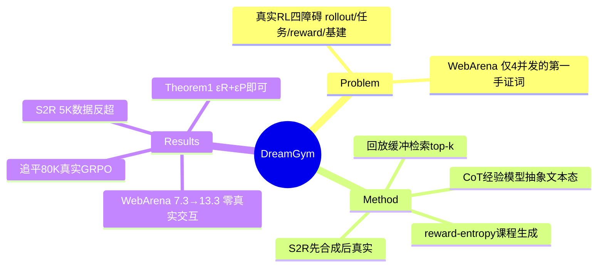

## Summary

DreamGym（Meta）把真实环境 RL 的 rollout 整个替换成**推理式经验模型合成**：LLM 经验模型在抽象文本状态空间里用 CoT 推理生成状态转移和 reward，配合经验回放缓冲（离线数据种子 + 在线更新）与 reward-entropy 课程任务生成器，在不接触真实环境的情况下训练 agent 策略（GRPO/PPO 均可）。在"非 RL-ready"的 WebArena 上全面超过真实环境 RL baseline（GRPO 7.3→13.3，3B backbone）；在 RL-ready 的 WebShop/ALFWorld 上零真实交互追平用 80K 真实交互的 GRPO/PPO；先合成后真实的 DreamGym-S2R 用 <10% 真实数据反超 from-scratch 训练。

## Problem & Motivation

真实环境 RL 的四大障碍：(1) rollout 昂贵（长交互序列、每步计算高、reward 稀疏）；(2) 任务稀缺（现有环境只有静态任务集，新任务可行性验证需人工）；(3) reward 不稳定（网页/GUI 高度动态，噪声/稀疏/假反馈）；(4) 基建复杂（Docker/VM 重后端、动作不可逆、缺可靠 reset）。

**Appendix A.3 的第一手证词**（对环境引擎研究极有价值）："no reliable open-source RL infrastructure exists for WebArena……despite extensive engineering effort, we are able to operate **only four AWS servers, enabling at most four parallel interaction sessions**"；RL 采样期间要**顺序扫完任务集后手动重启 server/reset 环境**以避免跨任务污染；且部分任务被 WebArena 自带评测函数**误判**（prior work 已报告的已知 issue）。

**核心立场**：agent 训练不需要完美复刻真实环境，只需要"sufficiently diverse, informative, and causally grounded"的交互数据。

## Method

三组件：

1. **Reasoning experience model (M_exp)**：在抽象 meta-representational 文本空间运行（合成干净的元素列表而非 raw HTML），输入 = 交互历史 + 任务指令 τ + 从回放缓冲按语义相似度检索的 top-k 过往经验，经显式 CoT 推理轨迹 R_t 输出下一状态 s_{t+1} 和 reward r_{t+1}（outcome-based：仅最终成功 r=1）。训练：对离线轨迹的每个 transition 用强 teacher LLM 标注"为什么该动作导致该转移"的推理轨迹，SFT 联合优化推理生成 + 下一状态预测（Eq.5）。
2. **Experience replay buffer**：离线真实数据播种（WebShop 1600 人类演示 + 2000 oracle/随机轨迹；ALFWorld 3200+2000；WebArena 从公开 leaderboard 高分 agent——IBM CUGA/ScribeAgent/Learn-by-Interact/AgentOccam——收集 4800 条），随训练持续注入新合成交互，与策略共演化。
3. **Curriculum task generator (M_task，与 M_exp 共参)**：以 **group-based reward entropy** V_τ = (1/n)Σ(r_i−r̄)² 选种子任务——组内成功/失败均衡时信息量最大（"feasible yet challenging"），对高熵任务生成渐进变体；超参 λ 限制每轮合成任务比例。

**DreamGym-S2R**：先在合成环境预训练，再迁移到真实环境 RL（rule-based 状态映射或轻量微调模型保证状态空间一致）。

**理论（Appendix B, Theorem 1）**：trust-region 更新下，合成环境训练的策略在真实环境的改进量下界 = 合成 surrogate gain − KL 惩罚 − 2×经验模型误差，而模型误差仅由 **ε_R（reward 保真度）+ ε_P（转移分布域一致性）**决定——**与 raw-state 重建误差无关**。"The synthetic environment need only provide domain-consistent transitions and correct, retrospective learning signals, without having to clone the original environment at the raw state level."

## Key Results

（backbone 依次 Llama-3.2-3B / Llama-3.1-8B / Qwen-2.5-7B；Table 1）

- **WebArena（非 RL-ready）**：GRPO 真实环境 7.3/6.1/6.1 → **DreamGym 13.3/9.1/12.7**（0 真实交互）；PPO 6.7/4.8/7.3 → **14.5/10.9/10.0**。所有 backbone 相对提升 >30%（多数近 2×）。
- **WebShop（RL-ready）**：GRPO 80K 真实交互 62.1/65.0/66.1 vs DreamGym 零真实 59.3/63.9/68.3（追平）；**S2R 仅 5K 真实 70.5/75.0/72.1（反超）**。
- **ALFWorld**：GRPO 65.3/70.9/79.8 vs DreamGym 62.1/66.3/71.0（略低）；S2R 65.0/75.9/82.4。
- **训练成本**：达到 WebArena 收益的同时，训练开销（rollout 采样时间 + GPU 时）降到真实环境 RL 的 **1/3–1/5**；训练曲线前 40 步提升更快、方差更小。
- **消融（Table 2, WebShop/WebArena）**：full 63.9/13.3；去 replay 59.2/9.7；**去 reasoning 55.8/7.3（最伤）**；去任务生成 57.3/7.3。GPT-4o judge 四维评价：去 History 伤 consistency（多轮漂题），去 Reasoning 伤 informativeness 且幻觉增加。
- **经验模型数据效率**：2k–10k 离线样本即可用；8B backbone 10k 样本 WebShop >50%；3B 用 20k 达 ~55%（轻量模型可行）；[[Papers/2411-WebDreamer]]（web 预训练 world model）在小数据 WebArena 领先（~13%）但样本增多后被通用 8B 追平——**web 特化预训练是早期优势而非必要条件**。
- **跨域迁移**：WebShop 种子训练的策略在 WebArena 上超过直接在 WebArena SFT 的模型（反向同理）；但 web→ALFWorld（具身）掉分显著——meta-representation 的域边界。
- 算力：全部实验 8 节点 A100 + 4 节点 H100。

## Strengths & Weaknesses

**Strengths**：问题动机是第一手的（自己搭 WebArena RL 只能 4 并发的证词比任何综述都有说服力）；Theorem 1 给"合成环境不需要像素级保真"提供了干净的理论刻画（ε_R/ε_P 而非重建误差）——这是 MobileGym"functional fidelity 足够"论点的理论版；reward-entropy 课程选择原则简洁且与"中等难度任务学得最快"的经验发现一致；消融完整（reasoning 是最关键组件）。

**Weaknesses / 边界**：
- **合成 reward 的正确性没有外部审计**：M_exp 既当转移函数又当 reward 函数，ε_R 理论上要小、实践中只有 GPT-4o judge 的四维打分佐证——若经验模型系统性误判某类动作，policy 会照单全收（与 [[Papers/2504-AgentRewardBench]] 的 judge precision ≤70% 对照，这里的 reward 可靠性主张缺同等级别的测量）。
- 纯合成在 RL-ready 环境上仍略低于真实 RL（ALFWorld 差 4–9pp），S2R 才反超——**合成是 warm-start 而非终局替代**。
- 离线种子数据来自公开 leaderboard 高分轨迹，隐含依赖"别人已经在真实环境里跑通过"——冷启动一个全新环境（无任何轨迹）时如何训 M_exp 未回答。
- 单环境设定（Limitations 自述）；跨域（web→embodied）明确失败。
- WebArena-Lite 165 任务的绝对分仍低（最高 14.5%），合成训练放大的是相对收益。

## Mind Map

## Notes

- **对 AFE / 环境引擎方向的定位**：DreamGym 是 [[Topics/AgentEnvironment-Survey]] "环境能力与模型能力互相替代"（Takeaway 3）的训练侧极点——环境引擎六轴全部缺失时（WebArena：4 并发 + 手动 reset + 评测误判），最优解干脆是**放弃真实环境**。它与 [[Papers/2510-WebServ]] 构成同一需求的两个对偶解：WebServ 把引擎做便宜（240× 存储、O(1) 快照），DreamGym 把引擎做没（合成经验）。两者的竞争边界正是 Theorem 1 的 ε_R/ε_P：**当真实引擎的并行/reset 成本降到合成推理成本以下、或任务要求的转移保真超出 LLM 先验时，天平倒向引擎**。
- Theorem 1 与 [[Papers/2605-MobileGym]] 的 95.1% sim-to-real retention 互为理论-实证：环境价值在"学习相关信号"（reward 正确 + 转移域一致）而非像素/DOM 复刻——这直接支持 AFE 的立场：affordance 暴露的是 state-transition 语义层。
- Appendix A.3 三条证词（4 并发上限 / 手动 sweep-reset / 官方评测函数误判）是 survey 第五幕和并行轴的第一手引用源，已核实原文。
- 但注意其反面：DreamGym 的"经验模型当 reward"与 [[Ideas/HybridVerifier-GUIRuntime]] 的方向相反（后者主张 verifier 靠环境状态可观测性）；若在支持 fork/verify 的引擎（WebServ/WebHarbor）上做 S2R，ε_R 可以用程序化 verifier 压到接近 0——**"合成转移 + 真实 verifier"的混合可能优于两个纯路线**，这是一个可写进 AFE 讨论的具体 idea 种子。
