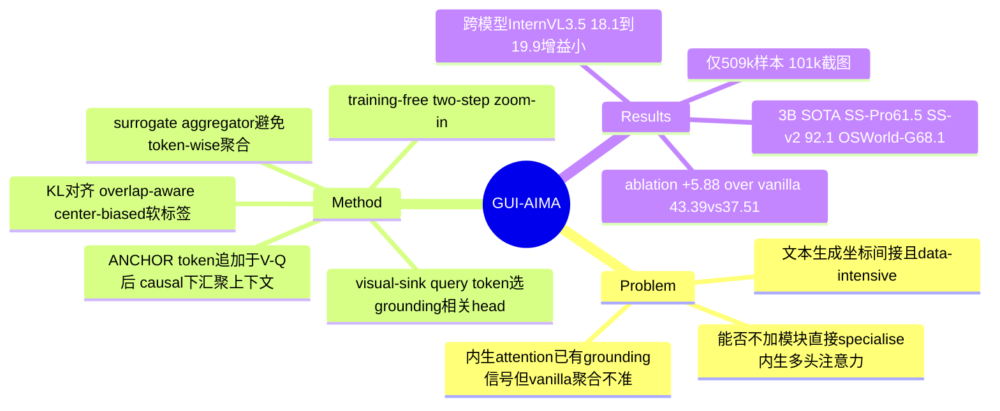

## Summary
针对 MLLM GUI grounding 常用的"文本生成坐标"范式数据密集且间接的问题，GUI-AIMA 提出 coordinate-free 框架：在 `[V,Q]` 后追加一个可学习 `<ANCHOR>` token，在 causal attention 下让它汇聚整条指令-视觉上下文，并用 KL loss 直接把它对视觉 patch 的 attention 分布对齐为 grounding 信号——复用 MLLM 的 intrinsic 多头注意力而非新增 grounding head。仅用 509k 样本（约 101k 张截图），GUI-AIMA-3B 在 ScreenSpot-Pro 61.5%、ScreenSpot-v2 92.1%、OSWorld-G 68.1% 上取得 3B 级 SOTA。

## Problem & Motivation
GUI grounding（把自然语言指令映射到屏幕可交互区域）是 computer-use agent 的关键能力。现有 MLLM 主流做法把它建模成 text-based coordinate generation——直接把 x-y 坐标当作文本 token 生成。作者的批评是：这种表述既间接（模型要把细粒度视觉定位压缩进文本坐标生成），又 data-intensive。

论文的出发点是一个已被观察到的现象：通用 MLLM 的 attention map 里本就"内生"了 query-visual grounding 信号。更直觉的策略应是先定位与指令相关的 visual patches，再在其中确定精确点击位置。但已有 attention-based 工作（如 TAG）有明确缺陷——它以 vanilla 方式聚合来自所有 query token 的 attention，简单但常不准确；另一类方法则仍需一个额外 adaptation stage、并未真正利用 native attention。由此作者提出核心问题：能否**不加额外模块、也不依赖 token-wise 聚合**，直接把 MLLM 的 intrinsic multi-head attention specialise 到 GUI grounding？

## Method
GUI-AIMA 的定位是 coordinate-free、直接监督 MLLM 内生注意力的 grounding 框架。它把"要点哪里"从文本生成问题改造成"对 anchor→patch 注意力分布的对齐"问题，通过两个设计避免对全部 query token、全部 head 的粗放聚合。

1. Context Anchor（`<ANCHOR>` token）
- 在视觉 token `V` 与 query token `Q` 之后追加一个**可学习**的 special anchor token，序列变为 `[V, Q, <ANCHOR>]`。
- 关键在于 causal self-attention 下这个末位 token 能 attend 到**前面所有** visual 与 query token，从而在其 attention 分布中"总结"整条指令上下文；于是它对 visual patch 的 attention 可作为 query-visual 交互的 **surrogate aggregator**，避免显式的 token-wise 聚合。
- 与 GUI-Actor 的 `<ACTOR>` token 的差别是关键：GUI-Actor 外接一个新的 attention-based action head（约 100M 参数）来产生 patch relevance；GUI-AIMA **不新增 grounding 模块**，只用一个 anchor token + 可学习的 per-head 权重去 reweight 并监督模型**已有**的多头注意力。这就是标题里 "intrinsic" 的含义。

2. Attention Head Weighting via Visual-sink Query Tokens
- Simplified attention grounding（Eq. 2）：把 anchor→patch 的注意力在 L 层 × H 头上按可学习权重 `w_(l,h)` 加权聚合得到 `â`。
- 权重不是拍脑袋给的：作者用 hidden-state cosine similarity 找出 "visual-sink query tokens"——一小撮与 visual patch 隐状态相似度最高（跨层累积 top-K）的 query token，认为它们体现了强 query-visual 连接；再以这些 token 为 proxy，识别出更可能编码 grounding 信号的 attention head 并给高权重（softmax 归一）。

3. Training & Inference
- 监督信号来自 GT bounding box 构造的 label 分布 `p`：**overlap-aware + center-biased**（用 IoU 与 Gaussian 距离加权，中心 patch 权重更高，Eq. 6）。训练目标是 `L_Attn = D_KL(p || normalize(â))`，即用 KL 把预测的 patch 分布对齐到标签分布。
- 因为 grounding 来自 patch-level 注意力，天然支持 **two-step zoom-in** 推理：先粗定位一个区域，再在裁剪视图上 refine，**无需额外训练**，专治高分辨率界面上因下采样导致的 offset 误差。

## Key Results
- **主结果（3B SOTA）**：GUI-AIMA-3B 在 ScreenSpot-Pro 61.5%、ScreenSpot-v2 92.1%、OSWorld-G 68.1%、MMBench-GUI-L2 79.1%、UI-Vision 60.0%，abstract 自述为 3B 级模型 SOTA（含 zoom-in）。
- **数据效率**：仅用 509k 样本（约 101k 张截图）单阶段微调，abstract 强调"light training can trigger the native grounding capability of MLLMs"。作为对照，GUI-Actor 用 verifier 版在 ScreenSpot-Pro 约 45.9%（WebFetch 报道，非本笔记独立核）。
- **zoom-in 的贡献**：不加 zoom-in 时 ScreenSpot-Pro 为 53.8%，两步 zoom-in（training-free）提到 61.5%。
- **核心 ablation**：在 ablation 训练设定下，相对 vanilla attention grounding 提升 5.88%（43.39% vs 37.51%）。ablation 还显示：用 visual-sink token 选头（42.13%）优于用全部 query token（37.63%）或只用 anchor（40.73%）；加 weighted patch labeling 进一步到 43.39%；Gaussian scaling α=0.8 最优。
- **跨模型验证**：换到 InternVL3.5-4B（45k 数据），ScreenSpot-Pro 从 18.1% → 19.9%，说明方法不绑定单一 backbone（但绝对分很低，见下）。

## Evidence Ledger
| Claim ID | Claim | Type | Source locator | Evidence excerpt | Status |
|:--|:--|:--|:--|:--|:--|
| C1 | GUI-AIMA-3B: SS-Pro 61.5 / SS-v2 92.1 / OSWorld-G 68.1 / MMBench-GUI-L2 79.1 / UI-Vision 60.0 | number | Abstract + Tables 1/2/3 | "average accuracy of 61.5% on ScreenSpot-Pro, 92.1% on ScreenSpot-v2, 68.1% on OSWorld-G, 79.1% on MMBench-GUI-L2 and 60.0% on UI-Vision" | source-verified |
| C2 | 训练仅 509k 样本（~101k 截图） | number | Abstract / Sec 4.1 | "trained with only 509k samples (∼101k screenshots), demonstrating exceptional data efficiency" | source-verified |
| C3 | 3B 级模型 SOTA | sota-novelty | Abstract | "achieves state-of-the-art performance among 3B models" | source-verified |
| C4 | `<ANCHOR>` token 追加于 `[V,Q]` 后，causal attention 下汇聚上下文，其对 patch 的 attention 作 grounding 信号，复用内生注意力不加模块 | causal-mechanism | Sec 3.1 | "special visual anchor token <ANCHOR> and append it after the GUI inputs, forming the sequence [V,Q,<ANCHOR>]... last token can attend to all preceding" | source-verified |
| C5 | head 权重由 visual-sink query token（hidden-state 余弦相似度选取）作 proxy 确定 | causal-mechanism | Sec 3.2 (Eq.4) | "visual affinity of each token qi... using cosine similarity between its hidden state and all visual patch states" | source-verified |
| C6 | KL loss 监督 anchor→patch 分布，label 由 GT bbox 构造、overlap-aware + center-biased | causal-mechanism | Sec 3.3 (Eq.6) | "both overlap-aware and center-biased. We then supervise the predicted patch distribution... using the KL divergence" | source-verified |
| C7 | ablation 设定下比 vanilla attention grounding +5.88%（43.39% vs 37.51%） | number | Table 4 + Sec 4 | "improves ScreenSpot-Pro accuracy by 5.88% over vanilla attention grounding (43.39% over 37.51%)" | source-verified |
| C8 | 无 zoom-in 53.8%，training-free zoom-in 提到 61.5% | number | Table 1 + Sec 3.3 | "53.8 ... 61.5"; "two-step inference by adding zoom-in without extra training" | source-verified |
| C9 | InternVL3.5-4B（45k 数据）SS-Pro 18.1% → 19.9% | number | Table 7 | "InternVL3.5-4B ... 18.1 ... GUI-AIMA-InternVL3.5-4B ... 19.9" | source-verified |

## Strengths & Weaknesses
**亮点。** 已知：方法契合"simple, scalable"的 taste——不新增 grounding head，而是把 grounding 归约为对模型**内生注意力**的一次对齐（一个 anchor token + 可学习 head 权重 + KL 对齐），却在 3B 级用 101k 截图打到 SOTA。相比 GUI-Actor 的外接 action head + verifier，这是更克制、更"physics-native"的重构：GUI grounding 本质是 region selection，而 MLLM 的 attention 本就是天然的 region selector，AIMA 只是把它 supervise 出来。visual-sink query token 选头是一个有机制假设的设计——不是"所有 head 都拿来平均"，而是先用 hidden-state 相似度找出真正编码 query-visual 连接的 head，ablation（42.13% vs 37.63%）支持了这个假设。overlap-aware + center-biased 的软标签也比单点监督更贴合 GUI 元素"整片可点"的性质。

**局限。** 已知（作者自陈）：(1) 单 `<ANCHOR>` 设计只支持 single-region grounding，multi-region 要靠未来的 `<ANCHOR_n>`；(2) 高分辨率截图被下采样导致 patch 粒度不足、信息损失——zoom-in 只是推理期 workaround，不是架构层解决；(3) dense tool area 下"找到区域但认不出真正 icon"的低粒度失败，以及语义混淆（点了同名不可点元素）、动作顺序错误等 failure case。推测：跨模型验证虽证明可迁移，但 InternVL3.5-4B 上 18.1%→19.9% 的绝对值极低且增益仅 1.8pt，说明方法收益强依赖 backbone 本身的 native grounding 质量——"点燃"内生能力的前提是内生能力已足够强，这限制了它在弱 backbone 上的适用边界。不知道：61.5% 依赖 zoom-in（无 zoom 仅 53.8%），而 zoom-in 需两次 forward，论文材料未给出 latency/吞吐代价，实际部署的 accuracy-cost trade-off 未量化。

**领域影响。** 这条"直接监督/复用 intrinsic attention 而非外接 head"的路线，若成立，会削弱"必须专门训练 grounding 头"的 convention，也可能迁移到 web-agent、embodied visual grounding。它与 GUI-Actor 构成一组有价值的对照点：两者都 coordinate-free、都用 anchor-style token，但一个训新 head、一个 reweight 旧 attention——谁在什么条件下更优，是值得追问的。

## Mind Map

## Notes
- **Context anchor 的精确定位**：这里的 "context anchor" 是 **grounding 级**的上下文锚——`<ANCHOR>` 汇聚的是**单张截图内**的 visual+instruction 上下文，用于一次 grounding 决策；**不是 trajectory 级**的历史/记忆上下文（与"跨步动作历史 anchoring"无关）。且当前为 single-region 设计。引用时勿混淆两种 "context"。
- **与 thesis 的关系**（对照"action 必须可追溯到某个 belief source——像素/结构/记忆/prior——并留下可验证的状态改变；hybrid observation 会放大 stale evidence"）：GUI-AIMA 只作用在 grounding 层，belief source 单一且清晰（**单张截图的像素/patch**），不涉及 memory/prior、也不涉及"可验证的状态改变"或 hybrid observation 的 staleness 问题。它对 thesis 的正向贡献是：把 belief→action 的中间表示显式化为**可检查的 patch attention 分布**（不是黑箱吐坐标），使"像素这个 belief source"的定位过程更可审计；但它对"状态改变是否可验证""hybrid 证据是否陈旧"这两条完全沉默。
- **可深挖的问题**：visual-sink query token 与 attention-sink 现象是否同源？如果 grounding-relevant head 可无监督地由 hidden-state 相似度识别，那"训练"到底在改什么——是改 head 权重还是改 anchor 表示？这关系到该方法能否零训练迁移。
