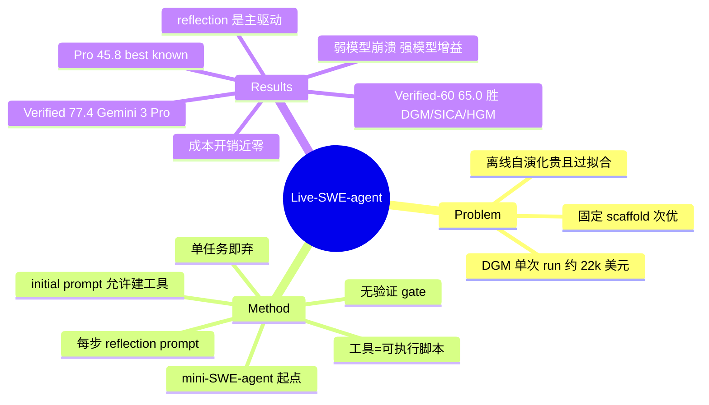

## Summary

Live-SWE-agent 把 software agent 的 self-evolution 从离线训练搬到运行时：在 mini-SWE-agent（约 100 行、仅 bash 工具）上只加两处 prompt 改动（initial prompt 允许建工具 + 每步 reflection prompt），让 agent 在解决真实软件问题的过程中按需创建可执行脚本工具。SWE-bench Verified 单次尝试达 77.4%（Gemini 3 Pro backbone，无 test-time scaling），超过全部已报告的 open-source 与 proprietary agent；在 Verified-60 子集上以零小时离线演化成本超过 DGM/SICA/HGM 等 offline 自演化 agent 8.3-15 个百分点。

## Problem & Motivation

现有 software agent（SWE-agent、OpenHands、AutoCodeRover 等）配备固定的预置工具集和静态 action space，而 scaffold 设计空间近乎无限，人工穷举既难又贵。自演化路线（DGM、SICA、HGM）让 agent 改写自身 scaffold，但都是**离线**范式：在特定 benchmark 上跑数百到上千小时的演化循环（论文转引 DGM 原文：单次 run 约 \$22,000），演化出的 scaffold 还可能对训练所用的 benchmark 和 LLM 过拟合、跨模型泛化存疑。本文的问题设定是：能否不做任何离线演化，让 agent 在解题**当时**（on the fly）针对手头任务演化自己的能力？

## Method

**基础 scaffold**：mini-SWE-agent——极简 agent，仅有 bash 环境访问，代码约 100 行。选它做起点本身是论证的一部分：起点越简、越能说明提升来自运行时演化而非人工设计。

**核心机制（改动仅在 prompt 层）**：
1. **Initial prompt**：告知 agent 可以为当前任务创建工具（定义为"可在环境中执行的脚本"）；
2. **Reflection prompt**：每步之后插入固定提示，要求 agent 反思已有轨迹、判断是否值得创建工具（Appendix D.2 原文大意："Reflect on the previous trajectories and decide if there are any tools you can create to help you with the current task…"）。

**演化产物**：custom tools（bash/python 可执行脚本）。t-SNE 分析（Figure 4）显示工具既向通用类型收敛（edit / view / search），又带 repo 特定与语言特定的变异（如 MARC 文件分析器、基于 Go 语法的模式匹配分析器，Figures 3/5）。

**关键设计取舍**：
- **无显式验证 gate**：不做 held-out 验证、不用 benchmark 当 fitness；工具是否有用完全由 backbone 自身推理判断，坏工具的代价内化在当前轨迹里（全文无 validation/held-out/fitness 机制，并明确与 prior agents "empirically validate each change using offline evaluation signals" 对比）。
- **单任务生命周期**：工具在任务结束后即丢弃，不跨任务持久化（作者在 Section 4.4 列为 limitation，未来方向是序列化复用与扩展到 workflow/system prompt 演化）。
- **与 offline 自演化的对照逻辑**：offline 路线把演化成本一次性花在 benchmark 上、产物固定；Live-SWE 把演化摊进每次任务求解，边际成本近零，且天然对当前任务（而非历史 benchmark）适配。

## Key Results

- **SWE-bench Verified（Table 1，单次尝试）**：相对 mini-SWE-agent，Claude 4.5 Sonnet 70.6%→75.4%、GPT-5 65.0%→68.4%、GPT-5-Mini 59.8%→63.0%、Gemini 3 Pro 74.2%→**77.4%**；论文称 77.4% 超过所有已报告系统含最佳 proprietary 方案（Figure 1，leaderboard 口径）。
- **成本（Table 1）**：单任务均价 Claude 4.5 Sonnet \$0.56→\$0.68、Gemini 3 Pro \$0.46→\$0.48、GPT-5 \$0.28→\$0.27（GPT-5-Mini \$0.04→\$0.05）——GPT-5 甚至略降，提示工具缩短轨迹的收益能抵消创建开销。
- **vs offline 自演化（Table 2，Verified-60 子集）**：Live-SWE-agent 65.0%，高于 HGM 56.7%（离线演化 512 小时）、DGM 53.3%（1231 小时）、SICA 50.0%（成本列标注 "infinite loop"）；Live 的离线演化时间为 0。**口径**：三个 baseline 数字系转引（"we directly reuse their experimental results"），60 题子集与三 baseline 的评测均出自 HGM 论文，backbone 统一为 GPT-5-Mini，与 Live 的 GPT-5-Mini 运行同 backbone 可比，但运行方是 HGM 原文而非本文作者。
- **SWE-bench Pro（Table 3）**：Claude 4.5 Sonnet 达 45.8%（baseline SWE-agent 43.6%），论文称 "best-known solve rate"。
- **Ablation（Table 4，Verified 50 题子集，Claude 4.5 Sonnet）**：无工具创建 62.0% → 只有 initial prompt（无 reflection）64.0% → 完整方法 76.0%；说明单靠"允许建工具"几乎无效，**每步 reflection 是主要驱动**。
- **Backbone 依赖（Table 5，50 题子集）**：强模型增益大（Claude 4.5 Sonnet 62.0→76.0、GPT-5 60.0→68.0、Claude 4 Sonnet 58.0→64.0、Claude 3.7 Sonnet 46.0→50.0），弱模型反而受害（GPT-5-Mini 60.0→58.0，GPT-5-Nano 44.0→**14.0**，崩溃式下降）——作者归因于弱模型缺乏合成有用工具的推理能力。
- **SWE-bench Multilingual（Table 6，50 题子集，Claude 4.5 Sonnet）**：40.0%→46.0%。

## Evidence Ledger

| Claim ID | Claim | Type | Source locator | Evidence excerpt | Status |
|:--|:--|:--|:--|:--|:--|
| C1 | Gemini 3 Pro 单次尝试（无 test-time scaling）SWE-bench Verified 77.4%，超所有现有 agent 含最佳 proprietary | sota-novelty | abstract; §4.1; Fig 1 | "77.4% without test-time scaling, outperforming all existing software agents, including the best proprietary solution" | source-verified |
| C2 | Verified 各 backbone mini→Live：70.6→75.4（C4.5S）、65.0→68.4（GPT-5）、59.8→63.0（GPT-5-Mini）、74.2→77.4（G3P） | number | Table 1 | "mini: 59.8/65.0/70.6/74.2; Live: 63.0/68.4/75.4/77.4" | source-verified |
| C3 | 单任务成本 \$0.56→\$0.68（C4.5S）、\$0.46→\$0.48（G3P）、\$0.28→\$0.27（GPT-5） | number | Table 1 | "Claude 4.5 \$0.56→\$0.68; Gemini 3 Pro \$0.46→\$0.48" | source-verified |
| C4 | Verified-60：Live 65.0% > HGM 56.7%（512h）> DGM 53.3%（1231h）> SICA 50.0%（infinite loop）；Live 离线演化 0 小时 | comparison | Table 2 | "SICA 50.0% infinite loop; DGM 53.3% 1231; HGM 56.7% 512; Live 65.0% 0" | source-verified |
| C5 | DGM 单次 run 约 \$22,000（转引 DGM 原文） | number | §1 | "a single run of DGM on SWE-bench costs around \$22,000 according to the original paper" | source-verified |
| C6 | SWE-bench Pro 45.8%（C4.5S）为 best known result；SWE-agent 43.6% | sota-novelty | Table 3 | "best-known solve rate of 45.8%" | source-verified |
| C7 | Ablation：无工具创建 62.0% / 无 reflection 64.0% / 完整 76.0% | number | Table 4 | "w/o tool creation 62.0%; w/o reflection 64.0%; Live-SWE-agent 76.0%" | source-verified |
| C8 | 弱 backbone 受损（GPT-5-Nano 44.0→14.0、GPT-5-Mini 60.0→58.0），强 backbone 增益（C4.5S 62.0→76.0 等） | number | Table 5 | "GPT-5-Nano 44.0→14.0; Claude 4.5 62.0→76.0" | source-verified |
| C9 | 机制：mini-SWE-agent（约 100 行、仅 bash）+ initial prompt + 每步 reflection prompt，无显式验证 gate | causal-mechanism | §2.1-2.2; §3; App D.2 | "~100 lines of code and only accessing bash commands"; "appending a simple reflection message after each environmental feedback" | source-verified |
| C10 | 演化产物为可执行脚本 custom tools，默认单任务用完即弃（跨任务复用仅为 future work） | causal-mechanism | §2.2; §4.2; §4.4 | "we define a custom tool as a script that can be executed" | source-verified |
| C11 | Multilingual 50 题子集 40.0%→46.0%（C4.5S） | number | Table 6 | "mini-SWE-agent 40.0%; Live-SWE-agent 46.0%" | source-verified |
| C12 | 代码开源 github.com/OpenAutoCoder/live-swe-agent（URL 实测 200） | license-code | abstract | "publicly available at: https://github.com/OpenAutoCoder/live-swe-agent" | source-verified |
| C13 | Table 2 三 baseline 数字为转引（出自 HGM 论文），backbone 均为 GPT-5-Mini，非本文重跑 | benchmark-setting | §3 Baselines | "we directly reuse their experimental results... used by prior work to specifically evaluate all three self-improving agent baselines" | source-verified |

## Strengths & Weaknesses

**Strengths**
- **极简方法拿到强结果**，是 "simple, scalable, generalizable" 的样板：对 100 行 scaffold 只加两段 prompt，无训练、无搜索循环、无 archive，却在 4 个强 backbone 上一致提升。与 DGM 的 archive + 采样 + 离线 benchmark 验证整套机制形成鲜明对比。
- **Table 2 是全文最有信息量的对比**：0 小时离线演化打败 512-1231 小时离线演化（同 GPT-5-Mini backbone，baseline 数字转引自 HGM 论文）。这对 offline self-evolution 路线的 cost-effectiveness 构成直接挑战——如果运行时按需合成工具就够了，离线演化 scaffold 的溢价需要重新论证。
- **演化的边际成本近零**（\$0.01-0.12/任务，GPT-5 上为负），把"自演化"从奢侈品变成默认可开启的选项。
- **诚实报告负结果**：弱模型崩溃（GPT-5-Nano -30pp）没有被藏起来，且给出机制解释，为方法划清适用边界。

**Weaknesses / 批判性阅读**
- **无验证 gate 是双刃剑**：在 SWE-bench 这类有 ground-truth 测试兜底的封闭评测里，坏工具的代价只是解题失败；开放部署中 ungated 的运行时工具合成正是 [[Papers/2509-Misevolution]] 刻画的风险面。本文与 [[Papers/2512-ASGSI]]（重 verifier-auditor gate 才许 promote 技能）恰好构成 gating 光谱的两端，而本文没有讨论安全面。
- **"self-evolve" 名实之辩**：工具单任务即弃，不满足 [[Papers/2507-SelfEvolvingAgentsSurvey]] 对 self-evolving 的操作性定义（persistent policy-changing effect）。更准确的定位是 **test-time scaffold adaptation / on-the-fly tool synthesis**；"first live software agent" 的 novelty 部分依赖这个定义边界的挪动。
- **能力放大器而非均衡器**：增益随 backbone 能力单调上升、弱模型反受其害，意味着该方法无法用于"弱模型 + 好 scaffold"的降本路线——恰与 offline 演化（DGM 产物可迁移给弱模型用）互补而非全面替代。
- 与 proprietary 系统的对比基于 leaderboard 口径（Figure 1），各家提交的 attempt 数与 scaffold 设置不一，"超过所有"应读作 leaderboard 快照而非受控对比。

## Mind Map

## Connections

- [[Papers/2505-DarwinGodelMachine]] — 直接对立面：DGM 用 archive + 离线 benchmark 验证演化 scaffold（约 2 周/\$22k 一次 run），本文在 Verified-60 上以零离线成本超过它 11.7pp。两者演化产物部分收敛（DGM 也自主发现了细粒度查看/精确编辑工具），提示"好工具"存在与演化范式无关的吸引子。
- [[Topics/SelfEvolvingAgents-Survey]] — 归入 tool evolution 路线的新数据点，但挑战 survey 采用的操作性定义（persistent 效果）；同时是 Takeaway 4（演化步 verifier gating）的反例：零 gate 也能在封闭评测中成立。
- [[Papers/2507-SelfEvolvingAgentsSurvey]] / [[Papers/2508-SelfEvolvingAIAgentsSurvey]] — 两篇 anchor survey 的四组件框架（model/memory/tool/workflow）中，本文只动 tool 且不持久化，位置介于 test-time adaptation 与 self-evolution 之间。
- [[Papers/2512-ASGSI]] — gating 光谱另一端：ASGSI 要求技能经 held-out 验证 + contract 校验 + evidence bundle 才 promote；本文完全无 gate。两者的分歧本质是封闭评测 vs 开放部署的威胁模型差异。
- [[Papers/2509-Misevolution]] — 若按论文 future work 把工具跨任务持久化，ungated 演化的 misevolution 风险将立即显性化。

## Notes

- 跨任务持久化是下一步的关键分岔：持久化才构成真正的 self-evolution，但立即引回 gating/misevolution 问题——本文的"安全"恰恰来自即弃。
- 工具收敛现象（不同任务独立演化出相似 edit/search 工具）暗示可把高频工具蒸馏回 scaffold 默认工具集——但那就变回了 offline 演化。两条路线可能在"演化产物蒸馏"处汇合，值得作为 survey 的一个 open question。
- Reflection prompt 每步注入的 token 开销与轨迹缩短的收益如何相抵，论文只给了总成本，未拆分；弱模型崩溃是否部分源于 reflection 干扰了本就有限的 context 管理能力，值得追问。
