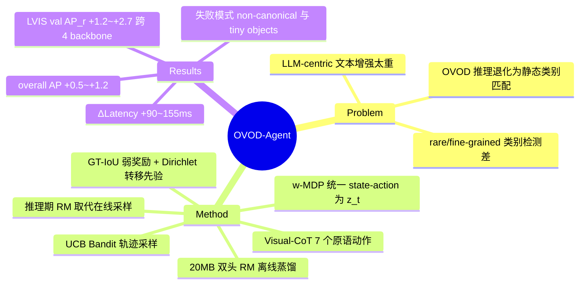

## Summary

针对 OVOD（Open-Vocabulary Object Detection）推理端只能做静态类别名匹配的问题，提出 LLM-free 的轻量框架：把文本描述的迭代细化建模为 8 状态 Weakly Markovian Decision Process 上的 Visual-CoT，训练期用 UCB Bandit 采样轨迹并以 GT-IoU 弱奖励 + Dirichlet 转移先验蒸馏出一个 20MB 双头 Reward-Policy Model（RM），推理期由 RM 逐步引导 prompt 改写。在 LVIS/COCO 上对 4 个 OVOD backbone 一致提升 rare-category AP_r（LVIS val +1.2~+2.7），overall AP 提升 +0.5~+1.2。

## Problem & Motivation

现有 OVOD 模型（GroundingDINO、YOLO-World 等）虽经多模态预训练，推理时仍退化为固定类别名的单次匹配，造成 "multimodal training vs unimodal inference" 的落差；视觉模糊、罕见/细粒度类别下表现差。已有的文本侧增强（prompt learning、attribute description、LLM-generated priors）本质是静态的单次调整，无法在检测过程中随 region/context 迭代演化；而把 LLM 放在决策中心（CoT-PL 等）又带来与检测器"快、可扩展、易部署"特性相悖的计算与内存开销，有的还需要多轮人工反馈。作者的问题定式：能否用一个不依赖 LLM 的轻量机制，实现 context-dependent、可迭代的文本表示细化。

## Method

核心是把"检测器主动执行一串显式视觉操作来细化文本描述"（Visual-CoT）形式化为离散决策过程，分四层：

- **Action space（7 个原语操作，Table 1）**：a1 Dictionary（同义词/上位词回退）、a2 Color（HSV/聚类色彩线索）、a3 Texture（LBP/GLCM）、a4 Background（前背景/ROI 调整）、a5 Geometry（尺度、长宽比）、a6 Lighting（HSV-V 光照/阴影）、a7 Spatial（位置、IoU 空间关系）。每步把一个视觉线索映射为文本属性，更新演化中的类别描述（如 apricot → "yellow round pitted fruit"）。
- **w-MDP（弱 Markov 建模，Sec 3.2）**：不区分 state/action，统一为 weak Markov unit z_t = g(c_t, a_t)，其中 c_t = (x_t, T_t) 是图像+当前 prompt 的 context；转移 P(z_{t+1}|z_t) 采用一阶（short-term memory）近似。注意：摘要与引言声称 "eight state spaces"（Fig 2 示意 S0-S7），但正文从未逐一定义这 8 个 state 是什么——state 集合的落地定义缺失（见 Weaknesses）。
- **Base Markov Field（弱监督初始化）**：两个成分。(1) GT-seeded 弱奖励基线 r_t^GT = 1 − IoU(b_t^pred, b_t^GT)（Eq 7），越高表示当前 state 越不确定；(2) 每个 z_t 的出边转移用 Dirichlet 先验初始化（Eq 8），保证归一化与结构可行性。另在 Algorithm 1 中，每步实际 reward r_t 来自 UncertaintyReduction(scores_t, scores_{t+1})，即检测分数变化——GT 奖励与分数不确定性奖励两者关系正文未明确调和。
- **UCB Bandit 采样（Sec 3.3）**：Q_t(a) = μ̂_t(a|c_t) + λ√(ln t/(1+n_t(a|c_t)))，执行后按 Dirichlet 计数更新经验转移矩阵。停止条件：trajectory 级（state 稳定 δ_s=0.02 / reward 收敛 / 步数 H_max=7），image 级（平均 reward 增量 <ε_r / 转移矩阵收敛 / episode 上限 E_max=50）。
- **Reward-Policy Model 与自演化闭环（Sec 3.4-3.5）**：RM 是 3 层 MLP 双头网络（约 20MB）：policy head π_θ(·|z_t) 建模局部转移连续性，reward head r̂_θ(z_t) 预测弱奖励。损失 = trajectory distillation + β·reward reconstruction + γ·KL(π_θ ‖ 经验转移先验) 三项（Eq 14）。离线训完后，推理期用 RM 决策规则（policy-driven / reward-driven / hybrid，Eq 15）取代 UCB 在线采样。

**监督信号来源**（"self-evolving" 的实际含义）：无人工反馈、无 LLM；监督完全来自 (1) 训练集 GT boxes 的 IoU 弱奖励，(2) 检测器自身分数变化，(3) Bandit 采样得到的转移统计。因此这是**离线弱监督蒸馏**，部署后 RM 冻结，并不在推理中继续进化。

## Key Results

- **主结果（Table 2，LVIS val AP_r）**：GroundingDINO 30.2→32.9 (+2.7)、YOLO-World 22.8→25.2 (+2.4)、GroundingDINO 1.5 42.7→44.1 (+1.4)、DINO-X Pro 48.0→49.2 (+1.2)。LVIS minival AP_r 分别 +1.6/+1.8/+1.3/+1.1；LVIS val overall AP +0.5~+1.2；COCO2017 val mAP +0.6~1.3。增益集中在 rare categories，common/frequent 不受损。
- **推理开销（Table 2 ΔLatency）**：+120/+90/+145/+155 ms（每步 reasoning 增加一次 detector forward，开销随轨迹长度近似线性）。注意引言声称 "<100 ms latency cost"，与 Table 2 中 4 个 detector 有 3 个超过 100ms 直接矛盾。
- **探索策略 ablation（Table 3）**：统一停止协议下 UCB 取得 Top-K@Stop 0.66、Pareto-Win Rate 44.8%，优于 Random (0.54/19.1)、Greedy-Q (0.59/29.7)、ε-Greedy (0.62/36.5)；GPT-5 blind 评分 4.7、人工评分 4.5。
- **Markov 结构 ablation（Table 4）**：KL 转移正则使 RM loss std 0.037→0.028、action entropy 1.41→1.55、AP 38.2→39.4、AP_r 19.0→20.3。⚠️ 该表基线量级（AP 38.2 / AP_r 19.0）与 Table 2 minival（AP_r 35.4→37.0）和 Table 5（35.4）完全对不上，论文声称同为 LVIS minival + GroundingDINO 却无任何解释。
- **动作集 ablation（Table 5）**：baseline AP_r 35.4 → 仅 +a1（dictionary）36.5 → 全动作 a1–a7 37.7。⚠️ 37.7 与 Table 2 同 setting 的 37.0 不一致。
- **失败模式（Sec 4.3, Fig 3）**：(1) 非 canonical 形态（如 dried apricot）下 reasoning 过度依赖 linguistic priors 而非退化的视觉线索；(2) 杂乱场景中的 tiny/occluded 物体（如 bulldozer）令 a5/a7 产生噪声奖励，policy 退回 a1 dictionary lookup 且定位不改善。

## Evidence Ledger

| Claim ID | Claim | Type | Source locator | Evidence excerpt | Status |
|:--|:--|:--|:--|:--|:--|
| C1 | w-MDP 将 state/action 统一为 z_t = g(c_t, a_t)，转移 P(z_{t+1}\|z_t) 取一阶近似 | causal-mechanism | p.3-4, Sec 3.2, Eq 4-6 | "state and action are unified into a single weak Markov unit... P(z_{t+1} \| z_t, z_{t-1},...) ≈ P(z_{t+1} \| z_t)" | source-verified |
| C2 | Action space 为 7 个原语操作（Dictionary/Color/Texture/Background/Geometry/Lighting/Spatial） | benchmark-setting | p.3, Table 1 | "seven interpretable primitive visual operations" | source-verified |
| C3 | 声称 "eight state spaces" 但正文未逐一定义 8 个 state（仅 Fig 2 示意 S0-S7） | causal-mechanism | Abstract; Sec 1; Fig 2；全文 | "w-MDP over eight state spaces"; 正文仅定义 z_t 与 7 action | source-verified |
| C4 | GT-seeded 弱奖励 r_t^GT = 1 − IoU(b_t^pred, b_t^GT)，越高越不确定 | causal-mechanism | p.4, Sec 3.2, Eq 7 | "A higher r_t^GT indicates greater uncertainty" | source-verified |
| C5 | Algorithm 1 每步 r_t = UncertaintyReduction(scores_t, scores_{t+1})，来自检测分数变化 | causal-mechanism | p.5, Algorithm 1 line 9 | "r_t ← UncertaintyReduction(scores_t, scores_{t+1})" | source-verified |
| C6 | UCB 规则 + Dirichlet 转移更新；H_max=7，E_max=50 | causal-mechanism | p.5, Sec 3.3, Eq 9-11 | "Step limit: t ≥ H_max = 7... Maximum episode limit E_max = 50" | source-verified |
| C7 | RM 为双头 3 层 MLP（20MB），三项损失，推理时取代 UCB | causal-mechanism | p.5-6, Sec 3.4-3.5, Eq 14-15 | "compact 3-layer MLP with dual heads (20MB)... UCB exploration is replaced by RM predictions" | source-verified |
| C8 | LVIS val AP_r：30.2→32.9、22.8→25.2、42.7→44.1、48.0→49.2 | number | p.7, Table 2 | "AP_r improves by +2.7, +2.4, +1.4, and +1.2" | source-verified |
| C9 | LVIS minival AP_r +1.6/+1.8/+1.3/+1.1；overall AP +0.5~+1.2；COCO +0.6~1.3 mAP | number | p.7, Table 2; Sec 4.1 | "overall AP are steady (ranging from +0.5 to +1.2)" | source-verified |
| C10 | ΔLatency +120/+90/+145/+155 ms | number | p.7, Table 2 | "+120 / +90 / +145 / +155" | source-verified |
| C11 | 引言声称 <100 MB disk / <20 MB memory / <100 ms latency，与 Table 2 中 3/4 detector 超 100ms 矛盾 | comparison | p.2 Sec 1 vs p.7 Table 2 | "(<100 MB disk, <20 MB memory) and <100 ms latency cost" | source-verified |
| C12 | UCB：Top-K@Stop 0.66、PWR 44.8%，优于 Random/Greedy-Q/ε-Greedy；AI 4.7、Human 4.5 | number | p.7, Table 3 | "UCB (Ours) 0.66±0.01 / 44.8 / 4.7±0.1 / 4.5±0.2" | source-verified |
| C13 | KL 正则：loss std 0.037→0.028、entropy 1.41→1.55、AP 38.2→39.4、AP_r 19.0→20.3 | number | p.7, Table 4 | "AP rising from 38.2 → 39.4 and AP_r from 19.0 → 20.3" | source-verified |
| C14 | 动作集 ablation 35.4→36.5→37.7；37.7 与 Table 2 同 setting 的 37.0 不一致 | number | p.8, Table 5 vs p.7, Table 2 | "Baseline 35.4 → +a1 36.5 → +a1–a7 37.7" | source-verified |
| C15 | LVIS minival = 官方 val index 前 5k 图（循 Detic/GLIP）；LVIS val 为 20k 全量 | benchmark-setting | p.6, Sec 4.1 | "selecting the first 5k images in the official validation index" | source-verified |
| C16 | 两大失败模式：非 canonical 形态过度依赖 linguistic priors；tiny/occluded 下 a5/a7 噪声奖励致退回 a1 | causal-mechanism | p.8, Sec 4.3, Fig 3 | "fall back on dictionary lookups (a1) without improving localization" | source-verified |

## Strengths & Weaknesses

**Strengths**

- **问题定位准**：抓住了"LLM-centric 文本增强与检测器轻量部署特性相悖"这个真实矛盾，用 20MB MLP 实现推理时迭代 prompt refinement，是对 "把 LLM 从决策中心移走、只蒸馏其离散推理结构" 这条路线的一次具体验证。
- **增益一致性**：4 个 backbone（含很强的 DINO-X Pro 48.0 AP_r）上 rare-category 均正增益且 common/frequent 不受损，比单点 SOTA 更有说服力。
- **失败分析诚实**（Sec 4.3）：明确给出两类失败机制及其原因（linguistic prior 过度依赖、噪声奖励），并承认需要更强视觉先验或 OOD reasoning——这部分信息量高于主表。
- **动作离散可解释**：轨迹（如 apricot → yellow round pitted fruit）人可读，Table 5 证明属性级动作贡献大于纯 dictionary 回退。

**Weaknesses**

- **"self-evolving" 是过度包装**：监督来自训练集 GT boxes（1−IoU 弱奖励）+ 检测器自身分数变化，RM 离线训完后推理期冻结。这是标准的弱监督离线蒸馏，不存在部署后的持续进化；跨域（无 GT 的新分布）能否成立完全未验证。
- **形式化含混**：(1) "eight state spaces" 全文从未落地定义（只定义了 7 个 action，且 state/action 已合并进 z_t，"8 状态"含义更加悬空）；(2) Eq 7 的 GT 奖励与 Algorithm 1 的 UncertaintyReduction 奖励是两套信号，"baseline 如何进入实际 reward" 未调和。w-MDP 的理论包装厚于其实际内容——本质是带 UCB 探索的离散 prompt 编辑 + 转移统计正则。
- **内部数字不一致 ×3（均已核实）**：引言 "<100ms" vs Table 2 +120/+145/+155ms；Table 5 的 37.7 vs Table 2 同 setting 的 37.0；Table 4 基线量级（AP 38.2/AP_r 19.0）与 Table 2/5 完全对不上且无解释。单独看每处都可能有未写明的 setting 差异，但三处叠加显著削弱数字可信度。
- **探索质量评估软**：Table 3 的 AI (GPT-5 blind) / Human 评分主观成分高，Top-K@Stop 与 PWR 是自定义指标，无外部可比性。
- **增益幅度适中**：overall AP +0.5~1.2，价值主要在 rare categories 与部署成本之间的 trade-off，而非能力上限的推进。

## Mind Map

## Notes

- **对 agent 方向的借鉴**：这是 "把 LLM planner 蒸馏成小模型决策头" 路线在检测上的实例——离散动作 + 转移统计正则 + 弱奖励蒸馏的组合可能迁移到 GUI agent 的轻量 verifier/policy 设计；但其 "8 状态" 未定义、双奖励未调和的问题也提示：这种蒸馏框架的关键在于 state abstraction 是否真的成立，而本文恰恰没有回答。
- **未解疑问**：GroundingDINO 1.5 / DINO-X Pro 标注为 "API access"，每步 reasoning 需一次 detector forward，API 往返下 +145/+155ms 的 ΔLatency 如何测得（本地代理？缓存？）论文未说明。
- 论文未提供 code 链接；资助为 NSFC Grant 82571371。
- arXiv v1 2025-11（2511.21064），CVF Open Access 页码 41416-41425。
